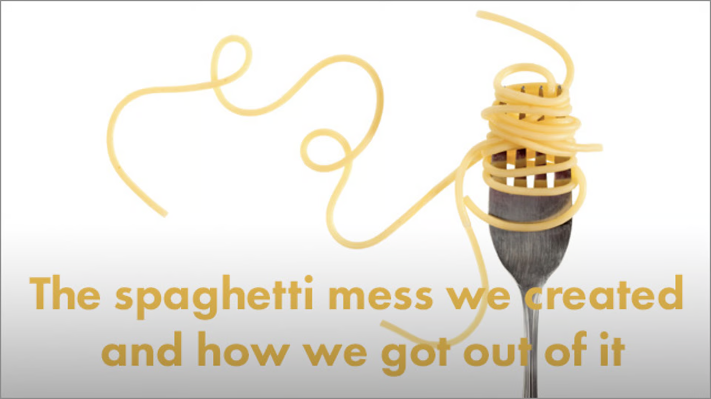
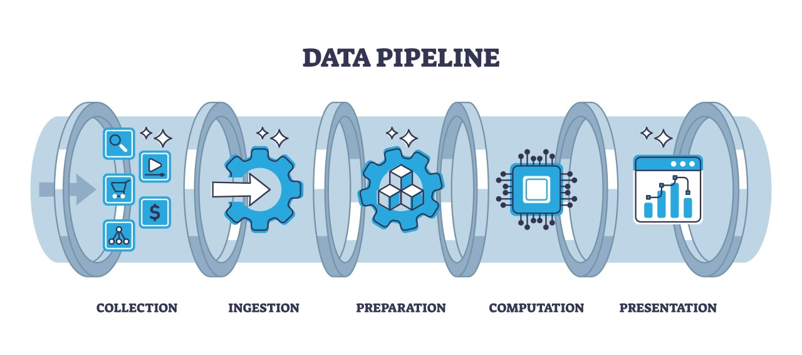
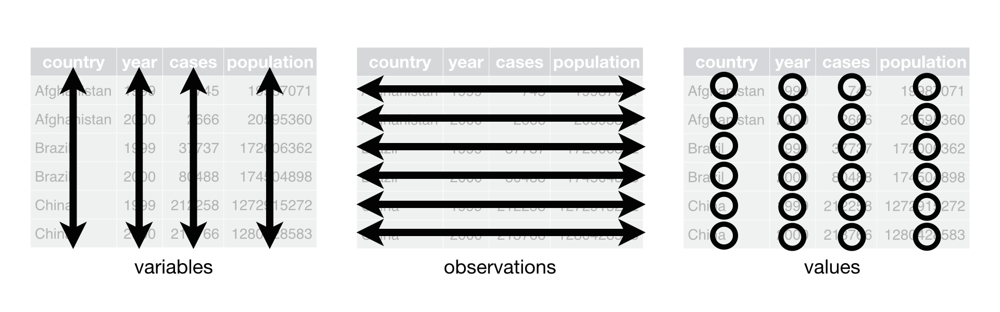
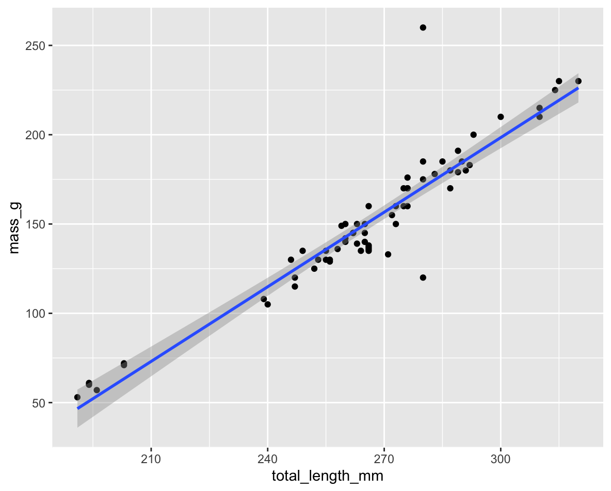
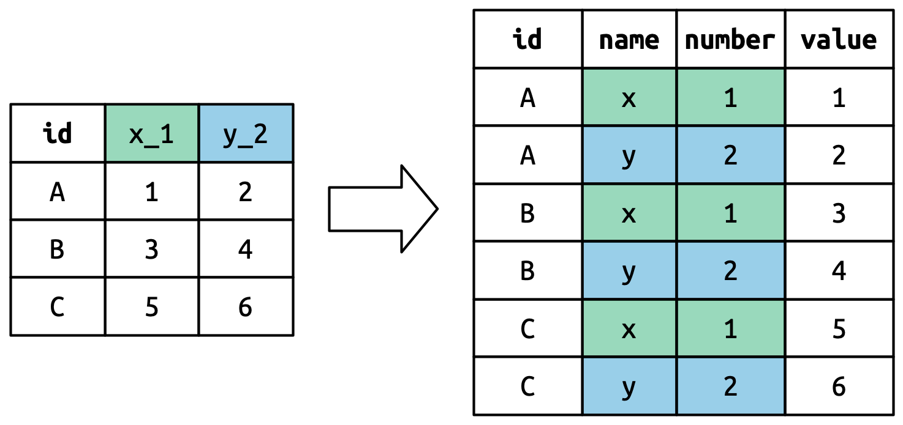
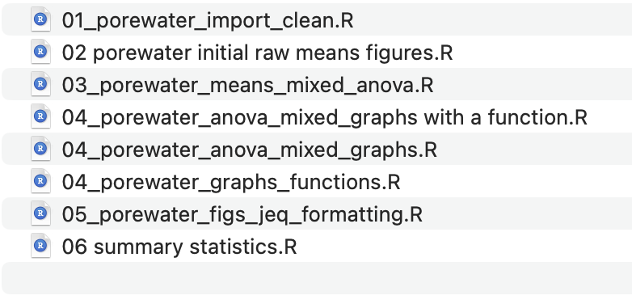
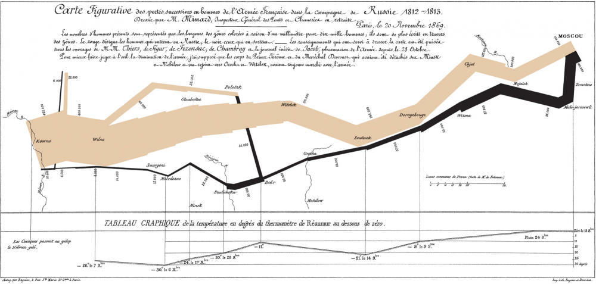

# Review of Lecture 1

::::: columns
::: {.column width="60%"}
Covered

- Inductive vs deductive reasoning
- Formulating research questions
- Accuracy vs precision
- Data types and classifications
- Setting up R projects
- Installing and loading libraries
- Reading files into R
- Creating basic graphs
:::

::: {.column width="40%"}
:::
:::::

# Lecture 2: Project Design & Data Visualization

::::: columns
::: {.column width="60%"}
## The objectives:

1.  Design a well-organized project
2.  Implement good naming conventions
    - Controlled vocabulary
    - Including units in names
3.  Create and use metadata effectively
4.  Build tidy, well-structured spreadsheets
5.  Understand data repositories
6.  Create effective visualizations with ggplot2
:::

::: {.column width="40%"}
{width="300" height="250"}
:::
:::::

# Project Design: Step 1

::::: columns
::: {.column width="60%"}
- Data: the raw material of science
- Wide variety of formats, sizes, complexity
- Data management and curation often under emphasized
- Good data management: owe it to our funding agencies, colleagues, supervisors, and study systems
:::

::: {.column width="40%"}
{width="416" height="264"}
:::
:::::

# **Lecture 2:** Project Design: Step 1

:::::: columns
:::: {.column width="60%"}
1.  **Determine data types** you'll collect
2.  **Establish controlled vocabulary**
    - Example: `do_mgl` for dissolved oxygen in mg/L
    - Example: `drp_ugl` for dissolved reactive phosphorus in μg/L
3.  **Plan your data flow** from collection to analysis
4.  **Organize your project structure** (folders, files)
5.  **Enter data promptly** after collection
6.  **Save in multiple formats** (Excel and CSV)
7.  **Ensure tidy data principles** from the start

::: callout-note
See Hadley Wickham's [Tidy Data principles](https://r4ds.hadley.nz/data-tidy.html) for best practices
:::
::::

::: {.column width="40%"}
{width="300" height="250"}
:::
::::::

# Project Design: Step 2

::::: columns
::: {.column width="60%"}
Create a **Metadata Sheet** that includes:

- Variable descriptions
- Units of measurement
- Collection methods
- Instrument details
- Dates and locations
- Any other relevant contextual information
:::

::: {.column width="40%"}
{width="300" height="250"}
:::
:::::

# Practice Exercise 1: Pine Data Organization

::: callout-tip
### Practice Exercise 1: Pine Data Organization

Let's examine our pine needle data:

- \- What naming conventions did you choose?
- \- How did you organize the data?
- \- How can you verify data formats (numeric vs categorical)?
- \- What's your plan for organizing outputs and figures?

```{r}
# Code to read and examine data
library(tidyverse)
library(patchwork)
library(flextable)

pine_df <- read_csv("data/pine_needles.csv")
pine_df

```
:::

# **Lecture 2:** Data Management: Step 3

::::: columns
::: {.column width="60%"}
**Storage and Backup Strategy**:

1.  Store raw data and metadata securely
    - Save in both Excel and CSV formats
    - Consider write-protecting raw data files
2.  Implement the 3-2-1 backup rule:
    - 3 total copies of data
    - 2 different storage media
    - 1 offsite location (cloud storage)
3.  Establish a regular backup schedule
:::

::: {.column width="40%"}
{width="100" height="80"} {width="128" height="100"}
:::
:::::

# **Lecture 2:** Data Management: Step 4

::::: columns
::: {.column width="60%"}
**Initial Data Inspection**:

1.  Examine data in the Environment tab
2.  Run summary() and glimpse() functions
3.  Create exploratory visualizations
4.  Check for outliers, errors, and missing data

``` r
# Specify how to handle missing values during import
pine_df <- read_csv("data/pine_needles.csv", 
                    na = c("", "NA", "N/A", "missing", "null"))

# Get a quick summary
summary(pine_df)
```
:::

::: {.column width="40%"}
{width="350" height="280"}
:::
:::::

# Practice Exercise 2: Try plotting a histogram

::: callout-tip
## Practice Exercise 2: Try plotting a histogram of your data

Create a histogram of pine needle lengths to check the distribution:

```{r}
# Write your code here to make a plot
# How do you examine the data - what are the ways you think and lets try it!


```
:::

# Lecture 2: Data Management: Step 5

::::: columns
::: {.column width="60%"}
**Data Cleaning**:

1.  Correct errors and inconsistencies
2.  Replace missing values with proper NA codes
3.  Document all changes made to raw data
4.  Save a clean, master version (consider making read-only)
5.  Keep notes on data cleaning procedures
:::

::: {.column width="40%"}
{width="303" height="188"}
:::
:::::

# Lecture 2: Data Management: Step 6

::::: columns
::: {.column width="60%"}
**Analysis and Visualization Workflow**:

1.  Create exploratory visualizations
2.  Summarize and transform data as needed
3.  Document all analysis steps
4.  Save outputs systematically
:::

::: {.column width="40%"}
**A useful way to organize script files is number them in the order they get run.**

{width="286" height="217"}
:::
:::::

# Lecture 2: Effective Data Visualization

::::: columns
::: {.column width="60%"}
## Why make plots?

## Get in a group and discuss

- What is the purpose of a data visualization?
- What elements are essential in an effective plot?
- What characteristics define a "good" plot?
- What common mistakes make plots ineffective?

[Napoleon's Disastrous Invasion of Russia Detailed in an 1869 Data Visualization: It's Been Called "the Best Statistical Graphic Ever Drawn"](https://www.openculture.com/2019/07/napoleons-disastrous-invasion-of-russia-explained-in-an-1869-data-visualization.html)
:::

::: {.column width="40%"}
{width="367" height="290"}
:::
:::::

# **Lecture 2:** Tables vs. Visualizations

**How readable are tables?**

We will get to what these number mean and how to make them in the next lecture.

- Tables
  - are they useful in a presentation?

```{r table}
#| echo: false
#| message: false
#| warning: false
#| paged-print: false
#| tbl-responsive: false
#| tbl-striped: true
#| css: ".table { font-size: 0.85rem; }" 

pine_df <-read_csv("data/pine_needles.csv")

# First, let's look at the data as a table
pine_summary <- pine_df %>%
  group_by(wind) %>%
  summarize(
    n = n(),
    mean_mm = round(mean(length_mm),0),
    sd_mm = round(sd(length_mm),2),
    min_mms = round(min(length_mm),2),
    max_mm = round(max(length_mm),2)
  )

pine_summary %>% flextable()
```

# **Lecture 2:** Displaying data

::::: columns
::: {.column width="60%"}
- **how does a table compare to a plot?**

- Does this help?

- What is this plot?

  - if you don't explain does the audience know?
:::

::: {.column width="40%"}
```{r}
#| echo: false
#| message: false
#| warning: false
#| paged-print: false
#| fig-width: 6
#| fig-height: 4
# Create a visual that tells the same story as the table
ggplot(pine_df, aes(x = wind, y = length_mm,  color=wind)) +
  geom_boxplot() +
  stat_summary(fun = "mean", geom = "point", shape = 23, size = 3, fill = "white") +
  labs(
       x = "Sampling Side", 
       y = "Length (mm)") +
  theme_minimal() +
  theme(legend.position = "bottom")

```
:::
:::::

# **Lecture 2:** Principles of Effective Graphics

According to [Tufte (2001)](https://www.edwardtufte.com/book/the-visual-display-of-quantitative-information/), good scientific graphics:

1.  **Show the data** without distortion
2.  **Maximize data-ink ratio** (minimize non-data elements)
3.  **Make large datasets coherent** and understandable
4.  **Encourage comparison** between elements
5.  **Reveal multiple layers** of information
6.  **Serve a clear purpose** in telling your story
7.  **Integrate with statistical methods** appropriately

```{r}
#| echo: false
#| message: false
#| warning: false
#| paged-print: false
# Let's create a table showing several layers of information
pine_summary <- pine_df %>%
  group_by(group) %>%
  summarize(
    mean_mm = mean(length_mm),
    sd_mm = sd(length_mm),
    n = n()
  ) %>%
  mutate(se_mm = sd_mm / sqrt(n),
         conf_low = mean_mm - qt(0.975, n-1) * se_mm,
         conf_high = mean_mm + qt(0.975, n-1) * se_mm)

pine_summary 
```

# **Lecture 2:** Creating Effective Graphics

::::: columns
::: {.column width="60%"}
According to [Tufte (2001)](https://www.edwardtufte.com/book/the-visual-display-of-quantitative-information/), good scientific graphics:

- To implement these principles:
  - Focus on the data, not decorative elements
  - Ensure proportional representation of numbers
  - Provide clear and informative labels
  - Remove unnecessary elements ("chart junk")
  - Revise and refine visualizations iteratively
:::

::: {.column width="40%"}
```{r good-graphics}
#| echo: false
#| message: false
#| warning: false

# Create a plot demonstrating good graphics principles
pine_plot <- ggplot(pine_df, aes(x = wind, y = length_mm, fill = wind)) +
  geom_violin(alpha = 0.3) +
  geom_boxplot(width = 0.2, alpha = 0.7) +
  geom_jitter(width = 0.1, alpha = 0.5, color = "gray30") +
  stat_summary(fun = mean, geom = "point", shape = 23, size = 3, fill = "white") +
  # geom_errorbar(data = pine_summary, 
  #               aes(y = mean_length, ymin = conf_low, ymax = conf_high),
  #               width = 0.1) +
  labs(
       x = "Group", 
       y = "Length (mm)") +
  theme_minimal() +
  theme(legend.position = "none")

# Add statistical test result
t_result <- t.test(length_mm ~ wind, data = pine_df)
p_val <- ifelse(t_result$p.value < 0.001, "p < 0.001", 
                paste("p =", round(t_result$p.value, 3)))

pine_plot <- pine_plot + annotate("text", x = 1.5, y = max(pine_df$length_mm) * 0.9, 
             label = p_val, size = 4)
```
:::
:::::

# **Lecture 2:** Displaying data - Good Graphics

::::: columns
::: {.column width="60%"}
To make good graphics:

- Above all, focus on data
- Do not distort data
- Graphical representation of numbers → directly proportional to numbers
- Strive for clarity through labeling
- Maximize data-ink ratio
  - Remove non-data ink
  - Reduce redundant data ink
- Revise and redraw
:::

::: {.column width="40%"}
```{r good-graphics-2}
#| echo: false
#| message: false
#| warning: false
#| paged-print: false

pine_plot
```
:::
:::::

# **Lecture 2:** Displaying data - Poor Example

::::: columns
::: {.column width="60%"}
What do you think?

Does this -

- Focus on data
- Distort data
- Is it directly proportional to numbers
- Is labeling clear
- Maximize data-ink ratio
  - Remove non-data ink
  - Reduce redundant data ink
- Revise and redraw
:::

::: {.column width="40%"}
```{r}
#| echo: false
#| message: false
#| warning: false
#| paged-print: false
# Let's create two versions of the same plot
# First, a "poor" version with low data-ink ratio
library(ggthemes)
poor_plot <- ggplot(pine_df, aes(x = wind, y = length_mm)) +
  geom_bar(stat = "summary", fun = "mean", fill = "lightblue", 
           color = "black") +
  geom_errorbar(stat = "summary", fun.data = "mean_se", width = 0.5) +
  # theme_excel() +
  labs(
       subtitle = "This plot has a low data-ink ratio",
       x = "Sampling Side", y = "Average lenght (mm)")
poor_plot
```
:::
:::::

# **Lecture 2:** Displaying data - Better Example

::::: columns
::: {.column width="60%"}
What do you think?

Does this -

- Focus on data
- Distort data
- Is it directly proportional to numbers
- Is labeling clear
- Maximize data-ink ratio
  - Remove non-data ink
  - Reduce redundant data ink
- Revise and redraw

What is one of the most common plots you make all the time?
:::

::: {.column width="40%"}
```{r}
#| echo: false
#| message: false
#| warning: false
#| paged-print: false


# "Better" version with higher data-ink ratio
better_plot <- ggplot(pine_df, aes(x = wind, y = length_mm)) +
  stat_summary(fun = "mean", geom = "point", size = 3) +
  stat_summary(fun.data = "mean_se", geom = "errorbar", width = 0.2) +
  labs(
       subtitle = "This plot has a low data-ink ratio",
       x = "Sampling Side", y = "Average lenght (mm)")


better_plot
```
:::
:::::

# **Lecture 2:** Displaying data - Common Problems

::::: columns
::: {.column width="60%"}
## Common Visualization Problems

1.  **Data distortion**:
    - Non-zero baselines on bar charts
    - 3D effects that skew perspective
    - Inappropriate scales
2.  **Excessive "chart junk"**:
    - Too many grid lines
    - Unnecessary decorative elements
    - Redundant information
3.  **Poor color choices**:
    - Too many colors
    - Non-colorblind-friendly palettes
    - Colors that don't print well in grayscale
4.  **Misleading representations**:
    - Pie charts with too many categories
    - Dual y-axes with different scales
    - Truncated axes without clear indication
:::

::: {.column width="40%"}
```{r}
#| echo: false
#| message: false
#| warning: false
#| paged-print: false
# Creating "bad graphics" examples
# Example 1: Non-zero baseline
p_bad1 <- ggplot(pine_df, aes(x = wind, y = length_mm)) +
  geom_bar(aes(y = length_mm), stat = "summary", fun = "mean", 
           fill = "lightblue") +
 coord_cartesian(ylim = c(15,21)) +
  labs(title = "Misleading",
       subtitle = "Exaggerates diffs",
       x = "Sampling Side", y = "Length (mm)") +
  theme_minimal()

# Example 2: Too many colors in pie chart
site_counts <- pine_df %>%
  count(wind)

p_bad2 <- ggplot(pine_df, aes(x = factor(1), fill = wind, y = length_mm)) +
  geom_bar(width = 1, stat = "identity") +
  coord_polar("y", start = 0) +
  labs(title = "Misleading: Pie Chart",
       subtitle = "Hard to compare") +
  theme_void() +
  theme(legend.position = "bottom")

# Example 3: Dual axis with different scales
p_bad3 <- ggplot(pine_df, aes(x = wind, y = length_mm)) +
  geom_bar(aes(y = length_mm), stat = "summary", fun = "mean", 
           fill = "lightblue") +
  # geom_line(aes(y = date_year/100, group = 1), color = "red", size = 1) +
  # scale_y_continuous(
  #   name = "Mass (g)",
  #   sec.axis = sec_axis(~.*100, name = "Year")
  # ) +
  theme_minimal()

# Combine the bad examples
p_bad1 + p_bad2 + p_bad3
```
:::
:::::

# Practice Exercise 3: Basic Plots with Pine Data

::: callout-tip
## Practice Exercise 3: Lets try some plots with pine data first

Lets try to make some basic plots

```         
# Write your code here to make a dot plot or X y plot
# How do you examine the data - what are the ways you think and lets try it!
# what is missing - hwo do you tell the effect of wind?
```
:::

# Practice Exercise 4: Colors, Shapes, and Fills

::: callout-tip
## Practice Exercise 4: OK we are closer but what about colors or shape or fills

Lets try to make some more basic plots

This is free time - we will free code this....

Below are some examples of code you will need for the future

```         
# Write your code here to make a dot plot or X y plot
# How do you examine the data - what are the ways you think and lets try it!
# what is missing - hwo do you tell the effect of wind?
```
:::

# **Lecture 2:** Introduction to the Grammar of Graphics - ggPLOT

We will learn the anatomy of a GGplot is layers

- ggplot2 uses a **layered grammar of graphics** approach:
  1.  **Data**: The dataset you're visualizing
  2.  **Aesthetics**: Mapping variables to visual properties
  3.  **Geometries**: The visual elements representing data
  4.  **Facets**: Splitting visualization into subplots
  5.  **Statistics**: Statistical transformations of the data
  6.  **Coordinates**: The space in which data is plotted
  7.  **Themes**: Overall visual style of the plotWe have aesthetics

# **Lecture 2:** Building a ggplot Visualization

### Key Components:

1.  **Aesthetics (aes)** map variables to visual properties:
    - x and y positions
    - color, fill, shape, size, alpha
    - group, linetype
2.  \*\*Geometries (geom\_\*)\*\* determine how data is displayed:
    - `geom_point()`: Scatter plots
    - `geom_line()`: Line graphs
    - `geom_boxplot()`: Box-and-whisker plots
    - `geom_violin()`: Violin plots
    - `geom_histogram()`: Histograms
    - `geom_bar()`: Bar charts
3.  **Position adjustments** control how elements are arranged:
    - `position_dodge()`: Side-by-side elements
    - `position_jitter()`: Add random noise to points
    - `position_stack()`: Stack elements on top of each other
4.  **Labels and annotations** provide context:
    - `labs()`: Title, subtitle, caption, axis labels
    - `annotate()`: Add text, shapes, etc.

# **Lecture 2:** Fine-tuning your visualizations

1.  **Colors, fills, and shapes**:

    ```         
    scale_color_manual(
      values = c("wind" = "darkblue", "lee" = "darkred"),
      labels = c("wind" = "Windward", "lee" = "Leeward")
    )
    ```

2.  **Coordinate systems**:

    ```         
    coord_cartesian(ylim = c(10, 30))  # Zoom in without dropping data
    ```

3.  **Themes**:

    ```         
    theme_minimal() +
    theme(
      axis.title = element_text(size = 14),
      legend.position = "bottom"
    )
    ```

4.  **Combining plots with patchwork**:

    ```         
    plot1 + plot2 + plot_layout(ncol = 2)
    ```

# Practice Exercise 5: Publication-Quality Plot

::: callout-tip
### Practice Exercise 4: Creating a Publication-Quality Plot

Create a fully customized plot that would be suitable for publication:

```         
# Create a publication-quality plot
pine_df %>%
  ggplot(aes(x = wind, y = length_mm, fill = wind)) +
  geom_violin(alpha = 0.4) +
  geom_boxplot(width = 0.2, alpha = 0.7, outlier.shape = NA) +
  geom_jitter(width = 0.1, alpha = 0.5, color = "gray30", size = 2) +
  stat_summary(fun = mean, geom = "point", shape = 23, size = 3, fill = "white") +
  labs(
    title = "Pine Needle Length Varies with Wind Exposure",
    subtitle = "Needles on the leeward side tend to be longer",
    x = "Tree Side", 
    y = "Needle Length (mm)",
    caption = "Data collected Spring 2023") +
  scale_fill_manual(
    values = c("wind" = "#1b9e77", "lee" = "#d95f02"),
    labels = c("wind" = "Windward", "lee" = "Leeward")) +
  theme_minimal() +
  theme(
    plot.title = element_text(face = "bold", size = 16),
    plot.subtitle = element_text(size = 12, color = "gray30"),
    axis.title = element_text(face = "bold"),
    legend.title = element_blank(),
    legend.position = "bottom")
```
:::

# Key Takeaways

1.  **Plan your data management** from the beginning
    - Consistent naming conventions
    - Good organization
    - Regular backups
2.  **Make your data tidy** from the start
    - One observation per row
    - One variable per column
    - One value per cell
3.  **Create effective visualizations** by:
    - Focusing on data, not decoration
    - Using appropriate plot types
    - Following good design principles
    - Customizing for clear communication
4.  **Master the grammar of graphics** to:
    - Build plots layer by layer
    - Communicate patterns clearly
    - Tell compelling stories with data

# Next Steps

- Practice creating different types of plots
- Learn to combine multiple plots effectively
- Explore statistical transformations in ggplot2
- Develop a consistent visualization style
