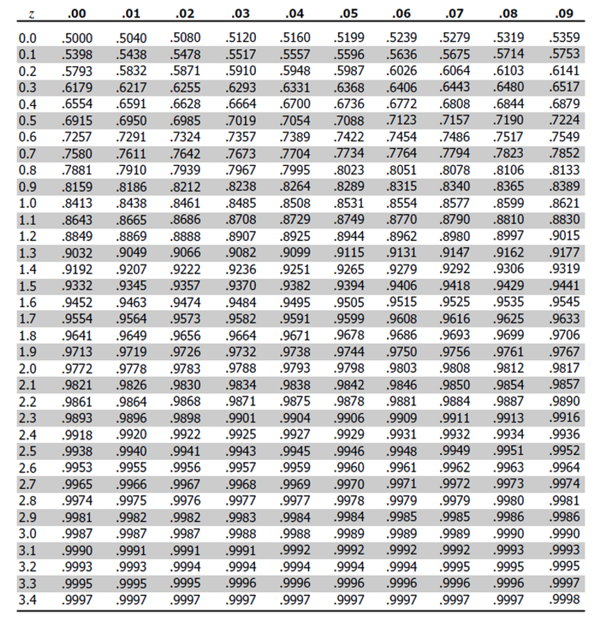
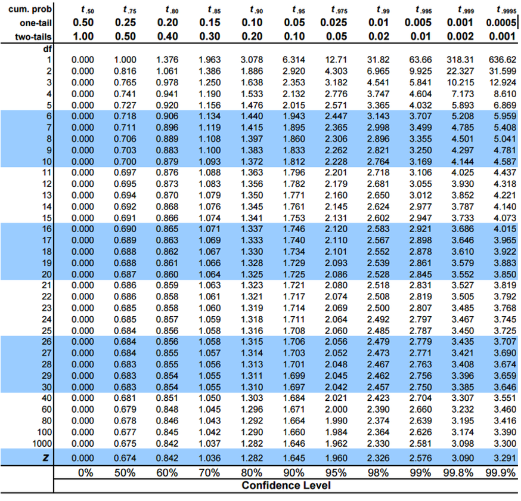
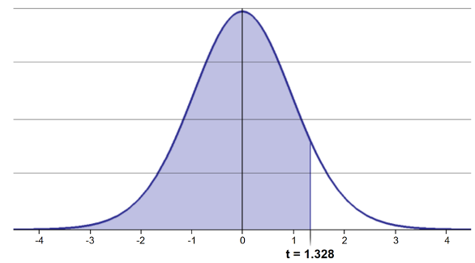
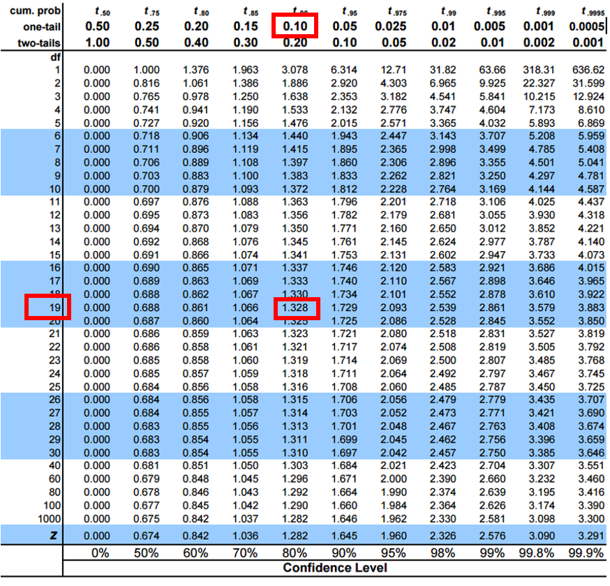
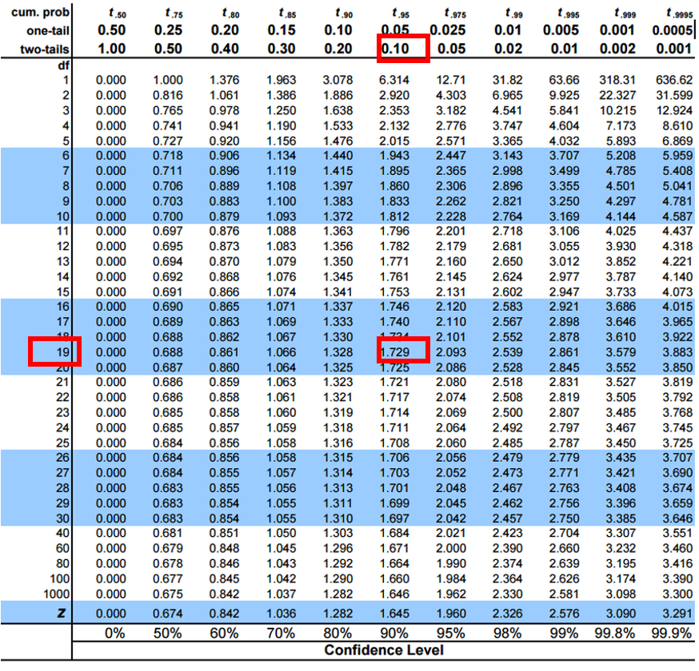
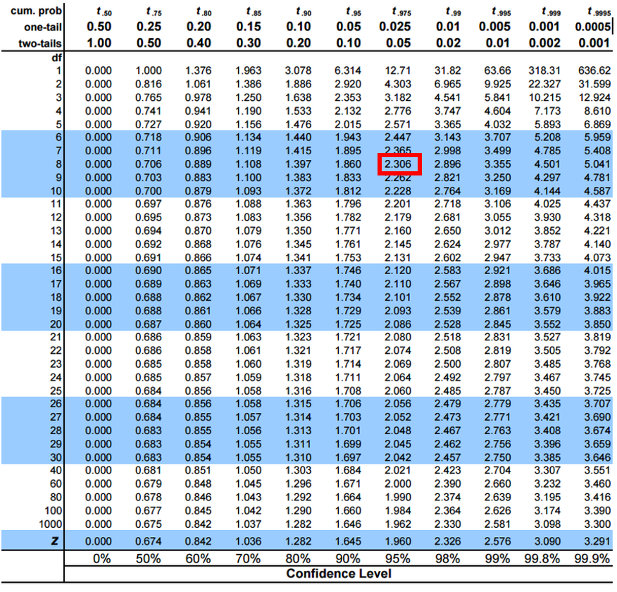

```{r l04-01}
#| message: false
#| warning: false
#| include: false
#| paged-print: false
#| 
library(tidyverse)
library(patchwork)


grayling_df <- read_csv("data/gray_I3_I8.csv") 

i3_df <- grayling_df %>% filter(lake =="I3")


```

# **Lecture 4: Probability and Statistical Inference**

::::: columns
::: {.column width="60%"}
-   Review of probability distributions
-   Standard normal distribution and Z-scores
-   Standard error and confidence intervals
-   Statistical inference fundamentals
-   Hypothesis testing principles
:::

::: {.column width="40%"}
```{r l04-02}
#| echo: false
#| message: false
#| warning: false
#| paged-print: false
#| fig-height: 4
#| fig-width: 5
grayling_i3i8_plot <- grayling_df %>% 
  ggplot(aes(length_mm, fill=lake)) + 
  geom_histogram(alpha = 0.7, binwidth = 10, position = "dodge") +
  labs(x = "Length (mm)", y = "Count", caption = "Arctic grayling length data from lakes I3 and I8")
grayling_i3i8_plot
```
:::
:::::

# Practice Exercise 1: Exploring the Grayling Dataset

::: callout-tip
## Practice Exercise 1: Exploring the Grayling Dataset

Let's explore the Arctic grayling data from lakes I3 and I8. Use the
`grayling_df` data frame to create basic summary statistics.

```{r l04-03}
# Write your code here to explore the basic structure of the data
# also note plottig a box plot is really useful


# Calculate summary statistics
grayling_summary <- grayling_df %>% 
  group_by(lake) %>%
  summarize(
    mean_length = mean(length_mm, na.rm = TRUE),
    sd_length = sd(length_mm, na.rm = TRUE),
    se_length = sd_length/sqrt(sum(!is.na(length_mm))),
    count = sum(!is.na(length_mm)),
    .groups = "drop")
grayling_summary

```
:::

# **Lecture 4:** Probability Distributions

::::: columns
::: {.column width="60%"}
## Probability Distribution Functions

-   A **probability distribution** describes the probability of
    different outcomes in an experiment
-   We've seen histograms of observed data
-   Theoretical distributions help us model and understand real-world
    data
-   We will focus on a **standard normal distribution** and a
    **students** **t distribution**
:::

::: {.column width="40%"}
```{r l04-04}
#| echo: false
#| message: false
#| warning: false
#| fig-height: 4
#| fig-width: 5
#| paged-print: false
grayling_i3i8_plot
```
:::
:::::

# **Lecture 4:** The Standard Normal Distribution

::::: columns
::: {.column width="60%"}
The standard normal distribution is crucial for understanding
statistical inference:

-   Has mean (μ) = 0 and standard deviation (σ) = 1
-   Symmetrical bell-shaped curve
-   Area under the curve = 1 (total probability)
-   **Approximately**:
    -   68% of data within ±1σ of the mean
    -   **95% of data within ±2σ of the mean - really 1.96σ**
    -   99.7% of data within ±3σ of the mean

Z-scores allow us to convert any **normal distribution** to the
**standard normal distribution.**
:::

::: {.column width="40%"}
```{r l04-05}
#| echo: false
#| message: false
#| warning: false
#| fig-height: 4
#| fig-width: 5
#| paged-print: false
# Create a standard normal distribution plot
x <- seq(-4, 4, length.out = 1000)
y <- dnorm(x)

normal_plot <- data.frame(x = x, y = y) %>%
  ggplot(aes(x = x, y = y)) +
  geom_line(color="red") +
  geom_vline(xintercept = c(-3, -2, -1, 0, 1, 2, 3), 
             linetype = c(3, 2, 2, 1, 2, 2, 3),
             color = c("blue", "blue", "blue", "black", "blue", "blue", "blue")) +
  annotate("text", x = c(-3.4, -2.4, -1.4, 0.2, 1.4, 2.4, 3.4), y = 0.5, 
           label = c("-3σ", "-2σ", "-1σ", "0", "1σ", "2σ", "3σ")) +
  labs(title = "Standard Normal Distribution",
       x = "Z-score",
       y = "Probability Density") +
  theme_classic()
normal_plot
```
:::
:::::

# Practice Exercise 2: Calculating Z-scores of lake I3

::: callout-tip
## Practice Exercise 2: Calculating Z-scores

Let's practice converting raw values to Z-scores using the Arctic
grayling data.

**Z Score = (length - mean) / standard deviation**

```{r l04-06}
#| echo: true
# Calculate the mean and standard deviation of fish lengths
mean_length <- mean(i3_df$length_mm, na.rm = TRUE)
sd_length <- sd(i3_df$length_mm, na.rm = TRUE)

# Calculate Z-scores for fish lengths
i3_df <- i3_df %>%
  mutate(z_score = (length_mm - mean_length) / sd_length)

# View the first few rows with Z-scores
head(i3_df)


```
:::

# **Lecture 4:** The fish data as a z score

::::: columns
::: {.column width="60%"}
So if we plot this data what does it look like in a standard normal
distributon?
:::

::: {.column width="40%"}
```{r l04-07}
#| echo: false
#| message: false
#| warning: false
#| fig-height: 4
#| fig-width: 5
#| paged-print: false
z_fish_plot <- i3_df %>% 
  ggplot(aes(x=z_score)) +
  geom_histogram()
z_fish_plot
```
:::
:::::

# Z-score Results

### How to get area under 1 STD DEV?

Proportion within 1 standard deviation = sum of absolute values of Z
Scores that are less than or equal to 1 divided by the number in the
sample...

Remember in a true normal distribution it is 68% within 1 std dev.

should be **approximately (varies if distribution is not normal)**:

-   68% of data within ±1σ of the mean
-   **95% of data within ±2σ of the mean - really 1.96σ**
-   99.7% of data within ±3σ of the mean

```{r l04-08}
# What proportion of fish are within 1 standard deviation of the mean?
within_1sd <- sum(abs(i3_df$z_score) <= 1, na.rm = TRUE) / sum(!is.na(i3_df$z_score))
cat("Proportion within 1 SD:", round(within_1sd * 100, 1), "%\n")
```

# Lecture 4: Standard normal distribution - Fish Data

::::: columns
::: {.column width="60%"}
You want to know things about this population like

-   probability of a fish having a certain length (e.g., \> 300 mm)
-   Can solve this by integrating the area under curve
-   But it is tedious to do every time
-   Instead
    -   we can use the *standard normal distribution* (SND)
    -   and can use the proportions from the density curve
:::

::: {.column width="40%"}
```{r l04-09}
#| echo: false
#| message: false
#| warning: false
#| fig-height: 4
#| fig-width: 5
#| paged-print: false

mean_length_i3_val<- i3_df %>%
  summarize(
    mean_length = round(mean(length_mm, na.rm = TRUE), 4))
mean_length_i3_val

i3_mean_plot <- i3_df%>% 
  ggplot(aes(length_mm)) + 
  geom_histogram(fill = "blue", alpha = 0.5, binwidth = 10) +
  labs(x = "lenght (mm)", y = "count" , caption = "data from I3")+
  geom_vline(xintercept = 266, color = "red", linewidth = 1) +
  annotate("text", x = 266, y = Inf, label = "266 mm", color = "red", vjust = 1, hjust = 0) 
i3_mean_plot
```
:::
:::::

# Lecture 4: Standard normal distribution properties

::::: columns
::: {.column width="60%"}
Standard Normal Distribution

-   "benchmark" normal distribution with µ = 0, σ = 1
-   The Standard Normal Distribution is defined so that:
    -   \~68% of the curve area within +/- 1 σ of the mean,

    -   \~95% within +/- 2 σ of the mean,

    -   \~99.7% within +/- 3 σ of the mean

\*remember σ = standard deviation
:::

::: {.column width="40%"}
```{r l04-10}
#| echo: false
#| message: false
#| warning: false
#| fig-height: 5
#| fig-width: 5
#| paged-print: false

gray_i3_df <- grayling_df %>% filter(lake=="I3")

i3_result <- gray_i3_df %>% 
  summarize(
    mean = mean(length_mm, na.rm = TRUE),
    sd = sd(length_mm, na.rm = TRUE),
    se = sd(length_mm, na.rm = TRUE)/(sum(!is.na(length_mm))^0.5),
    count = sum(!is.na(length_mm)), 
    .groups = "drop") 


i3_z_plot <- i3_df %>% 
  mutate(z_score = (length_mm - i3_result$mean) / i3_result$sd) %>%
  ggplot(aes(z_score)) + 
  geom_histogram(fill = "blue", alpha = 0.7, binwidth = 0.2) +
  geom_vline(xintercept = 0, color = "black", linewidth = 1) +
  geom_vline(xintercept = c(-1, 1), color = "red", linewidth = 0.8) +
  geom_vline(xintercept = c(-2, 2), color = "red", linewidth = 0.8, linetype = "dashed") +
  geom_vline(xintercept = c(-3, 3), color = "red", linewidth = 0.8, linetype = "dotted") +
  scale_x_continuous(breaks = c(-3, -2, -1, 0, 1, 2, 3)) +
  # Add annotations
  annotate("text", x = 0, y = Inf, label = "Mean", vjust = 1.5, size = 3) +
  annotate("text", x = c(-1, 1), y = Inf, label = "±1 SD", vjust = 1.5, size = 3) +
  annotate("text", x = c(-2, 2), y = Inf, label = "±2 SD", vjust = 1.5, size = 3) +
  annotate("text", x = c(-3, 3), y = Inf, label = "±3 SD", vjust = 1.5, size = 3) +
  labs(
    x = "Standard deviations from mean (z-score)", 
    y = "Count",
    title = "Z-distribution of I3 fish lengths",
    caption = "Red lines show ±1, ±2, and ±3 standard deviations"
  ) +
  theme_minimal()
i3_z_plot
```
:::
:::::

# Lecture 4: Using Z-tables

::::: columns
::: {.column width="60%"}
Areas under curve of Standard Normal Distribution

-   Have been calculated for a range of sample sizes
-   Can be looked up in z-table
-   No need to integrate
-   Any normally distributed data can be standardized
    -   transformed into the standard normal distribution

    -   a value can be looked up in a table
:::

::: {.column width="40%"}
```{r l04-11}
#| echo: false
#| message: false
#| warning: false
#| fig-height: 5
#| fig-width: 5
#| paged-print: false
i3_z_plot
```
:::
:::::

# Lecture 4: Z-score Formula

::::: columns
::: {.column width="60%"}
Done by converting original data points to z-scores

-   Z-scores calculated as:

## $\text{Z = }\frac{x_i-\mu}{\sigma}$

-   z = z-score for observation
-   xi = original observation
-   µ = mean of data distribution
-   σ = SD of data distribution

So lets do this for a fish that is 300mm long and guess the probability
of catching something larger

z = (300 - 265.61)/28.3 = 1.215194
:::

::: {.column width="40%"}
```{r l04-12}
#| echo: false
#| message: false
#| warning: false
#| fig-height: 5
#| fig-width: 5
#| paged-print: false
i3_z_plot


```
:::
:::::

# Lecture 4: Z-score example from table

::::: columns
::: {.column width="60%"}
Done by converting original data points to z-scores

-   Z-scores calculated as:

## $\text{Z = }\frac{X_i-\mu}{\sigma}$

-   z = z-score for observation
-   xi = original observation
-   µ = mean of data distribution
-   σ = SD of data distribution

So lets do this for a fish that is 300mm long and guess the probability
of catching something larger

-   z = (300 - 265.61)/28.3 = 1.22
-   look up 1.2 on left and 0.02 on top to get 0.8888 in table
-   Means 88.9% is the area left of the curve **and**
-   100 - 88.9 = 11.27% of fish are expected to be longer

**At what point do you think its not likely to catch a larger fish -
what percentage?**

do this the other way using that percent and why?
:::

::: {.column width="40%"}
{width="538" height="519"}
:::
:::::

# Lecture 4: Z-score example calculation in r

::::: columns
::: {.column width="60%"}
We can use R to get these values easier...

\# For standard normal distribution (mean=0, sd=1):

-   pnorm(z) \# gives cumulative probability (area to the left)
-   qnorm(p) \# gives z-value for a given probability
-   dnorm(z) \# gives probability density
:::

::: {.column width="40%"}
```{r z_in_r_1}
# Examples:
z_value <-  1.22
prob_left <- pnorm(z_value)          # 0.975 (97.5% to the left)
prob_right <- 1 - pnorm(z_value)     # 0.025 (2.5% to the right)
prob_between <- pnorm(2) - pnorm(-2)  # 0.95 (95% between ±1.96)
# To find z-value for a given probability:
z_for_95_percent <- qnorm(0.888)     # 1.96
print(prob_left)
print(prob_right)
print(prob_between)
print(z_for_95_percent)
```
:::
:::::

# Lecture 4: We can now use this for fun in the fish

::::: columns
::: {.column width="60%"}
Lets say we are interested in knowing at what point from I3 it is not
likely to catch a larger fish?

Maybe we expect 95% of the time to catch a fish that is "common" but the
5% is the unlikely portion....
:::

::: {.column width="40%"}
```{r z_in_r}
# Examples:
# What fish length corresponds to the top 5% (unlikely)?
top_5_percent_z <- qnorm(0.95)  # z-score for 95th percentile
unlikely_length <- mean_length + (top_5_percent_z * sd_length)

cat("Only 5% of fish are longer than:", round(unlikely_length, 1), "mm\n")
cat("This corresponds to z-score:", round(top_5_percent_z, 3), "\n")
```
:::
:::::

# Lecture 4: What this means

Given that we can: transform data to z-scores from standard normal
distribution...

...figure out area under the curve (probability) associated with range
of z-scores...

...can therefore figure out probability associated with a range of
original data

# Lecture 4: So what is next...

We can look at Standard normal distributions and know probability of a
value being in a range under the standard normal curve...

Previously we had calculated Standard Error and Confidence Intervals -

-   Now can assess our confidence that the population mean is within a
    certain range\
-   Can use t distribution to ask questions like:
    -   “What is probability of getting sample with mean = ȳ from
        population with mean = µ?“ (1 sample t-test)\
    -   “What is the probability that two samples came from same
        population?” (2 sample t-test)

# **Lecture 4:** When Population σ is Unknown

:::: columns
::: {.column width="60%"}
### When calculating confidence intervals we usually DON'T know the population σ (standard deviation) or 𝝁 population mean

-   estimate it from the samples when don't know the population σ or 𝝁
-   and when sample size is small \< \~30
-   can't use the standard normal (z) distribution

*Instead, we use Student's t distribution*
:::

{width="239" height="307"}
::::

# **Lecture 4:** Understanding t-distribution

::::: columns
::: {.column width="60%"}
### When sample sizes are small, the **t-distribution** is more appropriate than the normal distribution.

-   Similar to normal distribution but with heavier tails
-   Shape depends on **degrees of freedom** (df = n-1)
-   With large df (\>30), approaches the normal distribution
-   Used for:
    -   Small sample sizes

    -   When population standard deviation is unknown

    -   Calculating confidence intervals

    -   Conducting t-tests
:::

::: {.column width="40%"}
```{r l04-13}
#| echo: false
#| message: false
#| warning: false
#| fig-height: 4.5
#| fig-width: 5
#| paged-print: false
# Load required library
library(ggplot2)
library(dplyr)

# Create a plot comparing normal and t-distributions with better tail visualization
x <- seq(-4, 4, length.out = 1000)
normal_y <- dnorm(x)
t_df3_y <- dt(x, df = 3)
t_df10_y <- dt(x, df = 10)
t_df30_y <- dt(x, df = 30)

# Create data frame with proper factor ordering
dist_data <- data.frame(
  x = rep(x, 4),
  y = c(normal_y, t_df3_y, t_df10_y, t_df30_y),
  Distribution = rep(c("Normal", "t (df=3)", "t (df=10)", "t (df=30)"), each = 1000)
)

# Set the factor levels to control legend order: df 3, df 10, df 30, then Normal
dist_data$Distribution <- factor(dist_data$Distribution, 
                                levels = c("t (df=3)", "t (df=10)", "t (df=30)", "Normal"))

# Create main comparison plot
dist_plot <- dist_data %>%
  ggplot(aes(x = x, y = y, color = Distribution, linetype = Distribution)) +
  geom_line(linewidth = .8) +
  scale_color_manual(values = c("t (df=3)" = "#E31A1C", 
                               "t (df=10)" = "#FF7F00", 
                               "t (df=30)" = "#1F78B4", 
                               "Normal" = "#000000")) +
  scale_linetype_manual(values = c("t (df=3)" = "solid", 
                                  "t (df=10)" = "solid", 
                                  "t (df=30)" = "solid", 
                                  "Normal" = "dashed")) +
  labs(title = "Comparison of Normal and t-distributions",
       subtitle = "Note the heavier tails of t-distributions, especially with lower degrees of freedom",
       x = "Value",
       y = "Probability Density") +
  theme_minimal() +
  theme(legend.position = "bottom",
        plot.title = element_text(hjust = 0.5),
        plot.subtitle = element_text(hjust = 0.5))

print(dist_plot)
```
:::
:::::

# Student's t-distribution Formula

::::: columns
::: {.column width="60%"}
### To calculate CI for sample from "unknown" population:

## $\text{CI} = \bar{y} \pm t \cdot \frac{s}{\sqrt{n}}$

Where:

-   ȳ is sample mean
-   𝑛 is sample size
-   s is sample standard deviation
-   t t-value corresponding the probability of the CI
-   t in t-table for different degrees of freedom (n-1)
:::

::: {.column width="40%"}
{width="500" height="392"}
:::
:::::

# **Lecture 4:** Student's t-distribution Table

::::: columns
::: {.column width="60%"}
### Here is a t-table

-   Values of t that correspond to probabilities
-   Probabilities listed along top
-   Sample dfs are listed in the left-most column
-   Probabilities are given for one-tailed and two-tailed "questions"
:::

::: {.column width="40%"}
{width="500" height="410"}
:::
:::::

# **Lecture 4:** One-tailed Questions

::::: columns
::: {.column width="60%"}
### One-tailed questions: area of distribution left or (right) of a certain value

-   n=20 (df=19) - 90% of the observations found left
-   t= 1.328 (10% are outside)

{width="180" height="150"}
:::

::: {.column width="40%"}
{width="508" height="541"}
:::
:::::

# **Lecture 4:** Two-tailed Questions

::::: columns
::: {.column width="60%"}
Two-tailed questions refer to area between certain values

-   n= 20 (df=19), 90% of the observations are between
-   t=-1.729 and t=1.729 (10% are outside)

{width="276" height="200"}
:::

::: {.column width="40%"}
{width="421" height="514"}
:::
:::::

# **Lecture 4:** t-distribution CI Example

::::: columns
::: {.column width="60%"}
Let's calculate CIs again:

Use two-sided test

## $\text{CI} = \bar{y} \pm t \cdot \frac{s}{\sqrt{n}}$

-   95% CI Sample A: = 272.8 ± 2.306 \* (37.81/(9\^0.5))
-   mean = 272.8, N = 20, and s = 37.81 - t is ?
-   CI = 29.06
-   The 95% CI is between 243.7 and 301.9
-   "The 95% CI for the population mean from sample A is 272.8 ± 29.06
:::

::: {.column width="40%"}

:::
:::::

# Practice Exercise 4: Using the t-distribution

::: callout-tip
## Practice Exercise 4: Using the t-distribution

Let's compare confidence intervals using the normal approximation (z)
versus the t-distribution for our fish data. I3 data and 10 fish Mean is
266.7 - sd is 17.12 - se is 5.41

\## $\text{CI} = \bar{y} \pm t \cdot \frac{s}{\sqrt{n}}$

```{r l04-14}
#| message: false
#| warning: false
#| include: false
#| paged-print: false
small_sample <- grayling_df %>% filter(lake == "I3") %>% slice_sample(n = 10)
sample_mean <- mean(small_sample$length_mm)
sample_sd <- sd(small_sample$length_mm)
sample_n <- nrow(small_sample)
sample_se <- sample_sd / sqrt(sample_n)
z_ci_lower <- sample_mean - 1.96 * sample_se
z_ci_upper <- sample_mean + 1.96 * sample_se
t_crit <- qt(0.975, df = sample_n - 1)
t_ci_lower <- sample_mean - t_crit * sample_se
t_ci_upper <- sample_mean + t_crit * sample_se
```
:::

::: callout-tip
## Practice Exercise 4: Using the t-distribution

Let's compare confidence intervals using the normal approximation (z)
versus the t-distribution for our fish data. I3 data and 10 fish Mean is
266.7 - sd is 17.12 - se is 5.41

\## $\text{CI} = \bar{y} \pm t \cdot \frac{s}{\sqrt{n}}$

```{r l04-15}
# Display results
cat("Mean:", round(sample_mean, 1), "mm\n")
cat("Standard deviation:", round(sample_sd, 2), "mm\n")
cat("Standard error:", round(sample_se, 2), "mm\n")
cat("95% CI using z:", round(z_ci_lower, 1), "to", round(z_ci_upper, 1), "mm\n")
cat("95% CI using t:", round(t_ci_lower, 1), "to", round(t_ci_upper, 1), "mm\n")
cat("t critical value:", round(t_crit, 3), "vs z critical value: 1.96\n")
```
:::

# **Lecture 4:** Intro to Hypothesis Testing one tailed

::::: columns
::: {.column width="60%"}
Hypothesis testing is a systematic way to evaluate research questions
using data.

**Key components:**

1.  **Null hypothesis (H₀)**: Typically assumes "no effect" or "no
    difference"

2.  **Alternative hypothesis (Hₐ)**: The claim we're trying to support

3.  **Statistical test**: Method for evaluating evidence against H₀

4.  **P-value**: Probability of observing our results (or more extreme)
    if H₀ is true

5.  **Significance level (α)**: Threshold for rejecting H₀, typically
    0.05

**Decision rule**: Reject H₀ if p-value \< α\
\
lets test if our sample mean of 320 is larger than 270 or not?
Essentially we are looking at the confidence intervals!!! But we are
only interested if it is larger
:::

::: {.column width="40%"}
```{r l04-16}
#| echo: false
#| message: false
#| warning: false
#| fig-height: 5
#| fig-width: 5
#| paged-print: false

# Load required library
library(ggplot2)

# Define parameters
sample_mean_1t <- 320
sample_sd_1t <- 42.15
sample_size_1t <- 12
hypothesized_mean_1t <- 285
alpha_1t <- 0.05
df_1t <- sample_size_1t - 1

# Calculate critical t-value for one-tailed test (right tail)
t_crit_1t <- qt(1 - alpha_1t, df_1t)

# Create measurement scale data
measurement_x_1t <- seq(220, 360, length.out = 1000)
standard_error_1t <- sample_sd_1t / sqrt(sample_size_1t)

# Calculate probability density values
measurement_null_y_1t <- dt((measurement_x_1t - hypothesized_mean_1t) / standard_error_1t, df_1t) * (1 / standard_error_1t)

measurement_data_1t <- data.frame(
  x = measurement_x_1t,
  y = measurement_null_y_1t
)

# Critical value in original scale (only upper tail for one-tailed test)
critical_value_upper_1t <- hypothesized_mean_1t + t_crit_1t * standard_error_1t

# Create rejection region (ONLY upper tail)
rejection_upper_1t <- data.frame(
  x = seq(critical_value_upper_1t, max(measurement_x_1t), length.out = 100),
  y = dt((seq(critical_value_upper_1t, max(measurement_x_1t), length.out = 100) - hypothesized_mean_1t) / standard_error_1t, df_1t) * (1 / standard_error_1t)
)

# Calculate t-statistic
t_stat_1t <- (sample_mean_1t - hypothesized_mean_1t) / standard_error_1t

# Create the measurement scale plot - CORRECTED NAME
measurement_plot_1t <- ggplot(measurement_data_1t, aes(x = x, y = y)) +
  geom_line(color = "blue", size = 1) +
  # ONLY upper rejection region
  geom_area(data = rejection_upper_1t, aes(x = x, y = y), 
            fill = "red", alpha = 0.3, inherit.aes = FALSE) +
  # ONLY upper critical line
  geom_vline(xintercept = critical_value_upper_1t, linetype = "dashed", color = "red") +
  geom_vline(xintercept = sample_mean_1t, linetype = "solid", color = "green", size = 1.2) +
  geom_vline(xintercept = hypothesized_mean_1t, linetype = "solid", color = "blue", size = 1.2) +
  # ONLY one rejection region label
  annotate("text", x = critical_value_upper_1t + 15, y = max(measurement_null_y_1t) * 0.6, 
           label = "Rejection\nRegion\n(α = 0.05)", color = "red", size = 3.5) +
  annotate("text", x = sample_mean_1t + 5, y = max(measurement_null_y_1t) * 0.8, 
           label = paste("Sample Mean =", sample_mean_1t), color = "green", size = 3.5) +
  annotate("text", x = hypothesized_mean_1t - 5, y = max(measurement_null_y_1t) * 0.9, 
           label = paste("Ho: μ =", hypothesized_mean_1t), color = "blue", size = 3.5) +
  annotate("text", x = 240, y = max(measurement_null_y_1t) * 0.3,
           label = paste("t =", round(t_stat_1t, 3)), size = 3.5) +
  annotate("text", x = 240, y = max(measurement_null_y_1t) * 0.2,
           label = paste("Critical t =", round(t_crit_1t, 3)), size = 3.5) +
  labs(title = "One-Tailed t-Test (Upper Tail)",
       subtitle = paste0("Testing Ho: μ = ", hypothesized_mean_1t, " vs H1: μ > ", hypothesized_mean_1t, " (α = ", alpha_1t, ", df = ", df_1t, ")"),
       x = "Measurement Value",
       y = "Probability Density") +
  theme_minimal() +
  theme(plot.title = element_text(size = 14, face = "bold"),
        plot.subtitle = element_text(size = 12),
        axis.title = element_text(size = 12),
        axis.text = element_text(size = 10))

# Display the plot
# print(measurement_plot_1t)

# Print summary statistics
cat("Summary of One-Tailed Hypothesis Test:\n")
cat("Sample mean:", sample_mean_1t, "\n")
cat("Hypothesized mean:", hypothesized_mean_1t, "\n")
cat("Sample size:", sample_size_1t, "\n")
cat("Standard deviation:", sample_sd_1t, "\n")
cat("Standard error:", round(standard_error_1t, 3), "\n")
cat("t-statistic:", round(t_stat_1t, 3), "\n")
cat("Critical t-value (one-tailed):", round(t_crit_1t, 3), "\n")
cat("Critical value:", round(critical_value_upper_1t, 2), "\n")

# Determine if we reject H0 (one-tailed test)
if(t_stat_1t > t_crit_1t) {
  cat("Decision: Reject Ho (sample mean falls in upper rejection region)\n")
} else {
  cat("Decision: Fail to reject Ho (sample mean does not fall in rejection region)\n")
}


```
:::
:::::

# **Lecture 4:** Intro to Hypothesis Testing one tailed

::::: columns
::: {.column width="60%"}
Hypothesis testing is a systematic way to evaluate research questions
using data.

**Key components:**

1.  **Null hypothesis (H₀)**: Typically assumes "no effect" or "no
    difference"

2.  **Alternative hypothesis (Hₐ)**: The claim we're trying to support

3.  **Statistical test**: Method for evaluating evidence against H₀

4.  **P-value**: Probability of observing our results (or more extreme)
    if H₀ is true

5.  **Significance level (α)**: Threshold for rejecting H₀, typically
    0.05

**Decision rule**: Reject H₀ if p-value \< α\
\
lets test if our sample mean of 320 is larger than 270 or not?
Essentially we are looking at the confidence intervals!!! But we are
only interested if it is larger
:::

::: {.column width="40%"}
```{r l04-17}
#| echo: false
#| message: false
#| warning: false
#| fig-height: 5
#| fig-width: 5
#| paged-print: false

# Load required library
library(ggplot2)

# Define parameters
sample_mean_1t <- 320
sample_sd_1t <- 42.15
sample_size_1t <- 12
hypothesized_mean_1t <- 285
alpha_1t <- 0.05
df_1t <- sample_size_1t - 1

# Calculate critical t-value for one-tailed test (right tail)
t_crit_1t <- qt(1 - alpha_1t, df_1t)

# Create measurement scale data
measurement_x_1t <- seq(220, 360, length.out = 1000)
standard_error_1t <- sample_sd_1t / sqrt(sample_size_1t)

# Calculate probability density values
measurement_null_y_1t <- dt((measurement_x_1t - hypothesized_mean_1t) / standard_error_1t, df_1t) * (1 / standard_error_1t)

measurement_data_1t <- data.frame(
  x = measurement_x_1t,
  y = measurement_null_y_1t
)

# Critical value in original scale (only upper tail for one-tailed test)
critical_value_upper_1t <- hypothesized_mean_1t + t_crit_1t * standard_error_1t

# Create rejection region (ONLY upper tail)
rejection_upper_1t <- data.frame(
  x = seq(critical_value_upper_1t, max(measurement_x_1t), length.out = 100),
  y = dt((seq(critical_value_upper_1t, max(measurement_x_1t), length.out = 100) - hypothesized_mean_1t) / standard_error_1t, df_1t) * (1 / standard_error_1t)
)

# Calculate t-statistic
t_stat_1t <- (sample_mean_1t - hypothesized_mean_1t) / standard_error_1t

# Create the measurement scale plot - CORRECTED NAME
measurement_plot_1t <- ggplot(measurement_data_1t, aes(x = x, y = y)) +
  geom_line(color = "blue", size = 1) +
  # ONLY upper rejection region
  geom_area(data = rejection_upper_1t, aes(x = x, y = y), 
            fill = "red", alpha = 0.3, inherit.aes = FALSE) +
  # ONLY upper critical line
  geom_vline(xintercept = critical_value_upper_1t, linetype = "dashed", color = "red") +
  geom_vline(xintercept = sample_mean_1t, linetype = "solid", color = "green", size = 1.2) +
  geom_vline(xintercept = hypothesized_mean_1t, linetype = "solid", color = "blue", size = 1.2) +
  # ONLY one rejection region label
  annotate("text", x = critical_value_upper_1t + 15, y = max(measurement_null_y_1t) * 0.6, 
           label = "Rejection\nRegion\n(α = 0.05)", color = "red", size = 3.5) +
  annotate("text", x = sample_mean_1t + 5, y = max(measurement_null_y_1t) * 0.8, 
           label = paste("Sample Mean =", sample_mean_1t), color = "green", size = 3.5) +
  annotate("text", x = hypothesized_mean_1t - 5, y = max(measurement_null_y_1t) * 0.9, 
           label = paste("Ho: μ =", hypothesized_mean_1t), color = "blue", size = 3.5) +
  annotate("text", x = 240, y = max(measurement_null_y_1t) * 0.3,
           label = paste("t =", round(t_stat_1t, 3)), size = 3.5) +
  annotate("text", x = 240, y = max(measurement_null_y_1t) * 0.2,
           label = paste("Critical t =", round(t_crit_1t, 3)), size = 3.5) +
  labs(title = "One-Tailed t-Test (Upper Tail)",
       subtitle = paste0("Testing Ho: μ = ", hypothesized_mean_1t, " vs H1: μ > ", hypothesized_mean_1t, " (α = ", alpha_1t, ", df = ", df_1t, ")"),
       x = "Measurement Value",
       y = "Probability Density") +
  theme_minimal() +
  theme(plot.title = element_text(size = 14, face = "bold"),
        plot.subtitle = element_text(size = 12),
        axis.title = element_text(size = 12),
        axis.text = element_text(size = 10))

# Display the plot
print(measurement_plot_1t)

# # Print summary statistics
# cat("Summary of One-Tailed Hypothesis Test:\n")
# cat("Sample mean:", sample_mean_1t, "\n")
# cat("Hypothesized mean:", hypothesized_mean_1t, "\n")
# cat("Sample size:", sample_size_1t, "\n")
# cat("Standard deviation:", sample_sd_1t, "\n")
# cat("Standard error:", round(standard_error_1t, 3), "\n")
# cat("t-statistic:", round(t_stat_1t, 3), "\n")
# cat("Critical t-value (one-tailed):", round(t_crit_1t, 3), "\n")
# cat("Critical value:", round(critical_value_upper_1t, 2), "\n")
# 
# # Determine if we reject H0 (one-tailed test)
# if(t_stat_1t > t_crit_1t) {
#   cat("Decision: Reject Ho (sample mean falls in upper rejection region)\n")
# } else {
#   cat("Decision: Fail to reject Ho (sample mean does not fall in rejection region)\n")
# }
# 

```
:::
:::::

# 

# **Lecture 4:** Hypothesis Testing two tailed

::::: columns
::: {.column width="60%"}
Hypothesis testing is a systematic way to evaluate research questions
using data.

**Key components:**

1.  **Null hypothesis (H₀)**: Typically assumes "no effect" or "no
    difference"
2.  **Alternative hypothesis (Hₐ)**: The claim we're trying to support
3.  **Statistical test**: Method for evaluating evidence against H₀
4.  **P-value**: Probability of observing our results (or more extreme)
    if H₀ is true
5.  **Significance level (α)**: Threshold for rejecting H₀, typically
    0.05

**Decision rule**: Reject H₀ if p-value \< α

lets test if our sample mean of 320 is equal to 270 or not? Essentially
we are looking at the confidence intervals!!!\
:::

::: {.column width="40%"}
```{r l04-18}
#| echo: false
#| message: false
#| warning: false
#| fig-height: 5
#| fig-width: 5
#| paged-print: false

# Define parameters
sample_mean <- 320
sample_sd <- 37.81
sample_size <- 9
hypothesized_mean <- 270
alpha <- 0.05
df <- sample_size - 1

# Calculate critical t-value for two-tailed test
t_crit <- qt(1 - alpha/2, df)

# Create measurement scale data
measurement_x <- seq(200, 380, length.out = 1000)
standard_error <- sample_sd / sqrt(sample_size)

# Calculate probability density values
measurement_null_y <- dt((measurement_x - hypothesized_mean) / standard_error, df) * (1 / standard_error)

measurement_data <- data.frame(
  x = measurement_x,
  y = measurement_null_y
)

# Critical values in original scale
critical_value_upper <- hypothesized_mean + t_crit * standard_error
critical_value_lower <- hypothesized_mean - t_crit * standard_error

# Create rejection regions
rejection_upper <- data.frame(
  x = seq(critical_value_upper, max(measurement_x), length.out = 100),
  y = dt((seq(critical_value_upper, max(measurement_x), length.out = 100) - hypothesized_mean) / standard_error, df) * (1 / standard_error)
)

rejection_lower <- data.frame(
  x = seq(min(measurement_x), critical_value_lower, length.out = 100),
  y = dt((seq(min(measurement_x), critical_value_lower, length.out = 100) - hypothesized_mean) / standard_error, df) * (1 / standard_error)
)

# Calculate t-statistic
t_stat <- (sample_mean - hypothesized_mean) / standard_error

# Create the measurement scale plot
measurement_plot <- ggplot(measurement_data, aes(x = x, y = y)) +
  geom_line(color = "blue", size = 1) +
  geom_area(data = rejection_upper, aes(x = x, y = y), 
            fill = "red", alpha = 0.3, inherit.aes = FALSE) +
  geom_area(data = rejection_lower, aes(x = x, y = y), 
            fill = "red", alpha = 0.3, inherit.aes = FALSE) +
  geom_vline(xintercept = critical_value_upper, linetype = "dashed", color = "red") +
  geom_vline(xintercept = critical_value_lower, linetype = "dashed", color = "red") +
  geom_vline(xintercept = sample_mean, linetype = "solid", color = "green", size = 1.2) +
  geom_vline(xintercept = hypothesized_mean, linetype = "solid", color = "blue", size = 1.2) +
  annotate("text", x = critical_value_upper + 8, y = max(measurement_null_y) * 0.6, 
           label = "Rejection\nRegion", color = "red", size = 3.5) +
  annotate("text", x = critical_value_lower - 8, y = max(measurement_null_y) * 0.6,  
           label = "Rejection\nRegion", color = "red", size = 3.5) +
  annotate("text", x = sample_mean + 5, y = max(measurement_null_y) * 0.8, 
           label = paste("Sample Mean =", sample_mean), color = "green", size = 3.5) +
  annotate("text", x = hypothesized_mean - 5, y = max(measurement_null_y) * 0.9, 
           label = paste("Ho: μ =", hypothesized_mean), color = "blue", size = 3.5) +
  annotate("text", x = 230, y = max(measurement_null_y) * 0.3,
           label = paste("t =", round(t_stat, 3)), size = 3.5) +
  annotate("text", x = 230, y = max(measurement_null_y) * 0.2,
           label = paste("Critical t = ±", round(t_crit, 3)), size = 3.5) +
  labs(title = "One-Sample t-Test in Original Scale",
       subtitle = paste0("Testing Ho: μ = ", hypothesized_mean, " vs H1: μ ≠ ", hypothesized_mean, " (α = ", alpha, ", df = ", df, ")"),
       x = "Measurement Value",
       y = "Probability Density") +
  theme_minimal() +
  theme(plot.title = element_text(size = 14, face = "bold"),
        plot.subtitle = element_text(size = 12),
        axis.title = element_text(size = 12),
        axis.text = element_text(size = 10))

# Display the plot
# print(measurement_plot)

# Print summary statistics
cat("Summary of Hypothesis Test:\n")
cat("Sample mean:", sample_mean, "\n")
cat("Hypothesized mean:", hypothesized_mean, "\n")
cat("Standard error:", round(standard_error, 3), "\n")
cat("t-statistic:", round(t_stat, 3), "\n")
cat("Critical t-value (±):", round(t_crit, 3), "\n")
cat("Critical values:", round(critical_value_lower, 2), "to", round(critical_value_upper, 2), "\n")

# Determine if we reject H0
if(abs(t_stat) > t_crit) {
  cat("Decision: Reject Ho (sample mean falls in rejection region)\n")
} else {
  cat("Decision: Fail to reject Ho (sample mean falls in acceptance region)\n")
}
```
:::
:::::

# **Lecture 4:** Hypothesis Testing two tailed

::::: columns
::: {.column width="60%"}
Hypothesis testing is a systematic way to evaluate research questions
using data.

**Key components:**

1.  **Null hypothesis (H₀)**: Typically assumes "no effect" or "no
    difference"
2.  **Alternative hypothesis (Hₐ)**: The claim we're trying to support
3.  **Statistical test**: Method for evaluating evidence against H₀
4.  **P-value**: Probability of observing our results (or more extreme)
    if H₀ is true
5.  **Significance level (α)**: Threshold for rejecting H₀, typically
    0.05

**Decision rule**: Reject H₀ if p-value \< α

lets test if our sample mean of 320 is equal to 270 or not? Essentially
we are looking at the confidence intervals!!!
:::

::: {.column width="40%"}
```{r l04-19}
#| echo: false
#| message: false
#| warning: false
#| fig-height: 5
#| fig-width: 5
#| paged-print: false

# Define parameters
sample_mean <- 320
sample_sd <- 37.81
sample_size <- 9
hypothesized_mean <- 270
alpha <- 0.05
df <- sample_size - 1

# Calculate critical t-value for two-tailed test
t_crit <- qt(1 - alpha/2, df)

# Create measurement scale data
measurement_x <- seq(200, 380, length.out = 1000)
standard_error <- sample_sd / sqrt(sample_size)

# Calculate probability density values
measurement_null_y <- dt((measurement_x - hypothesized_mean) / standard_error, df) * (1 / standard_error)

measurement_data <- data.frame(
  x = measurement_x,
  y = measurement_null_y
)

# Critical values in original scale
critical_value_upper <- hypothesized_mean + t_crit * standard_error
critical_value_lower <- hypothesized_mean - t_crit * standard_error

# Create rejection regions
rejection_upper <- data.frame(
  x = seq(critical_value_upper, max(measurement_x), length.out = 100),
  y = dt((seq(critical_value_upper, max(measurement_x), length.out = 100) - hypothesized_mean) / standard_error, df) * (1 / standard_error)
)

rejection_lower <- data.frame(
  x = seq(min(measurement_x), critical_value_lower, length.out = 100),
  y = dt((seq(min(measurement_x), critical_value_lower, length.out = 100) - hypothesized_mean) / standard_error, df) * (1 / standard_error)
)

# Calculate t-statistic
t_stat <- (sample_mean - hypothesized_mean) / standard_error

# Create the measurement scale plot
measurement_plot <- ggplot(measurement_data, aes(x = x, y = y)) +
  geom_line(color = "blue", size = 1) +
  geom_area(data = rejection_upper, aes(x = x, y = y), 
            fill = "red", alpha = 0.3, inherit.aes = FALSE) +
  geom_area(data = rejection_lower, aes(x = x, y = y), 
            fill = "red", alpha = 0.3, inherit.aes = FALSE) +
  geom_vline(xintercept = critical_value_upper, linetype = "dashed", color = "red") +
  geom_vline(xintercept = critical_value_lower, linetype = "dashed", color = "red") +
  geom_vline(xintercept = sample_mean, linetype = "solid", color = "green", size = 1.2) +
  geom_vline(xintercept = hypothesized_mean, linetype = "solid", color = "blue", size = 1.2) +
  annotate("text", x = critical_value_upper + 8, y = max(measurement_null_y) * 0.6, 
           label = "Rejection\nRegion", color = "red", size = 3.5) +
  annotate("text", x = critical_value_lower - 8, y = max(measurement_null_y) * 0.6,  
           label = "Rejection\nRegion", color = "red", size = 3.5) +
  annotate("text", x = sample_mean + 5, y = max(measurement_null_y) * 0.8, 
           label = paste("Sample Mean =", sample_mean), color = "green", size = 3.5) +
  annotate("text", x = hypothesized_mean - 5, y = max(measurement_null_y) * 0.9, 
           label = paste("Ho: μ =", hypothesized_mean), color = "blue", size = 3.5) +
  annotate("text", x = 230, y = max(measurement_null_y) * 0.3,
           label = paste("t =", round(t_stat, 3)), size = 3.5) +
  annotate("text", x = 230, y = max(measurement_null_y) * 0.2,
           label = paste("Critical t = ±", round(t_crit, 3)), size = 3.5) +
  labs(title = "One-Sample t-Test in Original Scale",
       subtitle = paste0("Testing Ho: μ = ", hypothesized_mean, " vs H1: μ ≠ ", hypothesized_mean, " (α = ", alpha, ", df = ", df, ")"),
       x = "Measurement Value",
       y = "Probability Density") +
  theme_minimal() +
  theme(plot.title = element_text(size = 14, face = "bold"),
        plot.subtitle = element_text(size = 12),
        axis.title = element_text(size = 12),
        axis.text = element_text(size = 10))

# Display the plot
print(measurement_plot)

# # Print summary statistics
# cat("Summary of Hypothesis Test:\n")
# cat("Sample mean:", sample_mean, "\n")
# cat("Hypothesized mean:", hypothesized_mean, "\n")
# cat("Standard error:", round(standard_error, 3), "\n")
# cat("t-statistic:", round(t_stat, 3), "\n")
# cat("Critical t-value (±):", round(t_crit, 3), "\n")
# cat("Critical values:", round(critical_value_lower, 2), "to", round(critical_value_upper, 2), "\n")
# 
# # Determine if we reject H0
# if(abs(t_stat) > t_crit) {
#   cat("Decision: Reject Ho (sample mean falls in rejection region)\n")
# } else {
#   cat("Decision: Fail to reject Ho (sample mean falls in acceptance region)\n")
# }
```
:::
:::::

# Practice Exercise 5: One-Sample t-Test

::: callout-tip
## Practice Exercise 5: Lets practice a One-Sample t-Test

Let's perform a one-sample t-test to determine if the mean fish length
in Lake I3 differs from 260 mm:

```{r l04-20}
# get only lake I3
i3_df <- grayling_df %>% filter(lake=="I3")

# what is the mean
i3_mean <- mean(i3_df$length_mm, na.rm=TRUE)
cat("Mean:", round(i3_mean, 1), "mm\n")

# Perform a one-sample t-test
t_test_result <- t.test(i3_df$length_mm, mu = 260)

# View the test results
t_test_result
```

Interpret this test result by answering these questions:

1.  What was the null hypothesis?
2.  What was the alternative hypothesis?
3.  What does the p-value tell us?
4.  Should we reject or fail to reject the null hypothesis at α = 0.05?
5.  What is the practical interpretation of this result for fish
    biologists?
:::

# Practice Exercise 6: Formulating Hypotheses

::: callout-tip
## Practice Exercise 6: Formulating Hypotheses

For the following research questions about Arctic grayling, write the
null and alternative hypotheses:

1.  Are fish in Lake I8 longer than fish in Lake I3?

```{r l04-21}
# Let's test one of these hypotheses: Are fish in Lake I8 longer than fish in Lake I3?

# Perform an independent t-test
t_test_result <- t.test(length_mm ~ lake, data = grayling_df, 
                       alternative = "less")  # H₀: μ_I3 ≥ μ_I8, H₁: μ_I3 < μ_I8

# Display the results
t_test_result
```

Based on this t-test, what can we conclude about the difference in fish
length between the two lakes?
:::

# **Lecture 4:** Understanding P-values

::::: columns
::: {.column width="60%"}
A **p-value** is the probability of observing the sample result (or
something more extreme) if the null hypothesis is true.

**Common interpretations:**

-   \- p \< 0.05: Strong evidence against H₀
-   \- 0.05 ≤ p \< 0.10: Moderate evidence against H₀
-   \- p ≥ 0.10: Insufficient evidence against H₀

**Common misinterpretations:**

-   \- p-value is NOT the probability that H₀ is true
-   \- p-value is NOT the probability that results occurred by chance
-   \- Statistical significance ≠ practical significance
-   the smaller the p value does not necessarily mean much... use \<
    0.05 even if is is 10\^-16
:::

::: {.column width="40%"}
```{r l04-22}
#| echo: false
#| message: false
#| warning: false
#| fig-height: 4
#| fig-width: 5
#| paged-print: false
# Visualize the p-value concept
x <- seq(-4, 4, length.out = 1000)
y <- dnorm(x)

# Mark "observed" test statistic
observed_z <- 2.1
observed_p <- 1 - pnorm(observed_z)

# Create data for shaded region (p-value)
p_region <- data.frame(
  x = seq(observed_z, 4, length.out = 100),
  y = dnorm(seq(observed_z, 4, length.out = 100))
)

p_plot <- ggplot() +
  geom_line(data = data.frame(x = x, y = y), aes(x = x, y = y)) +
  geom_area(data = p_region, aes(x = x, y = y), fill = "blue", alpha = 0.3) +
  geom_vline(xintercept = observed_z, linetype = "dashed", color = "red") +
  annotate("text", x = 2.7, y = 0.05, 
           label = paste("p-value =", round(observed_p, 3)), 
           color = "blue") +
  annotate("text", x = observed_z, y = 0.15, 
           label = "Observed\nTest Statistic", 
           color = "red", hjust = -0.1) +
  labs(title = "Visualizing the p-value",
       subtitle = "Null distribution with observed test statistic",
       x = "Test Statistic (z)",
       y = "Probability Density") +
  theme_minimal()
p_plot
```
:::
:::::

# **Lecture 4:** Type I and Type II Errors

::::: columns
::: {.column width="60%"}
When making decisions based on hypothesis tests, two types of errors can
occur:

**Type I Error (False Positive)**

-   \- Rejecting H₀ when it's actually true
-   \- Probability = α (significance level)
-   \- "Finding an effect that isn't real"

**Type II Error (False Negative)**

-   \- Failing to reject H₀ when it's actually false
-   \- Probability = β - "Missing an effect that is real"

**Statistical Power = 1 - β**

-   \- Probability of correctly rejecting a false H₀
-   \- Increases with:
    -   \- Larger sample size

    -   \- Larger effect size

    -   \- Lower variability

    -   \- Higher α level
:::

::: {.column width="40%"}
```{r l04-23}
#| echo: false
#| message: false
#| warning: false
#| fig-height: 5
#| fig-width: 5
#| paged-print: false
# Create a visualization of Type I and Type II errors
x <- seq(-4, 8, length.out = 1000)
null_y <- dnorm(x, mean = 0, sd = 1)
alt_y <- dnorm(x, mean = 3, sd = 1.5)

# Critical value for alpha = 0.05
crit_val <- qnorm(0.95)

# Type I and II error regions
type_1_region <- data.frame(
  x = seq(crit_val, 8, length.out = 100),
  y = dnorm(seq(crit_val, 8, length.out = 100), mean = 0, sd = 1)
)

type_2_region <- data.frame(
  x = seq(-4, crit_val, length.out = 100),
  y = dnorm(seq(-4, crit_val, length.out = 100), mean = 3, sd = 1.5)
)

# Create the plot
error_plot <- ggplot() +
  # Distributions
  geom_line(data = data.frame(x = x, y = null_y), 
            aes(x = x, y = y, color = "Null Distribution")) +
  geom_line(data = data.frame(x = x, y = alt_y), 
            aes(x = x, y = y, color = "Alternative Distribution")) +
  
  # Error regions
  geom_area(data = type_1_region, aes(x = x, y = y), 
            fill = "red", alpha = 0.3) +
  geom_area(data = type_2_region, aes(x = x, y = y), 
            fill = "blue", alpha = 0.3) +
  
  # Critical value line
  geom_vline(xintercept = crit_val, linetype = "dashed") +
  
  # Labels
  annotate("text", x = 2, y = 0.3, label = "Type I Error (α)", color = "red") +
  annotate("text", x = 0, y = 0.15, label = "Type II Error (β)", color = "blue") +
  
  # Theme and formatting
  scale_color_manual(values = c("Null Distribution" = "black", 
                                "Alternative Distribution" = "darkgreen"),
                     name = "") +
  labs(title = "Type I and Type II Errors",
       x = "Test Statistic",
       y = "Probability Density") +
  theme_minimal()
error_plot
```
:::
:::::

# **Lecture 4:** Type I and Type II Errors

::::: columns
::: {.column width="60%"}
-   What does it mean...
    -   Black curve (Null Distribution): distribution of test statistics
        when Ho is true

    -   Green curve (Alternative Distribution): distribution when Ha is
        true (is an effect)
-   Red shaded area (Type I Error): probability of rejecting Ho when
    it's actually tru
    -   area under the null distribution (black curve) to the right α
        (p=0.05)
-   Blue shaded area (Type II Error): probability of failing to reject
    Ho when alternative is actually true
    -   area under alternative distribution (green curve) left of α
        (depends on effect size, sample size, etc.)

The Key Insight fundamental trade-off in hypothesis testing:

-   as α value moves left or right, change balance between Type I and
    Type II errors
-   Moving left reduces Type II errors increases Type I errors, and vice
    versa
-   power (1 - β) area under the green curve RIGHT of dashed line
-   the probability of correctly detecting a real effect.
:::

::: {.column width="40%"}
```{r l04-24}
#| echo: false
#| message: false
#| warning: false
#| fig-height: 5
#| fig-width: 5
#| paged-print: false

error_plot
```
:::
:::::

# 

# Practice Exercise 7: Interpreting Errors and Power

::: callout-tip
## Practice Exercise 6: Interpreting P-values and Errors

Given the following scenarios, identify whether a Type I or Type II
error might have occurred:

1.  A researcher concludes that a new fishing regulation increased
    grayling size, when in fact it had no effect.

2.  A study fails to detect a real decline in grayling population due to
    warming water, concluding there was no effect.

3.  Let's calculate the power of our t-test to detect a 30 mm difference
    in length between lakes:

```{r l04-25}
# Calculate power for detecting a 30 mm difference
# First determine parameters
lake_I3 <- grayling_df %>% filter(lake == "I3")
lake_I8 <- grayling_df %>% filter(lake == "I8") 

n1 <- nrow(lake_I3)
n2 <- nrow(lake_I8)
sd_pooled <- sqrt((var(lake_I3$length_mm) * (n1-1) + 
                  var(lake_I8$length_mm) * (n2-1)) / 
                  (n1 + n2 - 2))

# Calculate power
effect_size <- 30 / sd_pooled  # Cohen's d
df <- n1 + n2 - 2
alpha <- 0.05
power <- power.t.test(n = min(n1, n2), 
                     delta = effect_size,
                     sd = 1,  # Using standardized effect size
                     sig.level = alpha,
                     type = "two.sample",
                     alternative = "two.sided")

# Display results
power
```
:::

# **Lecture 4:** Summary

::::: columns
::: {.column width="60%"}
**Key concepts covered:**

1.  **Probability distributions** model random phenomena
    -   Normal distribution is especially important
    -   Z-scores standardize measurements
2.  **Standard error** measures precision of estimates
    -   Decreases with larger sample sizes
    -   Used to construct confidence intervals
3.  **Confidence intervals** express uncertainty
    -   Provide plausible range for parameters
    -   95% CI: `mean ± 1.96 × SE`
4.  **Hypothesis testing** evaluates claims
    -   Null vs. alternative hypotheses
    -   P-values quantify evidence against H₀
    -   Consider both statistical and practical significance
:::

::: {.column width="40%"}
```{r l04-26}
#| echo: false
#| message: false
#| warning: false
#| fig-height: 5
#| fig-width: 5
#| paged-print: false
error_plot
```
:::
:::::
