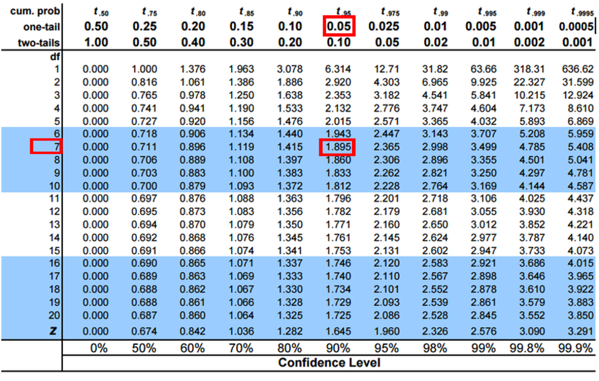
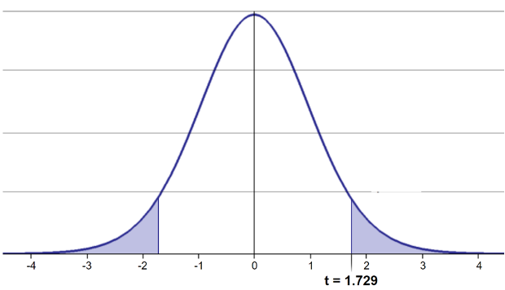
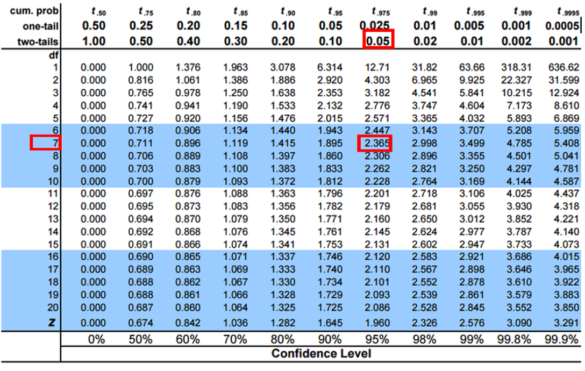

# **Lecture 4: Review**

::::: columns
::: {.column width="60%"}
-   Introduction to histograms or frequency distributions
-   Probability Distribution Functions (PDF)
    -   Z scores and T scores
-   Tests of means using T-Tests
    -   one sample

    -   two sample
:::

::: {.column width="40%"}
{width="241" height="330"}
:::
:::::

-   Tests of means using T-Tests
    -   one sample - is the sample mean different from a hypothesized
        mean?
    -   two sample - are the sample means from two samples the same or
        different?
-   for Two sample T-tests the df = n1+ n2 -2 = 8+8-2=14

```{r}
#| echo: false
#| message: false
#| warning: false
#| fig-height: 4
#| fig-width: 4
#| paged-print: false

library(readxl)
library(tidyverse)
library(patchwork)
library(car)  # For diagnostic tests

pine_df <- read_excel("data/class_pine needle length.xlsx") 
pine_switch_df <- read_excel("data/class_pine needle length switched.xlsx")

# Now we need to average the sunny and shady sides as these are all pseudoreplicated
p_df <- pine_df %>% 
  group_by(group, tree_no, tree_char, side) %>% 
  summarise(length_mm = mean(length_mm, na.rm=TRUE))

ps_df <- pine_switch_df %>% 
  group_by(group, tree_no, tree_char, side) %>% 
  summarise(length_mm = mean(length_mm, na.rm=TRUE))

ps_shady_df <- ps_df %>% 
  filter(side == "shady")

ps_sunny_df <- ps_df %>% 
  filter(side == "sunny")

stats_df <- ps_df %>% 
  group_by(side) %>% 
  summarize(
    mean_length = mean(length_mm, na.rm = TRUE),
    sd_length = sd(length_mm, na.rm = TRUE),
    se_length = sd(length_mm, na.rm = TRUE)/ sum(!is.na(length_mm))^.5,
    count = sum(!is.na(length_mm)),
    .groups = "drop"
  )
stats_df 


```

# **Lecture 5: Probability and Statistical Inference**

::::: columns
::: {.column width="60%"}
### **The goals for today**

-   Statistical inference fundamentals
-   Hypothesis testing principles
-   T Distributions
-   One sample T Test
-   Two sample T Test
-   Paired T Test
-   Assumption tests
:::

::: {.column width="40%"}
```{r}
#| echo: false
#| message: false
#| warning: false
#| paged-print: false
#| fig-height: 4
#| fig-width: 5
p_plot <- p_df %>% 
  ggplot(aes(side, length_mm, fill=side)) + 
  geom_boxplot(alpha = 0.7) +
  geom_point(aes(group = group, color= group))+
  geom_line(aes(group = group, color= group))+
  labs(x = "Length (mm)", y = "Count", caption = "Pine needles")
p_plot
```
:::
:::::

# **Lecture 5: Probability and Statistical Inference**

::::: columns
::: {.column width="60%"}
The goals for today

-   Statistical inference fundamentals
-   Hypothesis testing principles
-   T Distributions
-   One sample T Test
-   Two sample T Test
-   Paired T Test
:::

::: {.column width="40%"}
```{r}
#| echo: false
#| message: false
#| warning: false
#| paged-print: false
#| fig-height: 4
#| fig-width: 5
ps_plot <- ps_df %>% 
  ggplot(aes(side, length_mm, fill=side)) + 
  geom_boxplot(alpha = 0.7) +
  geom_point(aes(group = group, color= group))+
  geom_line(aes(group = group, color= group))+
  labs(x = "Length (mm)", y = "Count", caption = "Pine needles switched")
ps_plot
```
:::
:::::

# **Lecture 5:** One-tailed Questions

::::: columns
::: {.column width="60%"}
One-tailed questions: area of distribution left or (right) of a certain
value for a one sample test

-   n=8 (df=7) - 95% of the observations found left
-   t= 1.895 (5% are outside)

{width="267" height="198"}
:::

::: {.column width="40%"}
{width="609"} xxxx
:::
:::::

# **Lecture 5:** Two-tailed Questions

::::: columns
::: {.column width="60%"}
Two-tailed questions refer to area between certain values

-   n= 8 (df=7), 95% of the observations are between
-   t=-2.365 and t=2.365 (2.5% are outside on each side)
-   One tailed was t= 1.895 (5% are outside)

{width="200" height="150"}
:::

::: {.column width="40%"}
{width="675"}
:::
:::::

# **Lecture 5:** Calculating CI Example

::::: columns
::: {.column width="60%"}
Let's calculate CIs again:

Use two-sided test

-   $\text{CI} = \bar{y} \pm t \cdot \frac{s}{\sqrt{n}}$
-   95% CI Sample A: = 17.6 ± 2.365 \* (2.51/(8\^0.5)) = +/- 2.098746
-   The 95% CI is between 15.50 and 19.70
-   "The 95% CI for the population mean from sample A is 17.6 ± 2.1
:::

::: {.column width="40%"}
{width="675"}
:::
:::::

# **Lecture 5:** Applications of t-distribution

So:

-   Can assess confidence that population mean is within a certain range
-   Can use t distribution to ask questions like:
    -   "What is probability of getting sample with mean = ȳ\
        from population with mean = µ?" (1 sample t-test)
    -   "What is the probability that two samples came from\
        the same population?" (2 sample t-test)

# **Lecture 5:** One Sample T-Test

We want to test if the mean needle length on one side differs from 15mm.

### **Activity: Define hypotheses and identify assumptions**

H₀: μ = 15 (The mean needle length on shade side is 15mm)

H₁: μ ≠ 15 (The mean needle length on shade side is not 240mm)

### Assumptions for t-test:

1.  Data is normally distributed
2.  Observations are independent
3.  No significant outliers

# Assumptions in R - qqplots from car

```{r test_assumptions, exercise=TRUE}
#| message: false
#| warning: false
#| paged-print: false

# YOUR TASK: Test normality of all pine needle lengths
# QQ Plot
qqPlot(ps_df$length_mm, 
       main = "QQ Plot for length of pine needles",
       ylab = "Sample Quantiles")
```

# Statistical Test of Normality

### Shapiro-Wilk test

```{r}
# Shapiro-Wilk test
shapiro.test(ps_df$length_mm)

```

# Checking for Outliers

```{r}
# Check for outliers using boxplot
# YOUR CODE HERE
# Create a boxplot comparing the two lakes
shady_sunny_plot <- ps_df %>%
  ggplot(aes(x = side, y = length_mm, fill = side)) +
  geom_boxplot() +
  labs(
       x = "side",
       y = "Length (mm)",
       fill = "side") 
shady_sunny_plot
```

# Practice Exercise 1: One-Sample t-Test

::: callout-tip
## Practice Exercise 1: One-Sample t-Test

Let's perform a one-sample t-test to determine if the mean needle length
on the shady side differs from 15 mm:

```{r}
# what is the mean
ps_shade_mean <- mean(ps_shady_df$length_mm, na.rm = TRUE)
cat("Mean:", round(ps_shade_mean, 1), "mm\n")
# Perform a one-sample t-test
t_test_result <- t.test(ps_shady_df$length_mm, mu = 15)
t_test_result
```

Interpret this test result by answering these questions:

1.  What was the null hypothesis?
2.  What was the alternative hypothesis?
3.  What does the p-value tell us?
4.  Should we reject or fail to reject the null hypothesis at α = 0.05?
5.  What is the practical interpretation of this result for botanists?
:::

# **Lecture 5:** Hypothesis Testing Framework

::::: columns
::: {.column width="60%"}
Hypothesis testing is a systematic way to evaluate research questions
using data.

**Key components:**

1.  **Null hypothesis (Ho)**: Typically assumes "no effect" or "no
    difference"
2.  **Alternative hypothesis (Ha)**: The claim we're trying to support
3.  **Statistical test**: Method for evaluating evidence against H₀
4.  **P-value**: Probability of observing our results (or more extreme)
    if H₀ is true
5.  **Significance level (α)**: Threshold for rejecting H₀, typically
    0.05

**Decision rule**: Reject Ho if p-value less than α or shorthand p \<
0.05
:::

::: {.column width="40%"}
```{r}
#| echo: false
#| message: false
#| warning: false
#| fig-height: 5
#| fig-width: 5
#| paged-print: false

# Parameters for our scenario
hypothesized_mean <- 15  # The null hypothesis value
sample_mean <- 17.6        # Example sample mean (you can adjust this)
sample_sd <- 2.51           # Example sample standard deviation
sample_size <- 8         # Example sample size
alpha <- 0.05             # Significance level

# Calculate degrees of freedom
df <- sample_size - 1

# Calculate the t-statistic
t_stat <- (sample_mean - hypothesized_mean) / (sample_sd / sqrt(sample_size))

# Critical t-value for rejection region
t_crit <- qt(1 - alpha, df)

# Create sequence for x-axis (t-values)
x <- seq(-4, 6, length.out = 1000)

# Calculate t-distribution densities
null_y <- dt(x, df)

# Create data frame for plotting
hyp_data <- data.frame(
  x = x,
  y = null_y,
  Hypothesis = "t-distribution (df = 29)"
)

# Add rejection region
rejection_region <- data.frame(
  x = seq(t_crit, 6, length.out = 100),
  y = dt(seq(t_crit, 6, length.out = 100), df)
)

# Create the plot
hyp_plot <- ggplot(hyp_data, aes(x = x, y = y)) +
  geom_line(color = "blue") +
  geom_area(data = rejection_region, aes(x = x, y = y), 
            fill = "red", alpha = 0.3, inherit.aes = FALSE) +
  geom_vline(xintercept = t_crit, linetype = "dashed") +
  geom_vline(xintercept = t_stat, linetype = "solid", color = "green") +
  annotate("text", x = t_crit + 2, y = max(null_y)/6, 
           label = "Rejection\nRegion", color = "red") +
  annotate("text", x = t_stat+1, y = max(null_y)/3, 
           label = paste("t =", round(t_stat, 2)), color = "green", vjust = -1) +
  labs(title = "One-Sample t-Test",
       subtitle = paste0("Ho: μ = 15 vs Ha: μ ≠ 15 (α = 0.05, df = ", df, ")"),
       x = "t-statistic",
       y = "Probability Density") +
  theme_minimal()

# Display the plot
hyp_plot
```
:::
:::::

# **Lecture 5:** Hypothesis Testing

::::: columns
::: {.column width="60%"}
Hypothesis testing is a systematic way to evaluate research questions
using data.

**Key components:**

1.  **Null hypothesis (H₀)**: Typically assumes "no effect" or "no
    difference"
2.  **Alternative hypothesis (Hₐ)**: The claim we're trying to support
3.  **Statistical test**: Method for evaluating evidence against H₀
4.  **P-value**: Probability of observing our results (or more extreme)
    if H₀ is true
5.  **Significance level (α)**: Threshold for rejecting H₀, typically
    0.05

**Decision rule**: Reject H₀ if p-value \< α
:::

::: {.column width="40%"}
```{r}
#| echo: false
#| message: false
#| warning: false
#| fig-height: 5
#| fig-width: 5
#| paged-print: false
# You can also create a version showing actual measurement scale
# Convert t-values to the original measurement scale
measurement_x <- seq(10, 20, length.out = 1000)
measurement_null_y <- dt((measurement_x - hypothesized_mean)/(sample_sd/sqrt(sample_size)), df) * (sample_sd/sqrt(sample_size))

measurement_data <- data.frame(
  x = measurement_x,
  y = measurement_null_y
)

# Critical values in original scale
critical_value_upper <- hypothesized_mean + t_crit * (sample_sd/sqrt(sample_size))
critical_value_lower <- hypothesized_mean - t_crit * (sample_sd/sqrt(sample_size))

# Create rejection regions
rejection_upper <- data.frame(
  x = seq(critical_value_upper, 15, length.out = 100),
  y = dt((seq(critical_value_upper, 15, length.out = 100) - hypothesized_mean)/(sample_sd/sqrt(sample_size)), df) * (sample_sd/sqrt(sample_size))
)

rejection_lower <- data.frame(
  x = seq(15, critical_value_lower, length.out = 100),
  y = dt((seq(15, critical_value_lower, length.out = 100) - hypothesized_mean)/(sample_sd/sqrt(sample_size)), df) * (sample_sd/sqrt(sample_size))
)

# Create the measurement scale plot
measurement_plot <- ggplot(measurement_data, aes(x = x, y = y)) +
  geom_line(color = "blue") +
  geom_area(data = rejection_upper, aes(x = x, y = y), 
            fill = "red", alpha = 0.3, inherit.aes = FALSE) +
  geom_area(data = rejection_lower, aes(x = x, y = y), 
            fill = "red", alpha = 0.3, inherit.aes = FALSE) +
  geom_vline(xintercept = critical_value_upper, linetype = "dashed") +
  geom_vline(xintercept = critical_value_lower, linetype = "dashed") +
  geom_vline(xintercept = sample_mean, linetype = "solid", color = "green") +
  geom_vline(xintercept = hypothesized_mean, linetype = "solid", color = "blue") +
  annotate("text", x = critical_value_upper + 5, y = max(measurement_null_y)/2, vjust = -2, 
           label = "Rejection\nRegion", color = "red") +
  annotate("text", x = critical_value_lower - 5, y = max(measurement_null_y)/2, vjust = -2,  
           label = "Rejection\nRegion", color = "red") +
  annotate("text", x = sample_mean, y = max(measurement_null_y)/4, 
           label = paste("Sample Mean =", sample_mean), color = "green", vjust = -3) +
  annotate("text", x = hypothesized_mean, y = max(measurement_null_y)/3, 
           label = paste("Ho: μ =", hypothesized_mean), color = "blue", vjust = -18) +
  labs(title = "One-Sample t-Test in Original Scale",
       subtitle = paste0("Testing Ho: μ = 15 (α = 0.05, df = ", df, ")"),
       x = "Measurement Value",
       y = "Probability Density") +
  coord_cartesian(xlim = c(10, 20))+
  theme_minimal()

# Display the measurement scale plot
measurement_plot
```
:::
:::::

# Lecture 5: Interpreting One-Sample T-Test Results

**Activity: Interpret the t-test results**

-   What does the p-value tell us?
-   Should we reject or fail to reject the null hypothesis?

**How to report this result in a scientific paper:**

"A one-sample t-test at α=0.05 showed that the mean needle length (...
mm, SD = ...) \[was/was not\] significantly different from the expected
15 mm, t(...) = ..., p = ..."

# **Lecture 5:** Two Sample T-Tests Introduction

::::: columns
::: {.column width="60%"}
For example

-   what is probability that population X is the same as population Y?
-   How would you assess this question using what we learned?
-   This is what we will do with the needle length again...
:::

::: {.column width="40%"}
{width="204"}
:::
:::::

# **Lecture 5:** Comparing Two Samples

::::: columns
::: {.column width="60%"}
For example

-   what is probability that population X is the same as population Y?

How would you assess this question using what we learned?
:::

::: {.column width="40%"}
```{r}
#| fig-width: 5
#| fig-height: 4

shady_sunny_plot
# Based on the t-test results and the boxplot
# 
# what can you conclude about the needle lenght on the two sides?
```
:::
:::::

# Practice Exercise 2: Formulating Hypotheses

::: callout-tip
## Practice Exercise 2: Formulating Hypotheses

For the following research questions about needle lengths write the null
and alternative hypotheses:

1.  Are needle lengths on shady and sunny sides different?

What are the hypotheses?

Ho =

Ha =
:::

# **Lecture 5:** Two-Sample T-Test Framework

Now, let's compare needles lengths from the two sides

Question: **Is there a significant difference in needle length between
the sides?**

This requires a two-sample t-test.

Two-sample t-test compares means from two independent groups.

### $t = \frac{\bar{x}_1 - \bar{x}_2}{S_p\sqrt{\frac{1}{n_1} + \frac{1}{n_2}}}$

### where:

-   x̄₁ and x̄₂: These represent the sample means of the two groups you're
    comparing
-   s²ₚ: This is the pooled variance, calculated as: s²ₚ = \[(n₁ -
    1)s₁² + (n₂ - 1)s₂²\] / (n₁ + n₂ - 2), where s₁² and s₂² are the
    sample variances of the two groups.
-   **n₁ and n₂:** These are the sample sizes of the two groups.
-   **√(1/n₁ + 1/n₂):** This represents the pooled standard error.

### $t = \frac{SIGNAL}{NOISE}$

# Practice Exercise 3: Summary Statistics

::: callout-tip
## Practice Exercise 3: **Calculate summary statistics grouped by lake**

Before conducting the test, we need to understand the data for each
group.

1.  You need this and the graph to see what is going on ....

    ```{r}
    group_summary <- ps_df %>%
      group_by(side) %>%
      summarize(
        mean_length = mean(length_mm),
        sd_length = sd(length_mm),
        n = n(),
        se_length = sd_length / sqrt(n)
      )
    group_summary
    ```
:::

# Practice Exercise 4: Effect Size

::: callout-tip
## Practice Exercise 4: Effect size

We could also look at the difference in means... some cool code here

```{r}
# Assuming your dataframe is called df
group_summary %>%
  summarize(difference = mean_length[side == "shady"] - mean_length[side == "sunny"])
```
:::

# Practice Exercise 5: ggplot Summary Statistics

::: callout-tip
## Practice Exercise 5: Using GGPLOT to get summary plot

GGplot also has code to make the mean and standard error plots we are
interested in along with a lot of others

```{r}
# Assuming your dataframe is called df
needle_mean_se_plot <- ggplot(ps_df, aes(x = side, y = length_mm, color = side)) +
  stat_summary(fun = mean, geom = "point") +
  stat_summary(fun.data = mean_se, geom = "errorbar", width = 0.2) +
  labs(
       x = "side",
       y = "Mean Length (mm)") +
  theme_classic()
needle_mean_se_plot
```
:::

# **Lecture 5:** Testing Assumptions for Two-Sample T-Test

For a two-sample t-test, we need to check:

1.  Normality within each group
2.  Equal variances between groups (for standard t-test)
3.  Independent observations

If assumptions are violated:

-   Welch's t-test (unequal variances)
-   Non-parametric alternatives (Mann-Whitney U test)

# Practice Exercise 6: Separate Group Data

::: callout-tip
## Practice Exercise 7: Test normality of sunny pine needle lengths

Note you need to test each groups separately...

```{r}
#| paged-print: false
# how do you make separate dataframes to do this on?
# Separate data by groups
head(ps_shady_df)
head(ps_sunny_df)
```
:::

# Practice Exercise 8: Combined Normality Test

::: callout-tip
## Practice Exercise 8: Test Normality at one time

There are always a lot of ways to do this in R

```{r}
# there are always two ways
# Test for normality using Shapiro-Wilk test for each wind group
# All in one pipeline using tidyverse approach
normality_results <- ps_df %>%
  group_by(side) %>%
  summarize(
    shapiro_stat = shapiro.test(length_mm)$statistic,
    shapiro_p_value = shapiro.test(length_mm)$p.value,
    normal_distribution = if_else(shapiro_p_value > 0.05, "Normal", "Non-normal"))
normality_results
```
:::

# Practice Exercise 13: Test Equal Variances

::: callout-tip
## Practice Exercise 13: Test equal variances

Levenes test can be done on the original dataframe

**Note: the Levenes Test should be NOT SIGNIFICANT - What is the null
hypothesis**

```{r}
#| message: false
#| warning: false
#| paged-print: false
# Method 1: Using car package's leveneTest
# This is often preferred as it's more robust to departures from normality
levene_result <- leveneTest(length_mm ~ side, data = ps_df)
print("Levene's Test for Homogeneity of Variance:")
print(levene_result)
```
:::

# **Lecture 5:** Conducting the Two-Sample T-Test

::::: columns
::: {.column width="60%"}
Now we can compare the mean needle lengths between shady and sunny
sides.

Ho: μ₁ = μ₂ (The needle lengths do not differ)

Ha: μ₁ ≠ μ₂ (The mean needle lengths differ - direction is not
specified)

Calculate t-statistic manually (optional) - YOUR CODE HERE:

t = (mean1 - mean2) / sqrt((s1\^2/n1) + (s2\^2/n2))

Deciding between:

-   **Standard t-test (equal variances)**
-   Welch's t-test (unequal variances)
:::

::: {.column width="40%"}
```{r two_sample_ttest_1}
# YOUR TASK: Conduct a two-sample t-test
# Use var.equal=TRUE for standard t-test or var.equal=FALSE for Welch's t-test

# Standard t-test (if variances are equal)
t_test_result <- t.test(length_mm ~ side, data = ps_df, var.equal = TRUE)
print("Standard two-sample t-test:")
print(t_test_result)

```
:::
:::::

# **Lecture 5:** Conducting the Two-Sample T-Test

::::: columns
::: {.column width="60%"}
Now we can compare the mean needle lengths between shady and sunny
sides.

Ho: μ₁ = μ₂ (The needle lengths do not differ)

Ha: μ₁ ≠ μ₂ (The mean needle lengths differ - direction is not
specified)

Calculate t-statistic manually (optional) - YOUR CODE HERE:

t = (mean1 - mean2) / sqrt((s1\^2/n1) + (s2\^2/n2))

Deciding between:

-   Standard t-test (equal variances)
-   **Welches t-test (unequal variances)**
:::

::: {.column width="40%"}
```{r two_sample_ttest_1b}
# YOUR TASK: Conduct a two-sample t-test
# Use var.equal=TRUE for standard t-test or var.equal=FALSE for Welch's t-test

# Standard t-test (if variances are equal)
t_test_result <- t.test(length_mm ~ side, data = ps_df, var.equal = FALSE)
print("Welches two-sample t-test:")
print(t_test_result)

```
:::
:::::

# **Lecture 5:** Difference between a Two-Sample T and Welch's T Test

## Standard t-test (Student's t-test)

-   **Assumes equal variances** between the two groups being compared
-   Uses a **pooled variance estimate** that combines data from both
    group
-   Has **higher statistical power** when the equal variance assumption
    is met
-   **Degrees of freedom** = n₁ + n₂ - 2

## Welch's t-test

-   **Does not assume equal variances** between groups (also called the
    "unequal variances t-test")
-   Uses **separate variance estimates** for each group
-   More **robust** when group variances are different
-   Uses a more complex **degrees of freedom calculation**
    (**Welch-Satterthwaite equation**) and decimal!!!
-   **Degrees of freedom** are typically non-integer and usually smaller
    than the standard t-test

# **Lecture 5:** Interpreting Two-Sample T-Test Results

::::: columns
::: {.column width="60%"}
**Interpret the results of the two-sample t-test**

What can we conclude about the needle lengths on sunny vs shady sides?

**How to report this result in a scientific paper:**

"A two-tailed, two-sample t-test at α=0.05 showed \[a significant/no
significant\] difference in needle length between sunny (M = ..., SD =
...) and shady (M = ..., SD = ...) sides of pine trees, t(...) = ..., p
= ...."
:::

::: {.column width="40%"}
```{r}
#| echo: false
#| message: false
#| warning: false
#| fig-height: 4
#| fig-width: 5
#| paged-print: false

# Visualization 1: T-distribution with observed t-value
# Create a dataframe for the t-distribution
t_dist_df <- data.frame(
  x = seq(-10, 10, by = 0.01)
) %>%
  mutate(density = dt(x, df = 14))

# Calculate critical t-value for alpha = 0.05, two-tailed
critical_t <- qt(0.975, df = 14)

# Create the t-distribution plot
t_plot <- ggplot(t_dist_df, aes(x = x, y = density)) +
  geom_line(linewidth = 1.2, color = "blue") +
  geom_area(data = subset(t_dist_df, x <= -critical_t | x >= critical_t), 
            aes(x = x, y = density), fill = "red", alpha = 0.3) +
  geom_area(data = subset(t_dist_df, x >= -critical_t & x <= critical_t), 
            aes(x = x, y = density), fill = "lightblue", alpha = 0.3) +
  # Critical t-values in red
  geom_vline(xintercept = critical_t, color = "red", linewidth = 1) +
  geom_vline(xintercept = -critical_t, color = "red", linewidth = 1) +
  # Observed t-value in blue dashed
  geom_vline(xintercept = 1.1279, color = "blue", linetype = "dashed", linewidth = 1) +
  annotate("text", x = critical_t, y = 0.15, label = paste("Critical t =", round(critical_t, 3)), hjust = -0.1, color = "red") +
  annotate("text", x = 1.1279, y = 0.25, label = "Observed t = -13.797", hjust = -0.1, color = "blue") +
  annotate("text", x = 0, y = 0.2, label = "p < 2.2e-16", size = 4) +
  labs(
    title = "T-Distribution with Observed T-Value",
    subtitle = "Two-Sample T-Test for Needle Length (df = 14)",
    x = "t-value",
    y = "Density"
  ) +
  theme_minimal() +
  coord_cartesian(xlim = c(-5, 5), ylim = c(0, 0.4))

# Display the plot
print(t_plot)
```
:::
:::::

# **Lecture 5:** Now what does a paired T test tell us

::::: columns
::: {.column width="60%"}
Paired t-test:

Compares two measurements from the same subjects or matched pairs Tests
whether the mean difference between paired observations equals zero
Examples: before/after measurements on the same people, left vs right
measurements, matched case-control studies Uses the differences between
pairs as the data points Generally more powerful because it controls for
individual variation
:::

::: {.column width="40%"}
```{r}
# YOUR TASK: Conduct a two-sample t-test
# Use var.equal=TRUE for standard t-test or var.equal=FALSE for Welch's t-test

ps_wide_df <- ps_df %>%
  pivot_wider(
    names_from = "side",
    values_from = length_mm
  )


# Standard t-test (if variances are equal)
paired_t_test_result <- t.test(ps_wide_df$sunny, ps_wide_df$shady, paired = TRUE)
print("Standard two-sample t-test:")
print(paired_t_test_result)

# Welch's t-test (if variances are unequal)
# YOUR CODE HERE
```
:::
:::::

# Lecture 5: What is going on??

Note that thee is a lot of variation within trees but the trend is the
same

```{r}
ps_plot
```

# **Lecture 5:** Assumptions of Parametric Tests

**Common assumptions for t-tests:**

1.  Normality: Data comes from normally distributed populations
2.  Equal variances (for two-sample tests)
3.  Independence: Observations are independent
4.  No outliers: Extreme values can influence results

What can we do if our data violates these assumptions?

Alternatives when assumptions are violated:

-   Data transformation (log, square root, etc.)
-   Non-parametric tests
-   Robust statistical methods

# **Lecture 5:** Summary and Conclusions

In this activity, we've:

1.  Formulated hypotheses about pine needle length
2.  Tested assumptions for parametric tests
3.  Conducted one-sample and two-sample t-tests
4.  Visualized data using appropriate methods
5.  Learned how to interpret and report t-test results

**Key takeaways:**

-   Always check assumptions before conducting tests
-   Visualize your data to understand patterns
-   Report results comprehensively
-   Consider alternatives when assumptions are violated - non parametric
    tests...
