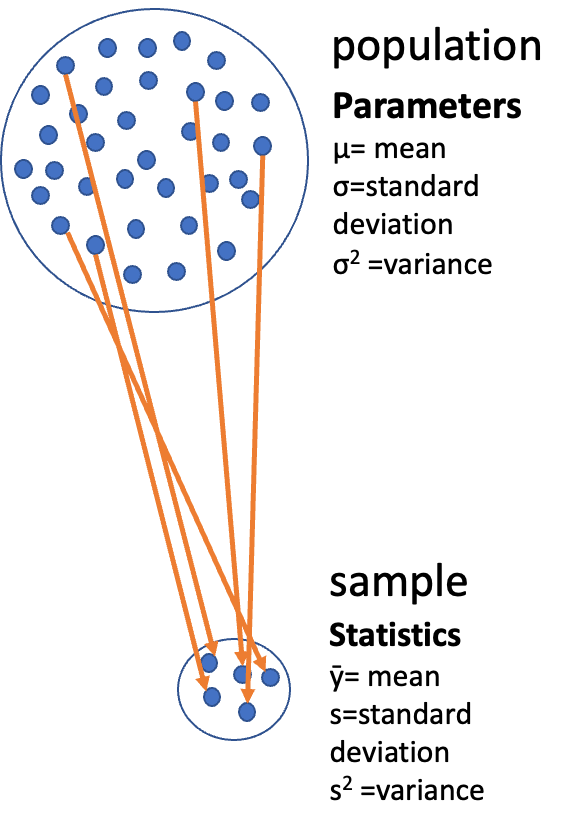
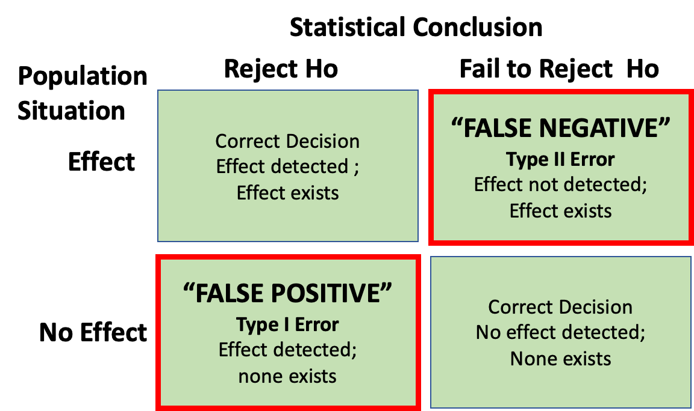
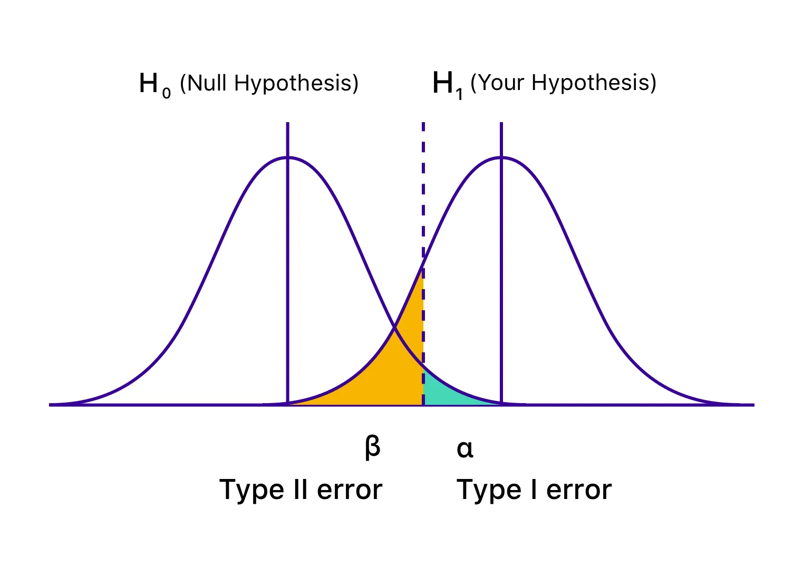
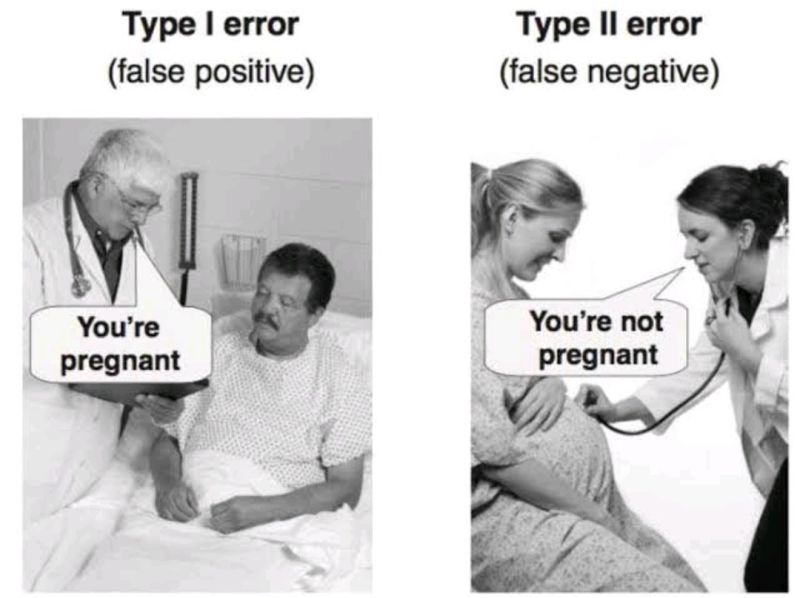

# Lecture 5: Review

:::: columns
::: {.column width="60%"}
Covered

-   Statistical inference fundamentals
-   Hypothesis testing principles
-   T Distributions
-   One sample T Tests
-   Two sample T Tests
-   Paired T Tests
:::

{width="259" height="315"}
:::
::::

# **Lecture 6:** Overview

::::: columns
::: {.column width="60%"}
## The objectives:

-   Brief review
-   Hypothesis tests for two populations
-   Assumptions of parametric tests
-   Power of Parametric Tests
-   Introduction to Non-Parametric Tests
:::

::: {.column width="40%"}
{width="300" height="200"}
:::
:::::

# **Lecture 6:** Statistical hypothesis testing

::::: columns
::: {.column width="60%"}
-   Major goal of statistics:
    -   inferences about populations from samples...
        -   assign degree of confidence to inferences
    -   Statistical hypothesis testing:
        -   formalized approach to inference
    -   Hypotheses ask whether samples come from populations with
        certain properties
    -   Often interested in questions about population means
        -   but other questions are of interest
:::

::: {.column width="40%"}
{width="300" height="250"}
:::
:::::

# **Lecture 6:** Hypothesis Components

::::: columns
::: {.column width="60%"}
Useful hypotheses:

-   Rely on specifying
    -   Ho is the hypothesis of "no effect"
        -   two samples from population with same mean

        -   sample is from population of mean = X
    -   Ha (research or alternate hypothesis)
        -   is the opposite of the Ho
        -   or predicts that there is an effect of x on y
        -   *but does NOT suggest a direction which is a prediction*
:::

::: {.column width="40%"}
{width="300" height="250"}
:::
:::::

# **Lecture 6:** Hypothesis Examples

::::: columns
::: {.column width="60%"}
Together Ho and Ha encompass all possible outcomes:

-   Ho: µ=0, Ha: µ ≠ 0
    -   mean equals 0 or mean does not equal 0
-   Ho: µ = 35, Ha: µ ≠ 35
    -   mean equals 35 or mean does not equal 35
-   Ho: µ1 = µ2, Ha: µ1 ≠ µ2
    -   mean of population 1 equals mean of population 2 or it does not
-   Ho: µ \> 0, Ha: µ ≤ 0
    -   can be directional mean is greater than 0 or mean is not equal
        or less than 0

    -   this becomes a one sided test as it predicts only one direction
:::

::: {.column width="40%"}
{width="300" height="250"}
:::
:::::

# **Lecture 6:** Statistical Testing Framework

::::: columns
::: {.column width="60%"}
Statistical tests assess likelihood of the null hypothesis being true

-   If the Ho is likely false, then Ha assumed to be correct
-   More precisely:
    -   the long run probability of obtaining sample value (or more
        extreme one) if the null hypothesis is true
        -   p(data\|Ho) - the probability of observing the data given
            that the null hypothesis Ho is true
:::

::: {.column width="40%"}
{width="300" height="250"}
:::
:::::

# **Lecture 6:** Understanding P-values

::::: columns
::: {.column width="60%"}
Hypothesis tests

-   Expressed as p-value (0-never to 1-always )
-   Interpret p-value as:
    -   probability of obtaining sample value of statistic (or more
        extreme one) if Ho is true
-   High p-value:
    -   high probability of obtaining sample statistic under Ho
        -   if the null hypothesis (Ho) were true, you would frequently
            observe data similar to your sample statistic
        -   your observed results are quite compatible with what the
            null hypothesis predicts
-   Low p-value: low probability of obtaining sample statistic under Ho
    -   if the null hypothesis (Ho) were true, you would rarely observe
        data similar to or more extreme than your sample statistic
    -   Your results are unusual under the null hypothesis, suggesting
        that either you've witnessed a rare event or the null hypothesis
        may be incorrect
:::

::: {.column width="40%"}
{width="300" height="250"}
:::
:::::

# **Lecture 6:** P-value Interpretation

Statistical test results:

-   p = 0.3 means that if I repeated the study 100 times, I would get
    this (or more extreme) result due to chance **30 times**

-   p = 0.03 means that if I repeated the study 100 times, I would get
    this (or more extreme) result due to chance **3 times**

*Which p-value suggests Ho likely false?*

At what point reject Ho?

p \< 0.05 conventional "significance threshold" (α = alpha or p value)

p \< 0.05 means: if Ho is true and we repeated the study 100 times

-   we would get this (or more extreme) result less than 5 times due to
    chance

# **Lecture 6:** Significance Levels and Interpretation

Statistical test results:

-   **α is the rate at which we will reject a true null hypothesis (Type
    I error rate)**
-   Lowering α will lower likelihood of incorrectly rejecting a true
    null hypothesis (e.g., 0.01, 0.001)
-   *Both Hs and α are specified* *BEFORE collection of data and
    analysis*

Traditionally α=0.05 is used as a cut off for rejecting null hypothesis

There is nothing magical about 0.05 - actual p-values need to be
reported - also need to decide prior to study

| p-value range | Interpretation |
|----|----|
| P \> 0.10 | No evidence against Ho - data appear consistent with Ho |
| 0.05 \< P \< 0.10 | Weak evidence against the Ho in favor of Ha |
| 0.01 \< P \< 0.05 | Moderate evidence against Ho in favor of Ha |
| 0.001 \< P \< 0.01 | Strong evidence against Ho in favor of Ha |
| P \< 0.001 | Very strong evidence against Ho in favor of Ha |

# **Lecture 6:** Understanding P-values Visually

::::: columns
::: {.column width="60%"}
A **p-value** is the probability of observing the sample result (or
something more extreme) if the null hypothesis is true.

-   **Common interpretations:**
    -   p \< 0.05: Strong evidence against H₀
    -   0.05 ≤ p \< 0.10: Moderate evidence against H₀
    -   p ≥ 0.10: Insufficient evidence against H₀
-   **Common misinterpretations:**
    -   p-value is NOT the probability that H₀ is true
    -   p-value is NOT the probability that results occurred by chance
    -   Statistical significance ≠ practical significance
-   Note that there is a difference in how to state the hypotheses
    -   one sample T-TEST

    -   two sample T-TEST
:::

::: {.column width="40%"}
```{r}
#| echo: false
#| message: false
#| warning: false
#| fig-height: 5
#| fig-width: 5
#| paged-print: false

# Visualize the p-value concept for a two-tailed t-test
library(ggplot2)

# Define parameters
df <- 20  # Degrees of freedom
alpha <- 0.05  # Significance level
critical_t <- qt(1-alpha/2, df)  # Critical t-value for two-tailed test
observed_t <- 2.5  # Observed t-value 
p_value <- 2 * (1 - pt(abs(observed_t), df))  # Calculate two-tailed p-value

# Create sequence of t values
x <- seq(-4, 4, length.out = 1000)
y <- dt(x, df)  # t-distribution density

# Create data for plotting
plot_data <- data.frame(x = x, y = y)

# Create data for right critical region
right_critical_region <- data.frame(
  x = seq(critical_t, 4, length.out = 100),
  y = dt(seq(critical_t, 4, length.out = 100), df)
)

# Create data for left critical region
left_critical_region <- data.frame(
  x = seq(-4, -critical_t, length.out = 100),
  y = dt(seq(-4, -critical_t, length.out = 100), df)
)

# Create data for observed p-value region
# (only right side in this case since observed_t is positive)
p_region <- data.frame(
  x = seq(observed_t, 4, length.out = 100),
  y = dt(seq(observed_t, 4, length.out = 100), df)
)

# Create the plot
p_plot <- ggplot() +
  # Plot the t-distribution
  geom_line(data = plot_data, aes(x = x, y = y)) +
  
  # Shade critical regions (0.025 in each tail)
  geom_area(data = right_critical_region, aes(x = x, y = y), 
            fill = "red", alpha = 0.3) +
  geom_area(data = left_critical_region, aes(x = x, y = y), 
            fill = "red", alpha = 0.3) +
  
  # Shade p-value region for observed statistic
  geom_area(data = p_region, aes(x = x, y = y), 
            fill = "blue", alpha = 0.5) +
  
  # Add vertical lines for critical values
  geom_vline(xintercept = critical_t, linetype = "dashed", color = "darkred") +
  geom_vline(xintercept = -critical_t, linetype = "dashed", color = "darkred") +
  
  # Add vertical line for observed t value
  geom_vline(xintercept = observed_t, linetype = "dashed", color = "blue") +
  
  # Add annotations
  annotate("text", x = critical_t, y = 0.15, 
           label = paste("Critical t =", round(critical_t, 3)), 
           color = "darkred", hjust = .2) +
  
  annotate("text", x = -critical_t, y = 0.15, 
           label = paste("Critical t = -", round(critical_t, 3)), 
           color = "darkred", hjust = .5) +
  
  annotate("text", x = observed_t, y = 0.08, 
           label = paste("Observed t =", round(observed_t, 2)), 
           color = "blue", hjust = 0.8) +
  
  annotate("text", x = 0, y = 0.35, 
           label = paste("Two-tailed p-value =", round(p_value, 4)), 
           color = "blue") +
  
  annotate("text", x = 3, y = 0.03, 
         label = "alpha/2 == 0.025", 
         color = "darkred", parse = TRUE) +

annotate("text", x = -3, y = 0.03, 
         label = "alpha/2 == 0.025", 
         color = "darkred", parse = TRUE) +
  
  # Labels and theme
  labs(title = "Two-tailed t-test",
       subtitle = paste("df =", df, ", α = 0.05 (0.025 in each tail)"),
       x = "t-statistic",
       y = "Probability Density") +
  theme_minimal() +
  theme(legend.position = "bottom")

print(p_plot)
```
:::
:::::

# **Lecture 6:** Historical Context

{width="465" height="352"}

# **Lecture 6:** Fisher's Perspective

:::: columns
::: {.column width="60%"}
Fisher:

p-value as informal measure of discrepancy between data and Ho

"If p is between 0.1 and 0.9 there is certainly no reason to suspect the
hypothesis tested. If it is below 0.02 it is strongly indicated that the
hypothesis fails to account for the whole of the facts. We shall not
often be astray if we draw a conventional line at .05 …"
:::

{width="300" height="250"}
::::

# **Decision errors**

::::: columns
::: {.column width="60%"}
-   **Even good studies can reach incorrect conclusions**
-   "Decision errors"
-   Two types of decision errors
-   Want to know probability of making these errors
:::

::: {.column width="40%"}
{width="350" height="280"}
:::
:::::

# **Type I and Type II Errors - Concept**

::::: columns
::: {.column width="60%"}
-   **Type I error rate**
    -   **α**: wrongly reject H₀ when it's true
    -   α = 0.05 means a type I error rate of 5%
-   **Type II error rate, β**
    -   wrongly fail to reject H₀ when it's false
-   **Power = 1-β**: **probability of correctly rejecting H₀ when H₁ is
    true**
-   Inverse relationship between type I and type II error - but not
    straightforward
-   Result of chance - sample not representative of population
-   **Which type of error is more dangerous?**
:::

::: {.column width="40%"}
{width="476" height="357"}

the dotted line is the alpha = 0.05
:::
:::::

# **Lecture 6:** Type I and Type II Errors - Details

::::: columns
::: {.column width="60%"}
When making decisions based on hypothesis tests, two types of errors can
occur:

**Type I Error (False Positive)**

-   Rejecting H₀ when it's actually true
-   Probability = α (significance level)
-   "Finding an effect that isn't real"

**Type II Error (False Negative)**

-   Failing to reject H₀ when it's actually false
-   Probability = β - "Missing an effect that is real"

**Statistical Power = 1 - β**

-   Probability of correctly rejecting a false H₀
-   Increases with:
    -   Larger sample size
    -   Larger effect size
    -   Lower variability
    -   Higher α level

The farther apart the means or lower variance the lower the beta error
is \~ have higher power. - CLICK TO NEXT AS SAME TEXT
:::

::: {.column width="40%"}
{width="300" height="250"}
:::
:::::

# **Lecture 6:** Type I and Type II Errors - Visualization

::::: columns
::: {.column width="60%"}
When making decisions based on hypothesis tests, two types of errors can
occur:

**Type I Error (False Positive)**

-   Rejecting H₀ when it's actually true
-   Probability = α (significance level)
-   "Finding an effect that isn't real"

**Type II Error (False Negative)**

-   Failing to reject H₀ when it's actually false
-   Probability = β - "Missing an effect that is real"

**Statistical Power = 1 - β**

-   Probability of correctly rejecting a false H₀
-   Increases with:
    -   Larger sample size
    -   Larger effect size
    -   Lower variability
    -   Higher α level

The farther apart the means or lower variance the lower the beta error
is \~ have higher power.
:::

::: {.column width="40%"}
```{r}
#| echo: false
#| message: false
#| warning: false
#| fig-height: 5
#| fig-width: 5
#| paged-print: false
# Create a visualization of Type I and Type II errors
x <- seq(-4, 8, length.out = 1000)
null_y <- dnorm(x, mean = 0, sd = 1)
alt_y <- dnorm(x, mean = 3, sd = 1.5)

# Critical value for alpha = 0.05
crit_val <- qnorm(0.95)

# Type I and II error regions
type_1_region <- data.frame(
  x = seq(crit_val, 8, length.out = 100),
  y = dnorm(seq(crit_val, 8, length.out = 100), mean = 0, sd = 1)
)

type_2_region <- data.frame(
  x = seq(-4, crit_val, length.out = 100),
  y = dnorm(seq(-4, crit_val, length.out = 100), mean = 3, sd = 1.5)
)

# Create the plot
error_plot <- ggplot() +
  # Distributions
  geom_line(data = data.frame(x = x, y = null_y), 
            aes(x = x, y = y, color = "Null Distribution")) +
  geom_line(data = data.frame(x = x, y = alt_y), 
            aes(x = x, y = y, color = "Alternative Distribution")) +
  
  # Error regions
  geom_area(data = type_1_region, aes(x = x, y = y), 
            fill = "red", alpha = 0.3) +
  geom_area(data = type_2_region, aes(x = x, y = y), 
            fill = "blue", alpha = 0.3) +
  
  # Critical value line
  geom_vline(xintercept = crit_val, linetype = "dashed") +
  
  # Labels
  annotate("text", x = 2, y = 0.3, label = "Type I Error (α)", color = "red") +
  annotate("text", x = 0, y = 0.15, label = "Type II Error (β)", color = "blue") +
  
  # Theme and formatting
  scale_color_manual(values = c("Null Distribution" = "purple", 
                                "Alternative Distribution" = "darkgreen"),
                     name = "") +
  labs(title = "Type I and Type II Errors",
       x = "Test Statistic",
       y = "Probability Density") +
  theme_minimal() +
  theme(legend.position = "bottom")
error_plot
```
:::
:::::

# Practice Exercise: Interpreting Errors and Power

::: callout-tip
## Practice Exercise 6: Interpreting P-values and Errors

Given the following scenarios, identify whether a Type I or Type II
error might have occurred:

1.  A researcher concludes that island mice size is larger, when in fact
    it is not.
2.  A study fails to detect a real difference in mouse size on islands
    when there is and concludes there is no effect.
3.  Let's calculate the power of our t-test to detect a 5 mm difference
    in mass sampling_sites:

-   pooled standard deviation
    -   This is the combined standard deviation of both groups weighted
        by respective degrees of freedom.
-   Cohen's d
    -   standardized difference between means - here assuming a
        difference of 1 units (g)
    -   `delta = 0.423`: The standardized effect size (Cohen's d)

```{r}
library(car)
library(patchwork)
library(tidyverse)
library(readxl)

m_df <- read_csv("data/mice_weights.csv") %>% 
  filter(!is.na(mass_g))


sidney_df <- m_df %>% filter(sampling_site=="Sidney Island")
vancouver_df <- m_df %>% filter(sampling_site=="Vancouver")
# Calculate power for detecting a 30 mm difference

n1 <- nrow(sidney_df)
n2 <- nrow(vancouver_df)
sd_pooled <- sqrt((var(sidney_df$mass_g) * (n1-1) + 
                  var(vancouver_df$mass_g) * (n2-1)) / 
                  (n1 + n2 - 2))

# Calculate power
effect_size <- 1 / sd_pooled  # Cohen's d
df <- n1 + n2 - 2
alpha <- 0.05
power <- power.t.test(n = min(n1, n2), 
                     delta = effect_size,
                     sd = 1,  # Using standardized effect size
                     sig.level = alpha,
                     type = "two.sample",
                     alternative = "two.sided")

# Display results
power
```
:::

# What if we calculated power for the pine needles you measured?

```{r}
pine_switch_df <- read_excel("data/class_pine needle length switched.xlsx")
ps_df <- pine_switch_df %>% 
  group_by(group, tree_no, tree_char, side) %>% 
  summarise(length_mm = mean(length_mm, na.rm=TRUE))

ps_shady_df <- ps_df %>% 
  filter(side == "shady")

ps_sunny_df <- ps_df %>% 
  filter(side == "sunny")

pine_alpha <- 0.05

# Calculate power for detecting a 30 mm difference

pine_n1 <- nrow(ps_shady_df)  # FIX: was using sidney_df instead of ps_shady_df
pine_n2 <- nrow(ps_sunny_df)  # FIX: was using vancouver_df instead of ps_sunny_df

pine_sd_pooled <- sqrt((var(ps_shady_df$length_mm) * (pine_n1-1) + 
                       var(ps_sunny_df$length_mm) * (pine_n2-1)) / 
                       (pine_n1 + pine_n2 - 2))  # FIX: was using n1, n2 instead of pine_n1, pine_n2

cat("Pooled SD:", round(pine_sd_pooled, 2), "mm\n\n")

# More realistic effect sizes to test:
observed_diff <- abs(mean(ps_shady_df$length_mm) - mean(ps_sunny_df$length_mm))
pine_effect_size_observed <- observed_diff / pine_sd_pooled
cat("Effect size for observed", round(observed_diff, 2), "mm difference: Cohen's d =", round(pine_effect_size_observed, 2), "\n")

# 2. Power for the observed difference
pine_power_observed <- power.t.test(n = min(pine_n1, pine_n2), 
                                   delta = pine_effect_size_observed,
                                   sd = 1,
                                   sig.level = pine_alpha,
                                   type = "two.sample",
                                   alternative = "two.sided")

cat("Power for observed", round(observed_diff, 2), "mm difference:", round(pine_power_observed$power, 3), "\n")


```

# What is Power

Statistical power represents the probability of detecting a true effect
(rejecting the null hypothesis when it is false). In this case, with a
power of 97%, there's a 97% chance of detecting a true difference of X
units between the means of the two groups if such a difference actually
exists.

A power analysis like this is typically done for one of these purposes:

1.  Before data collection to determine required sample size
2.  After a study to evaluate if the sample size was adequate
3.  To determine the minimum detectable effect size with the given
    sample

With 97% power, this test has excellent ability to detect the specified
effect size. Generally, **80% power is considered acceptable**, so 97%
indicates a very well-powered study for detecting a difference of XXg
between the groups.

# **Lecture 6:** Error Bars and Their Interpretation

::::: columns
::: {.column width="60%"}
Error bars are graphical representations of the variability of data that
show:

-   The **precision** of a measurement
-   The **uncertainty** around an estimate
-   A **confidence interval** for a parameter

Common types of error bars:

1.  **Standard Error (SE)**: Shows precision of the mean
2.  **Standard Deviation (SD)**: Shows variability in the data
3.  **Confidence Interval (CI)**: Shows plausible range for parameter

When interpreting graphs:

-   Always check what the error bars represent
-   Non-overlapping 95% CI bars suggest statistically significant
    differences
-   Error bars help assess both statistical and practical significance
:::

::: {.column width="40%"}
```{r}
#| echo: false
#| message: false
#| warning: false
#| fig-height: 5
#| fig-width: 5
#| paged-print: false
# Create comparison of different error bar types
error_bar_comparison <- m_df %>%
  group_by(sampling_site) %>%
  summarize(
    mean_length = mean(mass_g, na.rm = TRUE),
    sd = sd(mass_g, na.rm = TRUE),
    n = sum(!is.na(mass_g)),
    se = sd / sqrt(n),
    ci_lower = mean_length - qt(0.975, df = n - 1) * se,
    ci_upper = mean_length + qt(0.975, df = n - 1) * se,
    .groups = "drop"
  ) %>%
  # Create long format for multiple error bar types
  pivot_longer(
    cols = c(sd, se),
    names_to = "error_type",
    values_to = "error_value"
  ) %>%
  mutate(
    error_type = case_when(
      error_type == "sd" ~ "Standard Deviation",
      error_type == "se" ~ "Standard Error"
    )
  )

# Plot with both types of error bars
ggplot() +
  # Standard Error and Standard Deviation bars
  geom_bar(data = error_bar_comparison, 
           aes(x = sampling_site, y = mean_length, fill = sampling_site),
           stat = "identity", position = position_dodge(), alpha = 0.7) +
  geom_errorbar(data = error_bar_comparison,
                aes(x = sampling_site, ymin = mean_length - error_value, 
                    ymax = mean_length + error_value, 
                    group = error_type),
                position = position_dodge(width = 0.9), width = 0.2) +
  # Confidence interval bars (shown separately)
  geom_errorbar(data = error_bar_comparison %>% distinct(sampling_site, ci_lower, ci_upper, mean_length),
                aes(x = sampling_site, ymin = ci_lower, ymax = ci_upper),
                position = position_dodge(width = 0.9), width = 0.1, color = "red") +
  # Facet by error bar type
  facet_wrap(~error_type) +
  # Add annotation for CI bars
  annotate("text", x = 1.5, y = max(error_bar_comparison$mean_length) * 1.4, 
           label = "95% CI (red)", color = "red") +
  labs(title = "Different Types of Error Bars",
       subtitle = "Comparing SD, SE, and 95% CI",
       x = "sampling_site",
       y = "Mean Mass (g)") +
  theme_minimal()+
  theme(legend.position = "bottom")
```
:::
:::::

# **Lecture 6:** Sampling and Pseudoreplication

::::: columns
::: {.column width="60%"}
**Pseudoreplication** occurs when measurements that are not independent
are analyzed as if they were independent.

-   A critical consideration in experimental design
-   Results in underestimated standard errors and confidence intervals
-   Leads to inflated Type I error rates (false positives)

**Examples of pseudoreplication:**

-   Measuring the same individual multiple times
-   Treating multiple fish from the same tank as independent
-   Using multiple data points from a single site

**How to avoid pseudoreplication:**

-   Identify the true experimental unit
-   Use appropriate statistical techniques (e.g., mixed models)
-   Be clear about the level of replication
:::

::: {.column width="40%"}
```{r}
#| echo: false
#| message: false
#| warning: false
#| fig-height: 5
#| fig-width: 5
#| paged-print: false
# Create a visualization of pseudoreplication for mainland vs island mice
# Simulate data where island is the true experimental unit
set.seed(42)  # Changed seed for better demonstration
pseudo_data <- data.frame(
  island_id = rep(1:6, each = 10),  # 6 islands, 10 mice each
  location = rep(c("Mainland", "Island"), each = 30),  # 30 mainland, 30 island mice
  body_mass = NA  # Mouse body mass (our response variable)
)

# Generate data to show pseudoreplication problem
# Most island mice will be larger, but island means will overlap with mainland means
for (island in 1:6) {
  if (island <= 3) {
    # Mainland islands: variable means with some high values
    island_means <- c(22, 24, 28)  # One mainland island has high mean
    island_mean <- island_means[island]
    pseudo_data$location[pseudo_data$island_id == island] <- "Mainland"
  } else {
    # Island sites: mostly higher individual values but similar means when averaged
    island_means <- c(26, 23, 27)  # Variable means, some overlap with mainland
    island_mean <- island_means[island - 3]
    pseudo_data$location[pseudo_data$island_id == island] <- "Island"
  }
  
  # Generate mice - islands have more consistently large individuals
  if (pseudo_data$location[pseudo_data$island_id == island][1] == "Island") {
    # Island mice: shift distribution upward so most individuals are larger
    pseudo_data$body_mass[pseudo_data$island_id == island] <- 
      rnorm(10, mean = island_mean + 3, sd = 6)  # Shift upward by 3g
  } else {
    # Mainland mice: normal distribution around island mean
    pseudo_data$body_mass[pseudo_data$island_id == island] <- 
      rnorm(10, mean = island_mean, sd = 20)
  }
}

# Plot with pseudoreplication (treating each mouse as independent)
pseudo_plot <- pseudo_data %>%
  ggplot(aes(x = location, y = body_mass, color = factor(island_id))) +
  geom_point(position = position_jitter(width = 0.1), size = 2, alpha = 0.7) +
  stat_summary(aes(group = 1), fun = mean, geom = "point", 
               shape = 18, size = 4, color = "black") +
  stat_summary(aes(group = 1), fun.data = mean_se, geom = "errorbar", 
               width = 0.2, color = "black", linewidth = 1) +
  labs(title = "Pseudoreplication Analysis",
       subtitle = "Ind mice reps",
       x = "Location",
       y = "Body Mass (g)",
       color = "Island ID") +
  theme_minimal() +
  theme(legend.position = "right") +
  ylim(10, 40)

# Create proper analysis by first averaging within islands
correct_data <- pseudo_data %>%
  group_by(island_id, location) %>%
  summarize(mean_body_mass = mean(body_mass), 
            se_body_mass = sd(body_mass)/sqrt(n()), 
            .groups = 'drop')

# Plot with proper replication (island as experimental unit)
correct_plot <- correct_data %>%
  ggplot(aes(x = location, y = mean_body_mass, color = factor(island_id))) +
  geom_point(size = 2, position = position_dodge2(width = 0.4)) +
  geom_errorbar(aes(ymin = mean_body_mass - se_body_mass, 
                   ymax = mean_body_mass + se_body_mass),
               width = 0.4, alpha = 0.5, position = position_dodge2(width = 0.4)) +
  stat_summary(aes(group = 1), fun = mean, geom = "point", 
               shape = 18, size = 4, color = "black") +
  stat_summary(aes(group = 1), fun.data = mean_se, geom = "errorbar", 
               width = 0.2, color = "black", linewidth = 1) +
  labs(title = "Proper Analysis",
       subtitle = "Islands as reps",
       x = "Location",
       y = "Mean Body Mass per Island (g)",
       color = "Island ID") +
  theme_minimal() +
  theme(legend.position = "right") +
  ylim(10, 40)

# Combine plots using patchwork
combined_plot <- pseudo_plot + correct_plot +
  plot_layout(ncol = 2, guides = "collect") 

# Display the combined plot
print(combined_plot)


```
:::
:::::

# **Lecture 6:** Summary and Key Takeaways

**Key concepts covered:**

1.  **P-values** measure evidence against the null hypothesis
    -   Not the probability that H₀ is true
    -   Should be interpreted in context with effect size
2.  **Hypothesis testing** provides a framework for making decisions
    -   Null and alternative hypotheses must be specified beforehand
    -   α level determines Type I error rate
3.  **Type I and Type II errors** represent different kinds of mistakes
    -   Type I (α): False positive - rejecting true H₀
    -   Type II (β): False negative - failing to reject false H₀
    -   Statistical power = 1 - β
4.  **Error bars** communicate uncertainty in different ways
    -   Always check what type of error bar is shown
    -   CI bars help assess statistical significance
5.  **Pseudoreplication** inflates significance
    -   Identify true experimental units
    -   Account for non-independence in analysis
