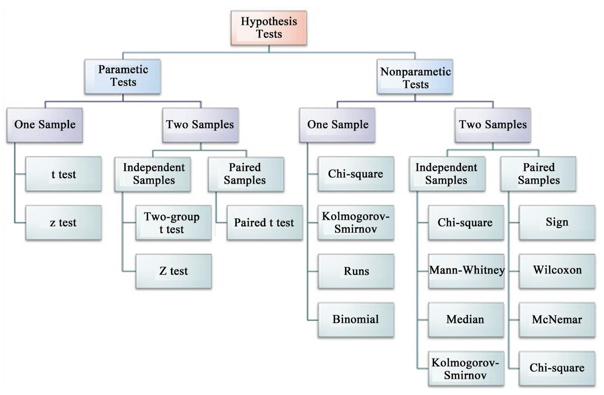
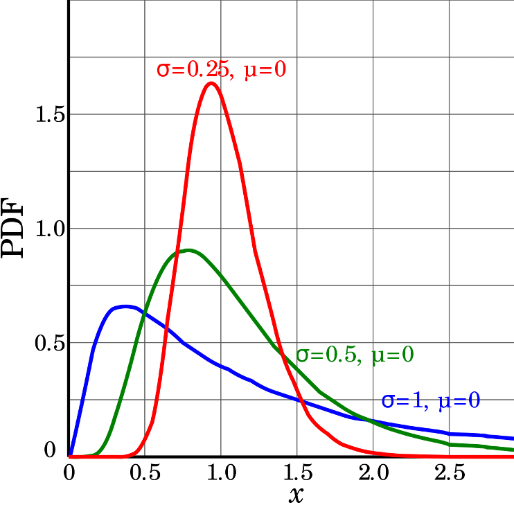
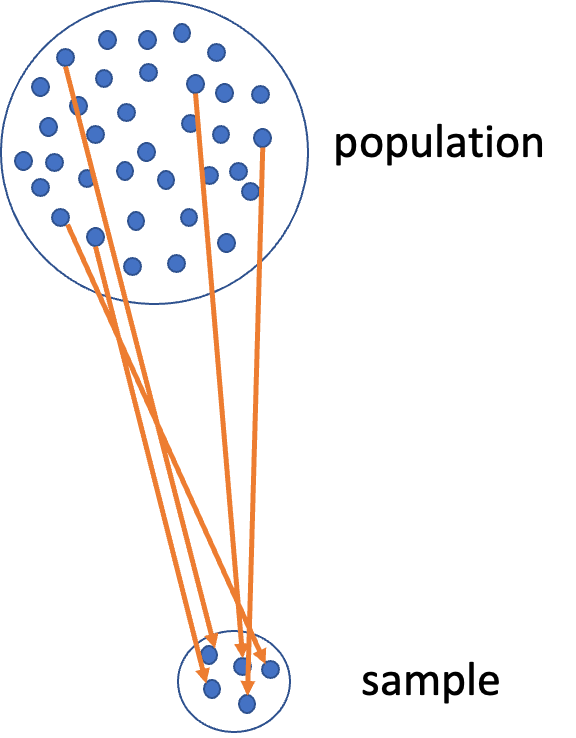

# Lecture 6 - A Brief review

::::: columns
::: {.column width="60%"}
-   Hypotheses
-   1- and 2-sided T tests
-   Power - what is it and why talk about it.
-   **Assumptions of parametric tests**
-   What next — WHEN ASSUMPTIONS FAIL!
    -   we will always cover parametric tests

    -   then we will cover non parametric approaches

    -   later on we will explore other approaches to use the appropriate
        underlying distribution that is not normal but Poisson or other
:::

::: {.column width="40%"}
{width="300" height="200"}
:::
:::::

# Lecture 7 overview

::::: columns
::: {.column width="60%"}
What we will cover today:

-   What are the assumptions again and how do you assess them
-   What to do when assumptions fail
    -   Robust tests
    -   Rank-based tests
    -   Permutation tests
:::

::: {.column width="40%"}
Lets work with the Lake Trout data as the weights are pretty cool and
the assumptions may or may not hold

This is easily translated into any of the other dataframes you might
want to use

lake trout

{width="381" height="167"}
:::
:::::

# Setting Up Our Analysis

```{r l07-01}
# Install packages if needed (uncomment if necessary)
# install.packages("readr")
# install.packages("tidyverse")
# install.packages("car")
# install.packages("here")

# Load libraries
library(car)          # For diagnostic tests
library(patchwork)
library(tidyverse)    # For data manipulation and visualization
```

# Loading Lake Trout Data

```{r load_data}
#| message: false
#| warning: false
#| fig-height: 3
#| fig-width: 3
#| paged-print: false
# the stuff above controls the output and is also set at the top so dont need here
# Load the pine needle data
# Use here() function to specify the path
lt_df <- read_csv("data/lake_trout.csv")

# Examine the first few rows
head(lt_df)

```

```{r l07-02}
# I had accdentally asked you to do mode in HW2 - wiht out telling you how... 
# here is one approach
lt_df %>%
  filter(!is.na(mass_g)) %>%
  group_by(lake, mass_g) %>%
  summarise(count = n(), .groups = "drop_last") %>%
  arrange(desc(count)) %>%
  slice(1) %>%
  select(-count) %>%
  rename(mode_mass = mass_g)
```

# Parametric versus non-parametric tests

::::: columns
::: {.column width="60%"}
T-tests are **parametric** tests

-   Parametric tests:
    -   specify/assume probability distribution from which parameters
        came
    -   Basic assumptions of parametric t-tests:
        -   Random sampling

        -   Normality

        -   Equal variance (or Welches T Test)

        -   No outliers
-   Non-parametric tests: no assumption about probability
    distribution/normality
    -   Mukasa et al 2021 DOI: 10.4236/ojbm.2021.93081
:::

::: {.column width="40%"}
{width="466" height="395"}
:::
:::::

# Assumptions of parametric tests - Overview

::::: columns
::: {.column width="60%"}
-   If assumptions of parametric test violated, test becomes unreliable
-   This is because test statistic may no longer follow distribution
-   Most parametric tests robust to mild/moderate violations of
    normality assumptions
:::

::: {.column width="40%"}
{width="300" height="250"}
:::
:::::

# Assumptions of parametric tests - Random Sampling

::::: columns
::: {.column width="60%"}
-   Basic assumptions of parametric t-tests:
    -   Random sampling
    -   Normality
    -   Equal variance
    -   No outliers
-   Random sampling:
    -   samples are randomly collected from populations; part of
        experimental design

    -   Necessary for sample -\> population inference
:::

::: {.column width="40%"}
{width="242" height="291"}
:::
:::::

# Assumptions of parametric tests - Normality Testing

::::: columns
::: {.column width="60%"}
Basic assumptions of parametric t-tests:

-   Normality
-   equal variance
-   random sampling
-   no outliers
-   Lets do the above for one lake - **`NE 12`** as if we were going to
    do a one sample T Test
    -   we need to make a new dataframe with NE 12 data only called
        `ne12_data`
    -   how do you do this?
-   Normality: Samples from normally distributed population
    -   Graphical tests: histograms, dotplots, boxplots, **qq-plots**
    -   "Formal" tests: **Shapiro-Wilk test** - sometimes not useful
:::

::: {.column width="40%"}
```{r l07-03}
#| echo: false
#| message: false
#| warning: false
#| fig-height: 5
#| fig-width: 5
#| paged-print: false
# Filter for Lake NE 12
ne12_data <- lt_df %>% 
  filter(lake == "NE 12") %>%
  filter(!is.na(mass_g))  # Remove any NA values

# Create the four different plots
# 1. Histogram
ne12_histo_plot <- ggplot(ne12_data, aes(x = mass_g)) +
  geom_histogram(binwidth = 200, fill = "steelblue", color = "white") +
  labs(title = "Histogram", x = "Mass (g)", y = "Count") +
  theme_minimal() +
  theme(plot.title = element_text(hjust = 0.5))

# 2. Dotplot
ne12_dot_plot <- ggplot(ne12_data, aes(x = mass_g, y = "")) +
  geom_dotplot(binwidth = 60, stackdir = "center", fill = "steelblue", dotsize = 0.5) +
  labs(title = "Dotplot", x = "Mass (g)", y = "") +
  theme_minimal() +
  theme(plot.title = element_text(hjust = 0.5), 
        axis.text.y = element_blank(),
        axis.ticks.y = element_blank())


# 3. Boxplot
ne12_box_plot <- ggplot(ne12_data, aes(y = mass_g)) +
  geom_boxplot(fill = "steelblue") +
  labs(title = "Boxplot", y = "Mass (g)", x = "") +
  theme_minimal() +
  theme(plot.title = element_text(hjust = 0.5),
        axis.text.x = element_blank(),
        axis.ticks.x = element_blank()) +
  coord_flip()

# 4. QQ Plot
ne12_qq_plot <- ggplot(ne12_data, aes(sample = mass_g)) +
  stat_qq(color = "steelblue") +
  stat_qq_line() +
  labs(title = "QQ Plot", x = "Theoretical Quantiles", y = "Sample Quantiles") +
  theme_minimal() +
  theme(plot.title = element_text(hjust = 0.5))

# Combine all plots using patchwork
combined_stats_plot <- (ne12_histo_plot + ne12_dot_plot) / (ne12_box_plot + ne12_qq_plot) +
  plot_annotation(
    title = "Lake NE 12 Trout Mass Distribution",
    subtitle = paste("n =", nrow(ne12_data), "fish samples"),
    theme = theme(plot.title = element_text(hjust = 0.5),
                  plot.subtitle = element_text(hjust = 0.5))
  )

# Display the combined plot
combined_stats_plot
```
:::
:::::

# Shapiro-Wilk Test for Normality

::::: columns
::: {.column width="60%"}
Basic assumptions of parametric t-tests:

-   Normality

-   equal variance

-   random sampling

-   no outliers

-   Lets do the above for one lake - `NE 12` as if we were going to do a
    one sample T Test

    -   we need to make a new dataframe with NE 12 data only called
        `ne12_data`
    -   how do you do this?

-   Normality: Samples from normally distributed population

    -   Graphical tests: histograms, dotplots, boxplots, **qq-plots**
    -   "Formal" tests: **Shapiro-Wilk test** - sometimes not useful

"Null hypothesis is that data is normally distributed"
:::

::: {.column width="40%"}
```{r l07-04}
#| echo: false
#| message: false
#| warning: false
#| fig-height: 5
#| fig-width: 5
#| paged-print: false

# Shapiro-Wilk test
shapiro_test <- shapiro.test(ne12_data$length_mm)
shapiro_test

```
:::
:::::

# Testing Equal Variance Assumption

::::: columns
::: {.column width="60%"}
Basic assumptions of parametric t-tests:

-   Normality
-   equal variance
-   random sampling
-   no outliers

Equal variance: samples are from populations with similar degree of
variability

-   Graphical tests: boxplots
-   "Formal" tests: F-ratio test
-   When samples sizes equal
    -   Parametric tests most robust to violations of normality
    -   Less so for equal variation assumptions
:::

::: {.column width="40%"}
```{r l07-05}
#| echo: false
#| message: false
#| warning: false

length_plot <- ne12_data %>% ggplot(aes(x=lake, y = length_mm)) +geom_boxplot() 

mass_plot <- ne12_data %>% ggplot(aes(x=lake, y = mass_g)) +geom_boxplot()

length_plot + mass_plot + plot_layout(ncol=1)
```
:::
:::::

# Testing for Outliers

::::: columns
::: {.column width="60%"}
-   Basic assumptions of parametric t-tests:
    -   Normality
    -   equal variance
    -   random sampling
    -   no outliers
-   No outliers: no "extreme" values that are very different from rest
    of sample
    -   Graphical tests: boxplots, histograms
    -   "Formal tests": Grubb's test - no one really does this
    -   **Note: outliers a problem for non-parametric tests as well**
:::

::: {.column width="40%"}
```{r l07-06}
#| echo: false
#| fig-width: 5
#| fig-height: 4
ne12_histo_plot + ne12_box_plot + plot_layout(ncol = 1)
```
:::
:::::

# Alternative Tests When Assumptions Fail

::::: columns
::: {.column width="60%"}
-   What if T Test assumptions fail?
-   Alternative tests, with more relaxed assumptions, are available
-   In which case would you use the following tests?
    -   Welch's t-test: *when distribution normal but variance unequal*
    -   Mann-Whitney-Wilcoxon test: *when distribution not normal and/or
        outliers are present (but both groups should still have similar
        distributions and \~equal variance)*
    -   Permutation test for two samples: *when distribution not normal
        (but both groups should still have similar distributions and
        \~equal variance)*
:::

::: {.column width="40%"}
```{r l07-07}
#| echo: false


ne12_histo_plot+ne12_box_plot + ne12_qq_plot + plot_layout(ncol=1)
```
:::
:::::

# Understanding QQ-Plots

::::: columns
::: {.column width="60%"}
### QQ-plots: tool for assessing normality

-   On x- theoretical quantiles from SND
-   On y- ordered sample values
-   Deviation from normal can be detected as deviation from straight
    line
:::

::: {.column width="40%"}
```{r l07-08}
#| message: false
#| warning: false
#| echo: false


isl_ne12_df <- lt_df %>% filter(lake %in% c("NE 12", "Island Lake"))

ne12_island_box_plot <- isl_ne12_df %>% 
  ggplot(aes(x=lake, y = mass_g, color=lake)) +
  geom_boxplot()+
  theme_minimal()

ne12_island_qq_plot <- isl_ne12_df %>% 
  ggplot(aes(sample = mass_g , color=lake)) +
  stat_qq() +
  stat_qq_line() +
  labs( x = "Theoretical Quantiles", y = "Sample Quantiles") +
  theme_minimal() 

ne12_island_box_plot +ne12_island_qq_plot+plot_layout(guides="collect")
```
:::
:::::

# Data Transformations

::::: columns
::: {.column width="60%"}
-   In some cases, data can be mathematically "transformed" to meet
    assumptions of parametric tests
-   this can be done in r and usually involves
    -   log10 transformations
    -   square root transformations
    -   and many others... I will have a description soon
:::

::: {.column width="40%"}
{width="430" height="369"}

[source](https://www.elsblog.org/the_empirical_legal_studi/2006/08/variable_transf.html)
:::
:::::

# Robust tests - Welch's T-Test

::::: columns
::: {.column width="60%"}
-   **Welch's t-test**
    -   common "robust" test for means of two populations

    -   Robust to violation of equal variance assumption, deals better
        with unequal sample size

    -   Parametric test (assumes normal distribution)

    -   Calculates a t statistic but recalculates df based on samples
        sizes and s
:::

::: {.column width="40%"}
```{r l07-09}
#| echo: false
#| message: false
#| warning: false
#| fig-width: 5
#| fig-height: 4
log_ne12_island_box_plot <- isl_ne12_df %>% 
  ggplot(aes(x=lake, y = log10(mass_g), color=lake)) +
  geom_boxplot()+
  theme_minimal()

ne12_island_box_plot +log_ne12_island_box_plot +plot_layout(guides="collect")
```
:::
:::::

# Comparing Standard T-Test vs Welch's T-Test

-   **Lets compare a parametric T-Test to a Welch's t-test**

    -   T-Test is:
        -   **t.test(y1, y2, var.equal = TRUE, paired = FALSE)**
    -   Welch's T-Test is:
        -   **t.test(y1, y2, var.equal = FALSE, paired = FALSE)**

```{r l07-10}
#| echo: false
#| message: false
#| warning: false
#| paged-print: false
# T test for length
# Perform standard t-test
t_test_length_result <- t.test(
  mass_g ~ lake, 
  data = isl_ne12_df,
  var.equal = TRUE  # Standard t-test with equal variance assumption
)

# Perform Welch's t-test (unequal variances)
welch_test_length_result <- t.test(
  mass_g ~ lake, 
  data = isl_ne12_df,
  var.equal = FALSE  # Welch's t-test
)

print("Standard t-test results for mass_g:")
print(t_test_length_result)

print("Welch's t-test results for mass_g:")
print(welch_test_length_result)
```

# Rank-Based Tests

Rank-based tests: no assumptions about distribution (non-parametric)

-   Ranks of data: observations assigned ranks, sums (and signs for
    paired tests) of ranks for groups compared

-   **Mann-Whitney U test** common alternative to independent samples
    t-test

-   **Wilcoxon signed-rank** test is alternative to paired t-test

-   Assumptions: similar distributions for groups, equal variance

-   Less power than parametric tests

-   Best when normality assumption can not be met by transformation
    (weird distribution) or large outliers

# Mann-Whitney U Test Results

```{r l07-11}
#| echo: false

# Perform Mann-Whitney U test (Wilcoxon rank-sum test)
# Syntax for Mann-Whitney U test
wilcox_test_result <- wilcox.test(
  mass_g ~ lake, 
  data = isl_ne12_df,
   alternative = "two.sided",  # Can be "less", "greater", or "two.sided"
)

print("Mann-Whitney U test results mass_g:")
wilcox_test_result
```

# Permutation Tests - Concept

::::: columns
::: {.column width="60%"}
-   Permutation tests based on resampling: reshuffling of original data
-   Resampling allows parameter estimation when distribution unknown,
    including SEs and CIs of statistics (means, medians)
-   Common approach is bootstrap: resample sample with replacement many
    times, recalculate sample stats
-   Use the `perm` package
-   Ho: µ~A~ = µ~B~
-   Ha: µ~A~ ≠µ~B~
-   Calculates the difference ∆ in means between two groups
:::

::: {.column width="40%"}
```{r l07-12}
#| echo: false
#| message: false
#| warning: false
#| fig-width: 5
#| fig-height: 4
ne12_island_box_plot
```
:::
:::::

# Permutation Tests - Method

::::: columns
::: {.column width="60%"}
-   Randomly reshuffle observations between groups (keeping n\~NE
    12\~=323 and n~Island~=10), calculate ∆
-   Repeat \>1,000 times
-   Record proportion of the different means i
-   This is equivalent to p-value and can be used in "traditional" H
    test framework
-   For a graphical explanation:
    -   [Graphical Explanation](https://www.jwilber.me/permutationtest/)
:::

::: {.column width="40%"}
:::
:::::

# Permutation Test Implementation

-   In R (using 'perm' package):
-   Assumptions: both groups have similar distribution; equal variance

```{r l07-13}
library(perm) 

# Prepare data for permutation test
ne12_perm_data <- isl_ne12_df %>% 
  filter(lake == "NE 12") %>% 
  pull(length_mm)

# Randomly sample exactly 25 observations from NE 12 (set seed for reproducibility)
set.seed(123)
ne12_perm_data <- sample(ne12_perm_data, size = 25, replace = FALSE)

island_perm_data <- isl_ne12_df %>% 
  filter(lake == "Island Lake") %>% 
  pull(length_mm)

# Calculate the observed difference in means
observed_diff <- mean(ne12_perm_data, na.rm = TRUE) - mean(island_perm_data, na.rm = TRUE)

# Perform permutation test for difference in means using perm package
permTS(ne12_perm_data, island_perm_data, 
       alternative = "two.sided", 
       method = "exact.mc", 
       control = permControl(nmc = 10000))

```

# Summary - Testing Assumptions

## Testing Assumptions of Parametric Tests

### Key Assumptions

-   **Random sampling**: Samples are randomly collected from populations
-   **Normality**: Data follows a normal distribution
-   **Equal variance**: Samples come from populations with similar
    variability
-   **No outliers**: No extreme values that can skew results

### Assessing Assumptions

-   Key to do every time
-   Should acknowledge in manuscript

# Summary - Data Transformations

## Data Transformations

When assumptions aren't met, transformations may help normalize data:

-   **Log transformation**: `log10(x)` - Useful for right-skewed data,
    multiplicative effects
-   **Square root**: `sqrt(x)` - Useful for count data, moderately
    right-skewed distributions
-   **Box-Cox**: More flexible family of power transformations
-   **More specialized transformations** especially for percentages or
    proportions

# Summary - Parametric Test Options

### 1. Standard T-Test

-   **Strengths:**

    -   High statistical power when assumptions are met
    -   \- Well understood and widely accepted

-   **Weaknesses:**

    -   \- Sensitive to violations of normality, equal variance
    -   \- Heavily influenced by outliers

### 2. Welch's T-Test

-   **Strengths:**
    -   \- Robust to violations of equal variance assumption
    -   \- Handles unequal sample sizes well
    -   \- Still parametric (assumes normality)
-   **Weaknesses:**
    -   \- Slightly less powerful than standard t-test when variances
        are equal
    -   \- Still assumes normal distribution

# Summary - Non-Parametric Options

### 3. Mann-Whitney-Wilcoxon Test

-   **Strengths:**
    -   \- Non-parametric: doesn't assume normal distribution
    -   \- Robust against outliers
    -   \- Works with ordinal data
-   **Weaknesses:**
    -   \- Less statistical power than parametric tests
    -   \- Still assumes similar distributions and approximate equal
        variance
    -   \- Tests median differences rather than mean differences

### 4. Permutation Tests

-   **Strengths:**
    -   \- Distribution-free: doesn't assume a specific distribution
    -   \- Can be applied to many types of test statistics
    -   \- Handles small sample sizes well
    -   \- Directly estimates p-values through resampling
-   **Weaknesses:**
    -   \- Computationally intensive
    -   \- Assumes exchangeability under the null hypothesis
    -   \- Requires similar distributions and equal variance

# Key Takeaway

Statistical tests have different strengths and assumptions. The choice
should be guided by your data characteristics, not just convenience.
Always visualize your data before deciding on the appropriate test.
