```{r setup}
#| message: false
#| warning: false
#| include: false
#| 
library(tidyverse)
library(patchwork)
library(flextable)
library(pwr)  # For power analysis
library(ggplot2)
library(viridis)

# Set a seed for reproducibility
set.seed(42)
```

# Lecture 7 Review

::::: columns
::: {.column width="60%"}
Covered

-   What are the assumptions again and how do you assess them
-   What to do when assumptions fail
    -   Mann Whitney Wilcoxin Rank Sum test
    -   Permutation tests
    -   There is a paired Wilcoxin Sign test
        -   this does if it is a + 0 or - in the pair and uses that info
            to do the test... possible but not very powerful or widely
            used
:::

::: {.column width="40%"}
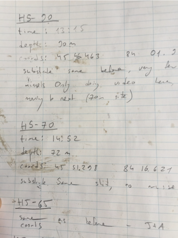{width="452" height="301"}
:::
:::::

# Lecture 8 Overview

::::: columns
::: {.column width="60%"}
Today we'll cover: Chapter 1 in Whitlock and Schluter

-   Study design
-   Causality in ecology
-   Experimental design:
    -   Replication, controls, randomization, independence
-   Sampling in field studies
-   Power analysis: *a priori* and *post hoc*
-   Study design and analysis

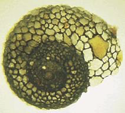{width="315"}
:::

::: {.column width="40%"}
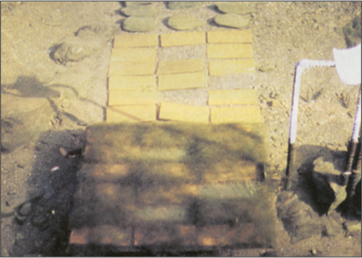{width="394" height="261"}

Lamberti and Resh 1983
:::
:::::

# Study Design Fundamentals

::::: columns
::: {.column width="60%"}
-   Data analysis has close links to study design
-   Statistics cannot save a poorly designed study!
-   Key question: **what is your research question?**

Common scientific questions:

-   Spatial/temporal patterns in variable Y?
    -   what are the problems with this data?
-   Effect of factor X on variable Y?
    -   what should you be worried about and how to fix?
-   Are values of variable Y consistent with hypothesis H?
-   What is the best estimate of parameter θ (some parameter)?
:::

::: {.column width="40%"}
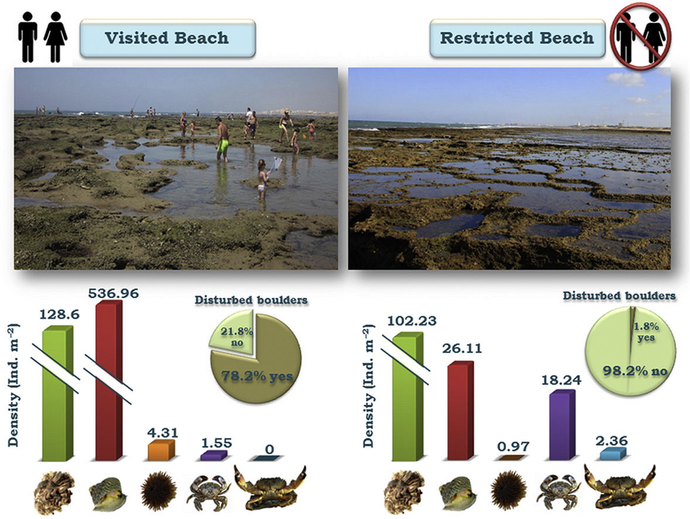{width="498" height="396"}

What sort of experiment is this design and what are the issues with
this?

<https://ars.els-cdn.com/content/image/1-s2.0-S0272771416307958-fx1_lrg.jpg>
:::
:::::

# Causality in Ecology - Introduction

::::: columns
::: {.column width="60%"}
-   Common question: what is the **cause** of Y?
-   Causality is challenging; modern statistics lacks clear language for
    causality
-   Strength of causal inference varies with study design!
-   Key factor: control of confounding variables, non independence and
    correlated varaibles
:::

::: {.column width="40%"}
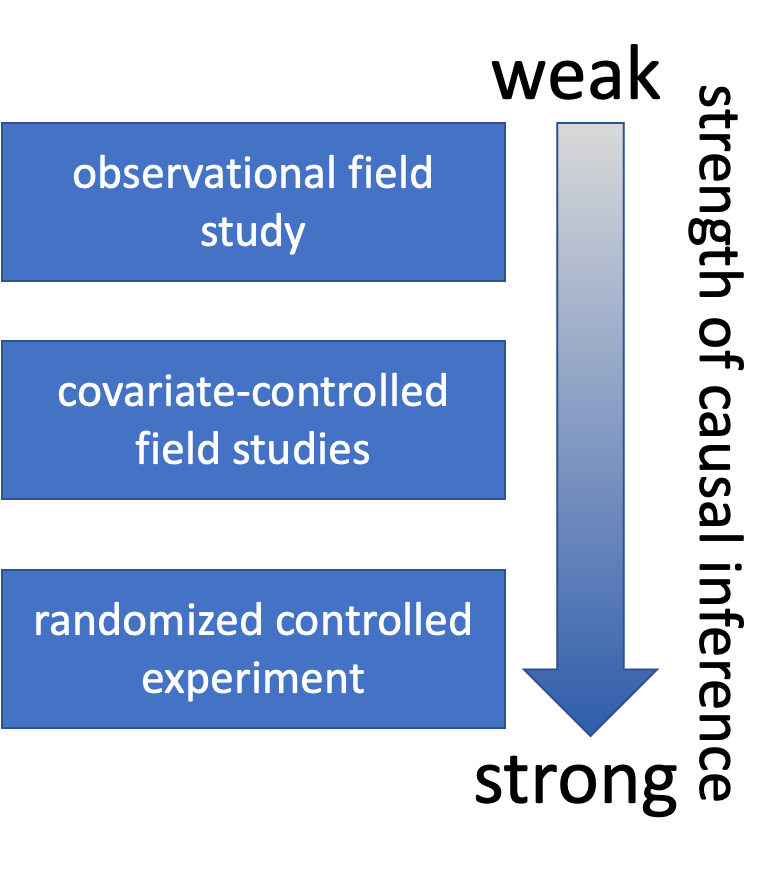{width="333" height="425"}
:::
:::::

# Causality in Ecology - Framework

::::: columns
::: {.column width="60%"}
-   Common question: what is the **cause** of Y?
-   Causality is challenging; modern statistics lacks clear language for
    causality
-   Strength of causal inference varies with study design
-   Key factor: control of confounding variables, non independence and
    correlated varaibles
:::

::: {.column width="40%"}
{width="482" height="399"}
:::
:::::

# Causality Example

::::: columns
::: {.column width="60%"}
**Example:** Spider and lizard populations on small islands

**Hypothesis:** On small islands, lizard predation controls spider
density

We're interested in causality. How do we get there?

### What type of experiment is this?

### What are the potential problems with testing this hypothesis?
:::

::: {.column width="40%"}
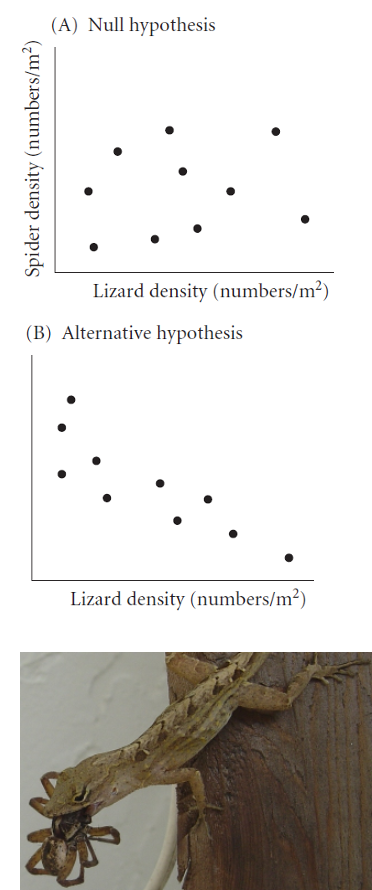{width="274" height="470"}
:::
:::::

# Natural Experiments

::::: columns
::: {.column width="60%"}
-   Not really experiments at all!
-   Utilizes natural variation in predictor variable
-   E.g., survey plots across natural gradient of lizard density

**Potential Problems:**

-   Cannot determine direction of cause ↔ effect relationship
-   Uncontrolled variables may affect results
:::

::: {.column width="40%"}
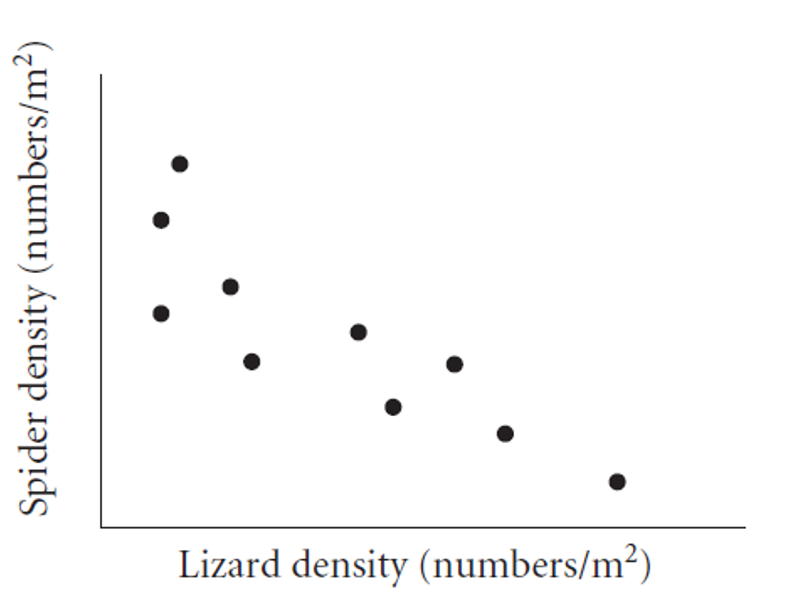{width="386" height="342"}
:::
:::::

# Strengthening Natural Experiments

::::: columns
::: {.column width="60%"}
**Good design:** Stronger inference from natural experiments

-   Reduce confounding (select plots similar in relevant ways)
-   Adjust for confounding (measure relevant covariates)
-   Identify and measure potential confounding variables
:::

::: {.column width="40%"}
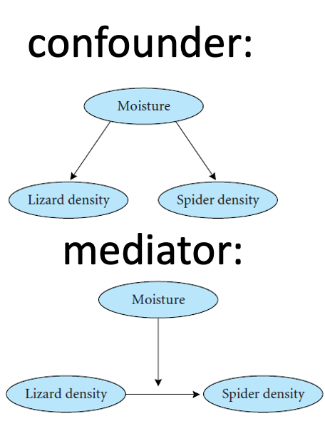{width="308" height="417"}
:::
:::::

# Manipulative Experiments

::::: columns
::: {.column width="60%"}
Experimenter directly manipulates predictor variable and measures
response

Randomized, controlled trials: gold standard

**Challenges:**

-   Often restricted to small "plots"; scale-replication trade-off
-   Often restricted to small, short-lived organisms
-   Often limited to small number of treatments; treatment-replication
    trade-off
-   Still requires **careful control of confounding variables!**
:::

::: {.column width="40%"}
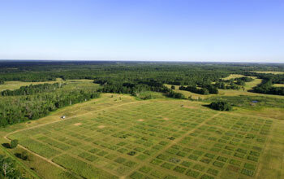{width="433" height="398"}

[Cedar Creek Ecosystem Science Reserve](https://www.mnmas.org/about-us)
:::
:::::

# Experimental Design Principles

::::: columns
::: {.column width="60%"}
Main problem of study design & interpretation: **confounding varaibles**

-   Is the result due to X or other factors?

Good study design seeks to eliminate confounding through:

-   Replication
-   Randomization
-   Controls
-   Independence
:::

::: {.column width="40%"}
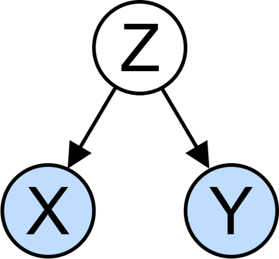{width="300" height="200"}
:::
:::::

# Replication

::::: columns
::: {.column width="60%"}
Replication is important because:

-   Ecological systems are variable
-   Need estimate of variability for many statistical methods

Without appropriate replication: Is the difference due to manipulation
or something else?

Replication must be on the appropriate scale: match scale of replication
to population of interest, otherwise run into **pseudoreplication**
(Hurlbert 1984 - **Pseudoreplication and the Design of Ecological Field
Experiments**)
:::

::: {.column width="40%"}
{width="316" height="278"}
:::
:::::

# Replication Examples

::::: columns
::: {.column width="60%"}
-   **Example 1:** Effects of forest fire on soil invertebrate diversity
    -   Replicate samples from burnt and unburnt parts of *a single*
        forest
    -   What hypothesis is this design addressing?
-   **Example 2:** Effects of copper on barnacle settling
    -   2 aquaria (+Cu, control), 5 settling plates in each
    -   Are settling plates replicates?
-   **Example 3:** Effects of sewage discharge on water quality
    -   10 water samples above discharge, 10 below
    -   Are samples replicates?
:::

::: {.column width="40%"}
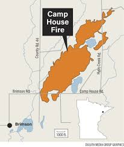{width="295"}
:::
:::::

# Consequences of Pseudoreplication

:::: columns
::: {.column width="60%"}
When you pseudoreplicate, you:

-   Underestimate variability
-   Increase type I error rate

Replicates must be on scale appropriate to population (& hypothesis!) of
interest:

-   Different burnt/unburnt forest areas
-   Different aquaria
-   Different plants and streams
:::

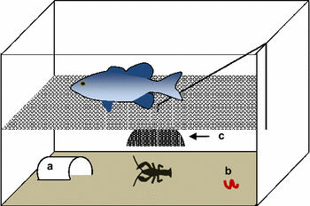{width="394"}
::::

# When Replication is Difficult

:::: columns
::: {.column width="60%"}
### What if replication is impossible/difficult/expensive?

**Example:** Effect of temperature on phytoplankton growth

-   4 chambers (5, 10, 15, 20°C), 10 beakers in each
-   Are beakers true replicates?

Possible solutions:

-   Rerun the experiment a few times, changing temperature of chambers -
    block by time
-   Try to account for all possible differences between chambers (light
    levels, humidity, contamination) - block by chamber
:::

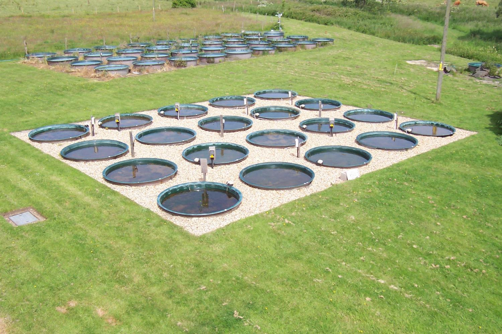{width="431"}
::::

# Controls or reference?

::::: columns
::: {.column width="60%"}
### **Key question:** Is response due to manipulation/hypothesized mechanism or external factor?

Controls help address this question:

-   Experimental units treated exactly as the manipulated units, except
    no manipulation under investigation
-   Can be tricky to implement; requires careful thought

**Examples:**

-   In toxicology, controls and treatment groups must both be injected,
    but control does not receive the substance under study
-   Predator exclosures often produce "cage effects"
-   need two controls: a grazer/predator control and a "cage control"
:::

::: {.column width="40%"}
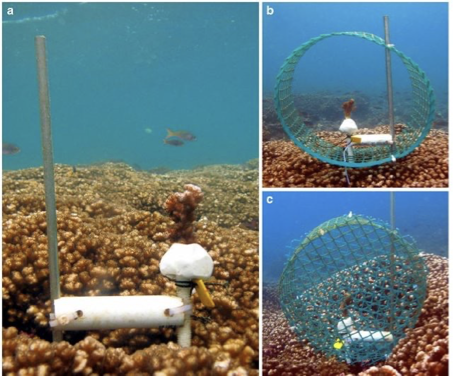{width="439" height="318"}
:::
:::::

# Activity 4: Designing Controls

::: callout-warning
## Activity 4: Designing Controls for Pine Experiments

Work in small groups to design appropriate controls for each experiment:

1.  Testing whether pine needle length is affected by a particular
    fertilizer
2.  Testing whether pine needle density affects water retention during
    drought using enclosed branches
3.  Testing whether sunlight exposure affects pine seedling growth using
    shade cloth

For each experiment, identify:

-   What would be appropriate controls?
-   What factors need to be controlled besides the main variable?
-   Could there be "cage effects" or similar issues to consider?
:::

# Independence

:::: columns
::: {.column width="60%"}
Independence of observations: assumption of many statistical methods

Events are independent if occurrence of one has no effect on occurrence
of another

-   E.g., offspring of one mother for treatment, offspring of another
    for control

**Temporal/spatial autocorrelation:** violation of independence

-   Values of variables at certain place/time correlated with values at
    another place/time
-   "Everything is related to everything, but near things are more
    related than distant things"
-   Special methods to adjust for autocorrelation
:::

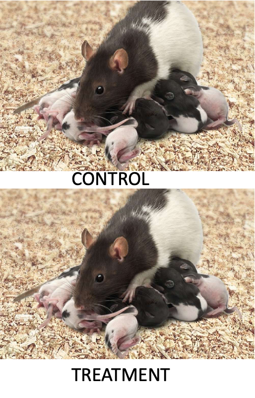{width="316" height="416"}
::::

# Randomization

::::: columns
::: {.column width="60%"}
Randomization helps deconfound "lurking" variables:

-   Attempts to equalize effects of confounders

**Random sampling from population:**

-   Experimental units should represent random sample from population of
    interest
-   Ensures unbiased population estimates and inference
-   E.g., animals in experiment are random subset of all animals that
    could have been used
:::

::: {.column width="40%"}
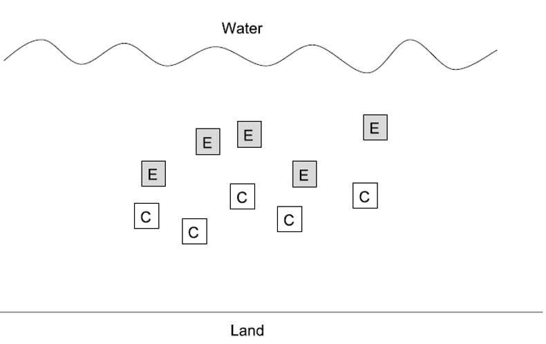{width="396" height="278"}
:::
:::::

# Randomization in Practice

::::: columns
::: {.column width="60%"}
**Allocation of experimental units to treatment/control:**

-   Experimental units must have equal chance of being allocated to
    control or experimental group
-   Properly done by random number generation

Randomization is essential at two levels:

-   Random selection from population
-   Random assignment to treatments
:::

::: {.column width="40%"}
```{r l08-06, echo=FALSE}
#| paged-print: false

# Example of randomization in R
# Select 10 trees randomly from 100 possible trees
all_trees <- 1:100
selected_trees <- sample(all_trees, 10)

# Randomly assign 5 trees to treatment and 5 to control
treatment_trees <- sample(selected_trees, 5)
control_trees <- selected_trees[!selected_trees %in% treatment_trees]

# Display results
data.frame(
  Treatment = treatment_trees,
  Control = control_trees
)

```
:::
:::::

# Sampling Design in Field Studies - Simple Random

::::: columns
::: {.column width="60%"}
### **Simple random design:**

-   all individuals/sampling units have equal chance of being selected
-   Assign number to all possible units, select units using random
    number generator
-   Often tricky in ecology; haphazard is common alternative
-   Most population estimates and tests assume random sampling
:::

::: {.column width="40%"}
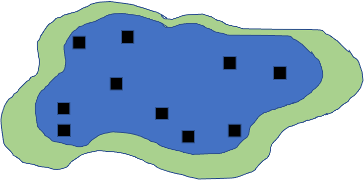{width="345" height="247"}
:::
:::::

# Sampling Design - Stratified

::::: columns
::: {.column width="60%"}
### **Stratified designs:** if there are distinct strata (groups) in population, may want to sample each independently

-   Samples collected from each stratum randomly, n proportional to
    "size" of stratum
-   Means and variances need to be estimated using different procedure;
    strata included in model
:::

::: {.column width="40%"}
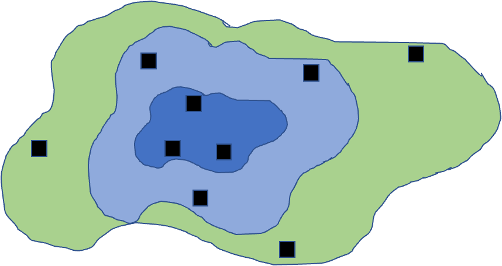{width="350" height="280"}
:::
:::::

# Sampling Design - Cluster

::::: columns
::: {.column width="60%"}
### **Cluster designs:**

-   focuses on sampling subunits nested in larger units
-   Used when other designs impractical (e.g., due to cost)
-   Mean calculation easy, modified procedure for variance
-   Nested ANOVA is often appropriate analytical method
:::

::: {.column width="40%"}
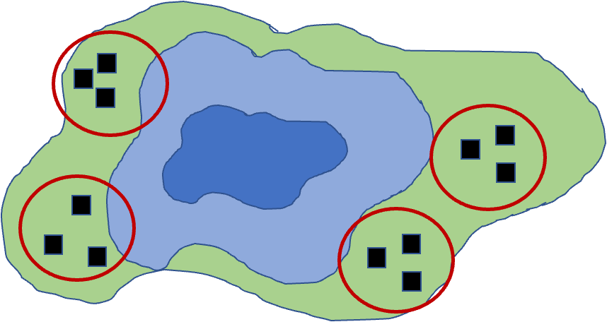{width="345" height="287"}
:::
:::::

# Sampling Design - Systematic

::::: columns
::: {.column width="60%"}
### **Systematic designs:**

-   sampling units evenly dispersed: "transect" sampling common in
    ecology
-   Used to determine changes along gradient
-   Risk: might coincide with some natural pattern
:::

::: {.column width="40%"}
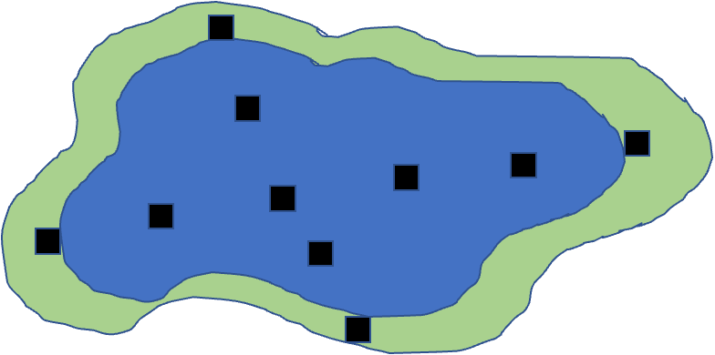{width="355" height="266"}
:::
:::::

# Activity 5: Field Sampling Pine Trees

::: callout-note
## Activity 5: Field Sampling Pine Trees

Let's consider sampling pine needles across campus:

```{r l08-01}
#| echo: false
#| fig-height: 5
#| fig-width: 5
# Let's create a campus map grid (simplified)
campus_grid <- expand.grid(x = 1:10, y = 1:10)

# Place "pine trees" clustered toward the north side (higher y values)
set.seed(46)
pine_locations <- data.frame(
  x = sample(1:10, 30, replace = TRUE),
  # Using rbeta to skew distribution toward higher y values
  # Alpha=1, Beta=3 creates right-skewed distribution, then scale to 1-10 range
  y = round(rbeta(30, 3, 1) * 9 + 1)
)

# Plot the campus and trees
ggplot() +
  geom_point(data = campus_grid, aes(x, y), color = "lightgrey", size = 0.5) +
  geom_point(data = pine_locations, aes(x, y), color = "darkgreen", size = 3) +
  theme_minimal() +
  labs(title = "Pine Tree Locations on Campus Grid (North Clustered)")
```

-   In groups of 3-4, design a sampling strategy to:
    1.  Estimate average needle length across campus (simple random
        sampling)
    2.  Compare needle lengths between north and south campus areas
        (stratified sampling)
    3.  Study how needle length changes with distance from the main road
        (systematic sampling)
-   For each strategy, describe:
    -   How many samples you would take
    -   Where you would take them
    -   What additional variables you might measure
:::

# Power Analysis Wrap up

-   Power is an important aspect of experimental design:
    -   Low power → higher likelihood of type II error (1-β)
    -   A study's power tells us how likely we are to see an effect if
        one really exists
-   Can use power analysis:
    -   Before experiment (*a priori*): how many samples do we need?
        -   what effect size can we detect?
    -   After experiment (*post hoc*): was finding of no effect due to
        lack of effect or poor design?
-   Power is a function of:
    -   ES - Effect size
    -   n - Sample size
    -   sigma - standard deviation
    -   α (significance level) - 0.05

### $$\text{Power} \propto \frac{ES \alpha \sqrt{n}}{\sigma}$$

# A Priori Power Analysis

-   Using power analysis to plan experiments:

-   **Sample size calculation:** how many samples will be needed?

-   Need to know: desired power, variability, significance level, effect
    size

-   **Effect size calculation:** what kind of effect can we find, given
    particular design?

-   Need to know: desired power, variability, significance level, n

-   Cohen's d - standardized measure of effect size used in statistical
    analysis, particularly when comparing two means

    -   0.2 = small effect
    -   0.5 = medium effect
    -   0.8 = large effect

-   Helps determine the practical significance of research findings, as
    opposed to just statistical significance (p-values). A Cohen's d of
    0.8 means that the difference between groups is large enough to be
    substantial in practical terms - specifically, it indicates that the
    means differ by 0.8 standard deviations.

    # A Priori Power Analysis Example

    How many samples do you need to find this difference

```{r l08-02}
# A priori power analysis for t-test
# How many samples needed per group?

# Parameters
effect_size <- 0.8  # Cohen's d
significance <- 0.05
desired_power <- 0.8

# Calculate sample size needed
pwr.t.test(d = effect_size, 
           sig.level = significance,
           power = desired_power,
           type = "two.sample")
```

# Post Hoc Power Analysis

-   Imagine you did not reject null hypothesis - still worth publishing
    result?
-   Is non-significant result due to low power (poor design) or actual
    no-effect situation?
    -   Have n and estimate of σ
    -   Need to define effect size that wanted to detect
    -   In return get estimate of experiment's power
-   Cohen's d is calculated as: d = (Mean1 - Mean2) / SD_pooled Where
    SD_pooled is the pooled standard deviation of both groups.
-   Can help convince reviewers that you are a good experimenter, but
    there really is no effect... please publish my non-significant
    finding!

# Post Hoc Power Analysis Example

```{r l08-03, echo=TRUE}
# Post hoc power analysis
# If we had n = 20 per group

# Parameters
effect_size <- 0.5  # Medium effect size
significance <- 0.05
sample_size <- 20  # per group

# Calculate achieved power
pwr.t.test(n = sample_size,
           d = effect_size,
           sig.level = 0.05,
           type = "two.sample")
```

# Activity 6: Power Analysis for Pine Needle Experiment

::: callout-important
## Activity 6: Power Analysis for Pine Needle Experiment

Let's design a study to compare needle lengths between exposed and
sheltered pine trees:

```{r l08-04}
#| fig-height: 4
#| fig-width: 4
# Based on pilot data, we have these estimates:
exposed_mean <- 75    # mm
sheltered_mean <- 85  # mm
pooled_sd <- 12       # mm

# Calculate Cohen's d effect size
effect_size <- abs(exposed_mean - sheltered_mean) / pooled_sd
effect_size

# A priori power analysis
pwr.t.test(d = effect_size,
           sig.level = 0.05,
           power = 0.8,
           type = "two.sample")


```
:::

# Activity 6: Power Curve Visualization

::: callout-important
## Activity 6: Power Analysis for Pine Needle Experiment

Let's design a study to compare needle lengths between exposed and
sheltered pine trees:

```{r l08-05}
#| echo: false
#| fig-height: 4
#| fig-width: 4

# Visualize the power curve
sample_sizes <- seq(5, 30, by = 1)
power_values <- sapply(sample_sizes, function(n) {
  power <- pwr.t.test(n = n,
                     d = effect_size,
                     sig.level = 0.05,
                     type = "two.sample")$power
  return(power)
})

power_df <- data.frame(
  sample_size = sample_sizes,
  power = power_values
)

ggplot(power_df, aes(x = sample_size, y = power)) +
  geom_line(color = "blue", size = 1) +
  geom_hline(yintercept = 0.8, linetype = "dashed", color = "red") +
  theme_minimal() +
  labs(title = "Power Analysis for Pine Needle Study",
       x = "Sample Size (per group)",
       y = "Statistical Power")
```

Questions:

1.  How many trees should we sample to achieve 80% power?
2.  If we can only sample 5 trees per group, what is our power?
3.  How would increasing variability (SD) affect our sample size
    requirements?
:::

# Study Design and Analysis

::::: columns
::: {.column width="60%"}
-   Study design is closely linked to statistical analysis
-   Recall: - Categorical vs. continuous variables - Dependent vs.
    independent variables
-   Nature of variables dictates analytical approach:
    -   Match your analysis to your design
    -   Cannot "fix" poor design with fancy statistics
:::

::: {.column width="40%"}
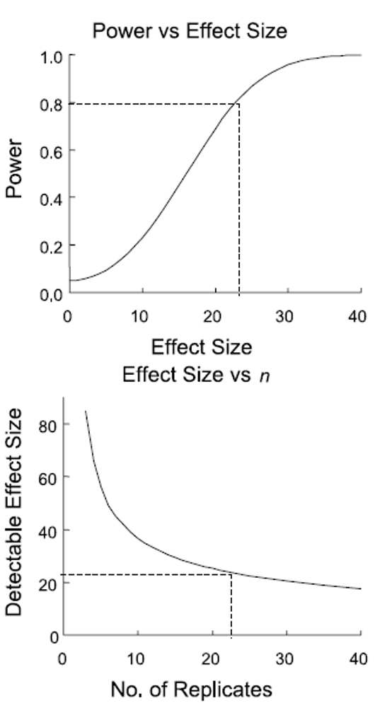{width="308" height="546"}
:::
:::::

# Summary and Take-Home Messages

::::: columns
::: {.column width="60%"}
Key concepts we covered today:

1.  **Study design is critical** - statistics cannot save poor design
2.  **Natural vs. manipulative experiments** - different approaches to
    causality
3.  **Principles of good design:**
    -   Replication at the right scale
    -   Proper randomization
    -   Appropriate controls
    -   Independence
4.  **Power analysis** - planning for sufficient sample size
5.  **Match analysis to design** - your statistical approach should
    follow from your experimental design
:::

::: {.column width="40%"}
**Remember:**

-   Correlation ≠ causation
-   Beware of pseudoreplication
-   Design before you collect data
-   Consider practical constraints
-   Report everything transparently
:::
:::::

# References and Additional Resources

-   Gotelli, N. J., & Ellison, A. M. (2012). A primer of ecological
    statistics (2nd ed.). Sinauer Associates.
-   Hurlbert, S. H. (1984). Pseudoreplication and the design of
    ecological field experiments. Ecological Monographs, 54(2), 187-211.
-   Quinn, G. P., & Keough, M. J. (2002). Experimental design and data
    analysis for biologists. Cambridge University Press.
-   Zuur, A. F., Ieno, E. N., & Elphick, C. S. (2010). A protocol for
    data exploration to avoid common statistical problems. Methods in
    Ecology and Evolution, 1(1), 3-14.
