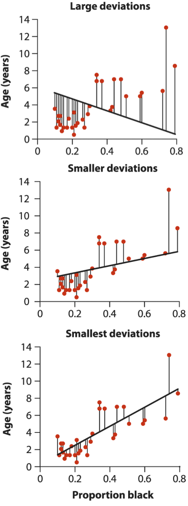
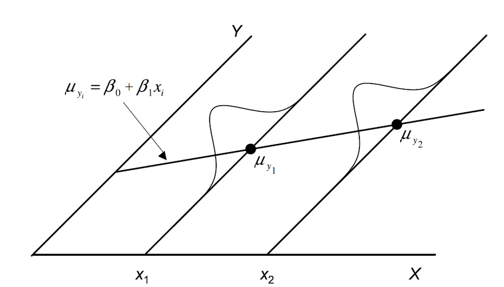
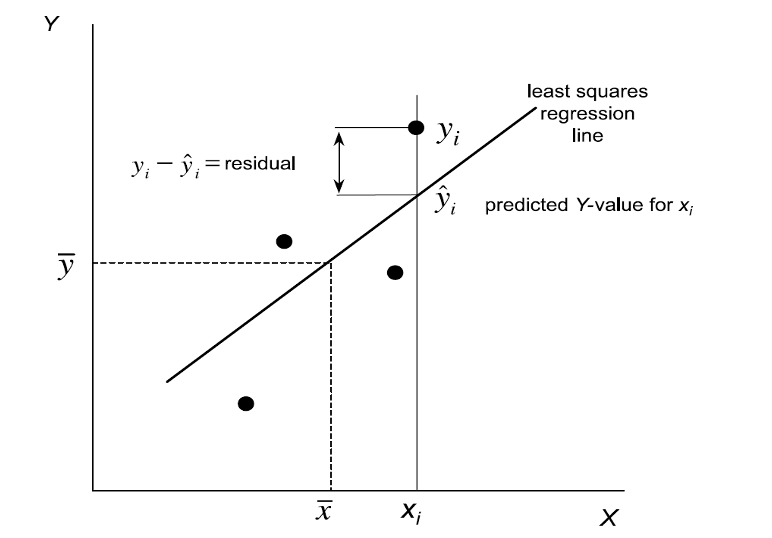
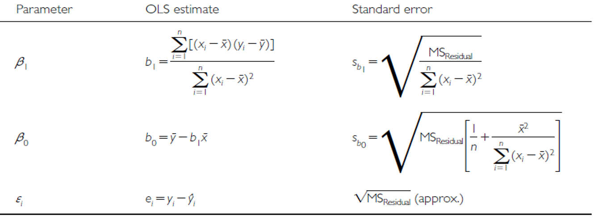
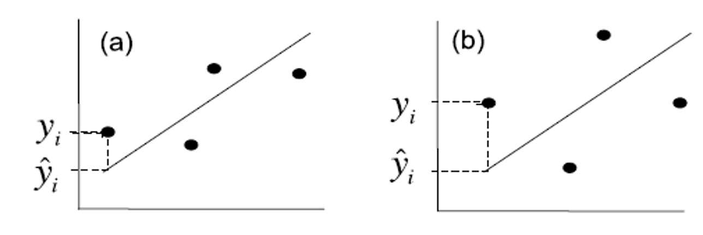
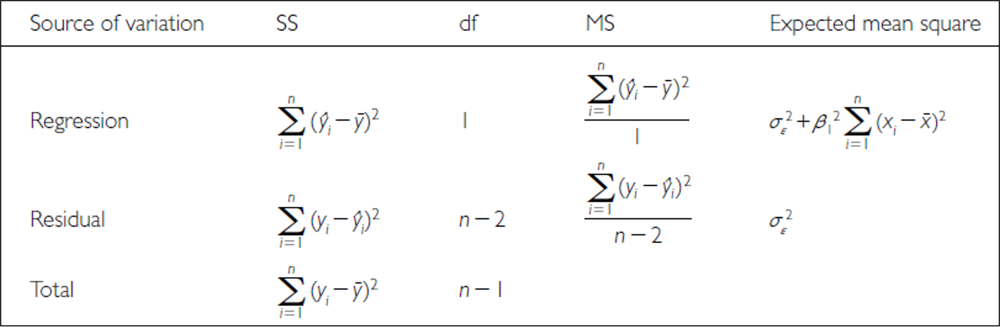
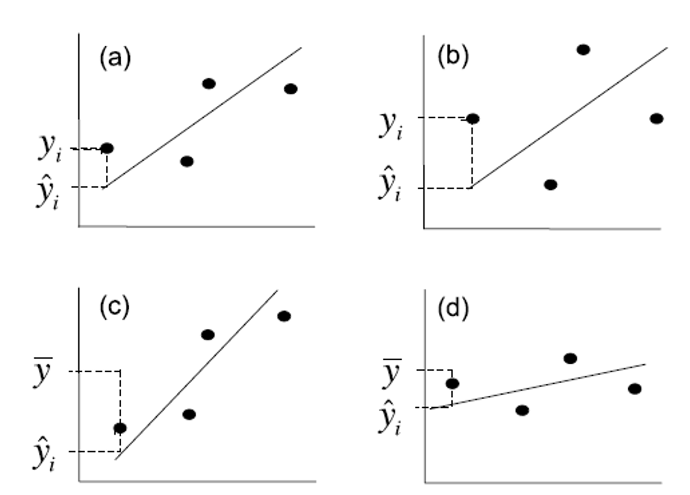
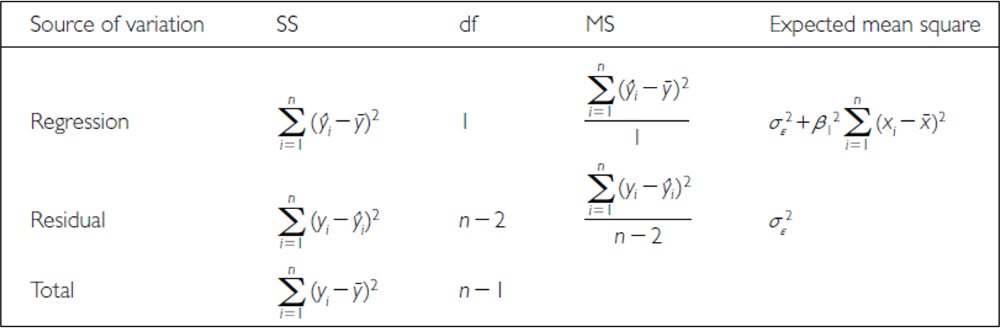

```{r setup}
#| include: false
#| message: false
#| warning: false

library(knitr)
library(patchwork)
library(grid)
library(gridExtra)
library(car)
# library(MASS)
# library(moments) # For skewness and kurtosis
library(boot)
library(tidyverse)

# Create sample data for demonstration, following the fish data example style
# This simulates allometric scaling relationship seen in Chapter 17
set.seed(123)
fish_data <- tibble(
  length_mm = runif(40, 180, 320),
  mass_g = 0.00001 * length_mm^3 * runif(40, 0.9, 1.1)
)

# Add a factor variable for demonstrations
fish_data$lake <- factor(rep(c("Lake A", "Lake B"), each = 20))

# To simulate the lion data in example 17.1
lion_data <- tibble(
  proportion_black = c(0.21, 0.14, 0.11, 0.13, 0.12, 0.13, 0.12, 0.18, 0.23, 0.22, 
                      0.20, 0.17, 0.15, 0.27, 0.26, 0.21, 0.30, 0.42, 0.43, 0.59, 
                      0.60, 0.72, 0.29, 0.10, 0.48, 0.44, 0.34, 0.37, 0.34, 0.74, 0.79, 0.51),
  age_years = c(1.1, 1.5, 1.9, 2.2, 2.6, 3.2, 3.2, 2.9, 2.4, 2.1, 
               1.9, 1.9, 1.9, 1.9, 2.8, 3.6, 4.3, 3.8, 4.2, 5.4, 
               5.8, 6.0, 3.4, 4.0, 7.3, 7.3, 7.8, 7.1, 7.1, 13.1, 8.8, 5.4)
)

# For example 17.3 (prairie stability)
set.seed(456)
prairie_data <- tibble(
  species_number = rep(c(1, 2, 4, 8, 16), times = c(32, 32, 32, 32, 33)),
  log_stability = 1.20 + 0.033 * species_number + rnorm(161, 0, 0.35)
)
```

# Lecture 8: Review

::::: columns
::: {.column width="60%"}
Covered

-   Study design
-   Causality in ecology
-   Experimental design:
    -   Replication, controls, randomization, independence
-   Sampling in field studies
-   Power analysis: *a priori* and *post hoc*
-   Study design and analysis
:::

::: {.column width="40%"}
```{r review-plot}
#| echo: false 
#| message: false
#| warning: false

# Read the lake trout data
grayling_df <- read_csv("data/gray_I3_I8.csv")

# Clean any NA values
grayling_df <- grayling_df %>% 
  filter(!is.na(mass_g)) %>% 
  filter(!is.na(length_mm))

# look at plots quick
grayling_df %>% ggplot(aes(lake, mass_g, color = lake))+
  geom_boxplot()

```
:::
:::::

# **Lecture 9:** Overview

### The objectives:

This lecture covers two fundamental statistical techniques in biology:
correlation and regression analysis. Based on Chapters 16-17 from
Whitlock & Schluter's *The Analysis of Biological Data* (3rd edition),
we'll explore:

-   Correlation analysis: measuring relationships between variables
-   The distinction between correlation and regression
-   Simple linear regression: predicting one variable from another
-   Estimating and interpreting regression parameters
-   Testing assumptions and handling violations
-   Analysis of variance in regression
-   Model selection and comparison

# **Lecture 9:** Correlation vs. Regression:

### What's the Difference?

::::: columns
::: {.column width="60%"}
### **Correlation Analysis:**

-   Measures the strength and direction of a relationship between two
    numerical variables
-   Both X and Y are random variables (both measured, neither
    manipulated)
-   Variables are typically on equal footing (either could be X or Y)
-   No cause-effect relationship implied
-   Quantifies the degree to which variables are related
-   Expressed as a correlation coefficient (r) from -1 to +1

### **Regression Analysis:**

-   Predicts one variable (Y) from another (X)
-   X is often fixed or controlled (manipulated)
-   Y is the response variable of interest
-   Often implies a cause-effect relationship
-   Produces an equation for prediction with slope and intercept
    parameters
:::

::: {.column width="40%"}
```{r}
#| echo: false
#| message: false
#| warning: false
#| fig-height: 5
#| fig-width: 4
#| paged-print: false
# Create a correlation plot
p1_fish <- ggplot(fish_data, aes(x = length_mm, y = mass_g)) +
  geom_point() +
  stat_ellipse() +
  # geom_smooth(method = "lm", se = FALSE, color = "blue") +
  labs(title = "Correlation View - no dependent/independent distinction",
       x = "Length (mm)",
       y = "Mass (g)") +
  theme_minimal()

# Create a regression plot
p2_fish <- ggplot(fish_data, aes(x = length_mm, y = mass_g)) +
  geom_point() +
  geom_smooth(method = "lm", se = TRUE, color = "red") +
  labs(title = "Regression View - predict  mass from length, clear X → Y relationship",
       x = "Length (mm) [predictor]",
       y = "Mass (g) [response]") +
  theme_minimal()

# Combine the plots
p1_fish / p2_fish

```
:::
:::::

# **Lecture 9:** Correlation Analysis

::::: columns
::: {.column width="60%"}
### What Is Correlation?

**Correlation analysis** measures the strength and direction of a
relationship between two numerical variables:

-   Ranges from -1 to +1
-   +1 indicates perfect positive correlation
-   0 indicates no correlation
-   -1 indicates perfect negative correlation

The **Pearson correlation coefficient (r)** is defined as:

$$r = \frac{\sum_{i}(X_i - \bar{X})(Y_i - \bar{Y})}{\sqrt{\sum_{i}(X_i - \bar{X})^2 \sum_{i}(Y_i - \bar{Y})^2}}$$

This can be simplified as:

$$r = \frac{\text{Covariance}(X, Y)}{s_X \cdot s_Y}$$

Where $s_X$ and $s_Y$ are the standard deviations of X and Y.
:::

::: {.column width="40%"}
```{r overview-plot-1i}
#| echo: false
#| fig-height: 6
#| fig-width: 4
#| message: false
#| warning: false
# Create datasets with different correlation levels
set.seed(123)
n <- 50
# Perfect positive correlation (r = 1)
perfect_pos <- tibble(
  x = 1:n, y = 1:n)
# Strong positive correlation (r ≈ 0.8)
strong_pos <- tibble(
  x = 1:n, y = 1:n + rnorm(n, 0, 5))
# No correlation (r ≈ 0)
no_corr <- tibble(
  x = 1:n, y = rnorm(n, 50, 10))
# Strong negative correlation (r ≈ -0.8)
strong_neg <- tibble(
  x = 1:n, y = n:1 + rnorm(n, 0, 5))
# Perfect negative correlation (r = -1)
perfect_neg <- tibble(
  x = 1:n, y = n:1)
# Function to create a correlation plot with title
corr_plot <- function(data, title, r_value) {
  ggplot(data, aes(x = x, y = y)) +
    geom_point(alpha = 0.5, size=0.2) +
    labs(title = paste(title, "r =", round(cor(data$x, data$y), 2)),
         x = "X Variable", y = "Y Variable") + theme_classic()
}
# Create plots for each correlation
p1_corr <- corr_plot(perfect_pos, "Perfect Positive Correlation", 1)
p2_corr <- corr_plot(strong_pos, "Strong Positive Correlation", 0.8)
p3_corr <- corr_plot(no_corr, "No Correlation", 0)
p4_corr <- corr_plot(strong_neg, "Strong Negative Correlation", -0.8)
p5_corr <- corr_plot(perfect_neg, "Perfect Negative Correlation", -1)
# Combine the plots
(p1_corr  + theme(axis.title.x = element_blank(), axis.text.x = element_blank())+ 
p2_corr  +theme(axis.title.x = element_blank(), axis.text.x = element_blank())+ 
p3_corr  +theme(axis.title.x = element_blank(), axis.text.x = element_blank())+ 
p4_corr  +theme(axis.title.x = element_blank(), axis.text.x = element_blank())+ 
p5_corr + plot_layout(ncol=1))
```
:::
:::::

# **Lecture 9:** Correlation Analysis

### Example 16.1: Flipping the Bird

Nazca boobies (*Sula granti*) - Do aggressive behaviors as a chick
predict future aggressive behavior as an adult?

-   correlation is r = 0.534 - moderate positive relationship
-   p-value = 0.007 correlation is statistically significant.

For a Pearson correlation coefficient (r) of 0.53372:

-   This is r (not rho as Spearman nonparametric below), as indicated by
    "cor" in your output
-   To determine the amount of variation explained, you square this
    value: r² = 0.53372² = 0.2849 (or approximately 28.49%)
-   means about 28.49% of the variance in one variable can be explained
    by the other variable

### Note that it is tested by a t test: $\text{t}=\frac{r}{SE_r}$

```{r overview-plot-1j}
#| echo: false
#| message: false
#| warning: false
#| fig-height: 4
#| fig-width: 5
# Recreate the data from Example 16.1
booby_data <- tibble(
  visits_as_nestling = c(1, 7, 15, 4, 11, 14, 23, 14, 9, 5, 4, 10, 
                         13, 13, 14, 12, 13, 9, 8, 18, 22, 22, 23, 31),
  future_aggression = c(-0.80, -0.92, -0.80, -0.46, -0.47, -0.46, -0.23, -0.16, 
                        -0.23, -0.23, -0.16, -0.10, -0.10, 0.04, 0.13, 0.19, 
                        0.25, 0.23, 0.15, 0.23, 0.31, 0.18, 0.17, 0.39)
)
# Test significance
booby_test <- cor.test(booby_data$visits_as_nestling, booby_data$future_aggression)
booby_test

```

# **Lecture 9:** Correlation Analysis

::::: columns
::: {.column width="60%"}
### Example 16.1: Flipping the Bird

**Interpretation:** The correlation coefficient of r = 0.534 suggests
that Nazca boobies who experienced more visits from non-parent adults as
nestlings tend to display more aggressive behavior as adults. This
supports the hypothesis that early experiences influence adult behavior
patterns in this species.

**Standard Error:**

### $\text{SE}_r = \sqrt{\frac{1-r^2}{n-2}}$

### SE = 0.180

Need to be sure relationship is not curved - note below
:::

::: {.column width="40%"}
```{r overview-plot-1k}
#| echo: false
#| fig-height: 5
#| fig-width: 4
#| message: false
#| warning: false
booby_data %>% ggplot(aes(visits_as_nestling, future_aggression))+geom_point()

```
:::
:::::

# **Lecture 9:** Correlation Analysis

::::: columns
::: {.column width="60%"}
### Testing Assumptions for Correlation

As described in Section 16.3, correlation analysis has key assumptions:

1.  **Random sampling**: Observations should be a random sample from the
    population
2.  **Bivariate normality**: Both variables follow a normal
    distribution, and their joint distribution is bivariate normal
3.  **Linear relationship**: The relationship between variables is
    linear, not curved

Let's check these assumptions booby data:
:::

::: {.column width="40%"}
```{r overview-plot-1l}
#| echo: false
#| fig-height: 4
#| fig-width: 5
#| message: false
#| warning: false
# Check normality of each variable
shapiro.test(booby_data$visits_as_nestling)
shapiro.test(booby_data$future_aggression)

```
:::
:::::

# **Lecture 9:** Correlation Analysis

::::: columns
::: {.column width="60%"}
### Testing Assumptions for Correlation

As described in Section 16.3, correlation analysis has key assumptions:

1.  **Random sampling**: Observations should be a random sample from the
    population
2.  **Bivariate normality**: Both variables follow a normal
    distribution, and their joint distribution is bivariate normal
3.  **Linear relationship**: The relationship between variables is
    linear, not curved

Let's check these assumptions using the booby data
:::

::: {.column width="40%"}
```{r overview-plot-1m}
#| echo: false
#| fig-height: 4
#| fig-width: 4
#| message: false
#| warning: false


# Create plots to check assumptions
p1_booby <- ggplot(booby_data, aes(x = visits_as_nestling)) +
  geom_histogram(bins = 10, fill = "lightblue", color = "black") +
  labs(title = "Visits",
       x = "Visits",
       y = "Frequency") +
  theme_minimal()

p2_booby <- ggplot(booby_data, aes(x = future_aggression)) +
  geom_histogram(bins = 10, fill = "lightgreen", color = "black") +
  labs(title = "Aggression",
       x = "Aggression",
       y = "Frequency") +
  theme_minimal()

p3_booby <- ggplot(booby_data, aes(sample = visits_as_nestling)) +
  geom_qq() +
  geom_qq_line() +
  labs(title = "Q-Q Plot Visits",
       x = "Theoretical Quantiles",
       y = "Sample Quantiles") +
  theme_minimal()+theme(
  axis.title.x = element_blank(),
  axis.text.x = element_blank())

p4_booby <- ggplot(booby_data, aes(sample = future_aggression)) +
  geom_qq() +
  geom_qq_line() +
  labs(title = "Q-Q Plot for Aggression",
       x = "Theoretical Quantiles",
       y = "Sample Quantiles") +
  theme_minimal()

# Combine the plots
(p1_booby / p2_booby) | (p3_booby / p4_booby)
```
:::
:::::

# **Lecture 9:** Correlation Analysis

### **What to do if assumptions are violated:**

Transform one or both variables (log, square root, etc.)

Use non-parametric correlation (**Spearman's rank correlation**) or
Kendall's tau 𝛕

Examine the data for outliers or influential points

```{r overview-plot-2m}
#| echo: false

#| echo: false
#| fig-height: 5
#| fig-width: 5
#| message: false
#| warning: false


p1_lion <- ggplot(lion_data, aes(x = proportion_black)) +
  geom_histogram(bins = 10, fill = "lightblue", color = "black") +
  labs(title = "Prop black",
       x = "Visits",
       y = "Frequency") +
  theme_minimal()

p2_lion <- ggplot(lion_data, aes(x = age_years)) +
  geom_histogram(bins = 10, fill = "lightgreen", color = "black") +
  labs(title = "Age",
       x = "Age",
       y = "Frequency") +
  theme_minimal()

p3_lion <- ggplot(lion_data, aes(sample = proportion_black)) +
  geom_qq() +
  geom_qq_line() +
  labs(title = "Q-Q Plot Prop Black",
       x = "Theoretical Quantiles",
       y = "Sample Quantiles") +
  theme_minimal()+theme(
    axis.title.x = element_blank(),
    axis.text.x = element_blank())

p4_lion <- ggplot(lion_data, aes(sample = age_years)) +
  geom_qq() +
  geom_qq_line() +
  labs(title = "Q-Q Plot for age",
       x = "Theoretical Quantiles",
       y = "Sample Quantiles") +
  theme_minimal()

# Combine the plots
(p1_lion / p2_lion) | (p3_lion / p4_lion)
```

# **Lecture 9:** Correlation Analysis

To understand the amount of variation explained, you can square the non
parametric Spearman's rho value.

For your value of 0.74485:

ρ² = 0.74485² = 0.5548

This means approximately 55.48% of the variance in ranks of one variable
can be explained by the ranks of the other variable. This is similar to
how R² works in linear regression, but specifically for ranked data.

```{r overview-plot-1n}
#| echo: false
#| fig-height: 4
#| fig-width: 5
#| message: false
#| warning: false

# Compute Spearman's rank correlation
spearman_corr <- cor.test(
  lion_data$proportion_black, lion_data$age_years, method = "spearman")
spearman_corr

```

# **Lecture 9:** Correlation Analysis

::::: columns
::: {.column width="60%"}
### Correlation: Important Considerations

-   **The correlation coefficient depends on the range**
    -   Restricting range of values can reduce the correlation
        coefficient
    -   Comparing correlations between studies requires similar ranges
        of values
-   **Measurement error affects correlation**
    -   Measurement error in X or Y tends to weaken observed correlation
    -   This bias is called **attenuation**
    -   True correlation typically stronger than observed correlation
-   **Correlation vs. Causation**
    -   Correlation does not imply causation
    -   Three possible explanations for correlation:
        1.  X causes Y
        2.  Y causes X
        3.  Z (a third variable) causes both X and Y
-   **Correlation significance test**
    -   H₀: ρ = 0 (no correlation in population)
    -   H₁: ρ ≠ 0 (correlation exists in population)
    -   **Test statistic: t = r / SE(r) with df = n-2**
:::

::: {.column width="40%"}
```{r overview-plot-1o}
#| echo: false
#| message: false
#| warning: false
#| fig-height: 5
#| fig-width: 4
# Recreate Figure 16.4-1 from the textbook to demonstrate range effect
set.seed(456)
n <- 100
x_full <- runif(n, 0, 10)
y_full <- 2 + 0.5*x_full + rnorm(n, 0, 1)
full_data <- tibble(x = x_full, y = y_full)

# Subset for restricted range
restricted_data <- full_data %>% filter(x >= 4 & x <= 6)

# Calculate correlations
full_cor <- cor(full_data$x, full_data$y)
restricted_cor <- cor(restricted_data$x, restricted_data$y)

# Create plots
p1_full <- ggplot(full_data, aes(x = x, y = y)) +
  geom_point() +
  geom_smooth(method = "lm", se = FALSE, color = "blue") +
  labs(title = "Full Range of Data",
       subtitle = paste("r =", round(full_cor, 2)),
       x = "X Variable",
       y = "Y Variable") +
  theme_minimal()+theme(
  axis.title.x = element_blank(),
  axis.text.x = element_blank())

p2_full <- ggplot(restricted_data, aes(x = x, y = y)) +
  geom_point() +
  geom_smooth(method = "lm", se = FALSE, color = "red") +
  labs(title = "Restricted Range",
       subtitle = paste("r =", round(restricted_cor, 2)),
       x = "X Variable",
       y = "Y Variable") +
  theme_minimal() +
  xlim(0, 10) + ylim(min(full_data$y), max(full_data$y))

# Plot to illustrate measurement error (Figure 16.6-1)
set.seed(789)
x_true <- runif(50, 0, 10)
y_true <- 1 + 0.8*x_true
x_meas <- x_true + rnorm(50, 0, 1)  # Add measurement error to X
y_meas <- y_true + rnorm(50, 0, 1)  # Add measurement error to Y

error_data <- tibble(
  x_true = x_true,
  y_true = y_true,
  x_meas = x_meas,
  y_meas = y_meas
)

p3_full <- ggplot(error_data, aes(x = x_true, y = y_true)) +
  geom_point() +
  geom_smooth(method = "lm", se = FALSE, color = "blue") +
  labs(title = "No Measurement Error",
       subtitle = paste("r =", round(cor(x_true, y_true), 2)),
       x = "X (True Values)",
       y = "Y (True Values)") +
  theme_minimal()+theme(
  axis.title.x = element_blank(),
  axis.text.x = element_blank())

p4_full <- ggplot(error_data, aes(x = x_meas, y = y_meas)) +
  geom_point() +
  geom_smooth(method = "lm", se = FALSE, color = "red") +
  labs(title = "With Measurement Error",
       subtitle = paste("r =", round(cor(x_meas, y_meas), 2)),
       x = "X (Measured Values)",
       y = "Y (Measured Values)") +
  theme_minimal()

# Combine the plots
p1_full + p2_full + p3_full + p4_full+plot_layout(ncol=1)

```
:::
:::::

# **Lecture 9:** Linear Regression

::::: columns
::: {.column width="60%"}
### Simple Linear Regression Model

**Simple linear regression** models the relationship between a response
variable (Y) and a predictor variable (X).

The **population** regression model $Y = \alpha + \beta X + \varepsilon$

-   Where:
    -   Y is the response variable
    -   X is the predictor variable
    -   α (alpha) is the intercept (value of Y when X=0)
    -   β (beta) is the slope (change in Y per unit change in X)
    -   ε (epsilon) is the error term (random deviation from the line)

The **sample** regression equation is: $\hat{Y} = a + bX$

-   Where:
    -   $\hat{Y}$ is the predicted value of Y
    -   a is the estimate of α (intercept)
    -   b is the estimate of β (slope)

**Method of Least Squares**: The line is chosen to minimize the sum of
squared vertical distances (residuals) between observed and predicted Y
values.
:::

::: {.column width="40%"}
{width="238"}
:::
:::::

# **Lecture 9:** Linear Regression

::::: columns
::: {.column width="60%"}
### Simple Linear Regression Model

**Simple linear regression** models the relationship between a response
variable (Y) and a predictor variable (X).

The **population** regression model is:
$Y = \alpha + \beta X + \varepsilon$

-   Where:
    -   Y is the response variable
    -   X is the predictor variable
    -   α (alpha) is the intercept (value of Y when X=0)
    -   β (beta) is the slope (change in Y per unit change in X)
    -   ε (epsilon) is the error term (random deviation from the line)

The **sample** regression equation is: $\hat{Y} = a + bX$

-   Where:
    -   $\hat{Y}$ is the predicted value of Y
    -   a is the estimate of α (intercept)
    -   b is the estimate of β (slope)

**Method of Least Squares**: The line is chosen to minimize the sum of
squared vertical distances (residuals) between observed and predicted Y
values.
:::

::: {.column width="40%"}
```{r overview-plot-1p}
#| echo: false
#| message: false
#| warning: false
# Create a plot showing regression components using the lion data
lion_model <- lm(age_years ~ proportion_black, data = lion_data)
intercept <- coef(lion_model)[1]
slope <- coef(lion_model)[2]
predictions <- predict(lion_model)

# Create annotated plot
liona_plot <- ggplot(lion_data, aes(x = proportion_black, y = age_years)) +
  # Plot points and regression line
  geom_point(size = 3) +
  stat_smooth(geom = "smooth", position="identity", 
              method = "lm", se = FALSE, color = "blue", fullrange = TRUE,
              xseq=c(-0.1,1)) +
  # Add residual for one point
  geom_segment(aes(x = proportion_black[10], y = age_years[10], 
                   xend = proportion_black[10], 
                   yend = predict(lion_model)[10]), 
               color = "red", linetype = "solid", linewidth = 1) +
  # Add annotations
  annotate("text", x = lion_data$proportion_black[10], 
           y = (lion_data$age_years[10] + predict(lion_model)[10]), 
           label = "Residual (ε)", color = "red") +
  annotate("text", x = 0.5, y = intercept + slope * 0.3 - 2, 
           label = paste("Intercept (α) =", round(intercept, 2)), color = "blue") +
  annotate("text", x = 0.6, y = intercept + slope * 0.6 + 2, 
           label = paste("Slope (β) =", round(slope, 2)), color = "blue") +
  # Add equation
  annotate("text", x = 0.4, y = 12, 
           label = paste("age=", round(intercept, 2), "+", 
                        round(slope, 2), "*prop"), 
           color = "darkblue", size = 3) +
 coord_cartesian(ylim=c(0,16), xlim=c(0,.9))+
  scale_y_continuous(breaks = seq(0,16,2))+
   # Format the plot
  labs(title = "Lion Age vs. Nose Blackness",
       x = "Proportion of black on nose",
       y = "Age (years)") +
  theme_minimal()
liona_plot
```
:::
:::::

# **Lecture 9:** Linear Regression

::::: columns
::: {.column width="40%"}
From Example 17.1 in the textbook the regression line for the lion data
is:

### $\text{age} = 0.88 + 10.65 \times \text{proportion}_{black}$

This means:

-   When a lion has no black on its nose (proportion = 0), its predicted
    age is 0.88 years
-   For each 0.1 increase in the proportion of black, age increases by
    1.065 years
-   The slope (10.65) indicates that lions with more black on their
    noses tend to be older
:::

::: {.column width="60%"}
```{r overview-plot-1q}
#| echo: false
#| message: false
#| warning: false
liona_plot
```
:::
:::::

# **Lecture 9:** Linear Regression

### Simple Linear Regression Model

-   male lions develop more black pigmentation on their noses as they
    age.
-   can be used to estimate the age of lions in the field.

```{r overview-plot-1a}
#| echo: false
#| fig-height: 4
#| fig-width: 5
#| message: false
#| warning: false
# Fit the regression model
lion_model <- lm(age_years ~ proportion_black, data = lion_data)

# View model summary
summary(lion_model)
```

# **Lecture 9:** Linear Regression

::::: columns
::: {.column width="60%"}
### Simple Linear Regression Model

The calculation for slope (m) is:\
$$m = \frac{\sum_i(X_i - \bar{X})(Y_i - \bar{Y})}{\sum_i(X_i - \bar{X})^2}$$

-   Given:

    -   \- $\bar{X} = 0.3222$

    -   \- $\bar{Y} = 4.3094$

    -   \- $\sum_i(X_i - \bar{X})^2 = 1.2221$

    -   \- $\sum_i(X_i - \bar{X})(Y_i - \bar{Y}) = 13.0123$

b = 13.0123 / 1.2221 = 10.647

Intercept (b):
$b = \bar{Y} - m\bar{X} = 4.3094 - 10.647(0.3222) = 0.879$
:::

::: {.column width="40%"}
```{r overview-plot-1b}
#| echo: false
#| fig-height: 4
#| fig-width: 5
#| message: false
#| warning: false
# Create a plot similar to Figure 17.1-4 in the textbook
ggplot(lion_data, aes(x = proportion_black, y = age_years)) +
  geom_point(size = 3) +
  geom_smooth(method = "lm",  color = "blue") +
  annotate("text", x = 0.4, y = 12, 
           label = paste("age =", round(coef(lion_model)[1], 2), "+", 
                        round(coef(lion_model)[2], 2), "× proportion_black"), 
           color = "darkblue", size = 4) +
  labs(title = "Lion Age vs. Nose Blackness",
       subtitle = "Using nose pigmentation to estimate age",
       x = "Proportion of black on nose",
       y = "Age (years)") +
  theme_minimal()

```
:::
:::::

# **Lecture 9:** Linear Regression

::::: columns
::: {.column width="60%"}
### Simple Linear Regression Model

**Making predictions:**

To predict the age of a lion with 0.50 proportion of black on its nose:

$$\hat{Y} = 0.88 + 10.65(0.50) = 6.2 \text{ years}$$

**Confidence intervals vs. Prediction intervals:**

-   **Confidence interval**: Range for the mean age of all lions with
    0.50 black
-   **Prediction interval**: Range for an individual lion with 0.50
    black

Both intervals are narrowest near $\bar{X}$ and widen as X moves away
from the mean.
:::

::: {.column width="40%"}
```{r overview-plot-1bb}
#| echo: false
#| fig-height: 4
#| fig-width: 5
#| message: false
#| warning: false
# Create a plot similar to Figure 17.1-4 in the textbook
ggplot(lion_data, aes(x = proportion_black, y = age_years)) +
  geom_point(size = 3) +
  geom_smooth(method = "lm",  color = "blue") +
  annotate("text", x = 0.4, y = 12, 
           label = paste("age =", round(coef(lion_model)[1], 2), "+", 
                        round(coef(lion_model)[2], 2), "× proportion_black"), 
           color = "darkblue", size = 4) +
  labs(title = "Lion Age vs. Nose Blackness",
       subtitle = "Using nose pigmentation to estimate age",
       x = "Proportion of black on nose",
       y = "Age (years)") +
  theme_minimal()

```
:::
:::::

# **Lecture 9:** Linear Regression

### Example Prairie Home Companion

-   Does biodiversity affect ecosystem stability?
-   Tilman et al. (2006) investigated using experimental plots varying
    plant species

```{r overview-plot-1c}
#| echo: false
#| message: false
#| warning: false
#| fig-height: 4
#| fig-width: 5
#| paged-print: false
# Look at the prairie data
# head(prairie_data)
# Fit regression model
prairie_model <- lm(log_stability ~ species_number, data = prairie_data)

# View model summary
summ_model <- summary(prairie_model)
summ_model
rsquared <- summ_model$r.squared
# ANOVA table for regression
anova(prairie_model)

```

# **Lecture 9:** Linear Regression

::::: columns
::: {.column width="60%"}
The hypothesis test asks whether the slope equals zero:

-   H₀: β = 0 (species number does not affect stability)
-   H₁: β ≠ 0 (species number does affect stability)

t = estimate/SE

**Interpretation:**

The slope estimate is 0.033, indicating that log stability increases by
0.033 units for each additional plant species in the plot.

The p-value is very small (2.73e-10), providing strong evidence to
reject the null hypothesis that species number has no effect on
ecosystem stability.

R² = 0.222, meaning that approximately 22.2% of the variation in log
stability is explained by the number of plant species.

This supports the biodiversity-stability hypothesis: more diverse plant
communities have more stable biomass production over time.
:::

::: {.column width="40%"}
```{r overview-plot-1d}
#| echo: false
#| message: false
#| warning: false
# Create a plot similar to Figure 17.3-1 in the textbook
ggplot(prairie_data, aes(x = species_number, y = log_stability)) +
  geom_point() +
  geom_smooth(method = "lm", se = TRUE, color = "blue") +
  labs(title = "Biodiversity and Ecosystem Stability",
       subtitle = paste("R² =", round(rsquared, 3)),
       x = "Number of plant species",
       y = "Log stability") +
  theme_minimal()

```
:::
:::::

# **Lecture 9:** Linear Regression

::::: columns
::: {.column width="60%"}
### Testing Regression Assumptions

linear regression has four key assumptions:

1.  **Linearity**: The relationship between X and Y is linear
2.  **Independence**: Observations are independent
3.  **Homoscedasticity**: Equal variance across all values of X
4.  **Normality**: Residuals are normally distributed

Let's check these assumptions for the lion regression model:\
\
Assume that **error 𝞮 i**s $e_i = y_i - \hat{y}_i$

-   normally distributed for each x~i~

-   has the same variance

-   has a mean of 0 at each xi
:::

::: {.column width="40%"}
{width="387"}
:::
:::::

# **Lecture 9:** Linear Regression

::::: columns
::: {.column width="60%"}
### Testing Regression Assumptions

linear regression has four key assumptions:

1.  **Linearity**: The relationship between X and Y is linear
2.  **Independence**: Observations are independent
3.  **Homoscedasticity**: Equal variance across all values of X
4.  **Normality**: Residuals are normally distributed

Let's check these assumptions for the lion regression model:\
\
Assume that **error 𝞮 i**s - estimated as the residuals:
$e_i = y_i - \hat{y}_i$

-   ordinary lease square estimates a and b or slope and intercept to
    minimize the sum of the residuals squared as

### $\sum_{i=1}^{n} = (y_i - \hat{y}_i)^2$
:::

::: {.column width="40%"}

:::
:::::

# **Lecture 9:** Linear Regression

::::: columns
::: {.column width="60%"}
### Testing Regression Assumptions

linear regression has four key assumptions:

1.  **Linearity**: The relationship between X and Y is linear
2.  **Independence**: Observations are independent
3.  **Homoscedasticity**: Equal variance across all values of X
4.  **Normality**: Residuals are normally distributed

Let's check these assumptions for the lion regression model:

Linearity - how does this plot work
:::

::: {.column width="40%"}
```{r overview-plot-1e}
#| echo: false
#| message: false
#| warning: false
#| paged-print: false
# Check linearity and homoscedasticity with residual plot
plot(lion_model, which = 1)


```
:::
:::::

# **Lecture 9:** Linear Regression

::::: columns
::: {.column width="60%"}
### Testing Regression Assumptions

linear regression has four key assumptions:

1.  **Linearity**: The relationship between X and Y is linear
2.  **Independence**: Observations are independent
3.  **Homoscedasticity**: Equal variance across all values of X
4.  **Normality**: Residuals are normally distributed

Let's check these assumptions for the lion regression model:
:::

::: {.column width="40%"}
```{r overview-plot-1f}
#| echo: false
#| message: false
#| warning: false
#| paged-print: false


# Check normality of residuals with Q-Q plot
plot(lion_model, which = 2)


```
:::
:::::

# **Lecture 9:** Linear Regression

::::: columns
::: {.column width="60%"}
### Testing Regression Assumptions

linear regression has four key assumptions:

1.  **Linearity**: The relationship between X and Y is linear
2.  **Independence**: Observations are independent
3.  **Homoscedasticity**: Equal variance across all values of X
4.  **Normality**: Residuals are normally distributed

Let's check these assumptions for the lion regression model:
:::

::: {.column width="40%"}
```{r overview-plot-1g}
#| echo: false
#| message: false
#| warning: false
#| fig-height: 4
#| fig-width: 5
#| paged-print: false

# Formal test for normality of residuals
shapiro.test(residuals(lion_model))

```
:::
:::::

# **Lecture 9:** Linear Regression

::::: columns
::: {.column width="40%"}
### Simple Linear Regression Model

linear regression has four key assumptions:

1.  **Linearity**: The relationship between X and Y is linear
2.  **Independence**: Observations are independent
3.  **Homoscedasticity**: Equal variance across all values of X
4.  **Normality**: Residuals are normally distributed

If assumptions are violated: 1. Transform the data (Section 17.6) 2. Use
weighted least squares for heteroscedasticity 3. Consider non-linear
models (Section 17.8)
:::

::: {.column width="60%"}
```{r overview-plot-1h}
#| echo: false
#| fig-height: 4
#| fig-width: 5
#| message: false
#| warning: false
# Create visual explanation of assumption violations
set.seed(123)

# Create datasets with different assumption violations
n <- 50
x <- seq(1, 10, length.out = n)

# Non-linear relationship
nonlinear_data <- tibble(
  x = x,
  y = 5 + 2*x + 0.3*x^2 + rnorm(n, 0, 3)
)

# Heteroscedasticity
hetero_data <- tibble(
  x = x,
  y = 5 + 2*x + rnorm(n, 0, 0.5*x)
)

# Non-normal residuals
nonnormal_data <- tibble(
  x = x,
  y = 5 + 2*x + rexp(n, 1)
)

# Create plots
p1_rel <- ggplot(nonlinear_data, aes(x = x, y = y)) +
  geom_point() +
  geom_smooth(method = "lm", se = FALSE, color = "red") +
  geom_smooth(se = FALSE, color = "blue") +
  labs(title = "Violation: Non-linearity , Red = linear model / Blue = true") +
  theme_minimal()

p2_rel <- ggplot(hetero_data, aes(x = x, y = y)) +
  geom_point() +
  geom_smooth(method = "lm", se = FALSE) +
  labs(title = "Violation: Heteroscedasticity Variance increases with x") +
  theme_minimal()

p3_rel <- ggplot(nonnormal_data, aes(x = x, y = y)) +
  geom_point() +
  geom_smooth(method = "lm", se = FALSE) +
  labs(title = "Violation: Non-normal residuals - Residuals have skewed distribution") +
  theme_minimal()

# Combine the plots
p1_rel+
  theme(
  axis.title.x = element_blank(),
  axis.text.x = element_blank()) + 
  p2_rel+
  theme(
  axis.title.x = element_blank(),
  axis.text.x = element_blank()) + 
  p3_rel+
  plot_layout(ncol=1)

```
:::
:::::

# **Lecture 9:** Linear Regression - estimates of error and significance

::::: columns
::: {.column width="60%"}
-   Estimates of standard error and confidence intervals for slow and
    intercept to determine confidence bands

-   the 95% confidence band will contain the true population line 95/100
    under repeated sampling

-   this is usually done in R
:::

::: {.column width="40%"}

:::
:::::

# **Lecture 9:** Linear Regression - estimates of error and significance

::::: columns
::: {.column width="60%"}
In addition to getting estimates of population parameters (β0 , β1),
want to test hypotheses about them

-   This is accomplished by analysis of variance
-   Partition variance in Y: due to variation in X, due to other things
    (error)
:::

::: {.column width="40%"}

:::
:::::

# **Lecture 9:** Linear Regression - estimates of variance

::::: columns
::: {.column width="60%"}
Total variation in Y is “partitioned” into 3 components:

-   $SS_{regression}$: variation explained by regression
    -   difference between predicted values (ŷi ) and mean y (ȳ)
    -   dfs= 1 for simple linear (parameters-1)
-   $SS_{residual}$: variation not explained by regression
    -   difference between observed ($y_i$) and predicted ($\hat{y}_i$)
        values
    -   dfs= n-2
-   $SS_{total}$: total variation
    -   sum of squared deviations of each observation ($y_i$) from mean
        ($\bar{y}$)

    -   dfs = n-1
:::

::: {.column width="40%"}

:::
:::::

# **Lecture 9:** Linear Regression - estimates of variance

::::: columns
::: {.column width="60%"}
Total variation in Y is “partitioned” into 3 components:

-   $SS_{regression}$: variation explained by regression
    -   difference between predicted values (ŷi ) and mean y (ȳ)
    -   dfs= 1 for simple linear (parameters-1)
-   $SS_{residual}$: variation not explained by regression
    -   difference between observed ($y_i$) and predicted ($\hat{y}_i$)
        values
    -   dfs= n-2
-   $SS_{total}$: total variation
    -   sum of squared deviations of each observation ($y_i$) from mean
        ($\bar{y}$)

    -   dfs = n-1
:::

::: {.column width="40%"}
{width="498"}
:::
:::::

# **Lecture 9:** Linear Regression - estimates of variance

::::: columns
::: {.column width="60%"}
Total variation in Y is “partitioned” into 3 components:

-   $SS_{regression}$: variation explained by regression
    -   GREATER IN C than D
-   $SS_{residual}$: variation not explained by regression
    -   GREATER IN B THAN A
-   $SS_{total}$: total variation
:::

::: {.column width="40%"}
{width="456"}
:::
:::::

# **Lecture 9:** Linear Regression - estimates of variance

::::: columns
::: {.column width="60%"}
Sums of Squares and degress of freedome are:

$SS_{regression} +SS_{residual} = SS_{total}$

$df_{regression}+df_{residual} = df_{total}$

-   Sums of Squares depends on n
-   We need a different estimate of variance
:::

::: {.column width="40%"}
{width="541"}
:::
:::::

# **Lecture 9:** Linear Regression - estimates of variance

::::: columns
::: {.column width="60%"}
Sums of Squares converted to Mean Squares

-   Sums of Squares divided by degrees of freedom - does not depend on n
-   $MS_{residual}$: estimate population variation
-   $MS_{regression}$: estimate pop variation and variation due to X-Y
    relationship
-   Mean Squares are not additive
:::

::: {.column width="40%"}
{width="505"}
:::
:::::
