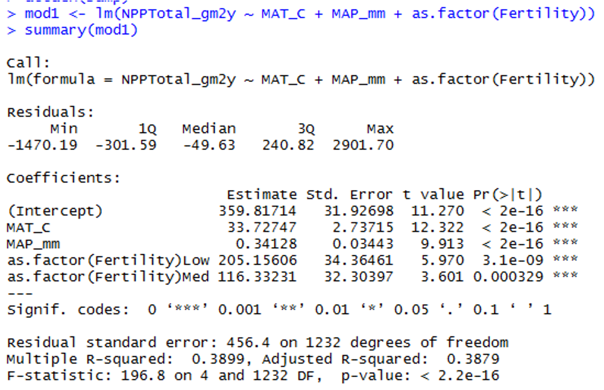
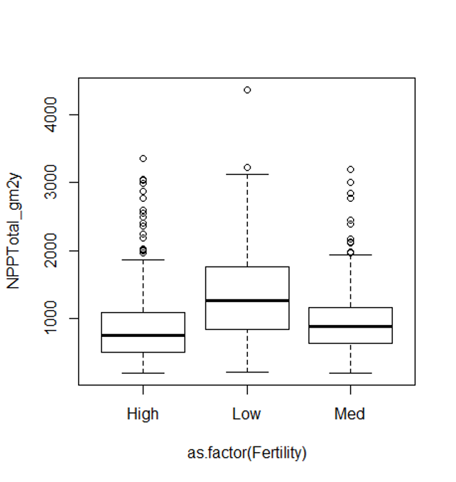

```{r setup}
#| include: false
#| message: false
#| warning: false

# install.packages("relaimpo")
library(relaimpo)
library(plotly)
library(knitr)
library(patchwork)
library(grid)
library(gridExtra)
library(car)
# library(MASS)
# library(moments) # For skewness and kurtosis
library(boot)
library(tidyverse)

# To simulate the lion data in example 17.1
lion_data <- tibble(
  proportion_black = c(0.21, 0.14, 0.11, 0.13, 0.12, 0.13, 0.12, 0.18, 0.23, 0.22, 
                      0.20, 0.17, 0.15, 0.27, 0.26, 0.21, 0.30, 0.42, 0.43, 0.59, 
                      0.60, 0.72, 0.29, 0.10, 0.48, 0.44, 0.34, 0.37, 0.34, 0.74, 0.79, 0.5),
  age_years = c(1.1, 1.5, 1.9, 2.2, 2.6, 3.2, 3.2, 2.9, 2.4, 2.1, 
               1.9, 1.9, 1.9, 1.9, 2.8, 3.6, 4.3, 3.8, 4.2, 5.4, 
               5.8, 6.0, 3.4, 4.0, 7.3, 7.3, 7.8, 7.1, 7.1, 13.1, 8.8, 5.4))

# Create sample data for demonstration, following the fish data example style
# This simulates allometric scaling relationship seen in Chapter 17
set.seed(123)
fish_data <- tibble(
  length_mm = runif(40, 180, 320),
  mass_g = 0.00001 * length_mm^3 * runif(40, 0.9, 1.1)
)

# Add a factor variable for demonstrations
fish_data$lake <- factor(rep(c("Lake A", "Lake B"), each = 20))

ant_df <- read_csv("data/ant_sp_diversity_gotelli.csv")

```

# Lecture 09: Review

::::: columns
::: {.column width="60%"}
Covered

-   Regression T-Test Anova
-   Regression Assumptions
-   sum of squared allocation and subdivision from total sums of squares
:::

::: {.column width="40%"}
```{r review-plot}
#| echo: false 
#| fig-height: 5
#| fig-width: 5
#| message: false
#| warning: false

# Fit the model and calculate predictions
model <- lm(age_years ~ proportion_black, data = lion_data)
lion_data <- lion_data %>%
  mutate(predicted = predict(model))

# Calculate mean of y
y_mean <- mean(lion_data$age_years)

# Find the highest point for the bracket
highest_point <- lion_data %>% slice_max(age_years, n = 1)

# Set offset amount
offset <- 0.003

# Create the plot
ggplot(lion_data, aes(proportion_black, age_years)) +
  # Green lines from regression to mean (offset left)
  geom_segment(aes(x = proportion_black - offset, xend = proportion_black - offset, 
                   y = predicted, yend = y_mean), 
               color = "green", alpha = 0.6) +
  # Red lines from points to regression (offset right)
  geom_segment(aes(x = proportion_black + offset, xend = proportion_black + offset, 
                   y = age_years, yend = predicted), 
               color = "red", alpha = 0.6) +
  # Mean line (light blue dotted)
  geom_hline(yintercept = y_mean, color = "lightblue", 
             linetype = "dotted", linewidth = 1) +
  # Regression line
  geom_smooth(method = "lm", se = FALSE) +
  # Points on top
  geom_point() +
  labs(x="Prop. Black", y = "Age yrs")+
  # Bracket for highest point
  annotate("segment", 
           x = highest_point$proportion_black + 0.01, 
           xend = highest_point$proportion_black + 0.01,
           y = highest_point$age_years, 
           yend = y_mean,
           color = "black") +
  # Blue dots on the regression line
  geom_point(aes(y = predicted), color = "blue", size =2) +
  geom_point(aes(y = y_mean), color = "lightblue", size =2) +
  # annotate("segment", 
  #          x = highest_point$proportion_black + 0.01, 
  #          xend = highest_point$proportion_black + 0.01,
  #          y = highest_point$age_years, 
  #          yend = highest_point$age_years,
  #          color = "black") +
  # annotate("segment", 
  #          x = highest_point$proportion_black + 0.015, 
  #          xend = highest_point$proportion_black + 0.02,
  #          y = y_mean, 
  #          yend = y_mean,
  #          color = "black") +
  NULL


```
:::
:::::

# Lecture 10: Overview

Multiple Linear Regression model

-   Regression parameters
-   Analysis of variance
-   Null hypotheses
-   Explained variance
-   Assumptions and diagnostics
-   Collinearity
-   Interactions
-   Dummy variables
-   Model selection
-   Importance of predictors

# **Lecture 10:** Analyses

::::: columns
::: {.column width="60%"}
What if more than one predictor (X) variable?

-   If predictors continuous
-   Mix between categorical and continuous
-   Can use multiple linear regression
:::

::: {.column width="40%"}
|                        | Independent variable |                 |
|:-----------------------|:---------------------|:----------------|
| **Dependent variable** | **Continuous**       | **Categorical** |
| **Continuous**         | Regression           | ANOVA           |
| **Categorical**        | Logistic regression  |                 |
:::
:::::

# **Lecture 10:** Analyses

::::: columns
::: {.column width="20%"}
Abundance of ants can be modeled as function of

-   latitude
-   longitude
-   both

Instead of line, modeled with (hyper)plane
:::

::: {.column width="80%"}
```{r l10-01}
#| echo: false
#| message: false
#| warning: false
#| paged-print: false
# Fit a linear model to get the plane
model <- lm(ant_spp ~ elevation + latitude, data = ant_df)

# Create a grid for the plane
elevation_range <- seq(min(ant_df$elevation), max(ant_df$elevation), length.out = 30)
latitude_range <- seq(min(ant_df$latitude), max(ant_df$latitude), length.out = 30)
grid <- expand.grid(elevation = elevation_range, latitude = latitude_range)
grid$ant_spp <- predict(model, newdata = grid)

# Create the 3D plot
ant_plot<- plot_ly() %>%
  # Add the actual data points
  add_trace(
    data = ant_df,
    x = ~elevation, 
    y = ~latitude, 
    z = ~ant_spp,
    type = "scatter3d",
    mode = "markers",
    marker = list(size = 5, color = "red"),
    name = "Observed"
  ) %>%
  # Add the fitted plane
  add_trace(
    data = grid,
    x = ~elevation,
    y = ~latitude,
    z = ~ant_spp,
    type = "mesh3d",
    opacity = 0.5,
    name = "Fitted Plane"
  ) %>%
  layout(
    scene = list(
      xaxis = list(title = "Elevation"),
      yaxis = list(title = "Latitude"),
      zaxis = list(title = "Ant Species")
    ),
    title = "Ant Species Diversity by Elevation and Latitude"
  )
ant_plot
```
:::
:::::

# **Lecture 10:** Analyses

::::: columns
::: {.column width="20%"}
Used in similar way to simple linear regression:

-   Describe nature of relationship between Y and X's
-   Determine explained / unexplained variation in Y
-   Predict new Ys from X
-   Find the “best” model
:::

::: {.column width="80%"}
```{r l10-02}
#| echo: false
#| message: false
#| warning: false
#| paged-print: false
ant_plot
```
:::
:::::

# **Lecture 10:** Analyses

::::: columns
::: {.column width="60%"}
Crawley 2012: “Multiple regression models provide some of the most
profound challenges faced by the analyst”:

-   Overfitting
-   Parameter proliferation
-   Multicollinearity
-   Model selection
:::

::: {.column width="40%"}
{width="277"}
:::
:::::

# **Lecture 10:** Analyses

Multiple Regression:

-   Set of i= 1 to n observations
-   fixed X-values for p predictor variables (X1, X2…Xp)
-   random Y-values:

$$y_i = \beta_0 + \beta_1 x_{i1} + \beta_2 x_{i2} + ... + \beta_p x_{ip} + \epsilon_i$$

-   y~i~: value of Y for i^th^ observation X~1~ = x~i1~, X~2~ = x~i2~,…,
    x~p~ = x~ip~

-   β~0~: population intercept, the mean value of Y when X~1~= 0, X~2~ =
    0,…, X~p~ = 0

# **Lecture 10:** Multiple linear regression model

Multiple Regression:

$$y_i = \beta_0 + \beta_1 x_{i1} + \beta_2 x_{i2} + ... + \beta_p x_{ip} + \epsilon_i$$

-   β~1~: partial regression slope, change in Y per unit change in X~1~
    holding other X-vars constant

-   β~2~: partial regression slope, change in Y per unit change in X~2~
    holding other X-vars constant

-   β~p~: partial regression slope, change in Y per unit change in X~p~
    holding other X-vars constant

What is partial - the relationship between a predictor variable and the
response variable **while holding all other predictor variables
constant**. It tells you the isolated effect of one variable,
controlling for the influence of others.

# Lecture 10: Partial regression slopes

::::: columns
::: {.column width="60%"}
model: ant_spp \~ elevation + latitude

-   The partial slope for elevation tells you how ant species richness
    changes with elevation when latitude is held constant
    -   1-m increase in elevation - ant spp decrease by 0.012 spp,
        holding latitude constant

    -   Or 100-meter increase in elevation, lose 1.2 spp
-   The partial slope for latitude tells you how ant species richness
    changes with latitude when elevation is held constant
    -   1-degree increase in latitude, ant spp decrease by 2 species,
        holding elevation constant

    -   Moving north = fewer ant spp, even when comparing sites at same
        elevation
:::

::: {.column width="40%"}
```{r l10-03}
model <- lm(ant_spp ~ elevation + latitude, data = ant_df)
summary(model)
```
:::
:::::

# **Lecture 10:** Regression parameters

Multiple Regression:

$$y_i = \beta_0 + \beta_1 x_{i1} + \beta_2 x_{i2} + ... + \beta_p x_{ip} + \epsilon_i$$

-   ε~i~: unexplained error - difference between y~i~ and value
    predicted by model (ŷ~i~)
-   ant_spp = β~0~ + β~1~(lat) + β~2~(elevation) + ε~i~

# **Lecture 10:** Regression parameters

Multiple Regression:

$$y_i = \beta_0 + \beta_1 x_{i1} + \beta_2 x_{i2} + ... + \beta_p x_{ip} + \epsilon_i$$

-   Estimate multiple regression parameters (intercept, partial slopes)
    using OLS to fit the regression line
-   OLS minimize ∑(y~i~-ŷ~i~)^2^, the SS (vertical distance) between
    observed y~i~ and predicted ŷ~i~ for each x~ij~
-   ε estimated as residuals: ε~i~ = y~i~-ŷ~i~
-   Calculation solves set of simultaneous normal equations with matrix
    algebra

# **Lecture 10:** Regression parameters

Regression equation can be used for prediction by subbing new values for
predictor (X) variables

-   Confidence intervals calculated for parameters
-   Confidence and prediction intervals depend on number of observations
    and number of predictors
    -   More observations decrease interval width
    -   More predictors increase interval width
-   Prediction should be restricted to within range of X variables

# **Lecture 10:** Analyses of variance or sums of squares

Variance - SS~total~ partitioned into SS~regression~ and SS~residual~

-   SS~regression~ is variance in Y explained by model

-   SS~residual~ is variance not explained by model

| Source of variation | SS | df | MS | Interpretation |
|:--------------|:--------------|:--------------|:--------------|:--------------|
| Regression | $\sum_{i=1}^{n} (y_i - \bar{y})^2$ | $p$ | $\frac{\sum_{i=1}^{n} (y_i - \bar{y})^2}{p}$ | Difference between predicted observation and mean |
| Residual | $\sum_{i=1}^{n} (y_i - \hat{y}_i)^2$ | $n-p-1$ | $\frac{\sum_{i=1}^{n} (y_i - \hat{y}_i)^2}{n-p-1}$ | Difference between each observation and predicted |
| Total | $\sum_{i=1}^{n} (y_i - \bar{y})^2$ | $n-1$ |  | Difference between each observation and mean |

# **Lecture 10:** Analyses

### SS converted to non-additive MS=(SS/df)

-   MS~residual~: estimate population variance
-   MS~regression~: estimate population variance + variation due to
    strength of X-Y relationships
-   MS is an estimate of variance that doesn't increase with sample size
    the way Sum of Squares (SS) does

| Source of variation | SS | df | MS |
|:-----------------|:-----------------|:-----------------|:-----------------|
| Regression | $\sum_{i=1}^{n} (y_i - \bar{y})^2$ | $p$ | $\frac{\sum_{i=1}^{n} (y_i - \bar{y})^2}{p}$ |
| Residual | $\sum_{i=1}^{n} (y_i - \hat{y}_i)^2$ | $n-p-1$ | $\frac{\sum_{i=1}^{n} (y_i - \hat{y}_i)^2}{n-p-1}$ |
| Total | $\sum_{i=1}^{n} (y_i - \bar{y})^2$ | $n-1$ |  |

# **Lecture 10:** Hypotheses

### Two Null Hypotheses usually tested in MLR:

-   “Basic” H~o~: all partial regression slopes equal 0; β~1~ = β~2~ = …
    = β~p~ = 0
-   If “basic” H~o~ true, MS~regression~ and MS~residual~ estimate
    variance and their ratio (F-ratio) = 1
-   If “basic” H~o~ false (at least one β ≠ 0) MS~regression~ estimates
    variance + partial regression slope and their ratio (F-ratio) will
    be \> 1 - F-ratio compared to F-distribution for p-value

# **Lecture 10:** Hypotheses

### Also: is any specific β = 0 (explanatory role)?

-   E.g., does LAT have effect on Ant species?
-   These H's tested through model comparison
-   Model 1 - model with 2 predictors X~1~, X~2~:
    -   yi= β~0~ +β~1~x~i1~+β~2~x~i2~+ ε~i~
-   Model 2 - To test H~o~ that β~2~ = 0 compare fit of **model 1** to
    **model 2** with 1 predictor:
    -   y~i~= β~0~ +β~1~x~i1~+ ε~i~

# **Lecture 10:** Hypotheses

-   If SS~regression~ of model~1~=model~2~, cannot reject H~o~ β~1~ = 0
    -   adding X~2~ did not explain any additional variance
-   If SS~regression~ of mod1 \> mod2, evidence to reject H~o~ β~1~ = 0
    -   adding X2 explains more variance
    -   evidence to reject H0: β~2~ = 2
-   SS for β~1~ is SS~extra~β~1~ = Full SS~regression~ - Reduced
    SS~regression~
    -   This quantifies how much additional variance X~2~ explains
-   Use partial F-test to test Ho β~1~ = 0 :

$$F_{w,n-p} = \frac{MS_{Extra}}{FULL\ MS_{Residual}}  $$ **Can also use
t-test (R provides this value)**

# **Lecture 10:** Explained variance

Explained variance (r^2^) is calculated the same way as for simple
regression:

$$r^2 = \frac{SS_{Regression}}{SS_{Total}} = 1 - \frac{SS_{Residual}}{SS_{Total}}  $$

-   r^2^ values can not be used to directly compare models
-   r^2^ values will always increase as predictors added
-   r^2^ values with different transformation will differ

# **Lecture 10:** Assumptions and diagnostics

::::: columns
::: {.column width="60%"}
-   Assume fixed Xs; unrealistic in most biological settings
-   No major (influential) outliers
-   Check leverage, influence- Cook’s Di
:::

::: {.column width="40%"}
```{r l10-04}
# Plot Cook's distance
plot(model, which = 4)
```
:::
:::::

# **Lecture 10:** Assumptions and diagnostics

::::: columns
::: {.column width="60%"}
-   Normality, equal variance, independence
-   Residual QQ-plots, residuals vs. predicted values plot
-   Distribution/variance often corrected by transforming Y
:::

::: {.column width="40%"}
```{r qq_and_resid}
#| echo: false
par(mfrow = c(2, 1), mar = c(4, 4, 2, 1))
plot(model, which = 1)
plot(model, which = 2)
par(mfrow = c(1, 1))
```
:::
:::::

# **Lecture 10:** Assumptions and diagnostics

-   **More observations than predictor variables**
    -   Ideally **at least 10x observations than predictors** to avoid
        “overfitting” **10:1**

        -   2 predictors = 20 observations!!!
-   **No colinearity**
    -   **Need Uncorrelated predictor variables (assessed using
        scatterplot matrix; VIFs)**
-   **Each X has linear relationship with Y after accounting for other
    predictors**
    -   **Added Variable (AV) plots** (also called partial regression
        plots)

        -   These show the relationship between Y and X₁ after removing
            the linear effects of all other predictors

        -   Create AV plots for all predictors - `avPlots(model)`

        -   Or for just one predictor -
            `avPlot(model, variable = "proportion_black")`

# **Lecture 10:** Analyses

::::: columns
::: {.column width="40%"}
Regression of Y vs. each X does not consider effect of other predictors:

want to know shape of relationship while holding other predictors
constant
:::

::: {.column width="60%"}
```{r l10-05}
#| echo: false

#| echo: false
#| message: false
#| warning: false
#| paged-print: false
# Plot 1: Ant species vs Elevation
p1 <- ggplot(ant_df, aes(x = elevation, y = ant_spp)) +
  geom_point(size = 3, color = "steelblue") +
  geom_smooth(method = "lm", se = TRUE, color = "red") +
  labs(x = "Elevation (m)", 
       y = "Ant Species Richness") +
  theme_minimal()

# Plot 2: Ant species vs Latitude
p2 <- ggplot(ant_df, aes(x = latitude, y = ant_spp)) +
  geom_point(size = 3, color = "steelblue") +
  geom_smooth(method = "lm", se = TRUE, color = "red") +
  labs(x = "Latitude (degrees)", 
       y = "Ant Species Richness") +
  theme_minimal()

# Display plots top bottom

p1 / p2 
```
:::
:::::

# **Lecture 10:** Collinearity

-   Potential predictor variables are often correlated (e.g.,
    morphometrics, nutrients, climatic parameters)
-   Multicollinearity (strong correlation between predictors) causes
    problems for parameter estimates
-   Severe collinearity causes unstable parameter estimates: small
    change in a single value can result in large changes in βp -
    estimates
-   Inflates partial slope error estimates, loss of power

```{r l10-06}
#| echo: false
#| message: false
#| warning: false
#| paged-print: false
cor_matrix <- cor(ant_df[, c("elevation", "latitude", "ant_spp")])
print(cor_matrix)
```

# **Lecture 10:** Collinearity

### Collinearity can be detected by:

-   Variance inflation Factors **(VIF)**:
    -   VIF for X~j~=1/ (1-r^2^ )
    -   VIF \> 10 = bad
-   Best/simplest solution:
    -   exclude variables that are highly correlated with other
        variables
    -   they are probably measuring similar things and are redundant

# **Lecture 10:** Interactions

### Predictors can be modeled as:

-   [**additive (effect of temp, plus precip, plus fertility)
    or**]{.underline}
-   [**multiplicative (interactive)**]{.underline}
-   **Interaction: effect of Xi depends on levels of Xj**
-   The partial slope of Y vs. X~1~ is different for different levels of
    X~2~ (and vice versa); measured by β~3~

$$y_i = \beta_0 + \beta_1X_{i1} + \beta_2X_{i2} + \epsilon_i \quad \text{vs.} \quad y_i = \beta_0 + \beta_1X_{i1} + \beta_2X_{i2} + \beta_3X_{i1}*X_{i2} \epsilon_i$$

This leads to “Curvature” of the regression (hyper)plane

# **Lecture 10:** Analyses

::::: columns
::: {.column width="30%"}
Interaction terms lead to “Curvature” of the regression (hyper)plane
:::

::: {.column width="70%"}
```{r l10-07}
#| echo: false
#| message: false
#| warning: false
#| paged-print: false
# Fit a model WITH INTERACTION to get curvature
model_interaction_int <- lm(ant_spp ~ elevation * latitude, data = ant_df)

# Create a grid for the curved surface
elevation_range_int <- seq(min(ant_df$elevation), max(ant_df$elevation), length.out = 30)
latitude_range_int <- seq(min(ant_df$latitude), max(ant_df$latitude), length.out = 30)
grid_int <- expand.grid(elevation = elevation_range, latitude = latitude_range)
grid_int$ant_spp <- predict(model_interaction_int, newdata = grid_int)

# Reshape for surface plot
z_matrix_int <- matrix(grid_int$ant_spp, nrow = 30, ncol = 30)

# Create the 3D plot with curved surface
ant_int_plot <- plot_ly() %>%
  # Add the actual data points
  add_trace(
    data = ant_df,
    x = ~elevation, 
    y = ~latitude, 
    z = ~ant_spp,
    type = "scatter3d",
    mode = "markers",
    marker = list(size = 5, color = "red"),
    name = "Observed"
  ) %>%
  # Add the fitted CURVED surface (interaction model)
  add_surface(
    x = elevation_range_int,
    y = latitude_range_int,
    z = z_matrix_int,
    opacity = 0.7,
    colorscale = "Viridis",
    name = "Interaction Model"
  ) %>%
  layout(
    scene = list(
      xaxis = list(title = "Elevation"),
      yaxis = list(title = "Latitude"),
      zaxis = list(title = "Ant Species")
    ),
    title = "Ant Species: Interaction Model (Curved Surface)"
  )

ant_int_plot
```
:::
:::::

# **Lecture 10:** Analyses

Adding interactions:

-   many more predictors (“parameter proliferation”):
-   2^n^ is required; 6 parameters = 64 terms; 7 parameters= 128
-   interpretation more complex
-   When to include interactions? When they make biological sense!!!

# **Lecture 10:** Dummy variables

**Multiple Linear Regression accommodates continuous and categorical
variables** (gender, vegetation type, etc.) Categorical vars as “dummy
vars”, n of dummy variables = n-1 categories

-   **Sex M/F:**
    -   Need 1 dummy var with two values (0, 1)
-   **Fertility L/M/H:**
    -   Need 2 dummy var, each with two values (0, 1): fert1 (0 if L or
        H, 1 if M), fert2 (1 if H, 0 if L or M)

| Fertility | fert1 | fert2 |
|:----------|:------|:------|
| Low       | 0     | 0     |
| Med       | 1     | 0     |
| High      | 0     | 1     |

# **Lecture 10:** Analyses

### Coefficients interpreted relative to reference condition

-   R codes dummy variables automatically
-   picks “reference” level alphabetically
-   Dummy variables with more than 2 levels add extra predictor
    variables to model

| Fertility | fert1 | fert2 |
|-----------|-------|-------|
| Low       | 0     | 0     |
| Med       | 1     | 0     |
| High      | 0     | 1     |

# **Lecture 10:** Analyses

::::: columns
::: {.column width="60%"}
{width="540"}
:::

::: {.column width="40%"}
{width="250"}
:::
:::::

# **Lecture 10:** Comparing models

-   When have multiple predictors (and interactions!)
    -   how to choose “best” model?
    -   Which predictors to include?
    -   Occam’s razor: “best” model balances complexity with fit to data
-   To chose:
    -   compare “nested” models
-   Overfitting
    -   getting high r2 just by having more (useless predictors)
    -   so r2 is not a good way of choosing between nested models

# **Lecture 10:** Comparing models

### Need to account for increase in fit with added predictors:

-   Adjusted r2
-   Akaike’s information criterion (AIC)
-   Both “penalize” models for extra predictors
-   Higher adjusted r2 and lower AIC are better when comparing models
    -   p = predictors
    -   n = \#

$$\text{Adjusted } r^2 = 1 - \frac{SS_{\text{Residual}}/(n - (p + 1))}{SS_{\text{Total}}/(n - 1)}$$
$$\text{Akaike Information Criterion (AIC)} = n[\ln(SS_{\text{Residual}})] + 2(p + 1) - n\ln(n)$$

# **Lecture 10:** Comparing models

-   But how to compare models?
    -   Can fit all possible models

        -   compare AICs or adj- r2,
        -   tedious w lots of predictors

    -   Automated forward (and backward) stepwise procedures: start w no
        terms (all terms), add (remove) terms w largest (smallest)

        -   partial F statistic
-   We will use manual form of backward selection

# **Lecture 10:** Analyses

```{r l10-08}
#| echo: false
#| message: false
#| warning: false
#| paged-print: false

# Create three models to compare
full_model <- lm(ant_spp ~ elevation + latitude, data = ant_df)
elevation_only <- lm(ant_spp ~ elevation, data = ant_df)
latitude_only <- lm(ant_spp ~ latitude, data = ant_df)

# Display all three models
cat("\n========== FULL MODEL (Both Variables) ==========\n")
summary(full_model)

```

# **Lecture 10:** Analyses

```{r l10-09}
#| echo: false
#| message: false
#| warning: false
#| paged-print: false

# Create three models to compare
full_model <- lm(ant_spp ~ elevation + latitude, data = ant_df)
elevation_only <- lm(ant_spp ~ elevation, data = ant_df)
latitude_only <- lm(ant_spp ~ latitude, data = ant_df)

cat("\n========== ELEVATION ONLY MODEL ==========\n")
summary(elevation_only)

```

# **Lecture 10:** Analyses

```{r l10-10}
#| echo: false
#| message: false
#| warning: false
#| paged-print: false

# Create three models to compare
full_model <- lm(ant_spp ~ elevation + latitude, data = ant_df)
elevation_only <- lm(ant_spp ~ elevation, data = ant_df)
latitude_only <- lm(ant_spp ~ latitude, data = ant_df)

cat("\n========== LATITUDE ONLY MODEL ==========\n")
summary(latitude_only)


```

# **Lecture 10:** Analyses

```{r l10-11}
#| echo: false
#| message: false
#| warning: false
#| paged-print: false

# Create three models to compare
full_model <- lm(ant_spp ~ elevation + latitude, data = ant_df)
elevation_only <- lm(ant_spp ~ elevation, data = ant_df)
latitude_only <- lm(ant_spp ~ latitude, data = ant_df)

# ========== MODEL COMPARISON ==========
cat("\n========== MODEL COMPARISON TABLE ==========\n")

# Extract metrics for all three models
full_adj_r2 <- summary(full_model)$adj.r.squared
elev_adj_r2 <- summary(elevation_only)$adj.r.squared
lat_adj_r2 <- summary(latitude_only)$adj.r.squared

full_aic <- AIC(full_model)
elev_aic <- AIC(elevation_only)
lat_aic <- AIC(latitude_only)

# Create comparison table
comparison <- data.frame(
  Model = c("Both Variables", 
            "Elevation Only", 
            "Latitude Only"),
  Adjusted_R2 = c(full_adj_r2, elev_adj_r2, lat_adj_r2),
  AIC = c(full_aic, elev_aic, lat_aic),
  R2_vs_Full = c(0, elev_adj_r2 - full_adj_r2, lat_adj_r2 - full_adj_r2),
  AIC_vs_Full = c(0, elev_aic - full_aic, lat_aic - full_aic)
)

print(comparison)

# ========== KEY FINDINGS ==========
cat("\n========== KEY FINDINGS ==========\n")
cat(sprintf("Full Model AIC: %.2f (Adjusted R²: %.4f)\n", full_aic, full_adj_r2))
cat(sprintf("Elevation Only AIC: %.2f (Adjusted R²: %.4f)\n", elev_aic, elev_adj_r2))
cat(sprintf("Latitude Only AIC: %.2f (Adjusted R²: %.4f)\n", lat_aic, lat_adj_r2))

cat("\n--- Differences from Full Model ---\n")
cat(sprintf("Removing latitude: AIC increases by %.2f, Adj R² decreases by %.4f\n", 
            elev_aic - full_aic, elev_adj_r2 - full_adj_r2))
cat(sprintf("Removing elevation: AIC increases by %.2f, Adj R² decreases by %.4f\n", 
            lat_aic - full_aic, lat_adj_r2 - full_adj_r2))

cat("\n========== CONCLUSION ==========\n")
cat("✓ Full model has LOWEST AIC (best fit)\n")
cat("✓ Full model has HIGHEST Adjusted R² (explains most variance)\n")
cat("✗ Removing either variable worsens model performance\n")
cat("\nBoth elevation and latitude are important predictors of ant species diversity!\n")
```

# **Lecture 10:** Predictors

Usually want to know relative importance of predictors to explaining Y

-   Three general approaches:
-   Using F-tests (or t-tests) on partial regression slopes
-   Using coefficient of partial determination
-   Using standardized partial regression slopes

# **Lecture 10:** Predictors

Using F-tests (or t-tests) on partial regression slopes:

-   Conduct F tests of Ho that each partial regression slope = 0
-   If cannot reject Ho, discard predictor
-   Can get additional clues from relative size of F-values
-   Does not tell us absolute importance of predictor (usually can not
    directly compare slope parameters)

# **Lecture 10:** Predictors

Using coefficient of partial determination:

-   the reduction in variation of Y due to addition of predictor (Xj)

$$r_{X_j}^2 = \frac{SS_{\text{Extra}}}{\text{Reduced }SS_{\text{Residual}}}$$

SSextra

-   Increased in SSregression when Xj is added to model
-   Reduced SSresidual is the unexplained SS from model without Xj

# **Lecture 10:** Predictors

### Using standardized partial regression slopes:

-   predictors of predictor variables can not be directly compared
-   Why?
    -   Standardize all vars (mean = 0, sd= 1)

    -   Scales are identical and larger PRS mean more important variable

# **Lecture 10:** Predictors

:::: columns
::: {.column width="60%"}
-   Using partial r^2^ values
    -   **pEta_sqr (Partial Eta Squared):**

        -   **Elevation: 0.3189 (31.9%)** - Elevation explains 31.9% of
            the variance *after controlling for latitude*

        -   **Latitude: 0.3564 (35.6%)** - Latitude explains 35.6% of
            the variance *after controlling for elevation*

        -   Both are important predictors! Latitude is slightly stronger
-   dR_sqr (Delta R Squared / Semi-partial R²):
    -   Elevation: 0.2087 (20.9%)

        -   If you removed elevation from the model, R² would drop by
            20.9%

    -   Latitude: 0.2468 (24.7%)

    -   If you removed latitude from the model, R² would drop by 24.7%
-   Shows the unique contribution of each predictor to the total
    variance explained
:::

```{r l10-12}
#| echo: false
#| message: false
#| warning: false
#| paged-print: false
# Get Type II ANOVA table
anova_result <- Anova(full_model, type = "II")

cat("\n== Method 2: Type II ANOVA (car package) ==\n")
print(anova_result)

# Calculate effect sizes
SSR <- anova_result$`Sum Sq`
df_terms <- anova_result$Df
SSE <- sum(residuals(full_model)^2)
SST <- sum((ant_df$ant_spp - mean(ant_df$ant_spp))^2)

# Create results table matching your image format
results <- data.frame(
  Coefficients = rownames(anova_result),
  SSR = SSR,
  df = df_terms,
  pEta_sqr = SSR / (SSR + SSE),
  dR_sqr = SSR / SST
)

# Display results
cat("== Coefficients Table ==\n")
print(results, row.names = FALSE, digits = 4)

cat("\n== Summary Statistics ==\n")
cat(sprintf("Sum of squared errors (SSE): %.1f\n", SSE))
cat(sprintf("Sum of squared total (SST): %.1f\n", SST))
cat(sprintf("Model R²: %.4f\n", summary(full_model)$r.squared))

```
::::
