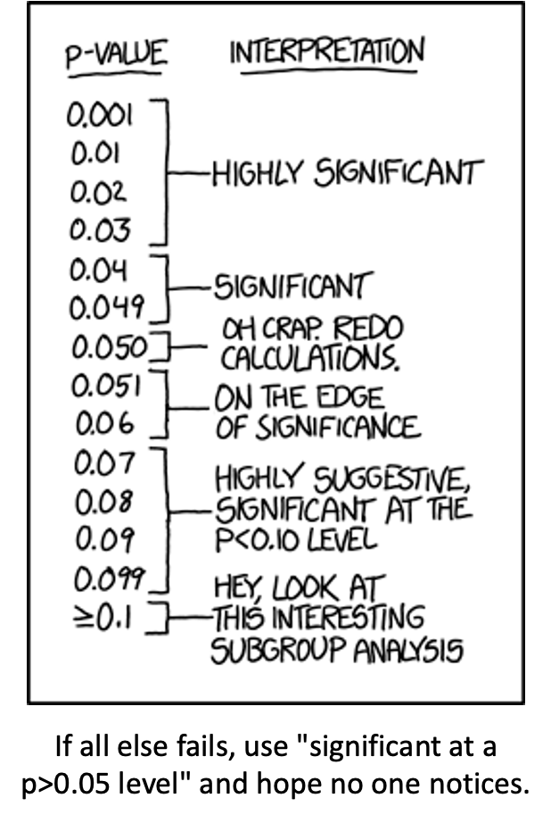
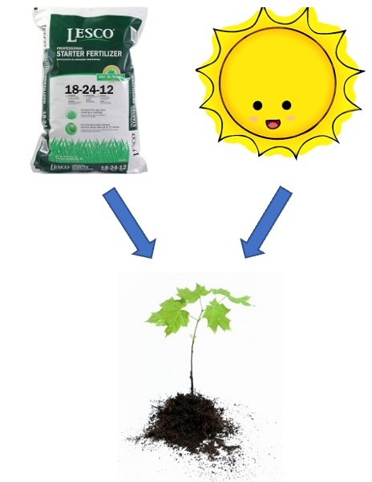
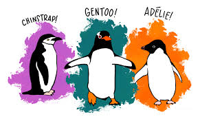
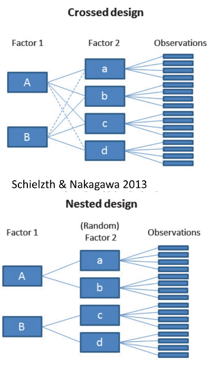
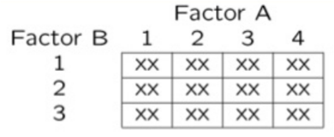
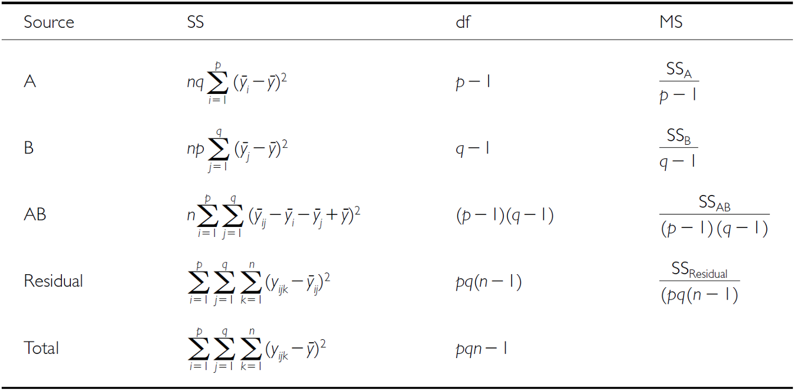
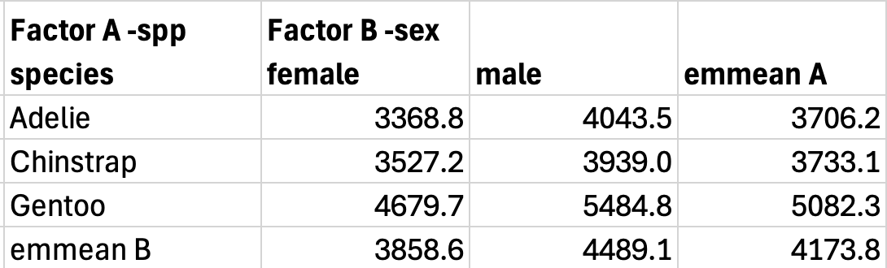
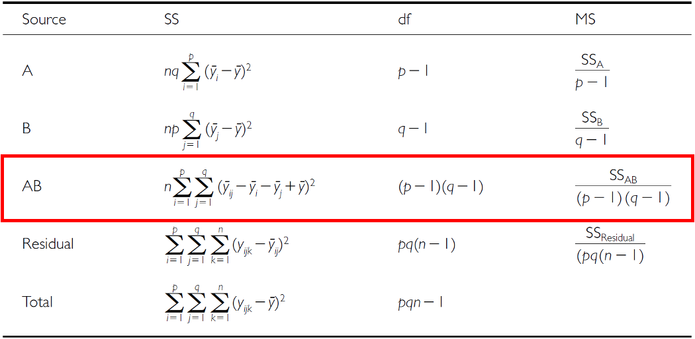

# Lecture 11: Review

::::: columns
::: {.column width="60%"}
### ANOVA

-   Analysis of variance: single and multi-factor designs
-   Examples: diatoms, circadian rhythms
-   Predictor variables: fixed vs. random
-   ANOVA model
-   Analysis and partitioning of variance
-   Null hypothesis
-   Assumptions and diagnostics
-   Post F Tests - Tukey and others
-   Reporting the results
:::

::: {.column width="40%"}
{width="301"}
:::
:::::

# Lecture 12: Factorial ANOVA

::::: columns
::: {.column width="60%"}
### 2-factor designs (2-way ANOVA)

-   very common in ecology
-   can have more factors (e.g., 3-way ANOVA) but interpretation gets
    very challenging...
-   Most multifactor designs: are factorial or nested
-   We will cover a 2 Factor Anova - this could be fertilizer and
    sunlight for plant biomass produced...
    -   each can have an effect independently
    -   the effect of one factor may interact with the other factor
    -   in this example...
        -   a low light and high light treatment might affect biomass

        -   fertilizer also might affect plant biomass

        -   but when you have higher light the high fertilizer treatment
            may grow better than expected
:::

::: {.column width="40%"}
{width="233"}


:::
:::::

# Factorial ANOVA: Design Structure

::::: columns
::: {.column width="60%"}
### Consider two factors:

-   Factorial/crossed:
    -   every level of B in every level of A\

        {width="316"}
:::

::: {.column width="40%"}
{width="345"}
:::
:::::

# Factorial ANOVA: Effect Types

::::: columns
::: {.column width="60%"}
### In factorial designs

-   look at two types of factor effects:
    -   **Main effect of each factor** (polling across other factor)
    -   **Interaction effects;** is there synergistic/ antagonistic
        effect of factors?
:::

::: {.column width="40%"}
{width="495"}
:::
:::::

# Introduction to Two-Way ANOVA

::::: columns
::: {.column width="60%"}
## Factorial Designs

Two-way ANOVA examines:

-   Main effect of Factor A (Species)
-   Main effect of Factor B (Sex)
-   Interaction between A × B
-   Balanced design: equal sample sizes in all cells
-   Type III sums of squares for unbiased estimates - if balanced it
    does not matter
:::

::: {.column width="40%"}
```{r load_packages_data}
#| echo: false
#| message: false
#| warning: false
#| paged-print: false
# Load required packages
library(palmerpenguins)
library(emmeans)
library(ggfortify)
library(car)
library(broom)
library(patchwork)
library(tidyverse)
# Load the penguin data
p_df <- penguins %>%
  filter(!is.na(body_mass_g), 
         !is.na(sex),
         !is.na(species)) %>%
  select(species, sex, body_mass_g)
# Calculate group means and SDs
summaryu_df <- p_df %>%
  group_by(species, sex) %>%
  summarise(
    n = sum(!is.na(body_mass_g)),
    mean_mass = mean(body_mass_g),
    sd_mass = sd(body_mass_g),
    se_mass = sd_mass/sqrt(n),
    .groups = 'drop'
  ) %>%
  arrange(species, sex)

print(summaryu_df)


```
:::
:::::

# Data Preparation - Creating Balanced Design

::::: columns
::: {.column width="60%"}
### Balancing the Penguin Data

The dataframe of penguins is unbalanced - there are unequal samples per
cell

```{r prepare_data}
#| echo: false
#| message: false
#| warning: false
#| paged-print: false
#| 
# Check original sample sizes
original_n <- p_df %>%
  count(species, sex) %>%
  arrange(species, sex)

p_df %>%
  count(species, sex) %>%
  pivot_wider(names_from = sex, 
              values_from = n,
              values_fill = 0) 

```
:::

::: {.column width="40%"}
```{r balance_data}
#| echo: false
#| message: false
#| warning: false
#| paged-print: false
#| collapse: true

# Find minimum sample size
min_n <- min(original_n$n)
cat(paste("Minimum n =", min_n, "\n\n"))

# Create balanced dataset
set.seed(123) # for reproducibility
balanced_df <- p_df %>%
  group_by(species, sex) %>%
  sample_n(min_n) %>%
  ungroup()

# Verify balanced design
balanced_n <- balanced_df %>% 
  count(species, sex) %>%
  pivot_wider(names_from = sex, 
              values_from = n,
              values_fill = 0) 
balanced_n
```

Statistical Mode
$Y_{ijk} = \mu + \alpha_i + \beta_j + (\alpha\beta)_{ij} + \varepsilon_{ijk}$

Where:

$\mu$ = grand mean

$\alpha_i$ = effect of species i

$\beta_j$ = effect of sex j

$(\alpha\beta)_{ij}$ = interaction effect

$\varepsilon_{ijk}$ = random error
:::
:::::

# Descriptive Statistics

::::: columns
::: {.column width="60%"}
## Summary Statistics by Groups

```{r descriptive_stats}
#| echo: false
#| message: false
#| warning: false
#| paged-print: false


# Calculate group means and SDs
summary_df <- balanced_df %>%
  group_by(species, sex) %>%
  summarise(
    n = sum(!is.na(body_mass_g)),
    mean_mass = mean(body_mass_g),
    sd_mass = sd(body_mass_g),
    se_mass = sd_mass/sqrt(n),
    .groups = 'drop'
  ) %>%
  arrange(species, sex)

print(summary_df)
```
:::

::: {.column width="40%"}
```{r box_plot}
#| echo: false
p_box_plot <- balanced_df %>% 
  ggplot(aes(species, body_mass_g, fill=sex))+
  geom_boxplot() +
  theme(axis.text = element_text(size = 14),
        legend.text = element_text(size = 14))
p_box_plot

```
:::
:::::

# Factorial ANOVA Models

Factorial designs can be of 3 types:

-   **Model 1** - 2 fixed factors - the focus for today....
-   Model 2 - 2 random
-   **Model 3** - 1 fixed, 1 random (mixed model) - often nested

Model 1 ANOVA:

### $$y_{ijk} = \mu + \alpha_i + \beta_j + (\alpha\beta)_{ij} + \varepsilon_{ijk}$$

# Model Components Explained

### $$y_{ijk} = \mu + \alpha_i + \beta_j + (\alpha\beta)_{ij} + \varepsilon_{ijk}$$

-   $y_{ijk}$: value of the k~th~ observation from jth and ith
    combination of B and A (sex m of species y)
-   µ: overall mean (overall mass)
-   αi: effect of the ith level of A, pooling across all levels of B:
    µi- µ (difference between average mass in all "males " for species x
    and overall mean)

# Interaction Effects

### $$y_{ijk} = \mu + \alpha_i + \beta_j + (\alpha\beta)_{ij} + \varepsilon_{ijk}$$

-   Βj: effect of jth level of B, pooling across all levels of A: µj- µ
    (difference between average mass in all males treatments and overall
    mean)
-   (αβ)ij: effect of interaction of ith level of A and jth level of B
    (µij - µi - µj + µ).
    -   Does effect of B depend on level of A? (is effect of sex
        different in the 3 species?)

# Model Types and Interpretation

### $$y_{ijk} = \mu + \alpha_i + \beta_j + (\alpha\beta)_{ij} + \varepsilon_{ijk}$$

-   Model 2 ANOVA rare in ecology
-   **Model 3 interpretation is different:**
    -   βj: random variable measuring variance in y across all possible
        levels of B, pooling across all levels of A
    -   (αβ)ij is random variable measuring variance of interaction
        between A and B across all possible levels of B ("is effect of A
        consistent across all possible levels of B that could have been
        chosen?")

# Estimated Marginal Means

::::: columns
::: {.column width="60%"}
-   Before we go further we need to define what estimated marginal means
    are

-   Balanced data - it is just the means of the groups... easy

-   Unbalanced data - it is the mean of cells that represent the lowest
    average of the groups

```{r means_table}
#| echo: false
#| message: false
#| warning: false
#| paged-print: false
# First, calculate cell means (species x sex combinations)
cell_means <- p_df %>%
  group_by(species, sex) %>%
  summarise(
    n = sum(!is.na(body_mass_g)), 
    cell_mean = mean(body_mass_g),
    .groups = 'drop'
  ) 
cell_means_wide <- cell_means %>% select(-n) %>% 
  pivot_wider(
              names_from = sex,
              values_from = cell_mean)
cell_counts <- p_df %>%
  count(species, sex) %>%
  pivot_wider(names_from = sex, 
              values_from = n,
              values_fill = 0) 
# Join the tables
combined_table <- cell_means_wide %>%
  left_join(cell_counts, by = "species", suffix = c("_mean", "_n"))

cat("Combined table with means and counts:\n\n")
print(combined_table)

# Show the WRONG way (regular means - weighted by sample size)
regular_species_means <- p_df %>%
  group_by(species) %>%
  summarise(total_n = n(),
    regular_mean = mean(body_mass_g),
    .groups = 'drop')
cat("\n\nRegular means (WRONG for marginal means):\n\n")
print(regular_species_means)

```
:::

::: {.column width="40%"}
```{r marginal_means_2a}
#| echo: false
#| paged-print: false

# Show the CORRECT way (EMMs - average of cell means)
# For species marginal means: average the male and female means for each species
emm_species <- cell_means %>%
  group_by(species) %>%
  summarise(
    emm_mean = mean(cell_mean),  # Average of cell means!
    calculation = paste0("(", 
                        paste(round(cell_mean, 1), collapse = " + "), 
                        ") / 2 = ", 
                        round(mean(cell_mean), 1)),
    .groups = 'drop'
  )

cat("Estimated Marginal Means for Species (CORRECT):")
print(emm_species)

# Create a comparison table to show the difference
comparison <- cell_means %>%
  pivot_wider(names_from = sex, 
              values_from = c(n, cell_mean)) %>%
  mutate(
    # Show the calculation explicitly
    species_emm = (cell_mean_female + cell_mean_male) / 2,
    # Compare with regular mean
    regular_mean = regular_species_means$regular_mean[match(species, regular_species_means$species)],
    difference = species_emm - regular_mean
  )
cat("\n\nComparison showing EMM calculation:\n\n")
print(comparison %>% select(species, cell_mean_female, cell_mean_male, species_emm, regular_mean, difference))
```
:::
:::::

# Estimated Marginal Means

::::: columns
::: {.column width="60%"}
-   Before we go further we need to define what estimated marginal means
    are

-   Balanced data - it is just the means of the groups... easy

-   Unbalanced data - it is the mean of cells that represent the lowest
    average of the groups

```{r}
#| echo: false
#| message: false
#| warning: false
#| paged-print: false
# First, calculate cell means (species x sex combinations)
cell_means <- p_df %>%
  group_by(species, sex) %>%
  summarise(
    n = sum(!is.na(body_mass_g)), 
    cell_mean = mean(body_mass_g),
    .groups = 'drop'
  ) 
cell_means_wide <- cell_means %>% select(-n) %>% 
  pivot_wider(
              names_from = sex,
              values_from = cell_mean)
cell_counts <- p_df %>%
  count(species, sex) %>%
  pivot_wider(names_from = sex, 
              values_from = n,
              values_fill = 0) 
# Join the tables
combined_table <- cell_means_wide %>%
  left_join(cell_counts, by = "species", suffix = c("_mean", "_n"))

cat("Combined table with means and counts:\n\n")
print(combined_table)


```
:::

::: {.column width="40%"}
```{r marginal_means_2}
#| echo: false
#| message: false
#| warning: false
#| paged-print: false
# Regular Means for sex
regular_sex_means <- p_df %>%
  group_by(sex) %>%
  summarise(
    total_n = n(),
    regular_mean = mean(body_mass_g, na.rm = TRUE),  # Added na.rm for safety
    .groups = 'drop'
  )
cat("\nRegular means sex (WRONG for marginal means):")
print(regular_sex_means)

# For sex marginal means: average across all species for each sex
emm_sex <- cell_means %>%
  group_by(sex) %>%
  summarise(
    emm_mean = mean(cell_mean),  # Average of cell means!
    calculation = paste0("(", 
                        paste(round(cell_mean, 1), collapse = " + "), 
                        ") / 3 = ", 
                        round(mean(cell_mean), 1)),
    .groups = 'drop'
  )
cat("\n\nEstimated Marginal Means for Sex (CORRECT):\n\n")
print(emm_sex)

# Create a comparison table to show the difference
comparison <- emm_sex %>%
  left_join(regular_sex_means, by = "sex") %>%
  mutate(
    difference = emm_mean - regular_mean
  ) %>%
  select(sex, total_n, regular_mean, emm_mean, difference)

cat("\\n\nComparison showing difference between regular and marginal means:\n\n")
print(comparison)

```
:::
:::::

# ANOVA Table Structure

-   SStotal = SSA + SSB + SSAB + SSresidual
-   SStotal = (Y - Grand Mean Y)\^2
-   SSresidual = (Y -Yhat)\^2 or the difference between each observation
    and the appropriate cell mean, summed over all observations

::: {style="font-size: 1.4em;"}
| Source | SS | df | MS |
|:---|:---|:---|:---|
| A | $nq \sum_{i=1
            }^{p} (\bar
            {y}_{i.} -
            \bar{y})^2$ | $p-1$ | $\frac{SS_A}
                                           {p-1}$ |
| B | $np \sum_{j=1
            }^{q} (\bar
            {y}_{.j} -
            \bar{y})^2$ | $q-1$ | $\frac{SS_B}
                                           {q-1}$ |
| AB | $n \sum_{i=1
            }^{p} \sum_{
            j=1}^{q} (\ 
            bar{y}_{ij}
            - \bar{y}_
            {i.} - \bar
            {y}_{.j} +
            \bar{y})^2$ | $(p-1)(q-1)$ | $\frac{SS_{AB
                                           }}{(p-1)(q-1)
                                           }$ |
| Residual | $\sum_{i=1}
            ^{p} \sum_{
            j=1}^{q}
            \sum_{k=1}^{
            n} (y_{ijk}
            - \bar{y}_{
            ij})^2$ | $pq(n-1)$ | $\frac{SS_{\ 
                                           text{Residual
                                           }}}{pq(n-1)}$ |
| Total | $\sum_{i=1}
            ^{p} \sum_{
            j=1}^{q}
            \sum_{k=1}^{
            n} (y_{ijk}
            - \bar{y})^2$ | $pqn-1$ |  |

: {tbl-colwidths="\[10,40,15,15\]"}
:::

# SSA: Factor A Effects

-   SSA is SS of differences between each marginal mean of A and overall
    mean
-   If A is species then get the emmeans for factor A down and subtract
    from overall mean

{width="75%"}

{width="75%"}

# SSB: Factor B Effects

-   SSB is SS of differences between each marginal mean of B and overall
    mean
-   If B is sex then get the emmeans for factor B across and subtract
    from overall mean

{width="75%"}

{width="75%"}

# SSAB: Interaction Effects

-   SSAB is SS of cell means minus marginal means plus overall mean

{width="70%"}

{width="70%"}

# F-ratio Calculations

::: {style="font-size: 1.4em;"}
-   SS converted to MS;
-   F-ratio calculations are different depending on whether factors are
    fixed, random or mixed

| Source | A and B fixed | A and B random | A fixed, B random |
|:---|:---|:---|:---|
| A | $\frac{MS_A}{MS_{
          Residual}}$ | $\frac{MS_A}{MS_{AB}}$ | $\frac{MS_A}{MS_{AB}}$ |
| B | $\frac{MS_B}{MS_{
          Residual}}$ | $\frac{MS_B}{MS_{AB}}$ | $\frac{MS_B}{MS_{AB}}$ |
| AB | $\frac{MS_{AB}}{MS_{
          Residual}}$ | $\frac{MS_{AB}}{MS_{
                                 Residual}}$ | $\frac{MS_{AB}}{MS_{
                                                          Residual}}$ |
:::

# Hypotheses: Fixed Factors

-   3 hypotheses are tested in a two-way factorial ANOVA:
-   A, B, A\*B Both factors fixed:
    -   Ho(A): µ1= µ2= µ3=…. µi= µp (no diff. in marginal means of A,
        pooling across all levels of B)
    -   Ho(B): µ1= µ2= µ3=…. µj= µq (no diff. in marginal means of B,
        pooling across all levels of A)
    -   Ho(AB): µij- µi - µj + µ = 0 (no effect of interaction)

# Hypotheses: Mixed Model

-   3 hypotheses are tested in a two-way factorial ANOVA: A, B, A\*B
-   One fixed, one random:
    -   Ho(A): µ1= µ2= µ3=…. µi= µp (no diff. in marginal means of A,
        pooling across all levels of B)
    -   Ho(B): σB2= 0 (no added variance due to levels of B that could
        have been used)
    -   Ho(AB): σAB2= 0 (no added variance due to interaction between
        all levels of A and B that could have been used)

# Example Study Details

::::: columns
::: {.column width="60%"}
So lets try the example with the penguin data that is in the package
penguin

-   Effect of species and sex on body_mass_g
    -   3 species (factor A)
    -   2 sexes (factor B)
    -   34 replicates in each cell
    -   This analysis examines the effects of species and sex on the
        body mass of penguins.
:::

::: {.column width="40%"}
{width="487"}
:::
:::::

# Two-Way ANOVA with Type III Sums of Squares

::::: columns
::: {.column width="60%"}
## Fitting the Model

```{r anova_model}
#| echo: false
# Set contrasts for Type III SS
options(contrasts = c("contr.sum", "contr.poly"))

# Fit the two-way ANOVA model with interaction
anova_model <- lm(body_mass_g ~ species * sex, 
                  data = balanced_df)
# Model summary
summary(anova_model)

```
:::

::: {.column width="40%"}
```{r model_summary}
#| echo: false
# Type III ANOVA table using car::Anova
anova_type3 <- Anova(anova_model, type = "III")
cat("Type III Sums of Squares ANOVA:")
print(anova_type3)

```
:::
:::::

# Understanding Type III SS

::::: columns
::: {.column width="60%"}
Type III sums of squares test each effect after adjusting for all other
effects in the model:

-   **Species effect**: Tested after adjusting for sex and interaction
-   **Sex effect**: Tested after adjusting for species and interaction
-   **Interaction**: Tested after adjusting for both main effects

This is especially important for unbalanced designs, but we're using it
here for consistency with the next analysis.
:::

::: {.column width="40%"}
```{r effect_sizes}
#| echo: false
#| message: false
#| warning: false
#| paged-print: false

# Calculate effect sizes (eta-squared)
ss_total <- sum(anova_type3$`Sum Sq`[2:4]) + 
            anova_type3$`Sum Sq`[5]

eta_squared_df <- data.frame(
  Effect = c("Species", "Sex", "Interaction"),
  Eta_Squared = anova_type3$`Sum Sq`[2:4] / ss_total
)

cat("Effect Sizes (Eta-squared):")
print(eta_squared_df)
```
:::
:::::

```{r diagnostics_1aa}
#| include: false

# Creates all 4 diagnostic plots automatically
plot_assump_plot <-  autoplot(anova_model, which = 1:4, ncol = 2, nrow = 2)
# plot_assump_plot
# print(plot_assump_plot)
# Save with better parameters
ggsave("images/assumpt_1.jpg", 
       plot = plot_assump_plot, 
       width = 5, 
       height = 5, 
       dpi = 300,
       bg = "white")

```

# Checking Model Assumptions

::::: columns
::: {.column width="50%"}
Assumption Plots
:::

::: {.column width="50%"}
{fig-align="center"}
:::
:::::

# Formal Tests

-   These are the formal tests of
    -   normality of residuals
    -   homogeneity of variances

```{r assumption_tests}
#| echo: false

# Normality test
shapiro_test <- shapiro.test(residuals(anova_model))
cat("Shapiro-Wilk Normality Test:")
print(shapiro_test)

# Homogeneity of variance
levene_test <- leveneTest(body_mass_g ~ species * sex,
                          data = balanced_df)
cat("Levene's Test for Homogeneity:")
print(levene_test)

# Check for outliers
outliers_df <- balanced_df %>%
  mutate(
    fitted = fitted(anova_model),
    residuals = residuals(anova_model),
    std_resid = rstandard(anova_model)
  ) %>%
  filter(abs(std_resid) > 3)

cat(paste("Number of outliers (|z| > 3):",
            nrow(outliers_df)))
```

# Estimated Marginal Means (EMMs)

::::: columns
::: {.column width="60%"}
## Computing EMMs

```{r emmeans_computation}
#| echo: false
#| message: false
#| warning: false
#| paged-print: false
#| collapse: true

# EMMs for species
species_emm <- emmeans(anova_model, ~ species)
cat("Species EMMs:\n\n")
print(species_emm)


# EMMs for sex
sex_emm <- emmeans(anova_model, ~ sex)
cat("Sex EMMs:\n\n")
print(sex_emm)
cat("\n")

# EMMs for interaction
interaction_emm <- emmeans(anova_model, ~ species * sex)
cat("Species by Sex EMMs:\n\n")
print(interaction_emm)
```
:::

::: {.column width="40%"}
## Pairwise Comparisons

```{r pairwise_comparisons}
#| echo: false
#| message: false
#| warning: false
#| paged-print: false
#| collapse: true

# Pairwise comparisons for species
species_pairs <- pairs(species_emm, 
                       adjust = "tukey")
print("Species pairwise comparisons:\n")
cat("\n")
print(species_pairs)

# Pairwise comparisons for interaction
interaction_pairs <- pairs(interaction_emm,
                          by = "sex",
                          adjust = "tukey")
print("Species comparisons within sex:")
print(interaction_pairs)
```
:::
:::::

# Post F Test of the interaction

What we need to do if the interaction is significant is to test the
overall interaction and ignore the main effects!!!

```{r emm_interaction_post}
#| echo: false
# Get estimated marginal means for the interaction
emm_interaction <- emmeans(anova_model, ~ species * sex)  # Replace factor1 and factor2 with your actual factor names

# Pairwise comparisons with Tukey adjustment
pairs_interaction <- pairs(emm_interaction, adjust = "tukey")


```

# Interaction tests continued

```{r}
#| echo: false
# Get compact letter display (cld)
cld_interaction <- multcomp::cld(emm_interaction, 
                       Letters = letters,
                       adjust = "sidak")

# Display the results
# print(cld_interaction)

cld_df <- as.data.frame(cld_interaction) %>%
  arrange(species, sex)  # Sort by estimated marginal mean

# View the results with means and grouping letters
print(cld_df)

```

# interaction plot

::: panel
```{r interaction_plot}
#| echo: false

emm_plotting_df <- as.data.frame(emm_interaction)
# Create interaction plot
interaction_plot <- ggplot(emm_plotting_df, 
       aes(x = species, 
           y = emmean, 
           color = sex, 
           group = sex)) +
  geom_point(size = 3) +
  geom_line(linewidth = 1) +
  geom_errorbar(aes(ymin = emmean - SE,
                    ymax = emmean + SE),
                width = 0.1) +
  scale_color_manual(values = c("#1f78b4", "#b2df8a")) +
  labs(title = "Interaction Plot: Species × Sex",
       x = "Species",
       y = "Mean Body Mass (g)",
       color = "Sex") +
  theme_minimal() +
  theme(legend.position = "right")
interaction_plot

```
:::

# Introduction to Unbalanced Designs

::::: columns
::: {.column width="60%"}
The Challenge of Unbalanced Data

-   Real-world data is often unbalanced:
    -   Unequal sample sizes across groups
    -   Missing data patterns
    -   Natural variation in sampling
-   Key Issues:
    -   Type I, II, and III SS give different results
    -   Order of terms matters for Type I SS
    -   Marginal means ≠ Simple averages Interpretation becomes complex

Statistical Model (same as balanced):
$$Y_{ijk} = \mu + \alpha_i + \beta_j + (\alpha\beta)_{ij} + \varepsilon_{ijk}$$

But parameter estimation differs!

### Data Preparation - Using Natural Unbalanced Data

```{r unbalanced_new}
#| echo: false
#| message: false
#| warning: false
#| paged-print: false
# Check sample sizes - naturally unbalanced
unbalanced_n <- p_df %>%
  count(species, sex) %>%
  arrange(species, sex)

print("Unbalanced sample sizes:")
print(unbalanced_n)

# Calculate total N and imbalance ratio
total_n <- sum(unbalanced_n$n)
max_n <- max(unbalanced_n$n)
min_n <- min(unbalanced_n$n)
imbalance_ratio <- max_n / min_n

print(paste("Total N =", total_n))
print(paste("Imbalance ratio =", round(imbalance_ratio, 2)))
```
:::

::: {.column width="40%"}
## Visualizing Imbalance

```{r visualize_imbalance}
#| echo: false


# Create sample size plot
imbalance_plot <- ggplot(unbalanced_n, 
       aes(x = species, y = n, fill = sex)) +
  geom_col(position = "dodge") +
  geom_text(aes(label = n), 
            position = position_dodge(0.9),
            vjust = -0) +
  scale_fill_manual(values = c("#1f78b4", "#b2df8a")) +
  labs(title = "Sample Sizes by Group",
       subtitle = "Unbalanced Design",
       x = "Species", 
       y = "Sample Size",
       fill = "Sex") +
  theme_minimal() +
  theme(legend.position = "top")

print(imbalance_plot)
```
:::
:::::

# Understanding Sums of Squares Types

::::: columns
::: {.column width="60%"}
## Type I (Sequential) SS

```{r type1_ss}
#| echo: false
#| message: false
#| warning: false
#| paged-print: false

# Type I SS - Order matters!
# Model 1: Species then Sex
model1_type1 <- lm(body_mass_g ~ species + sex + species:sex,
                   data = p_df)
anova1_type1 <- anova(model1_type1)
cat("Type I SS (Species → Sex → Interaction):\n\n")
print(anova1_type1)

# Model 2: Sex then Species (different order)
model2_type1 <- lm(body_mass_g ~ sex + species + sex:species,
                   data = p_df)
anova2_type1 <- anova(model2_type1)
cat("\n\nType I SS (Sex → Species → Interaction):\n\n")
print(anova2_type1)

# Compare SS for main effects
ss_comparison_df <- data.frame(
  Effect = c("Species", "Sex"),
  Order1_SS = c(anova1_type1$`Sum Sq`[1], 
                anova1_type1$`Sum Sq`[2]),
  Order2_SS = c(anova2_type1$`Sum Sq`[2], 
                anova2_type1$`Sum Sq`[1])
)
cat("\n\nType I SS depends on order:\n\n")
print(ss_comparison_df)
```
:::

::: {.column width="40%"}
## How Type I SS Works

**Sequential decomposition:**

1.  **First term** gets all SS it can explain
2.  **Second term** gets SS after removing first
3.  **Third term** gets SS after removing first two

-   **Example calculation:**
    -   SS(Species) = reduction in SS from null to species-only model
    -   SS(Sex\|Species) = additional reduction adding sex
    -   SS(Interaction\|Species,Sex) = additional reduction adding
        interaction
-   **Problems with unbalanced data:**
    -   Order dependency
    -   Biased if factors are correlated
    -   Not invariant to coding
:::
:::::

# Type III Sums of Squares

::::: columns
::: {.column width="60%"}
## Type III (Marginal) SS

```{r type3_ss}
#| echo: false
#| message: false
#| warning: false
#| paged-print: false

# Set contrasts for Type III SS
options(contrasts = c("contr.sum", "contr.poly"))

# Fit model for Type III SS
model_u <- lm(body_mass_g ~ species * sex, 
              data = p_df)

# Type III ANOVA
anova_type3_u <- Anova(model_u, type = "III")
print("Type III Sums of Squares:")
print(anova_type3_u)

# Compare with Type I
print("Comparison of F-values:")
comparison_f_df <- data.frame(
  Effect = c("Species", "Sex", "Interaction"),
  Type_I_F = round(anova1_type1$`F value`[1:3], 2),
  Type_III_F = round(anova_type3_u$`F value`[2:4], 2)
)
print(comparison_f_df)
```
:::

::: {.column width="40%"}
## How Type III SS Works

-   **Marginal decomposition:**
    -   Each effect tested after adjusting for all others:
        -   SS(Species\|Sex,Interaction)
        -   SS(Sex\|Species,Interaction)
        -   SS(Interaction\|Species,Sex)
-   **Advantages:**
    -   Order invariant
    -   Tests hypotheses about unweighted means
    -   Standard in most software
-   **Disadvantages:**
    -   Lower power with missing cells

    -   Tests may not be orthogonal

    -   Requires careful interpretation

```{r effect_sizes_unbalanced}
#| echo: false
#| message: false
#| warning: false
#| paged-print: false

# Calculate effect sizes
ss_total_u <- sum(anova_type3_u$`Sum Sq`[-1])

eta_squared_p_df <- data.frame(
  Effect = c("Species", "Sex", "Interaction"),
  Eta_Squared = round(
    anova_type3_u$`Sum Sq`[2:4] / ss_total_u, 4)
)
print("Effect Sizes (Type III):")
print(eta_squared_p_df)
```
:::
:::::

# Manual SS Calculation Demonstration

::::: columns
::: {.column width="60%"}
## Computing SS Step-by-Step

```{r manual_ss_calculation}
#| echo: false
#| message: false
#| warning: false
#| paged-print: false

# Grand mean
grand_mean <- mean(p_df$body_mass_g)
print(paste("Grand mean:", round(grand_mean, 1)))

# Total SS
ss_total_manual <- sum((p_df$body_mass_g - grand_mean)^2)
print(paste("Total SS:", round(ss_total_manual, 0)))

# Between-group SS (full model)
group_means_df <- p_df %>%
  group_by(species, sex) %>%
  mutate(group_mean = mean(body_mass_g)) %>%
  ungroup()

ss_between <- sum((group_means_df$group_mean - grand_mean)^2)
print(paste("Between-groups SS:", round(ss_between, 0)))

# Within-group SS (Error SS)
ss_within <- sum((group_means_df$body_mass_g - 
                  group_means_df$group_mean)^2)
print(paste("Within-groups SS:", round(ss_within, 0)))

# Verify: Total = Between + Within
print(paste("Check: Between + Within =", 
            round(ss_between + ss_within, 0)))
```
:::

::: {.column width="40%"}
## Decomposing Between-Group SS

```{r decompose_ss}
#| echo: false
#| message: false
#| warning: false
#| paged-print: false

# For Type I SS (sequential)
# SS for species (ignoring sex)
species_only_model <- lm(body_mass_g ~ species, 
                         data = p_df)
ss_species_only <- sum((fitted(species_only_model) - 
                       grand_mean)^2)
cat(paste("SS(Species alone):", 
            round(ss_species_only, 0)))

# SS for sex (ignoring species)  
sex_only_model <- lm(body_mass_g ~ sex, 
                     data = p_df)
ss_sex_only <- sum((fitted(sex_only_model) - 
                   grand_mean)^2)
cat(paste("SS(Sex alone):", 
            round(ss_sex_only, 0)))

# Note: These don't add up to between SS
# because effects are not orthogonal!
cat(paste("\n\nSum of main effects:", 
            round(ss_species_only + ss_sex_only, 0)))
cat(paste("Actual between SS:", 
            round(ss_between, 0)))
cat(paste("\n\nDifference (due to correlation):", 
            round(ss_between - 
                  (ss_species_only + ss_sex_only), 0)))
```
:::
:::::

# Estimated Marginal Means - Unbalanced Data

### Computing EMMs

```{r emmeans_unbalanced}
#| echo: false
#| message: false
#| warning: false
#| paged-print: false

# EMMs for main effects
species_emm_u <- emmeans(model_u, ~ species)
sex_emm_u <- emmeans(model_u, ~ sex)

cat("Species EMMs (model-based):")
print(species_emm_u)

cat("\n\nSex EMMs (model-based):")
print(sex_emm_u)

# Get estimated marginal means for the interaction
emm_interaction_u <- emmeans(model_u, ~ species * sex)  # Replace factor1 and factor2 with your actual factor names

# Pairwise comparisons with Tukey adjustment
pairs_interaction_u <- pairs(emm_interaction, adjust = "tukey")
pairs_interaction_u

```

# Interaction tests continued

```{r}
#| echo: false
#| message: false
#| warning: false
#| paged-print: false
# Get compact letter display (cld)
cld_interaction_u <- multcomp::cld(emm_interaction_u, 
                       Letters = letters,
                       adjust = "sidak")

# Display the results
# print(cld_interaction)

cld_df_u <- as.data.frame(cld_interaction_u) %>%
  arrange(species, sex)  # Sort by estimated marginal mean

# View the results with means and grouping letters
print(cld_df_u)

```

# Pairwise Comparisons

::::: columns
::: {.column width="60%"}
### Tukey HSD Comparisons

```{r pairwise_unbalanced}
#| echo: false
#| message: false
#| warning: false
#| paged-print: false

# Pairwise comparisons for species
species_pairs_u <- pairs(species_emm_u, 
                         adjust = "tukey")
cat("Species pairwise comparisons (Tukey):")
print(species_pairs_u)

# Effect of sex within each species
sex_by_species_emm <- emmeans(model_u, ~ sex | species)
sex_effects_df <- pairs(sex_by_species_emm)
cat("\n\nSex effect within each species:")
print(sex_effects_df)
```
:::

::: {.column width="40%"}
### Interaction Contrasts

```{r interaction_contrasts}
#| echo: false
#| message: false
#| warning: false
#| paged-print: false

# Test if sex effect differs across species
interaction_test <- emmeans(model_u, 
                            pairwise ~ sex | species)

# Extract contrasts
contrasts_df <- as.data.frame(interaction_test$contrasts)

# Calculate difference in sex effects
sex_diff_adelie <- contrasts_df[1, "estimate"]
sex_diff_chinstrap <- contrasts_df[2, "estimate"]
sex_diff_gentoo <- contrasts_df[3, "estimate"]

interaction_summary_df <- data.frame(
  Species = c("Adelie", "Chinstrap", "Gentoo"),
  Sex_Effect = round(c(sex_diff_adelie, 
                       sex_diff_chinstrap,
                       sex_diff_gentoo), 0)
)

cat("Sex effect (Male - Female) by species:")
print(interaction_summary_df)

# Test if these differ significantly
cat("\n\nInteraction interpretation:")
if(anova_type3_u$`Pr(>F)`[4] < 0.05) {
  print("Sex effects differ across species")
} else {
  print("Sex effects similar across species")
}
```
:::
:::::

# Diagnostic Plots - Unbalanced Design

::::: columns
::: {.column width="60%"}
## Model Diagnostics

```{r diagnostics_unbalanced}
#| echo: false
#| message: false
#| warning: false
#| paged-print: false
#| fig-height: 4
#| fig-width: 4

# Diagnostic plots
par(mfrow = c(2, 2))

# Residuals vs Fitted
plot(model_u, which = 1,
     main = "Residuals vs Fitted")

# Q-Q plot
plot(model_u, which = 2,
     main = "Normal Q-Q")

# Scale-Location  
plot(model_u, which = 3,
     main = "Scale-Location")

# Residuals by group
plot(fitted(model_u), residuals(model_u),
     col = as.numeric(interaction(p_df$species, 
                                  p_df$sex)),
     main = "Residuals by Group",
     xlab = "Fitted values",
     ylab = "Residuals")
abline(h = 0, lty = 2)
```
:::

::: {.column width="40%"}
## Assumption Tests

```{r assumption_tests_unbalanced}
#| echo: false
#| message: false
#| warning: false
#| paged-print: false

# Normality test
shapiro_u <- shapiro.test(residuals(model_u))
print("Shapiro-Wilk test:")
print(shapiro_u)

# Homogeneity of variance
levene_u <- leveneTest(body_mass_g ~ species * sex,
                       data = p_df,
                       center = median)
print("\nLevene's test:")
print(levene_u)

# Check residuals by group
residual_summary_df <- p_df %>%
  mutate(
    residuals = residuals(model_u),
    fitted = fitted(model_u)
  ) %>%
  group_by(species, sex) %>%
  summarise(
    n = n(),
    mean_resid = mean(residuals),
    sd_resid = sd(residuals),
    .groups = 'drop'
  )

print("\nResidual SD by group:")
print(residual_summary_df[, c("species", "sex", 
                              "sd_resid")])
```
:::
:::::

# Comparing Balanced vs Unbalanced Results

::::: columns
::: {.column width="60%"}
## Side-by-Side Comparison

```{r compare_designs}
#| echo: false
#| message: false
#| warning: false
#| paged-print: false

# Load balanced results (simulated)
set.seed(123)
b_df <- p_df %>%
  group_by(species, sex) %>%
  sample_n(34) %>%
  ungroup()

# Fit balanced model
options(contrasts = c("contr.sum", "contr.poly"))
model_b <- lm(body_mass_g ~ species * sex, data = b_df)
anova_b <- Anova(model_b, type = "III")

# Create comparison table
comparison_results_df <- data.frame(
  Effect = c("Species", "Sex", "Interaction"),
  Balanced_F = round(anova_b$`F value`[2:4], 2),
  Balanced_p = round(anova_b$`Pr(>F)`[2:4], 4),
  Unbalanced_F = round(anova_type3_u$`F value`[2:4], 2),
  Unbalanced_p = round(anova_type3_u$`Pr(>F)`[2:4], 4)
)

cat("Balanced vs Unbalanced Results:")
print(comparison_results_df)

# Compare power
cat("\n\nSample sizes:")
cat(paste("Balanced total N:", nrow(b_df)))
cat(paste("Unbalanced total N:", nrow(p_df), "\n\n"))
cat(paste("Data discarded:", 
            nrow(p_df) - nrow(b_df), 
            "observations"))
```
:::

::: {.column width="40%"}
## Visual Comparison

```{r visual_comparison}
#| echo: false
#| message: false
#| warning: false
#| paged-print: false

# Combine EMMs from both analyses
emm_b <- as.data.frame(emmeans(model_b, ~ species))
emm_u <- as.data.frame(emmeans(model_u, ~ species))

comparison_plot_df <- data.frame(
  Species = rep(levels(as.factor(p_df$species)), 2),
  Design = rep(c("Balanced", "Unbalanced"), 
               each = 3),
  EMM = c(as.numeric(emm_b$emmean),
          as.numeric(emm_u$emmean)),
  SE = c(as.numeric(emm_b$SE),
         as.numeric(emm_u$SE))
)

comparison_plot <- ggplot(comparison_plot_df, 
       aes(x = Species, y = EMM, 
           color = Design, group = Design)) +
  geom_point(position = position_dodge(0.3), 
             size = 3) +
  geom_errorbar(aes(ymin = EMM - SE, 
                    ymax = EMM + SE),
                position = position_dodge(0.3),
                width = 0.2) +
  labs(title = "EMMs: Balanced vs Unbalanced",
       y = "Estimated Marginal Mean (g)",
       color = "Design") +
  theme_minimal() +
  theme(legend.position = "top")

print(comparison_plot)
```
:::
:::::

# Summary and Best Practices

### Key Takeaways

### Unbalanced Designs:

**Challenges:** - Type I SS depends on order - Simple means ≠ EMMs -
Reduced power for interactions - Complex interpretation

**Solutions:** - Use Type III SS for main effects - Report EMMs, not
simple means - Check assumptions carefully - Consider impact of
imbalance

### Recommendations:

1.  **Always report:**
    -   Sample sizes per cell
    -   Type of SS used
    -   EMMs with CIs
2.  **Visualization:**
    -   Show actual data points
    -   Include error bars
    -   Note unequal sample sizes
3.  **Interpretation:**
    -   Focus on effect sizes
    -   Consider practical significance
    -   Acknowledge limitations

# Final Recommendations

**For Experimental Studies:** - Design for balance when possible -
Randomize allocation - Plan for attrition

**For Observational Studies:** - Accept imbalance as reality - Use Type
III SS - Report EMMs - Consider covariates (ANCOVA)

**Statistical Software Defaults:** - R: Type I (sequential) - SAS: Type
III (marginal) - SPSS: Type III (marginal)

Always specify which type you're using!
