```{r setup}
#| echo: false
#| message: false
#| warning: false
#| paged-print: false
#| collapse: true


library(car)
library(lme4)
library(lmerTest)
library(emmeans)
library(performance)
library(DHARMa)
library(afex)
library(patchwork)
library(janitor)
library(broom)
library(tidyverse)

options(contrasts = c("contr.sum", "contr.poly"))


# no sci notation
options(scipen=999)
```

# Lecture 12: Review

::::: columns
::: {.column width="60%"}
-   Two Factor ANOVA
    -   Example

    -   Linear model

    -   Analysis of variance

    -   Null hypotheses

    -   Interactions and main effects

    -   Unequal sample size

    -   Assumptions
:::

::: {.column width="40%"}
{width="75%"}
:::
:::::

# Lecture 12: 2 Factor or 2 Way ANOVA

::::: columns
::: {.column width="60%"}
-   Often consider more than 1 factor (independent categorical
    variables):
    -   reduce unexplained variance
    -   look at interactions
-   2-factor designs (2-way ANOVA) very common in ecology
-   Can have more factors (e.g., 3-way ANOVA)
    -   interpretation tricky…
-   Most tests are multifactor designs:
    -   factorial
    -   nested
    -   mixed
:::

::: {.column width="40%"}
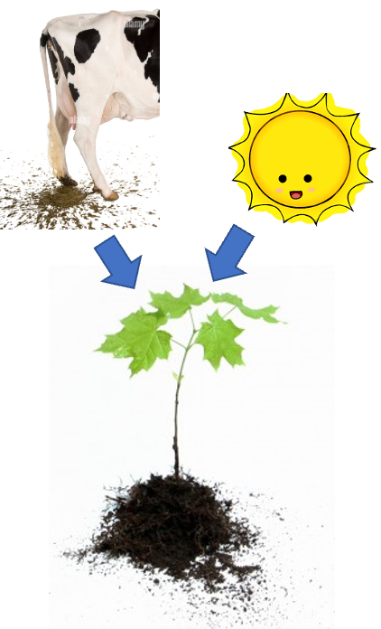{width="75%"}
:::
:::::

# Factorial Versus Nested Designs

::::: columns
::: {.column width="60%"}
-   Consider two factors: A and B
    -   Factorial/crossed: every level of B in every level of A

    -   Nested/hierarchical: levels of B occur only in 1 level of A

        -   both can be fixed - rare
        -   one fixed one random
        -   both random - rare in ecology common in genetics
:::

::: {.column width="40%"}
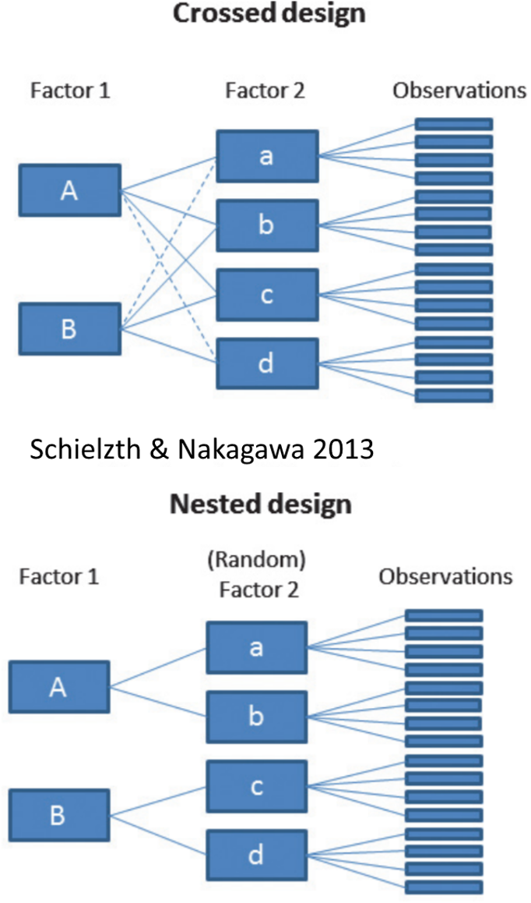{width="75%"}
:::
:::::

# Factorial Designs Overview

::::: columns
::: {.column width="40%"}
-   Factorial Designs:
    -   Both factors typically fixed (but not always)
:::

::: {.column width="60%"}
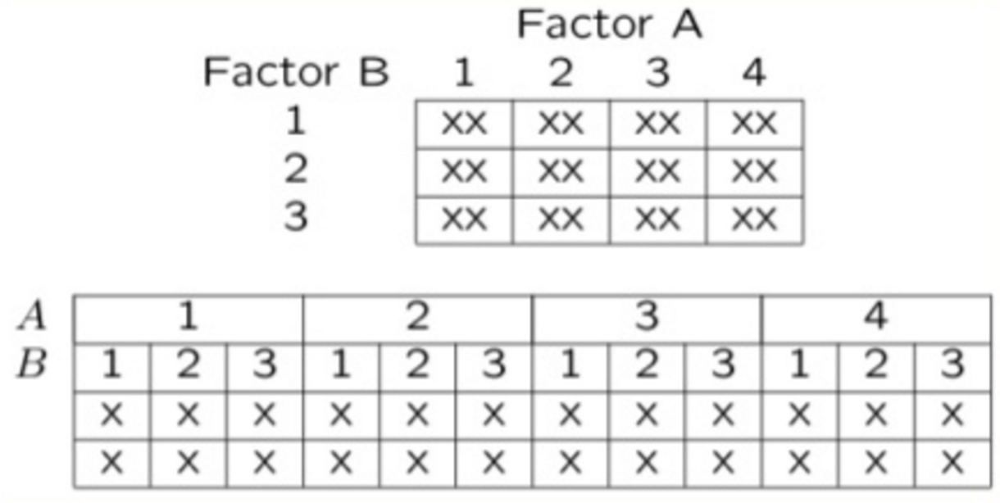{width="100%"}
:::
:::::

# Factorial Design Example: Seedling Growth

::::: columns
::: {.column width="40%"}
-   Effects of light level on growth of seedlings of different size:
    -   3 light levels (factor A)

    -   3 size classes (factor B)

    -   5 replicate seeding in each cell
:::

::: {.column width="60%"}
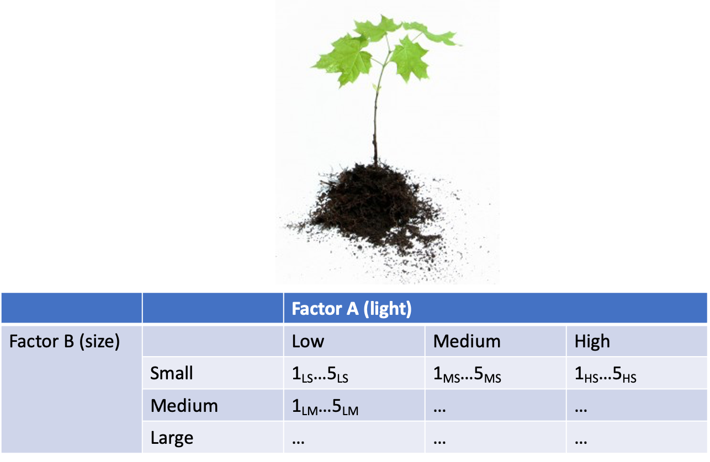{width="100%"}
:::
:::::

# Factorial Design Example: Salamander Growth

::::: columns
::: {.column width="40%"}
-   Effects of food level and tadpole presence on larval salamander
    growth
    -   2 food levels (factor A)

    -   presence/absence of tadpoles (factor B)

    -   8 replicates in each cell
:::

::: {.column width="60%"}
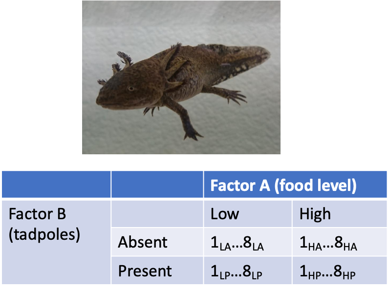{width="100%"}
:::
:::::

# Factorial Design Example: Limpet Fecundity

::::: columns
::: {.column width="40%"}
-   Effect of season and density on limpet fecundity.
    -   2 seasons (factor A)

    -   4 density treatments (factor B)

    -   3 replicates in each cell
:::

::: {.column width="60%"}
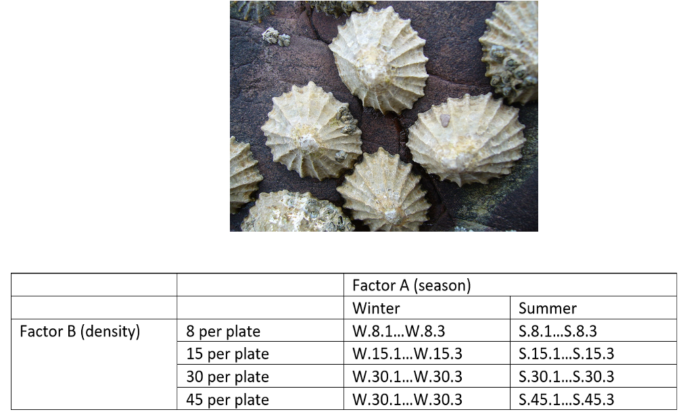{width="100%"}
:::
:::::

# Nested Designs Overview

::::: columns
::: {.column width="40%"}
-   Nested design examples
    -   Nested designs
    -   Linear model
    -   Analysis of variance
    -   Null hypotheses
    -   Unbalanced designs
    -   Assumptions
    -   mixed model ANOVA
-   Nested Designs:
    -   Factor A usually fixed
    -   Factor B usually random
:::

::: {.column width="60%"}
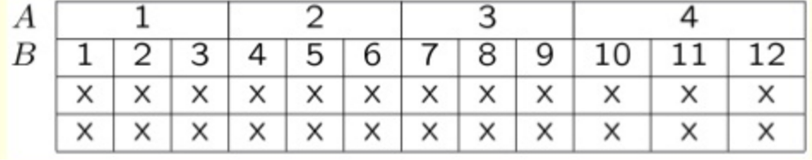{width="100%"}
:::
:::::

# Nested Design Example: Limpet Growth

::::: columns
::: {.column width="40%"}
-   Study on effects of enclosure size on limpet growth:
    -   2 enclosure sizes (factor A)

    -   5 replicate enclosures (factor B)

    -   5 replicate limpets per enclosure
:::

::: {.column width="60%"}
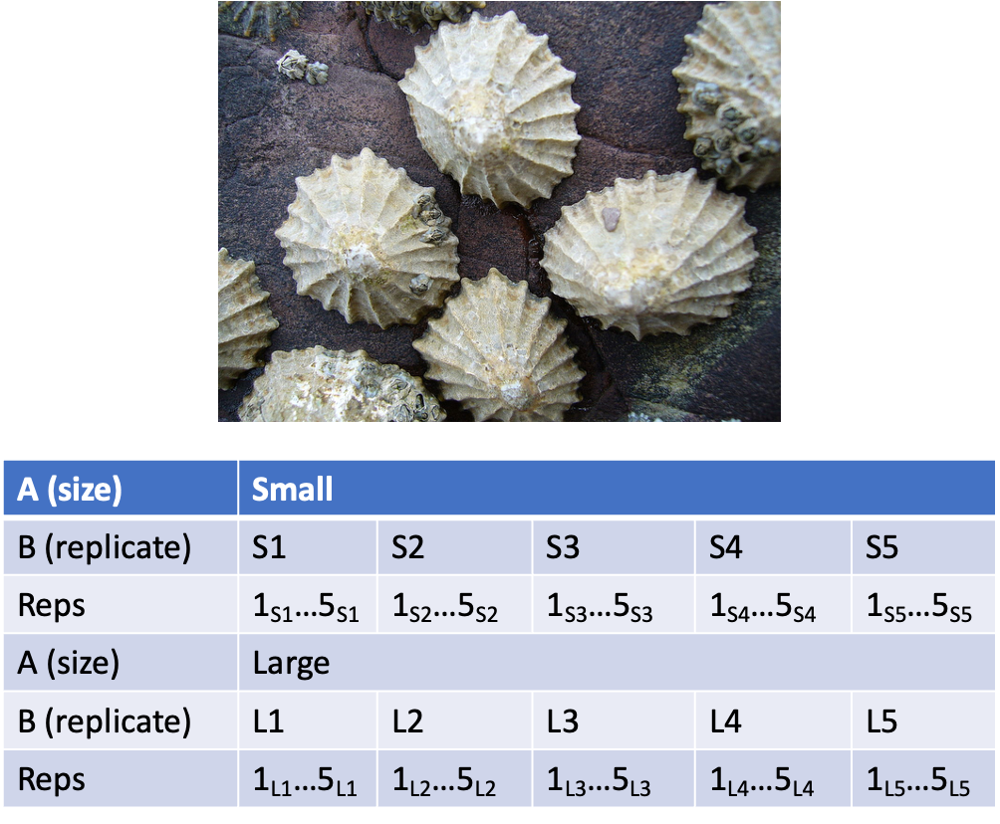{width="100%"}
:::
:::::

# Nested Design Example: Reef Fish

::::: columns
::: {.column width="40%"}
-   Study on reef fish recruitment:
    -   5 sites (factor A)

    -   6 transects at each site (factor B)

    -   replicate observations along each transect
:::

::: {.column width="60%"}
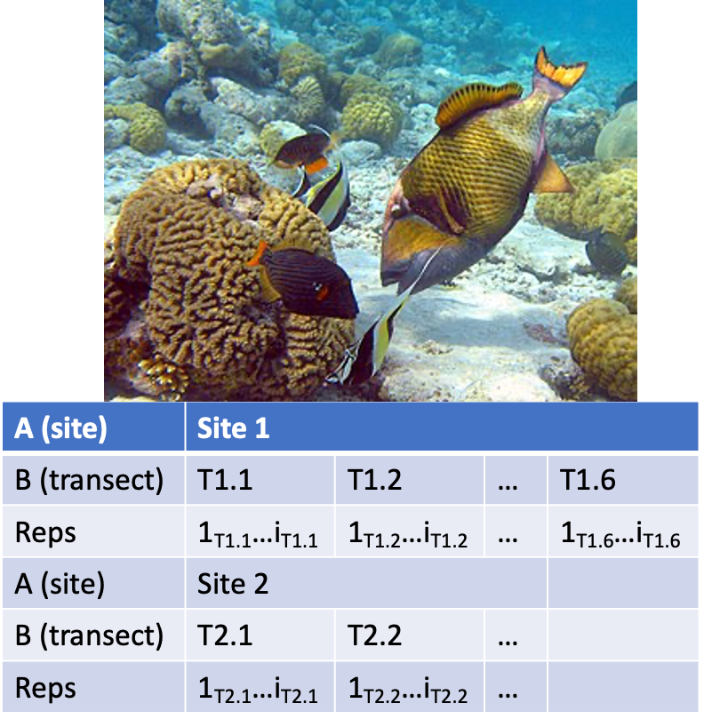{width="100%"}
:::
:::::

# Nested Design Example: Sea Urchin Grazing

::::: columns
::: {.column width="40%"}
Effects of sea urchin grazing on biomass of filamentous algae:

-   4 levels of urchin grazing: none, L, M, H
-   4 patches of rocky bottom (3-4 m2) nested in each level of grazing
-   5 replicate quadrats per patch
:::

::: {.column width="60%"}
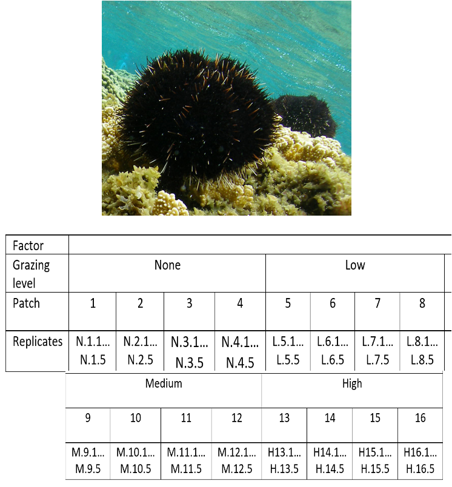{width="100%"}
:::
:::::

# Nested Design: Linear Model Structure

::::: columns
::: {.column width="40%"}
-   Consider a nested design with:
    -   p levels of factor A (i= 1…p) (e.g., 4 grazing levels)

    -   q levels of factor B (j= 1…q), nested within each level of A
        (e.g., 4 - diff. patches per grazing level)

    -   n replicates (k= 1…n) in each combination of A and B (5
        replicate - quadrats in each patch in each grazing level)
:::

::: {.column width="60%"}
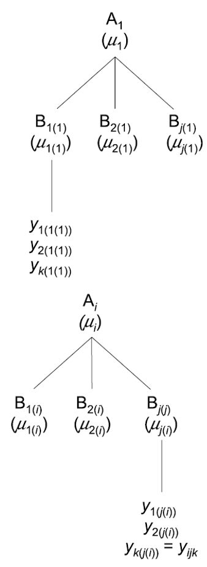{height="100%%"}
:::
:::::

# Calculating Means in Nested Design

::::: columns
::: {.column width="40%"}
-   Can calculate several means:
    -   overall mean (across all levels of A and B)= ȳ;
    -   a mean for each level of A (across all levels of B in that A)=
        ȳi;
    -   a mean for each level of B within each A= ȳj(i)
:::

::: {.column width="60%"}
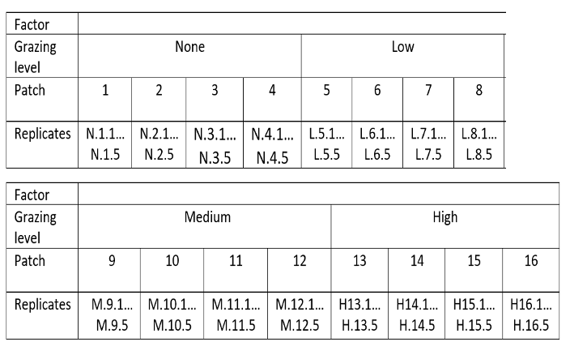{width="100%"}
:::
:::::

# Nested Design Means Visualization

::: {.panel column="screen"}
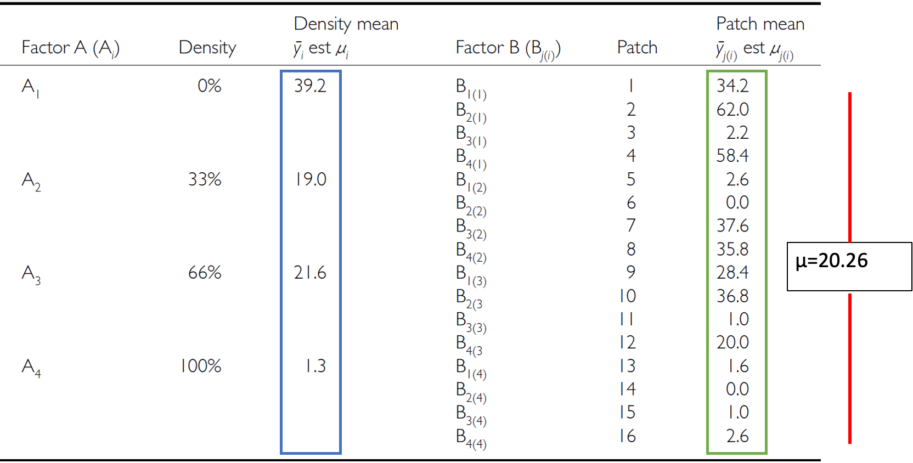{width="100%"}
:::

# Nested Design Linear Model

The linear model for a nested design is:

### $$y_{ijk} = \mu + \alpha_i + \beta_{j(i)} + \varepsilon_{ijk}$$

-   Where:
    -   $y_{ijk}$ is the response variable
        -   value of the k-th replicate in j-th level of B in the i-th
            level of A
        -   (algal biomass in 3rd quadrat, in 2nd patch in low grazing
            treatment)
    -   $\mu$ is the overall mean
        -   (overall average algal biomass)

# Fixed Effects in Nested Model

The linear model for a nested design is:

### $$y_{ijk} = \mu + \alpha_i + \beta_{j(i)} + \varepsilon_{ijk}$$

-   $\alpha_i$ is the fixed effect of factor $i$
-   (difference between average biomass in all low grazing level
    quadrats and overall mean)
-   $\beta_{j(i)}$ is the random effect of factor $j$ nested within
    factor $i$
-   usually random variable, measuring variance among all possible
    levels of B within each level of A
-   (variance among all possible patches that may have been used in the
    low grazing treatment)

# Error Term in Nested Model

### The linear model for a nested design is:

### $y_{ijk} = \mu + \alpha_i + \beta_{j(i)} + \varepsilon_{ijk}$

-   where:
    -   $\varepsilon_{ijk}$ is the error term
    -   αi: is the effect of the ith level of A: µi- µ
    -   unexplained variance associated with the kth replicate in jth
        level of B in the ith level of A
    -   (difference bw observed algal biomass in 3rd quadrat in 2nd
        patch in low grazing treatment and predicted biomass - average
        biomass in 2nd patch in low grazing treatment)

# Analysis of Variance: Residual and Total

::::: columns
::: {.column width="40%"}
-   SSresid is difference bw each observation and mean for its level of
    factor B, summed over all observations
-   SStotal = SSA + SSB + SSresid
-   SS can be turned into MS by dividing by appropriate df
:::

::: {.column width="60%"}
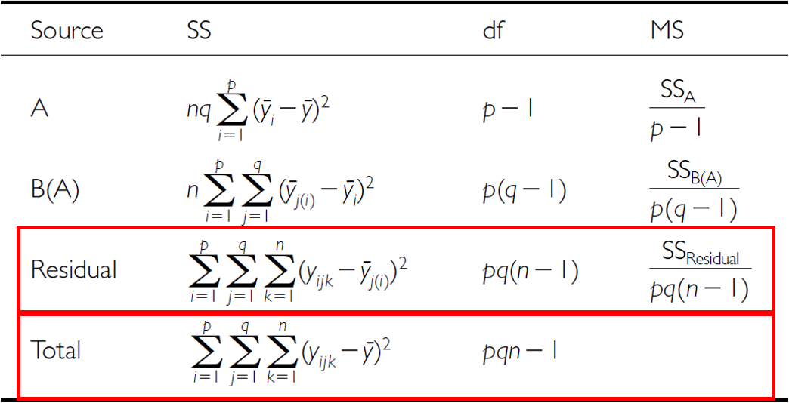{width="100%"}
:::
:::::

# Analysis of Variance: SSA

::::: columns
::: {.column width="40%"}
As before, partition the variance in the response variable using SS SSA
is SS of differences between means in each level of A and overall mean
:::

::: {.column width="60%"}
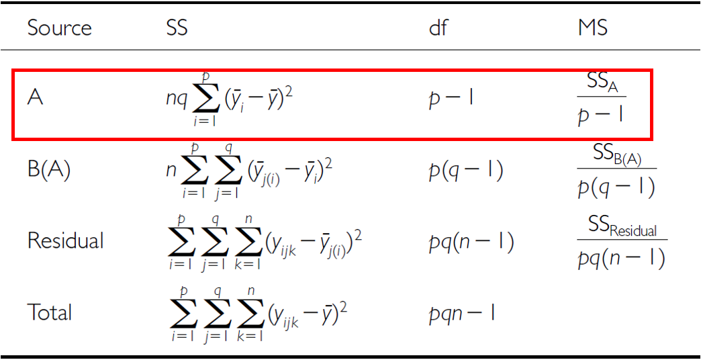{width="100%"}
:::
:::::

# Analysis of Variance: SSB

::::: columns
::: {.column width="40%"}
SSB is SS of difference between means in each level of B and the mean of
corresponding level of A summed across levels of A
:::

::: {.column width="60%"}
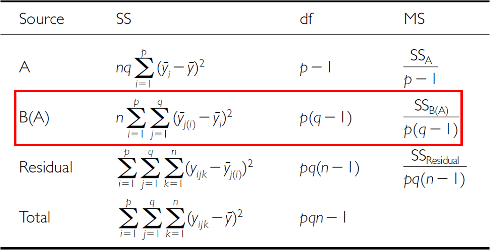{width="100%"}
:::
:::::

# Analysis of Variance Table

::: {.panel column="screen"}
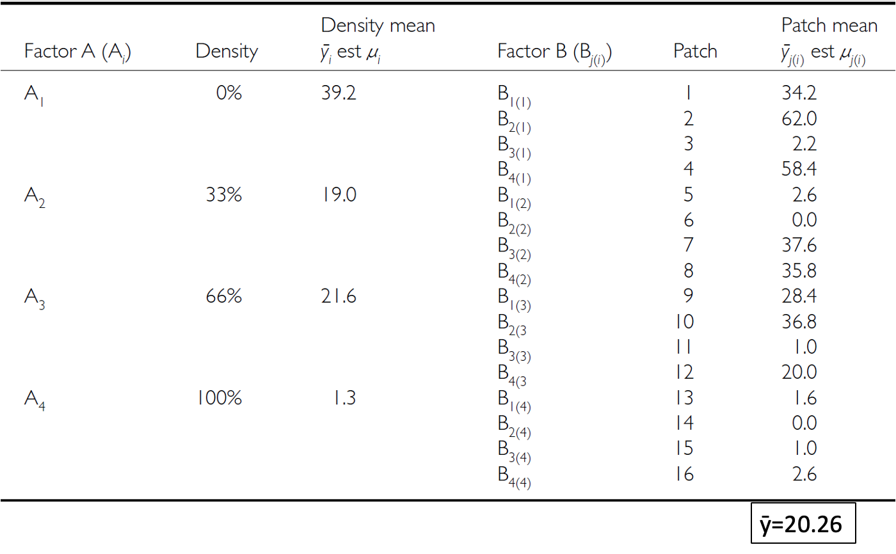{width="100%"}
:::

# Null Hypotheses: Factor A

::::: columns
::: {.column width="40%"}
Two hypotheses tested on values of MS:

1.  no effects of factor A

-   Assuming A is fixed:
-   Ho(A): µ1= µ2= µ3=…. µi= µ
-   Same as in 1-factor ANOVA, using means from B factors nested within
    each - level of A
-   (no difference in algal biomass across all levels of grazing:
    µnone= - µlow= µmed= µhigh)
:::

::: {.column width="60%"}
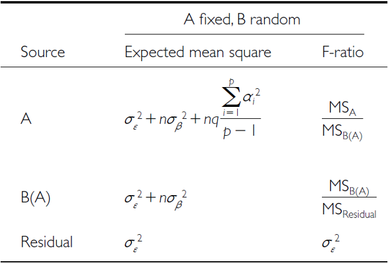{width="100%"}
:::
:::::

# Null Hypotheses: Factor B

::::: columns
::: {.column width="40%"}
Two hypotheses tested on values of MS:

2.  No effects of factor B nested in A

-   Assuming B is random:
-   Ho(B): σβ2= 0 (no variance added due to differences between all
    possible - levels of B)
-   (no variance added due to differences between patches)
:::

::: {.column width="60%"}
{width="100%"}
:::
:::::

# Conclusions from Analysis

::::: columns
::: {.column width="40%"}
**Conclusions?**

"significant variation between replicate patches within each treatment,
but no significant difference in amount of filamentous algae between
treatments"
:::

::: {.column width="60%"}
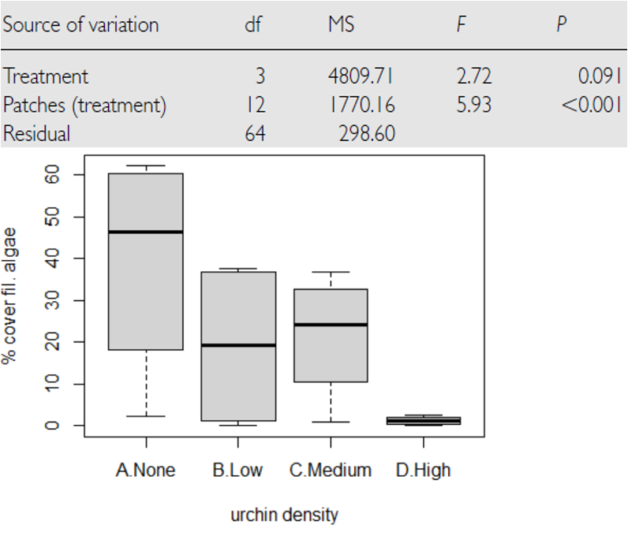{width="100%"}
:::
:::::

# Unbalanced Nested Designs

::::: columns
::: {.column width="40%"}
Unequal sample sizes can be because of:

-   uneven number of B levels within each A
-   uneven number of replicates within each level of B

Not a problem, unless have unequal variance or large deviation from -
normality
:::

::: {.column width="60%"}

:::
:::::

# Nested Design Assumptions

-   As usual, we assume
    -   equal variance
    -   normality
    -   no outliers
    -   independence of observations
-   Equal variance + normality need to be assessed at both levels:
    -   Since means for each level of B within each A are used for the
        H-test about A, need to assess whether those means meet
        normality and equal variance
    -   Examine residuals for H-test about B
    -   Transformations can be used

# Lecture 13: The nested design the hard way

This analysis examines the effects of varying sea urchin densities on
the percentage cover of filamentous algae. The experiment was designed
with:

-   four random patches
-   four urchin density treatments (
    -   none = removed
    -   low = control
    -   medium = 33% of original density
    -   high = 66% of original density)
-   Five replicate quadrats were measured within each treatment-patch
    combination.

# Lecture 13: Data Overview

::::: columns
::: {.column width="50%"}
-   The dataframe contains the following variables:

    -   patch: Random patches (1-16) where treatments were applied
    -   treat: Urchin density treatment (None/Removed, Low/Control,
        Medium/33% Density, High/66% Density)
    -   quad: Replicate quadrats within each treatment-patch combination
    -   algae: Percentage cover of filamentous algae (response variable)

-   Read data and make factors
:::

::: {.column width="50%"}
```{r read_file}
#| echo: false
#| message: false
#| warning: false
#| paged-print: false
#| collapse: true


# Load and prepare data
u_df <- read_csv("data/andrew.csv") %>% clean_names()

# Convert treat to factor with meaningful labels and order them correctly
u_df <- u_df %>% 
  mutate(treat = case_when(
         treat == "removal" ~ "none"   ,
         treat == "control" ~ "high"    ,
         treat == "dens_33" ~ "low" ,
         treat == "dens_66" ~ "medium"  , 
         TRUE ~ "other")) %>% 
  mutate(treat = factor(treat, 
                        levels = c("none", "low", "medium", "high"),
                        labels = c("none", "low", "medium", "high")),
         patch = as_factor(patch))

cat("Data\n\n")
head(u_df)
cat("\n\nTreatment levels:\n\n")
levels(u_df$treat)
```

## Summary statistics

```{r summary_stats}
#| echo: false
#| message: false
#| warning: false
#| paged-print: false
#| collapse: true
#| 
# Summary statistics
u_summary <- u_df %>%
  group_by(treat) %>%
  summarise(
    n = n(),
    mean = mean(algae),
    sd = sd(algae),
    se = sd / sqrt(n),
    min = min(algae),
    max = max(algae)
  )

cat("Summary statistics by treatment:\n\n")
u_summary
```
:::
:::::

# Plots

::: {.panel column="screen"}
```{r}
u_df %>% ggplot(aes(treat, algae)) +
  stat_summary(aes(treat, algae),fun = "mean", geom="point", size = 3) +
  geom_point(aes(color=as.factor(patch)), position = position_dodge2(width=0.3))
```
:::

# Manual nested ANOVA

::::: columns
::: {.column width="60%"}
-   In this experimental design,
    -   patch is nested within treat because each patch received only
        one treatment level.
    -   a hierarchical design where the effect of patches must be
        considered within each treatment.
    -   in Quinn & Keough (2002)
-   we'll use a traditional nested ANOVA
    -   you could make this easy and take the averages of the response
        variable algae
    -   do a one way anova
        -   your power is significantly reduced
        -   you don't get estimates of variability of patches
-   This is really a regular factorial anova
    -   really not appropriate as it is pseudoreplicated
    -   also the F value for Treat is using the MSresid
    -   should use MStreat:patch
:::

::: {.column width="40%"}
```{r nested_fact_model}
#| echo: TRUE
#| message: false
#| warning: false
#| paged-print: false
#| collapse: true

# Full model for patch effect and residual - proper nesting notation
# First, get the standard ANOVA table to extract MS values
u_fact_model <- aov(algae ~ treat + treat:patch, data = u_df)

cat("Factorial model summary:\n\n")
summary(u_fact_model)
```
:::
:::::

# The factorial anova is not correct

::::: columns
::: {.column width="40%"}
-   We can correct this by specifying the error term
-   The MS needed for the F value is really MS patch nested in
    treatments as those are the replicates
-   we can specify that
    -   problem is that we can't really handle unbalanced designs.
:::

::: {.column width="60%"}
```{r nested_model}
#| echo: TRUE
#| message: false
#| warning: false
#| paged-print: false
#| collapse: true
# Explicitly specify the nesting
# This will give you the correct F-test using patch within treat as error term
u_nested_model <- aov(algae ~ treat + Error(treat:patch), data = u_df)

cat("Correctly specified nested ANOVA:\n\n")
summary(u_nested_model)
```
:::
:::::

# What to do if it is unbalanced design

::::: columns
::: {.column width="50%"}
And you are from the 80's and had big hair

{width="311"}

**Bon Jovi**

{width="323"}

David Bowie
:::

::: {.column width="50%"}
```{r afex_model}
#| echo: TRUE
#| message: false
#| warning: false
#| paged-print: false
#| collapse: true
#| 
# Using afex package (recommended for unbalanced designs)
# The afex package is specifically designed for ANOVA with 
# Type III SS and handles nested designs pretty well:

options(contrasts = c("contr.sum", "contr.poly"))

# This works and gives you the correct answer
u_afex_model <- aov_car(algae ~ treat + Error(patch), 
                     data = u_df,
                     fun_aggregate = mean)

cat("AFEX nested ANOVA results:\n\n")
summary(u_afex_model)
```
:::
:::::

# The modern way - mixed model ANOVA

::::: columns
::: {.column width="50%"}
-   Fit the model with treatment as fixed effect and patch nested within
    treatment as random lmer(algae \~ treat + (1\|treat:patch), data =
    u_df, control = lmerControl(optimizer = "bobyqa", optCtrl =
    list(maxfun = 2e5)))

-   BOBYQA (Bound Optimization BY Quadratic Approximation)

    -   optimization algorithm in mixed-effects modeling to find the
        best parameter values maximizing the likelihood function
    -   Useful when fitting complex models like the ones you're working
        with in your nested ANOVA analysis

-   Notation we will get into later

    -   random intercept - fixed slope - (1\|patch)
    -   random intercept - random slope - (1\|treat:patch)
:::

::: {.column width="50%"}
```{r mixed_model}
#| echo: TRUE
#| message: false
#| warning: false
#| paged-print: false
#| collapse: true
# Fit the model with treatment as fixed effect and patch nested within treatment as random
u_lmer_model <- lmer(algae ~ treat + (1|treat:patch), data = u_df,
                    control = lmerControl(optimizer = "bobyqa",
                                         optCtrl = list(maxfun = 2e5)))

# BOBYQA (Bound Optimization BY Quadratic Approximation) is an optimization algorithm used in mixed-effects modeling to find the best parameter values that maximize the likelihood function. It's especially useful when fitting complex models like the ones you're working with in your nested ANOVA analysis.

cat("Mixed model summary:\n\n")
summary(u_lmer_model)
```
:::
:::::

# The modern way - mixed model ANOVA

::::: columns
::: {.column width="50%"}
-   METHOD 1 - the F-distribution with estimated degrees of freedom
    -   Accounts for the uncertainty in variance component estimation
    -   More conservative (higher p-values)
    -   Better for small samples
:::

::: {.column width="50%"}
```{r mixed_anova_chi}
#| echo: TRUE
#| message: false
#| warning: false
#| paged-print: false
#| collapse: true
# Type III ANOVA with F-statistics (not chi-square) using Satterthwaite's method
u_anova_result <- Anova(u_lmer_model, type = 3, ddf = "Satterthwaite",
                       test.statistic = "F")

cat("Type III ANOVA with F test:\n\n")
u_anova_result
```
:::
:::::

# The modern way - mixed model ANOVA

::::: columns
::: {.column width="50%"}
-   METHOD 2 - the Chi Square
    -   Assumes variance components are known (not estimated)
    -   More liberal (lower p-values)
    -   Assumes large samples
-   Why Different Results?
    -   relationship between these tests is:
    -   Chi-square = F × numerator df
-   The p-values differ because:
    -   F-test accounts for denominator df (12 in your case) - reflects
        sample size
    -   Chi-square assumes infinite denominator df - assumes large
        samples
-   **Rule of Thumb**
-   under 100 observations or \< 20 random effect levels: Use F-test
-   over 500 observations and \> 50 random effect levels: Chi-square is
    okay
-   In between: F-test is safer
:::

::: {.column width="50%"}
```{r mixed_anova_f}
#| echo: TRUE
#| message: false
#| warning: false
#| paged-print: false
#| collapse: true
# Alternative using car package with F-statistic
u_anova_f <- Anova(u_lmer_model, type = 3, test.statistic = "Chisq")

cat("Type III ANOVA with F test:\n\n")
u_anova_f
```
:::
:::::

# The modern way - mixed model ANOVA

::::: columns
::: {.column width="50%"}
The nested ANOVA model is specified as:

$algae_{ijk} = \mu + \alpha_i + \beta_{j(i)} + \epsilon_{ijk}$

Where:

-   $\mu$ is the overall mean\
-   $\alpha_i$ is the fixed effect of treatment $i$\
-   $\beta_{j(i)}$ is the random effect of patch $j$ nested within
    treatment $i$\
-   $\epsilon_{ijk}$ is the residual error for quadrat $k$ in patch $j$
    within treatment $i$
:::

::: {.column width="50%"}
```{r anova_results}
#| echo: false
#| message: false
#| warning: false
#| paged-print: false
#| collapse: true
cat("Final ANOVA results:\n\n")
u_anova_result 
```
:::
:::::

# Lecture 13: Variance Components

::: {.callout-important appearance="simple"}
Interpretation of ANOVA Results The nested ANOVA reveals that there was
no significant effect of urchin density treatment on algae cover (χ² =
8.1513, df = 3, p = 0.04306). The variance component for patches nested
within treatments (294.3) indicates substantial spatial heterogeneity in
algae cover, highlighting the importance of accounting for this spatial
variation in the analysis.
:::

# Lecture 13: Post-hoc Comparisons

Although the main effect of treatment was marginally significant in the
nested ANOVA (p = 0.04306), we can examine the mean differences between
treatments to understand patterns in the data.

::: {.panel column="screen"}
```{r emmeans}
#| echo: true
#| message: false
#| warning: false
#| paged-print: false
#| collapse: true

# Calculate estimated marginal means
u_emm <- emmeans(u_lmer_model, ~ treat)

cat("Estimated marginal means:\n\n")
u_emm
```
:::

# Lecture 13: Tukey Pairwise Comparisons

::: {.panel column="screen"}
```{r pairwise}
# Pairwise comparisons with Sidak adjustment
u_pairs <- pairs(u_emm, adjust = "sidak")

cat("Pairwise comparisons (Sidak adjusted):\n\n")
u_pairs
```
:::

# Lecture 13: Letter Display

::: {.panel column="screen"}
```{r cld}
# Extract compact letter display for plotting
u_cld <- multcomp::cld(u_emm, alpha = 0.05, Letters = letters)

cat("Compact letter display:\n\n")
u_cld
```
:::

::: {.callout-important appearance="simple"}
Interpretation of Treatment Comparisons The mean algae cover shows a
clear pattern with increasing urchin density: None/Removed (39.20%) \>
Medium/33% Density (19.00%) \> High/66% Density (21.55%) \> Low/Control
(1.30%). The pattern suggests an inverse relationship between urchin
density and algae cover, with complete removal showing the highest algae
cover. The high variability among patches within treatments contributed
to the marginal statistical significance for the treatment effect.
:::

# Lecture 13: ANOVA Assumptions Testing

-   For valid inference from ANOVA, several assumptions must be met. We
    test these assumptions below.
-   Base R approach
-   Note that it does not work that well

::: {.panel column="screen"}
```{r diagnostic_plots}
#| echo: false
#| message: false
#| warning: false
#| paged-print: false


# Use the mixed model for both fitted values and residuals
u_fitted <- fitted(u_lmer_model)
u_residuals <- residuals(u_lmer_model)

# QQ plot
u_qq_plot <- ggplot(data.frame(residuals = u_residuals), aes(sample = residuals)) +
  stat_qq() +
  stat_qq_line() +
  labs(title = "Normal Q-Q Plot of Residuals",
       x = "Theoretical Quantiles",
       y = "Sample Quantiles")

# Histogram of Residuals
u_hist_plot <- ggplot(data.frame(residuals = u_residuals), aes(x = residuals)) +
  geom_histogram(bins = 15, fill = "lightblue", color = "black") +
  labs(title = "Histogram of Residuals",
       x = "Residuals",
       y = "Frequency")

u_resid_plot <- ggplot(data.frame(fitted = u_fitted, residuals = u_residuals), 
                    aes(x = fitted, y = residuals)) +
  geom_point() +
  geom_hline(yintercept = 0, linetype = "dashed", color = "red") +
  labs(title = "Residuals vs. Fitted Values",
       x = "Fitted Values",
       y = "Residuals")

# Combine plots
u_qq_plot + u_hist_plot + u_resid_plot
```
:::

# Lecture 13: Levenes Test for Homogeneity of Variance

::::: columns
::: {.column width="50%"}
Levenes test

```{r levene}
# Homogeneity of Variance
# Levene's test for homogeneity of variance
u_levene <- leveneTest(algae ~ treat, data = u_df)

cat("Levene's test for homogeneity of variance:\n\n")
u_levene
```
:::

::: {.column width="50%"}
Interpretation of Assumption Tests The Q-Q plot shows some deviation
from normality, particularly in the tails, and Levene's test indicates
significant heterogeneity of variances across treatments (p =
0.00008785). As noted by Quinn & Keough (2002), there were "large
differences in within-cell variances" in this dataset, and
transformations (including arcsin) did not improve variance homogeneity.
However, ANOVA is generally robust to heteroscedasticity with balanced
designs, which is why they chose to analyze untransformed data. The
Residuals vs. fitted plot also shows a pattern of increasing variance
with increasing fitted values, confirming the heteroscedasticity.
:::
:::::

# Lecture 13: Visualization

::: {.panel column="screen"}
```{r boxplot}
#| echo: false
#| message: false
#| warning: false
#| paged-print: false


# Create boxplot
u_boxplot <- ggplot(u_df, aes(x = treat, y = algae, fill = treat)) +
  geom_boxplot(alpha = 0.7, outlier.shape = NA) +
  geom_jitter(width = 0.2, alpha = 0.4, size = 1) +
  scale_fill_viridis_d(option = "D", end = 0.85) +
  labs(title = "Algae Cover by Urchin Density Treatment",
       x = "Treatment",
       y = "Algae Cover (%)")

u_boxplot
```
:::

# Lecture 13: Means Plot

::: {.panel column="screen"}
```{r means_plot}
#| echo: false
#| message: false
#| warning: false
#| paged-print: false


# Create means plot
u_means_plot <- ggplot(u_summary, aes(x = treat, y = mean, group = 1)) +
  geom_point(size = 3, shape = 21, fill = "white") +
  geom_errorbar(aes(ymin = mean - se, ymax = mean + se), width = 0.2) +
  labs(title = "Mean Algae Cover by Treatment",
       x = "Treatment", 
       y = "Mean Algae Cover (%)") 

u_means_plot
```
:::

# Lecture 13: Discussion

::: {.callout-important appearance="simple"}
Scientific Interpretation Our nested ANOVA analysis revealed substantial
spatial heterogeneity in algae cover, with significant variation among
patches within each treatment. The effect of urchin density treatments
on filamentous algae cover was marginally significant at the α = 0.05
level (p = 0.043). The descriptive statistics show a clear pattern where
algae cover increases as urchin density decreases, with None/Removed
showing the highest cover (39.20%), followed by Medium/33% Density
(19.00%), High/66% Density (21.55%), and Low/Control showing minimal
algae cover (1.30%). This pattern demonstrates a density-dependent
relationship between urchin grazing and algal abundance. The substantial
variance component associated with patches nested within treatments
(294.31, approximately 39.5% of total variance) underscores the
importance of spatial heterogeneity in structuring algal communities.
This finding highlights the necessity of accounting for spatial
variability when designing and analyzing ecological field experiments.
From an ecological perspective, these results suggest that sea urchins
significantly influence algal communities through grazing, though local
environmental factors and patch-specific conditions also play an
important role in determining algae cover. This has important
implications for ecosystem management, as it indicates that the effects
of urchin density manipulations are context-dependent and influenced by
local environmental conditions.
:::

# We can do this manually

::::: columns
::: {.column width="50%"}
But UGGGG who would EVER do this

```{r manual_nested}
#| echo: true
#| message: false
#| warning: false
#| paged-print: false
#| 

# Method 1: Convert to dataframe with Source as a proper variable
u_man_model <- aov(algae ~ treat + treat:patch, data = u_df)
u_anova_summary <- summary(u_man_model)[[1]]

cat("Standard ANOVA table:\n\n")
u_anova_summary
```

```{r extract_values}
#| echo: true
#| message: false
#| warning: false
#| paged-print: false
#| 
# Extract values by position (much simpler!)
# Row 1 = treat, Row 2 = treat:patch, Row 3 = Residuals
u_MS_treat <- u_anova_summary[1, "Mean Sq"]      # Row 1, Mean Sq column
u_MS_patch <- u_anova_summary[2, "Mean Sq"]      # Row 2, Mean Sq column  
u_MS_residual <- u_anova_summary[3, "Mean Sq"]   # Row 3, Mean Sq column

u_df_treat <- u_anova_summary[1, "Df"]
u_df_patch <- u_anova_summary[2, "Df"] 
u_df_residual <- u_anova_summary[3, "Df"]

cat("Extracted mean squares:\n\n")
cat("MS Treatment:", u_MS_treat, "\n")
cat("MS Patch(Treatment):", u_MS_patch, "\n")
cat("MS Residual:", u_MS_residual, "\n\n")
```
:::

::: {.column width="50%"}
```{r calculate_f}
#| echo: true
#| message: false
#| warning: false
#| paged-print: false
#| 
# Calculate CORRECT F-ratios for nested design
u_F_treat_correct <- u_MS_treat / u_MS_patch        # Treatment tested against patches
u_F_patch <- u_MS_patch / u_MS_residual             # Patches tested against residual

cat("Corrected F-ratios:\n\n")
cat("F Treatment:", u_F_treat_correct, "\n")
cat("F Patch(Treatment):", u_F_patch, "\n\n")
```

```{r calculate_p}
#| echo: true
#| message: false
#| warning: false
#| paged-print: false
#| 
# Calculate correct p-values
u_p_treat_correct <- pf(u_F_treat_correct, u_df_treat, u_df_patch, lower.tail = FALSE)
u_p_patch <- pf(u_F_patch, u_df_patch, u_df_residual, lower.tail = FALSE)

cat("Corrected p-values:\n\n")
cat("p Treatment:", u_p_treat_correct, "\n")
cat("p Patch(Treatment):", u_p_patch, "\n\n")
```

```{r manual_table}
#| echo: true
#| message: false
#| warning: false
#| paged-print: false
#| 
# Create simple corrected table
u_corrected_table <- data.frame(
  Source = c("Treatment", "Patches(Treatment)", "Residual"),
  Df = c(u_df_treat, u_df_patch, u_df_residual),
  MS = round(c(u_MS_treat, u_MS_patch, u_MS_residual), 1),
  F = c(round(u_F_treat_correct, 2), round(u_F_patch, 2), NA),
  p = c(ifelse(u_p_treat_correct < 0.001, "<0.001", round(u_p_treat_correct, 3)),
        ifelse(u_p_patch < 0.001, "<0.001", round(u_p_patch, 3)), 
        NA)
)

cat("Corrected ANOVA table:\n\n")
u_corrected_table
```
:::
:::::
