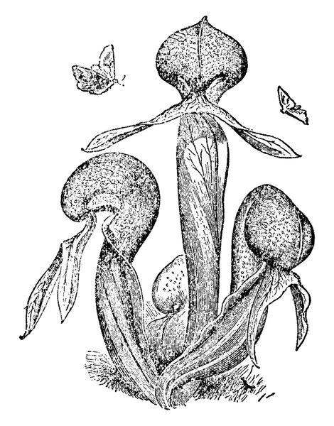
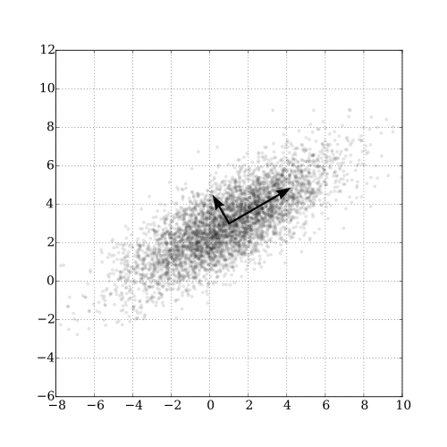

```{r setup}
#| include: false
#| message: false
#| warning: false
# devtools::install_github("pmartinezarbizu/pairwiseAdonis/pairwiseAdonis")
library(pairwiseAdonis)
library(psych)
library(RColorBrewer)
library(vegan)
library(ggfortify)
library(emmeans)
library(corrplot)
library(FactoMineR)
library(factoextra)
library(ggrepel)
library(patchwork)
library(tidyverse)

# Set theme for all plots
theme_set(theme_minimal(base_size = 12))
```

# Introduction to Multivariate Analysis

::::: columns
::: {.column width="60%"}
### Why Study Multivariate Data?

-   In ecology, often measure many variables on the same organisms:
    -   **Plant morphology**: height, width, leaf size, flower size
    -   **Environmental conditions**: temperature, pH, nutrients
    -   **Species composition**: presence/absence, abundance
-   **Challenge**: How do we make sense of all these variables at once?
-   **PCA helps by**:
    -   Reducing many correlated variables to a few key dimensions
    -   Visualizing patterns in high-dimensional data
    -   Identifying the most important sources of variation
:::

::: {.column width="40%"}
Darlingtonia californica (Cobra Lily)

{width="335"}
:::
:::::

# Our Study System: Darlingtonia

::::: columns
::: {.column width="60%"}
### The Cobra Lily Dataset

-   Analyze morphological measurements from 89 individual *Darlingtonia
    californica* plants collected from **4 sites** in the Siskiyou
    Mountains of Oregon.
-   **Variables measured** (10 total):
    -   **Morphological measurements (mm)**:
        -   height - Height of pitcher
        -   mouth_diam - Mouth diameter
        -   tube_diam - Tube diameter
        -   keel_diam - Keel diameter
        -   wing1_length, wing2_length
        -   Wing lengths (2 measurements)
        -   wingsprea - Wing spread
    -   **Biomass measurements (g)**:
        -   hoodmass_g - Hood mass

        -   tubemass_g - Tube mass

        -   wingmass_g - Wing mass
:::

::: {.column width="40%"}
```         
![Darlingtonia pitcher structure showing measured features\]
```

{width="211"}

-   \*\*Sites\*\*:
-   TJH: T.J. Howell's Fen
-   DG: Day's Gulch
-   LEH: L.E. Hunter's Fen
-   HD: High Divide
:::
:::::

# Loading the Data

### Step 1: Import and Prepare the Data

::: panel
```{r load_data}
#| echo: true
#| message: false
#| warning: false
#| paged-print: false

# Load the data
darlingtonia <- read_csv("darlingtonia.csv")

# View the structure
head(darlingtonia)

darlingtonia %>%
  count(site, name = "n_plants")
```
:::

# Exploring the Raw Data

::::: columns
::: {.column width="60%"}
## Initial Data Exploration

Before any analysis, we should **always look at our data**:

-   Check for outliers
-   Examine distributions
-   Look for patterns by site
-   Understand variable scales

**Key observations**:

-   Variables measured in different units (mm vs. g)
-   Different ranges: height (hundreds) vs. biomass (fractions)
-   Need to standardize before PCA!
:::

::: {.column width="40%"}
```{r explore_data}
#| echo: false
#| fig-width: 8
#| fig-height: 8

# Create long format for easier plotting
darl_long <- darlingtonia %>%
  pivot_longer(cols = -site,
               names_to = "variable",
               values_to = "value")

# Box plots by site
ggplot(darl_long, aes(x = site, y = value, fill = site)) +
  geom_boxplot() +
  facet_wrap(~variable, scales = "free_y", ncol = 2) +
  theme_minimal() +
  theme(legend.position = "none",
        axis.text.x = element_text(angle = 45, hjust = 1)) +
  labs(title = "Raw Data by Site",
       subtitle = "Notice the different scales!")
```
:::
:::::

# The Problem of Different Scales

::::: columns
::: {.column width="60%"}
### Why Standardization Matters

-   **Without standardization**:
    -   Variables with larger values (like height in mm) would dominate
        the analysis over variables with smaller values (like biomass in
        g).
-   **Example from data**:
    -   Height: mean ≈ 600 mm, range 322-845 mm -
    -   Wing mass: mean ≈ 0.16 g, range 0.02-5.00 g
-   calculated distances without standardizing, height would have 1000×
    more influence than wing mass!
-   **Solution: Z-score standardization**
    -   $Z = \frac{(Y_i - \bar{Y})}{s}$
-   transforms each variable to:
    -   Mean = 0
    -   Standard deviation = 1
    -   Units: "standard deviations from the mean"
:::

::: {.column width="40%"}
-   **Before standardization:** - Height dominates (larger scale)
-   **After standardization:**
    -   All variables contribute equally
    -   Measured in "standard deviations"

```{r standardization_demo}
#| echo: true
#| paged-print: false

# Example: standardize height
darlingtonia %>%
  summarize(
    mean_height = mean(height),
    sd_height = sd(height),
    mean_wingmass = mean(wingmass_g),
    sd_wingmass = sd(wingmass_g)
  )

# After standardization, both will have:
# mean = 0, sd = 1
```
:::
:::::

# Measuring Multivariate Distance

::::: columns
::: {.column width="60%"}
### Euclidean Distance Between Individuals

-   How different are two plants?
    -   For two plants measured on multiple variables, calculate
        **Euclidean distance**:
        -   **For 2 variables** (height and spread):

            -   $d_{i,j} = \sqrt{(y_{i,1} - y_{j,1})^2 + (y_{i,2} - y_{j,2})^2}$

        -   **For n variables**:

            -   $d_{i,j} = \sqrt{\sum_{k=1}^{n}(y_{i,k} - y_{j,k})^2}$

        -   Pythagorean theorem extended to many dimensions!

        -   **Key point**: Distance should use *standardized* values so
            all variables contribute equally
:::

::: {.column width="40%"}
```{r distance_example}
#| include: false

# Calculate distance between first two plants
# Using just height and mouth diameter (for simplicity)

plant1 <- darlingtonia[1, c("height", "mouth_diam")]
plant2 <- darlingtonia[2, c("height", "mouth_diam")]

# Euclidean distance (raw values)
distance_raw <- sqrt(sum((plant1 - plant2)^2))
cat("Distance between plants 1 and 2 (raw values):\n")
cat(round(distance_raw, 2), "mm\n")

# For standardized distance, we need to standardize 
# using the mean and SD of ALL plants
height_mean <- mean(darlingtonia$height)
height_sd <- sd(darlingtonia$height)
mouth_mean <- mean(darlingtonia$mouth_diam)
mouth_sd <- sd(darlingtonia$mouth_diam)

# Standardize each plant
plant1_std <- c((plant1$height - height_mean) / height_sd,
                (plant1$mouth_diam - mouth_mean) / mouth_sd)
plant2_std <- c((plant2$height - height_mean) / height_sd,
                (plant2$mouth_diam - mouth_mean) / mouth_sd)

# Calculate standardized distance
distance_std <- sqrt(sum((plant1_std - plant2_std)^2))

```

```{r}
#| echo: false
cat("\nDistance between plants 1 and 2 (standardized):\n",
  round(distance_std, 2), "standard deviations\n\n",
"\nNote: Standardization uses mean and SD from ALL plants,\n",
"not just these two plants!")
```
:::
:::::

# Standardizing the Data

::::: columns
::: {.column width="60%"}
### Step 2: Z-score Transformation

```{r standardize}
#| echo: false

# Select only numeric variables for PCA
darl_numeric <- darlingtonia %>%
  dplyr::select(-site)

# Standardize using scale()
# This centers (mean=0) and scales (sd=1) each variable
darl_scaled <- scale(darl_numeric)

darl_scaled_df  <- as.data.frame(darl_scaled)
# # Verify standardization
# colMeans(darl_scaled) %>% round(10)  # Should be ~0
# apply(darl_scaled, 2, sd) %>% round(10)  # Should be 1

darl_scaled_df %>%
  select(height, mouth_diam, wingmass_g) %>%
  pivot_longer(cols = c(height, mouth_diam, wingmass_g) , names_to = "variable", values_to = "value") %>%
  ggplot(aes(x = variable, y = value, fill  = variable)) +
  geom_boxplot() +
  labs(title = "Standardized Data (same scale)") +
  theme(legend.position = "none")

```
:::

::: {.column width="40%"}
### Visualizing Standardized Data

```{r scaled_comparison}
#| echo: false
#| fig-width: 5
#| fig-height: 6

# Compare raw vs standardized
darl_scaled_df <- as.data.frame(darl_scaled) %>%
  mutate(site = darlingtonia$site)

# Create comparison plots
p1 <- darlingtonia %>%
  select(site, height, mouth_diam) %>%
  pivot_longer(
    cols=c(height, mouth_diam),
    names_to = "variable", values_to = "value") %>%
  ggplot(aes(x = site, y = value, fill = site)) +
  geom_boxplot() +
  facet_grid(variable~., scales = "free_y") +
  labs(title = "Raw Data (different scales)") +
  theme(legend.position = "none")

p2 <- darl_scaled_df %>%
  select(site, height, mouth_diam) %>%
  pivot_longer(
    cols=c(height, mouth_diam),
    names_to = "variable", values_to = "value") %>%
  ggplot(aes(x = site, y = value, fill = site)) +
  geom_boxplot() +
  facet_grid(variable~., scales = "free_y") +
  labs(title = "Standardized Data (same scale)") +
  theme(legend.position = "none")

p1 + p2+ plot_layout(ncol = 1)
```
:::
:::::

# Understanding Correlations

::::: columns
::: {.column width="60%"}
### Why Correlations Matter for PCA

-   PCA works best when variables are **correlated**:
    -   If variables are uncorrelated → PCA provides no benefit
    -   If variables are highly correlated → PCA can reduce dimensions
        effectively
-   **In data**, expect correlations because:
    -   Larger plants have larger measurements overall
    -   Wing dimensions likely correlate with each other
    -   Mass measurements correlate with size measurements
-   **The correlation matrix** shows relationships between all pairs of
    variables.
-   Strong correlations (positive or negative) suggest PCA will be
    useful!
:::

::: {.column width="40%"}
**Strong positive correlations** (dark blue) suggest variables measure
similar aspects of plant size/shape.

```{r correlation_plot}
#| echo: false
#| fig-width: 6
#| fig-height: 6

# Calculate correlation matrix
cor_matrix <- cor(darl_numeric)

# Visualize with corrplot
corrplot(cor_matrix, 
         method = "color",
         type = "upper",
         order = "hclust",
         tl.col = "black",
         tl.cex = 0.7,
         addCoef.col = "black",
         number.cex = 0.6,
         title = "Correlation Matrix\n(Darlingtonia variables)",
         mar = c(0,0,2,0))
```
:::
:::::

# Correlation Matrix Details

### Examining Variable Relationships

::: panel
```{r correlation_values}
#| echo: false

# Calculate correlation matrix
cor_matrix <- cor(darl_numeric)

# Display rounded values
round(cor_matrix, 2)
```
:::

# Key Observations

::::: columns
::: {.column width="50%"}
-   **Highly correlated variables**:
    -   Height with tube area (r=0.89)
        -   Wing lengths with each other (r=0.80)
        -   Wing area with wing spread (r=0.81)
-   These correlations indicate **redundancy**
-   multiple variables measuring similar things.
:::

::: {.column width="50%"}
-   **Moderate correlations**:
    -   Most morphological variables
    -   Mass measurements with size
-   **Lower correlations**:
    -   Some specific features like keel diameter
-   **PCA will help** by combining correlated variables into fewer
    components!
:::
:::::

# What is Principal Component Analysis?

::::: columns
::: {.column width="60%"}
### The Concept of PCA

-   PCA creates new variables (components) that are:
    -   **Linear combinations** of original variables
    -   **Uncorrelated** with each other
    -   **Ordered by importance** (amount of variance explained)
-   **The mathematical idea**:
    -   For each plant *i* and component *k*:
    -   $Z_{ik} = a_{i1}Y_1 + a_{i2}Y_2 + ... + a_{in}Y_n$
-   Where:
    -   $Z_{ik}$ = score on principal component *k*
    -   $Y_j$ = standardized value of original variable *j*
    -   $a_{ij}$ = loading (weight) of variable *j* on component *i*
-   **Goal**: Find loadings that maximize variance in first component,
    then second, etc.
:::

::: {.column width="40%"}
{width="246"}\
Conceptual diagram of PCA: reducing 2 variables to 1 principal axis

-   **The first principal axis** passes through maximum variance.
-   **Key properties**: - As many components as variables - First
    components explain most variation - Later components explain
    residual variation
:::
:::::

# Principal Components: Properties

::::: columns
::: {.column width="50%"}
### Understanding Components are:

-   **1. Orthogonal (perpendicular)**
    -   Components are uncorrelated
    -   Each captures independent information
-   **2. Ordered by variance**
    -   PC1 explains the most variance
    -   PC2 explains second most (of remaining variance)
    -   And so on...
-   **3. Linear combinations**
    -   Each component is a weighted sum of original variables
    -   Weights (loadings) show variable importance
:::

::: {.column width="50%"}
### Why this matters:

-   **Dimension reduction**:
    -   Start with 10 correlated variables
    -   End with 2-3 uncorrelated components
    -   Retain most information with fewer dimensions
-   **Easier interpretation**:
    -   PC1 might represent "overall size"
    -   PC2 might represent "shape"
    -   Components often have biological meaning
-   **Better for analysis**:
    -   Can use in regression, ANOVA
    -   No multicollinearity problems
    -   Variables are standardized
:::
:::::

# Performing PCA in R

### Step 3: Run the Analysis

::: panel
```{r run_pca}
#| echo: true

# Perform PCA using prcomp()
# center = TRUE: center variables (mean = 0)
# scale. = TRUE: scale variables (sd = 1)
pca_result <- prcomp(darl_numeric, 
                     center = TRUE, 
                     scale = TRUE)

# What's in the result?
names(pca_result)
```
:::

# Understanding the Output

::: panel
```{r pca_structure}
#| echo: false

# View summary
summary(pca_result)
```

-   **Output components**:
-   `sdev`: standard deviations of each PC (square root of eigenvalues)
-   `rotation`: loadings matrix (how variables load on PCs)
-   `x`: PC scores for each observation
-   `center`: variable means
-   `scale`: variable standard deviations
:::

# Eigenvalues and Variance Explained

::::: columns
::: {.column width="60%"}
### How Much Variance Does Each PC Explain?

-   **Eigenvalues** ($\lambda$) measure variance explained by each
    component.
-   The proportion of variance for PC *j* is:
    -   $\text{Proportion}_j = \frac{\lambda_j}{\sum_{k=1}^{n}\lambda_k}$
-   **In practice**:
    -   PC1 always explains the most variance

    -   We want the first few PCs to explain most (\>70%) of total
        variance

    -   allows dimension reduction
:::

::: {.column width="40%"}
```{r variance_explained}
#| echo: false
#| message: false
#| warning: false
#| paged-print: false

# Get eigenvalues (variance of each PC)
eigenvalues <- pca_result$sdev^2

# Calculate proportion of variance
prop_var <- eigenvalues / sum(eigenvalues)

# Calculate cumulative proportion
cum_var <- cumsum(prop_var)

# Create summary table
var_summary <- tibble(
  PC = paste0("PC", 1:10),
  Eigenvalue = round(eigenvalues, 3),
  Proportion = round(prop_var, 3),
  Cumulative = round(cum_var, 3)
)

var_summary
```
:::
:::::

# Scree Plot: Choosing Components

::::: columns
::: {.column width="60%"}
### How Many Components to Use?

-   A **scree plot** shows variance explained by each component.
-   **How to read it**:
    -   Look for an "elbow" - sharp change in slope
    -   Keep components before the elbow
    -   Discard components in the "scree" (rubble)
-   **In this data**:
    -   PC1 explains 49.9% of variance
    -   PC2 explains 17.7%
    -   PC3 explains 15.3%
    -   **First 3 PCs explain 77.3% of variance**
-   **Decision**: Use PC1, PC2, and PC3 for interpretation.
-   remaining 7 components explain 17.1% (mostly noise).
:::

::: {.column width="40%"}
```{r scree_plot}
#| echo: false
#| fig-width: 6
#| fig-height: 6

# Create scree plot
scree_data <- tibble(
  PC = factor(1:10),
  Variance = prop_var * 100,
  Cumulative = cum_var * 100 )

ggplot(scree_data, aes(x = PC)) +
  geom_col(aes(y = Variance), fill = "steelblue", alpha = 0.7) +
  geom_line(aes(y = Cumulative, group = 1), 
            color = "red", linewidth = 1.2) +
  geom_point(aes(y = Cumulative), 
             color = "red", size = 3) +
  geom_hline(yintercept = 70, linetype = "dashed", 
             color = "darkgray") +
  annotate("text", x = 8, y = 75, 
           label = "70% threshold", color = "darkgray") +
  labs(title = "Scree Plot",
       subtitle = "Bars = individual variance, Line = cumulative",
       x = "Principal Component",
       y = "Percentage of Variance Explained") +
  theme_minimal()
```
:::
:::::

# Understanding Loadings

::::: columns
::: {.column width="60%"}
### What are Loadings?

-   **Loadings** are the weights ($a_{ij}$) that show how each original
    variable contributes to each principal component.
-   **For PC1**:
    -   $Z_1 = a_{11}Y_1 + a_{12}Y_2 + ... + a_{1p}Y_p$
-   **Interpreting loadings**:
    -   **Large positive loading**: variable increases with PC
    -   **Large negative loading**: variable decreases with PC
    -   **Near-zero loading**: variable unimportant for PC
-   **Guidelines**:
    -   Loadings \> 0.3 or \< -0.3 are worth considering
    -   Loadings \> 0.5 or \< -0.5 are important
    -   Sign (+ or -) can flip; patterns matter more
:::

::: {.column width="40%"}
-   **PC1 loadings**:
    -   Most variables have similar positive values
    -   All \~0.31 to 0.40 except keel (-0.18) and tube (-0.002)
    -   Suggests PC1 measures "overall size"

```{r loadings_pc1}
#| echo: false

# View loadings for first 3 PCs
loadings <- pca_result$rotation[, 1:3]
round(loadings, 3)
```
:::
:::::

# Interpreting PC1: Overall Size

::::: columns
::: {.column width="60%"}
-   PC1 Interpretation - Looking at PC1 loadings:
-   **Key patterns**:
-   Most variables load positively and similarly: - Height: 0.310 -
    Mouth diameter: 0.400
    -   Wing lengths: 0.386, 0.372
    -   Wing spread: 0.256
    -   Biomass: 0.397, 0.380, 0.230
-   **Exception**: Keel diameter (-0.177) and tube diameter (\~0)
-   **Biological meaning**: PC1 represents **overall plant size**
    -   most measurements scale together (bigger plants have bigger
        everything).

```{r pc1_interpretation}
#| echo: false
pc1_loads <- tibble(
  Variable = rownames(pca_result$rotation),
  Loading = pca_result$rotation[, 1]) %>%
  arrange(desc(abs(Loading)))
pc1_loads
```
:::

::: {.column width="40%"}
-   High PC1 → large plants
-   Low PC1 → small plants

```{r pc1_loading_plot}
#| echo: false
#| fig-width: 4
#| fig-height: 5

# Visualize PC1 loadings
pc1_loads %>%
  ggplot(aes(x = reorder(Variable, Loading), y = Loading)) +
  geom_col(aes(fill = Loading > 0), show.legend = FALSE) +
  coord_flip() +
  geom_hline(yintercept = 0, linetype = "dashed") +
  labs(title = "PC1 Loadings",
       subtitle = "Overall Plant Size",
       x = "Variable",
       y = "Loading") +
  scale_fill_manual(values = c("FALSE" = "coral", "TRUE" = "steelblue")) +
  theme_minimal()
```
:::
:::::

# Interpreting PC2: Shape Contrast

::::: columns
::: {.column width="60%"}
### PC2 Interpretation

-   Looking at PC2 loadings:
-   **Key patterns**:
    -   Height: -0.419 (negative, moderate)
    -   Mouth: -0.250 (negative, moderate)
    -   Wing measurements: positive (0.275-0.434)
    -   Wing spread: 0.434 (positive, strong)
    -   Biomass: mostly negative
-   **Biological meaning**: PC2 represents **shape trade-offs**
    -   tall narrow pitchers vs. short wide pitchers with large wings.

```{r pc2_interpretation}
#| echo: false

pc2_loads <- tibble(
  Variable = rownames(pca_result$rotation),
  Loading = pca_result$rotation[, 2]
) %>%
  arrange(desc(abs(Loading)))

pc2_loads
```
:::

::: {.column width="40%"}
-   High PC2 → short plants with large wings
-   Low PC2 → tall narrow plants

```{r pc2_loading_plot}
#| echo: false
#| fig-width: 5
#| fig-height: 6

# Visualize PC2 loadings
pc2_loads %>%
  ggplot(aes(x = reorder(Variable, Loading), y = Loading)) +
  geom_col(aes(fill = Loading > 0), show.legend = FALSE) +
  coord_flip() +
  geom_hline(yintercept = 0, linetype = "dashed") +
  labs(title = "PC2 Loadings",
       subtitle = "Shape: Height vs. Wing Size",
       x = "Variable",
       y = "Loading") +
  scale_fill_manual(values = c("FALSE" = "coral", "TRUE" = "steelblue")) +
  theme_minimal()
```
:::
:::::

# Interpreting PC3

::::: columns
::: {.column width="60%"}
### PC3 Interpretation

-   Looking at PC3 loadings:
-   **Key patterns**:
-   Dominated by:
    -   Tube diameter: 0.743 (very strong positive)
    -   Keel diameter: 0.576 (strong positive)
    -   Most other variables near zero
-   **Biological meaning**: PC3 represents **tube girth**
    -   width/diameter of tube structure independent of height or wing
        size.
    -   Plants with high PC3 scores = **fat tubes**, allowing to trap
        larger prey?

```{r pc3_interpretation}
#| echo: false

pc3_loads <- tibble(
  Variable = rownames(pca_result$rotation),
  Loading = pca_result$rotation[, 3]
) %>%
  arrange(desc(abs(Loading)))

pc3_loads
```
:::

::: {.column width="40%"}
-   High PC3 → fat tubes
-   Low PC3 → skinny tubes

```{r pc3_loading_plot}
#| echo: false
#| fig-width: 5
#| fig-height: 6

# Visualize PC3 loadings
pc3_loads %>%
  ggplot(aes(x = reorder(Variable, Loading), y = Loading)) +
  geom_col(aes(fill = Loading > 0), show.legend = FALSE) +
  coord_flip() +
  geom_hline(yintercept = 0, linetype = "dashed") +
  labs(title = "PC3 Loadings",
       subtitle = "Tube Girth",
       x = "Variable",
       y = "Loading") +
  scale_fill_manual(values = c("FALSE" = "coral", "TRUE" = "steelblue")) +
  theme_minimal()
```
:::
:::::

# Principal Component Scores

::::: columns
::: {.column width="50%"}
### What are PC Scores?

-   **PC scores** are values of each principal component for each
    obs./plant
-   Each plant gets a score on each PC:
    -   PC1 score = measure of size
    -   PC2 score = measure of shape
    -   PC3 score = measure of tube girth
-   **How they're calculated**:
-   For plant *i* on PC1:
    -   $\text{PC1}_i = 0.31×height_i + 0.40×mouth_i + ...$
    -   Using the standardized values and loadings we saw earlier.
:::

::: {.column width="50%"}
```{r pc_scores_example}
#| echo: false

# PC scores are in pca_result$x
pc_scores <- as_tibble(pca_result$x) %>%
  mutate(site = darlingtonia$site,
         plant_id = 1:n())

# First few plants
pc_scores %>%
  select(plant_id, site, PC1, PC2, PC3) %>%
  head(10)
```
:::
:::::

# Visualizing PCA Results: Scores Plot

::::: columns
::: {.column width="60%"}
### Ordination of Sites

-   We can plot PC scores to visualize:
    -   How plants are distributed in PC space
    -   Whether sites differ in morphology
    -   Patterns and groupings
-   **In this plot**:
    -   Each point = one plant
    -   Position determined by PC1 and PC2 scores
    -   Colors indicate collection site
-   **Observations**:
    -   Sites show some separation
    -   HD (orange) plants have lower PC1 (smaller)
    -   TJH (pink) plants variable but lower PC2
    -   Some overlap among sites
-   This is called **ordination** - ordering objects along axes.
:::

::: {.column width="40%"}
The ordination

```{r scores_plot_basic}
#| echo: false
#| fig-width: 6
#| fig-height: 6

# Basic scores plot
ggplot(pc_scores, aes(x = PC1, y = PC2, color = site)) +
  geom_point(size = 3, alpha = 0.7) +
  stat_ellipse(level = 0.68, linetype = 2) +
  labs(title = "PCA Scores Plot",
       subtitle = paste0("PC1 (", round(prop_var[1]*100, 1), "%) vs PC2 (", 
                        round(prop_var[2]*100, 1), "%)"),
       x = paste0("PC1: Overall Size (", round(prop_var[1]*100, 1), "%)"),
       y = paste0("PC2: Shape (", round(prop_var[2]*100, 1), "%)"),
       color = "Site") +
  theme_minimal(base_size = 12) +
  theme(legend.position = "right")
```
:::
:::::

# Different visualization of PCA Scores

::: panel
```{r}
#| echo: false
#| message: false
#| warning: false
#| paged-print: false
library(plotly)

pc_data <- as.data.frame(pca_result$x) %>%
  mutate(site = darlingtonia$site)

plot_ly(pc_data, 
        x = ~PC1, y = ~PC2, z = ~PC3,
        color = ~site,
        type = "scatter3d",
        mode = "markers") %>%
  layout(scene = list(
    xaxis = list(title = "PC1"),
    yaxis = list(title = "PC2"),
    zaxis = list(title = "PC3")
  ))
```
:::

# PCA Biplot: Combining Scores and Loadings

::::: columns
::: {.column width="60%"}
### Reading a Biplot

-   A **biplot** shows both:
    -   **Points** = plants (PC scores)
    -   **Arrows** = original variables (loadings)
-   **How to interpret arrows**:
-   **Length** = how important the variable is
-   **Direction** = how the variable relates to PCs
-   **Angle between arrows** = correlation
    -   Small angle = positively correlated
    -   90° = uncorrelated
    -   180° = negatively correlated
-   **How to interpret points**:
    -   Plants in the direction of an arrow are high in that variable
    -   Plants opposite an arrow are low in that variable
:::

::: {.column width="40%"}
The plot

```{r biplot}
#| echo: false
#| fig-width: 6
#| fig-height: 6
#| warning: false

# Create biplot using factoextra
fviz_pca_biplot(pca_result,
                geom.ind = "point",
                col.ind = darlingtonia$site,
                palette = c("DG" = "#E69F00", 
                           "HD" = "#56B4E9",
                           "LEH" = "#009E73", 
                           "TJH" = "#F0E442"),
                addEllipses = TRUE,
                label = "var",
                col.var = "black",
                repel = TRUE,
                title = "PCA Biplot: Darlingtonia Morphology") +
  theme_minimal()
```
:::
:::::

# Biplot Interpretation

::::: columns
::: {.column width="50%"}
### Key Patterns in the Biplot

-   **Variable relationships**:
    -   Most morphological and biomass variables point together (right
        and slightly down):
        -   Height, mouth, masses - These are highly correlated

        -   All contribute to PC1 (size)
-   Wing variables (wing1_length, wing2_length, wingspread) point more
    upward:
    -   Contribute positively to PC2
        -   Represent the "wing dimension" of shape
-   **Site separation**:
    -   **HD (blue)**: Lower PC1, plants are smaller overall

    -   **DG (orange)**: Higher PC1, plants are larger

    -   **TJH (yellow)** and **LEH (green)**: Intermediate and variable
:::

::: {.column width="50%"}
### Biological Interpretation

-   **What determines plant morphology?**
    -   **Size** (PC1, 45.8% variance)
        -   Primary source of variation

        -   Most measurements scale together

        -   May reflect resource availability or age
    -   **Shape trade-offs** (PC2, 16.7% variance)
        -   Tall narrow vs. short wide with large wings
        -   May reflect different trapping strategies
        -   Or developmental/environmental constraints
    -   **Tube dimensions** (PC3, 14.8% variance)
        -   Independent aspect of morphology
        -   May affect prey capture efficiency
    -   **Sites differ** primarily in overall size, with some shape
        variation.
:::
:::::

# Testing Site Differences with ANOVA

### Step 4: Statistical Analysis

-   Now that we have PC scores, we can test if sites differ:
    -   **Result**: Sites differ significantly in PC1 (F = 9.26, P \<
        0.001)

::: panel
```{r anova_pc1}
#| echo: true

# Test for site differences on PC1 (size)
anova_pc1 <- aov(PC1 ~ site, data = pc_scores)
summary(anova_pc1)

# Calculate means by site
pc_scores %>%
  group_by(site) %>%
  summarize(
    mean_PC1 = mean(PC1),
    sd_PC1 = sd(PC1),
    n = n()
  )

```
:::

# ANOVA for PC2 and PC3

### Testing Shape and Tube Differences

-   **Results**:
    -   PC2 (shape): F = 5.36, P = 0.002 (significant)
        -   PC3 (tube girth): F = 1.45, P = 0.234 (not significant)

::: panel
```{r anova_pc2_pc3}
#| echo: true
# Test for site differences on PC2 (shape)
anova_pc2 <- aov(PC2 ~ site, data = pc_scores)
summary(anova_pc2)
# Test for site differences on PC3 (tube girth)
anova_pc3 <- aov(PC3 ~ site, data = pc_scores)
summary(anova_pc3)
# Summary statistics
pc_scores %>% group_by(site) %>% summarize(mean_PC2 = mean(PC2),mean_PC3 = mean(PC3))
```
:::

# Visualizing Site Differences

::::: columns
::: {.column width="50%"}
### Box Plots of PC Scores

**HD plants are significantly smaller** than plants at other sites.

```{r boxplots_pc1}
#| echo: false
#| fig-width: 6
#| fig-height: 5
ggplot(pc_scores, aes(x = site, y = PC1, fill = site)) +
  geom_boxplot(alpha = 0.7) +
  geom_jitter(width = 0.2, alpha = 0.3) +
  labs(title = "PC1 Scores by Site",
       subtitle = "Overall Size",
       x = "Site",
       y = "PC1 Score") +
  theme_minimal() +
  theme(legend.position = "none")
```
:::

::: {.column width="50%"}
-   **TJH plants have different shapes**

    -   taller and narrower with smaller wings.

    ```{r boxplots_pc2}
    #| echo: false
    #| fig-width: 6
    #| fig-height: 5

    ggplot(pc_scores, aes(x = site, y = PC2, fill = site)) +
      geom_boxplot(alpha = 0.7) +
      geom_jitter(width = 0.2, alpha = 0.3) +
      labs(title = "PC2 Scores by Site",
           subtitle = "Shape (Height vs. Wing Size)",
           x = "Site",
           y = "PC2 Score") +
      theme_minimal() +
      theme(legend.position = "none")
    ```
:::
:::::

# Post-hoc Comparisons

### Which Sites Differ?

::: panel
```{r posthoc}
#| echo: false
#| warning: false

# Post-hoc test for PC1 (Tukey's HSD)
# PC1 comparisons
pc1_emm <- emmeans(anova_pc1, ~ site)
pc1_pairs <- pairs(pc1_emm, adjust = "tukey")

# Display results
pc1_pairs

# Compact letter display
multcomp::cld(pc1_emm, Letters = letters)
```
:::

# Distance Between Sites

::::: columns
::: {.column width="60%"}
### Calculating Euclidean Distance Between Groups

-   Calculate the distance between site centroids (mean PC scores):
    -   $d_{k,j} = \sqrt{\sum_{i=1}^{p}(\bar{Z}_{i,k} - \bar{Z}_{i,j})^2}$
    -   Where $\bar{Z}_{i,k}$ is the mean of PC *i* for site *k*.
-   **Using all PCs** preserves the true Euclidean distance from the
    original data.
-   **Using just PC1-PC3** (77% of variance) gives approximate
    distances.
:::

::: {.column width="40%"}
**HD is most different** from other sites (smallest plants).

```{r site_distances}
#| echo: true
#| message: false
#| warning: false
#| paged-print: false

# Calculate site centroids (means)
site_means <- pc_scores %>%
  group_by(site) %>%
  summarize(across(PC1:PC3, mean))

site_means

# Calculate distance matrix
site_dist <- site_means %>%
  dplyr::select(PC1, PC2, PC3) %>%
  dist() %>%
  round(3)
site_dist

```
:::
:::::

# Visualization of the distances

::: panel
```{r euclidian distances}
#| echo: true
#| message: false
#| warning: false
#| paged-print: false

# 1. Prepare PC Scores with Site
pc_scores_for_dist <- as.data.frame(pca_result$x) %>%
  mutate(site = darlingtonia$site)

# 2. Calculate the mean PC scores for each site (the site "centroids")
site_centroids <- pc_scores_for_dist %>%
  group_by(site) %>%
  summarise(across(starts_with("PC"), mean)) %>%
  ungroup()

# 3. Set site names as row names BEFORE calculating distances
site_centroids_matrix <- site_centroids %>%
  column_to_rownames("site")  # This keeps site names as row names

# 4. Calculate the Euclidean distance matrix between site centroids
dist_matrix <- dist(site_centroids_matrix, method = "euclidean")

# Display the distance matrix
dist_matrix

# Visualize the distance matrix
fviz_dist(dist_matrix, 
          gradient = list(low = "#00AFBB", high = "#FC4E07"))
```
:::

# Summary: PCA Results for Darlingtonia

::::: columns
::: {.column width="50%"}
### What We Learned

-   Dimension Reduction Success
    -   [x] **Started with**: 10 correlated variables\
    -   [x] **Reduced to**: 3 principal components\
    -   [x] **Retained**: 77.3% of variance
-   This makes data **easier to visualize, interpret, and analyze**.
-   Biological Insights - **Three major axes of morphological
    variation**: - **PC1 (45.8%)**: Overall size
    -   Larger vs. smaller plants
    -   HD site has smallest plants - **PC2 (16.7%)**: Shape contrast
    -   Tall/narrow vs. short/wide with large wings
    -   TJH site has taller, narrower plants - **PC3 (14.8%)**: Tube
        girth
    -   Fat vs. skinny tubes
    -   No significant site differences
:::

::: {.column width="50%"}
-   Statistical Findings
    -   **Sites differ significantly** in size (PC1)
    -   **Sites differ significantly** in shape (PC2)
    -   **Sites do not differ** in tube girth (PC3)
-   PCA Advantages
    -   [x] Reduced 10 dimensions to 3\
    -   [x] Created uncorrelated variables\
    -   [x] Revealed biological patterns\
    -   [x] Enabled statistical testing\
    -   [x] Simplified visualization
-   Key Take-Home Messages
    -   PCA good for **exploratory analysis** of multivariate data
    -   Always **standardize** when different units/scales
    -   **Loadings** reveal variables contributions to each component
    -   **Scores** used in subsequent analyses (ANOVA, regression)
    -   **Biplots** visualize both samples and variables simultaneously
:::
:::::

# When to Use PCA

-   PCA is Appropriate When:
    -   [x] Variables are **continuous** (not categorical)
    -   [x] Variables are **correlated** (redundancy exists) + **Linear
        relationships**
    -   [x] Goal is **dimension reduction** or **data exploration**
    -   [x] **Sample size** adequate (at least 3× number of variables)
-   PCA Assumptions:
    -   **Linearity**: relationships between variables are linear
    -   **Adequate correlation**: variables must be correlated
    -   **No severe outliers**: can distort results
    -   **Sample size**: need enough observations
-   Always Check:
    -   Correlation matrix (are variables correlated?)
    -   Scree plot (how many components needed?)
    -   Loadings (biological interpretation makes sense?)
    -   Outliers (check scores plots)

# When to **Consider Alternatives:**

-   **Different data types**:
    -   Categorical variables → MCA (Multiple
    -   Correspondence Analysis) - Species composition data → CA
        (Correspondence Analysis)
    -   Distance/dissimilarity matrices → PCoA (Principal Coordinates
        Analysis)
-   **Different goals**: - Classification → Discriminant Analysis
    -   Non-linear patterns → NMDS (Non-metric Multidimensional Scaling)
    -   Hypothesis testing → MANOVA
-   **Problems with PCA**:
    -   Strong outliers present
    -   Non-linear relationships
    -   Variables are uncorrelated
    -   Many zeros in data
-   **PCA works best** for morphological, physiological, and
    environmental variables!

# Additional PCA Diagnostics

::::: columns
::: {.column width="50%"}
### Checking Assumptions and Quality

1.  Sampling Adequacy

-   **Kaiser-Meyer-Olkin (KMO) Test**:
-   Measures sampling adequacy
-   Values \> 0.6 = acceptable
-   Values \> 0.8 = good

Our overall KMO = 0.80 (good!)

```{r kmo}
#| echo: true
# KMO test requires psych package
KMO(cor(darl_numeric))
```
:::

::: {.column width="50%"}
### 2. Outlier Detection

Check for influential observations:

```{r outliers}
#| echo: false
#| fig-width: 6
#| fig-height: 5

# Identify potential outliers
pc_scores_outliers <- pc_scores %>%
  mutate(
    outlier = abs(PC1) > 3 | abs(PC2) > 3,
    label = if_else(outlier, paste0("Plant ", plant_id), "")
  )

ggplot(pc_scores_outliers, aes(x = PC1, y = PC2)) +
  geom_point(aes(color = outlier, size = outlier), alpha = 0.6) +
  geom_text_repel(aes(label = label), size = 3) +
  scale_size_manual(values = c("FALSE" = 2, "TRUE" = 4)) +
  scale_color_manual(values = c("FALSE" = "gray", "TRUE" = "red")) +
  labs(title = "Outlier Detection in PC Space",
       subtitle = "Points >3 SD from mean highlighted") +
  theme_minimal() +
  theme(legend.position = "none")
```
:::
:::::

# PCA vs. Other Ordination Methods

## Comparison Table

| Method | Data Type | Distance/Similarity | Linear? | Eigenanalysis? |
|----|----|----|----|----|
| **PCA** | Continuous, correlated | Euclidean (correlation) | Yes | Yes |
| **CA** | Count data, species | Chi-square | No | Yes |
| **PCoA** | Any (via distance matrix) | Any distance metric | N/A | Yes |
| **NMDS** | Any (via distance matrix) | Any distance metric | No | No |
| **DCA** | Species abundance | Weighted averaging | No | Yes |

# Advanced Topics in PCA

::::: columns
::: {.column width="50%"}
## Topics We Haven't Covered

-   **Factor Analysis**: - Similar to PCA but with different goals -
    Assumes latent "factors" cause observed variables - Uses rotation to
    improve interpretation - More common in social sciences
-   **Robust PCA**: - Less sensitive to outliers - Uses robust
    covariance estimators - Useful with messy ecological data
-   **Sparse PCA**: - Forces many loadings to exactly zero - Easier to
    interpret - Better for very high-dimensional data
:::

::: {.column width="50%"}
-   **Functional PCA**: - For time series or spatial data - Treats
    curves as observations - Common in physiology
-   **Probabilistic PCA**: - Includes uncertainty estimation - Can
    handle missing data - Maximum likelihood framework
-   **Kernel PCA**: - Handles non-linear relationships - Uses kernel
    trick from machine learning - More flexible but harder to interpret\
-   These are beyond our scope but worth knowing exist!
:::
:::::

# Practical Tips for PCA

## Best Practices

::::: columns
::: {.column width="50%"}
### Before PCA:

1.  **Explore your data**
    -   Check distributions
    -   Identify outliers
    -   Understand variable scales
2.  **Check correlations**
    -   Make correlation plot
    -   Ensure variables are correlated
    -   Consider removing redundant variables
3.  **Standardize appropriately**
    -   Use `scale = TRUE` for different units
    -   Consider centering only for same units
4.  **Check sample size**
    -   Need at least 3× variables
    -   More is better (50+ ideal)
:::

::: {.column width="50%"}
### During PCA:

1.  **Examine scree plot**
    -   Look for elbow
    -   Consider cumulative variance
    -   Usually keep 2-5 components
2.  **Interpret loadings**
    -   Look for patterns
    -   Consider biological meaning
    -   Ignore very small loadings
3.  **Check scores plots**
    -   Look for outliers
    -   Identify patterns/groups
    -   Consider site/treatment effects

### After PCA:

1.  **Report clearly**
    -   State why you used PCA
    -   Report variance explained
    -   Describe component interpretation
2.  **Use results appropriately**
    -   PC scores can go into other analyses
    -   Don't over-interpret small components
    -   Remember: exploratory tool!
:::
:::::

# Reporting PCA Results

## What to Include in Papers/Theses

::::: columns
::: {.column width="50%"}
### Methods Section:

"We performed principal component analysis (PCA) on 10 morphological and
biomass variables measured on 89 *Darlingtonia californica* plants from
four sites. Variables were standardized (mean = 0, SD = 1) prior to
analysis to account for different measurement scales. PCA was conducted
using the `prcomp()` function in R. We retained principal components
with eigenvalues \> 1 and that cumulatively explained \>70% of
variance."

### Results Section:

"The first three principal components explained 77.3% of variance (PC1:
45.8%, PC2: 16.7%, PC3: 14.8%). PC1 represented overall plant size, with
high positive loadings for most morphological and biomass variables..."
:::

::: {.column width="50%"}
### Essential Figures:

1.  **Scree plot** - shows variance explained
2.  **Loadings plot** - shows variable contributions
3.  **Scores plot** or **biplot** - shows samples in PC space

### Essential Tables:

1.  **Variance explained** by each PC
2.  **Loadings** for retained PCs (usually PC1-PC3)
3.  **ANOVA results** if testing groups

### Don't Report:

-   All 10 PCs if only 3 are meaningful
-   Tiny loadings (\< 0.3)
-   Every individual PC score
-   Raw eigenvalues (report % variance instead)
:::
:::::

# Common PCA Mistakes to Avoid

::::: columns
::: {.column width="50%"}
## Mistakes Students Make:

❌ **Not standardizing** data with different units\
→ ✓ Always use `scale = TRUE` for different units

❌ **Forgetting to check correlations**\
→ ✓ Make correlation plot first

❌ **Using too many components**\
→ ✓ Use scree plot, keep components above elbow

❌ **Over-interpreting small loadings**\
→ ✓ Focus on loadings \> \|0.3\|

❌ **Ignoring signs on loadings**\
→ ✓ Sign can flip; look at patterns

❌ **Treating PC scores as original data**\
→ ✓ Remember PCs are derived variables
:::

::: {.column width="50%"}
❌ **Using PCA on categorical data**\
→ ✓ Use appropriate method (CA, MCA)

❌ **Not checking for outliers**\
→ ✓ Plot scores, check for extreme values

❌ **Assuming PCs have biological meaning**\
→ ✓ Interpret carefully, components are mathematical

❌ **Using PCA with too few samples**\
→ ✓ Need n \> 3p (preferably n \> 50)

❌ **Not reporting variance explained**\
→ ✓ Always report % variance for each PC

❌ **Forgetting that PCA is exploratory**\
→ ✓ Use for patterns, not hypothesis testing
:::
:::::

# Practice Exercise

::::: columns
::: {.column width="50%"}
### Exercise 1: Subset Analysis

Try running PCA on just the **morphological variables** (exclude
biomass):

```{r exercise1, eval=FALSE}
#| echo: true

# Select only morphological variables
darl_morph <- darlingtonia %>%
  select(height, mouth_diam, tube_diam, 
         keel_diam, wing1_length, 
         wing2_length, wingsprea)

# Run PCA
pca_morph <- prcomp(darl_morph, 
                    scale. = TRUE)

# Examine results
summary(pca_morph)

# How do results differ from full PCA?
```
:::

::: {.column width="50%"}
### Exercise 2: Site-Specific PCA

Run PCA on just one site (e.g., DG):

```{r exercise2, eval=FALSE}
#| echo: true

# Filter to one site
darl_dg <- darlingtonia %>%
  filter(site == "DG") %>%
  select(-site)

# Run PCA
pca_dg <- prcomp(darl_dg, 
                 scale. = TRUE)

# Compare to overall PCA
summary(pca_dg)

# Do the same patterns emerge?
```

### Exercise 3: Interpretation

1.  What does PC1 represent in each analysis?
2.  How much variance is explained?
3.  Do you see the same patterns?
:::
:::::

# Some other ways

```{r}
# Create dataset with row names
darl_pca_data <- darlingtonia %>% 
  select(height, mouth_diam, tube_diam, keel_diam, 
         wing1_length, wing2_length, wingsprea, 
         hoodmass_g, tubemass_g)

# PCA
pca_facto <- PCA(darl_pca_data, 
                 graph = FALSE, 
                 scale.unit = TRUE)

# Create grouping factor with same length
site_groups <- factor(darlingtonia$site)

# Plot with grouping
fviz_pca_biplot(pca_facto, 
                col.ind = site_groups,  # Use col.ind instead
                palette = "jco",
                addEllipses = TRUE,
                ellipse.level = 0.95,
                repel = TRUE)

# Individual plot with better options
fviz_pca_ind(pca_facto,
             geom.ind = "point",
             col.ind = darlingtonia$site,
             palette = "jco",
             addEllipses = TRUE,
             ellipse.type = "confidence",
             legend.title = "Site",
             repel = TRUE)


```

```{r}


# Quick PCA plot with ggplot2
autoplot(pca_result, 
         data = darlingtonia, 
         colour = 'site',
         loadings = TRUE, 
         loadings.label = TRUE,
         frame = TRUE,  # Adds ellipses
         frame.type = 'norm')  # or 't' for confidence
```

```{r}
# Prepare data matrix (samples × variables)
darl_matrix <- darlingtonia %>%
  select(height, mouth_diam, tube_diam, keel_diam, 
         wing1_length, wing2_length, wingsprea, 
         hoodmass_g, tubemass_g) %>%
  scale()

# PCA with vegan (uses SVD, similar to prcomp)
pca_vegan <- rda(darl_matrix)

# Quick plot
biplot(pca_vegan, scaling = 2)

# Calculate distances between sites
site_matrix <- darlingtonia %>%
  select(height, mouth_diam, wingmass_g) %>%
  mutate(site = darlingtonia$site) %>%
  group_by(site) %>%
  summarise(across(everything(), mean)) %>%
  column_to_rownames("site")

# Euclidean distance (many distance metrics available!)
dist_euclidean <- vegdist(site_matrix, method = "euclidean")
dist_bray <- vegdist(site_matrix, method = "bray")  # Bray-Curtis
dist_manhattan <- vegdist(site_matrix, method = "manhattan")

# Create a nice color palette
site_factor <- factor(darlingtonia$site)
n_sites <- length(levels(site_factor))
colors <- brewer.pal(min(n_sites, 8), "Set1")  # Use Set1 palette
site_colors <- colors[as.numeric(site_factor)]

# Ordination plot with sites
ordiplot(pca_vegan, type = "none")
points(pca_vegan, display = "sites", col = site_colors, pch = 19, cex = 1.5)
ordispider(pca_vegan, groups = darlingtonia$site, col = colors)
ordiellipse(pca_vegan, groups = darlingtonia$site, draw = "polygon", 
            col = colors, alpha = 0.2)

# Add legend
legend("topright", legend = levels(site_factor), 
       col = colors, pch = 19, bty = "n")
```

```{r}
# Analysis
pca_vegan <- rda(darl_matrix)
permanova <- adonis2(darl_matrix ~ site, data = darlingtonia)

# Visualization
fviz_pca_biplot(pca_result,
                habillage = darlingtonia$site,
                addEllipses = TRUE) +
  labs(title = paste0("PERMANOVA: p = ", 
                      round(permanova$`Pr(>F)`[1], 3)))

# Scale the data properly
darl_scaled <- darlingtonia %>%
  select(height, mouth_diam, tube_diam, keel_diam, 
         wing1_length, wing2_length, wingsprea, 
         hoodmass_g, tubemass_g) %>%
  scale() %>%
  as.data.frame()  # Convert back to data frame

# PERMANOVA
permanova_scaled <- adonis2(darl_scaled ~ site, 
                           data = darlingtonia, 
                           method = "euclidean",
                           permutations = 999)
permanova_scaled
```

```{r}
# Ordination plot with convex hulls (simpler)
ordiplot(pca_vegan, type = "none")
ordihull(pca_vegan, groups = darlingtonia$site, 
         draw = "polygon", col = 1:n_sites, alpha = 50)
points(pca_vegan, display = "sites", pch = 21, 
       bg = as.numeric(factor(darlingtonia$site)), cex = 1.5)
legend("topright", legend = levels(factor(darlingtonia$site)), 
       pt.bg = 1:n_sites, pch = 21, bty = "n")
```

```{r}
# Pairwise comparisons between sites
pairwise_result <- pairwise.adonis2(darl_scaled ~ site, 
                                    data = darlingtonia,
                                    method = "euclidean",  # Add this!
                                    p.adjust.m = "bonferroni")
pairwise_result
```

```{r}
# install.packages("RVAideMemoire")
library(RVAideMemoire)

# Pairwise PERMANOVA
pairwise.perm.manova(vegdist(darl_scaled, method = "euclidean"),
                     darlingtonia$site,
                     test = "Wilks",
                     nperm = 999,
                     p.method = "bonferroni")
```

results come from different statistical tests being used. Let me break
down what each is doing: 1. pairwise.adonis2() - PERMANOVA on subsets
What it does: For each pair, it subsets the data to just those 2 sites
and runs a separate PERMANOVA Results: All p-values ≤ 0.016 (5 of 6 are
p = 0.001) Interpretation: Tests if centroids (mean positions) differ
between site pairs 2. pairwise.perm.manova() - Different test entirely
What it does: Uses a MANOVA-based approach with permutations on the full
distance matrix Results: More conservative - DG vs LEH now p = 0.078
(not significant) Interpretation: Also tests centroid differences but
uses a different statistical framework

Why the differences matter: Location (Centroid) Tests:

pairwise.adonis2() and pairwise.perm.manova() both test if site means
differ They give slightly different p-values due to different
algorithms, but similar conclusions Use these to answer: "Are sites
morphologically different?"
