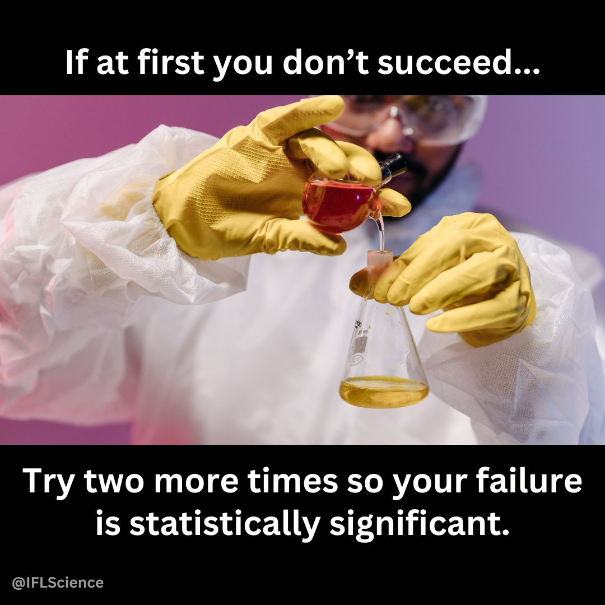
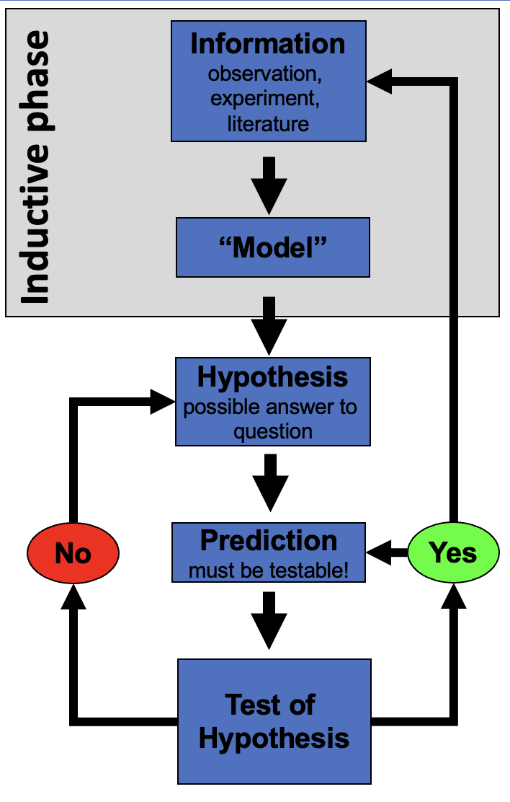
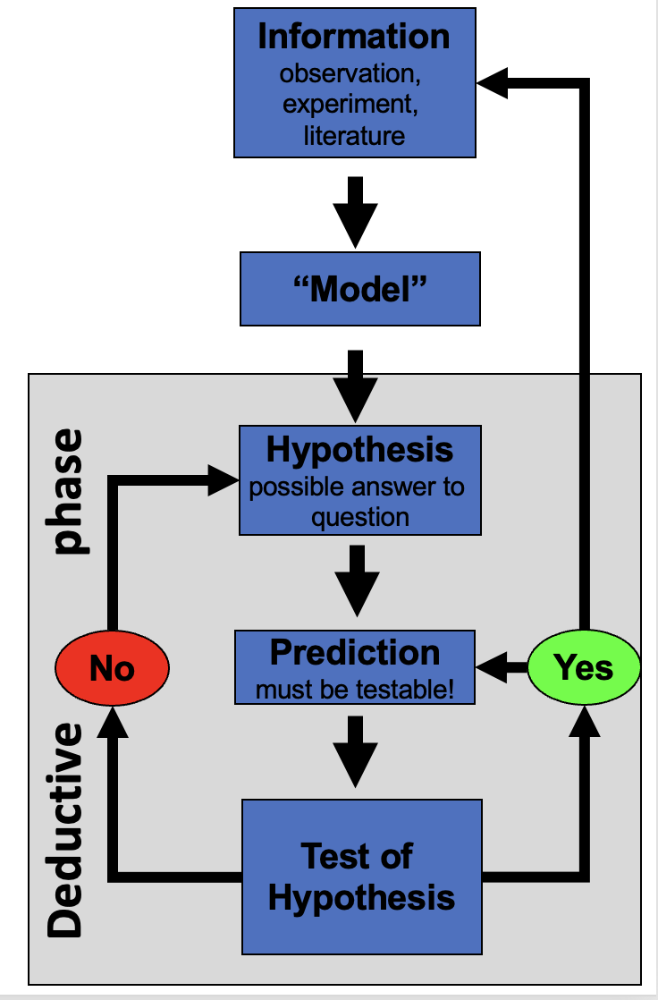
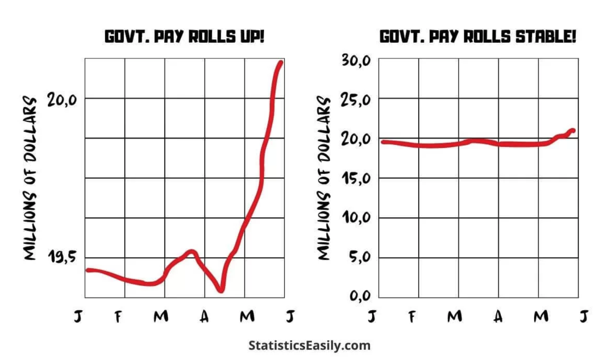
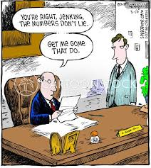

# **Lecture 1: Syllabus**

- Please look over the syllabus as it has all the details of the class and how it will run.

# **Lecture 1:** Who am I?

::::: columns
::: {.column width="60%"}
- Bill Perry
- Office is in SSB 13
- Phone 218-726-8145
- Email is wlperry_at_d.umn.edu
:::

::: {.column width="40%"}
{width="163" height="212"}
:::
:::::

# Lecture 1: My goals

- How do we make observations and hypotheses?
- How do we design an experiment
- How do we collect data?
- How do we organize, clean, summarize, and view the data?
- How do we use statistics to test our hypotheses
  - what tests to use
  - what are the assumptions
  - what are the interpretations

# Lecture 1: My expectations

- Communication
- Practice
- Failure
- Learn to correct and troubleshoot

# **Lecture 1: Science**

- Way to acquire knowledge, organize it and apply it back to the real world
- Make predictions and testing these predictions using a falsifiable approach - statistics
- Explanations that cannot be falsified are not science

# What is Statistics?

::::: columns
::: {.column width="60%"}
Zar (1999) - "analysis and interpretation of data with view towards objective evaluation of conclusions based on the data"
:::

::: {.column width="40%"}
{width="276"}
:::
:::::

# **Lecture 1:** Inductive reasoning  (Specific → General)

::::: columns
::: {.column width="60%"}
### **Inductive Reasoning (Specific → General)**

Inductive reasoning involves observing specific cases and using them to form a general conclusion.

**Example:**

1.  Measure **10 pine needles** from a tree - average length is **75 mm**.
2.  Measure **10 more needles** from the same tree and gets similar results.
3.  Measures needles from second tree - average length is **120 mm** .
4.  You **generalize** pine needles from different trees **vary in length**, but each tree tends to have a characteristic range.

**Conclusion (Induction):** *"Pine needle length varies by tree, but each tree seems to have a typical range of lengths.*

**Potential Issue:** Conclusion is **not guaranteed** to be true - based on patterns observed in a sample, and there could be exceptions.
:::

::: {.column width="40%"}
{width="264" height="290"}
:::
:::::

# **Lecture 1:** Deductive reasoning (General → Specific)

::::: columns
::: {.column width="60%"}
### **Deductive Reasoning (General → Specific)**

Deductive reasoning starts with a general principle and applies it to a specific case.

**Example:**

1.  **General Principle:** *Pine needles from a species of pine tree have a predictable length range (e.g., 70–80 mm).*
2.  **Specific Case:** Collect sample of pine needles and measure them.
3.  **Prediction:** Since its the species the needle lengths **should** fall within 70–80 mm.
4.  **Measurement:** Check the data and confirm needles fall within this expected range.

**Conclusion (Deduction):** *"This tree belongs the species with a needle length range of 70–80 mm, we expect its needle lengths to fall in this range."*

**Stronger than induction** because it's based on a general rule—but if the assumption (length range) is incorrect, conclusion could still be wrong.
:::

::: {.column width="40%"}
{fig-align="right" width="300" height="350"}
:::
:::::

# **Lecture 1:** Reality of reasoning

::::: columns
::: {.column .r-fit-text width="50%"}
### **In reality we are doing both of these processes**
:::

::: {.column .r-fit-text width="50%"}
{fig-align="right" width="229"}
:::
:::::

# How do we test hypotheses

::::: columns
::: {.column width="60%"}
### Statistics

- Design good experiments
- Design good tests
- Summarize patterns/data
- Use to make probabilistic determinations to see if differences are "real"
:::

::: {.column width="40%"}
{width="291" height="247"}
:::
:::::

# Data Types

::::: columns
::: {.column width="60%"}
- **Continuous**
  - numeric
- **Discrete**
  - integer or numerical
- **Categorical**
  - nominal – up, down, right, left...
  - ordinal – order - a, b, c, d or morning, afternoon, evening
:::

::: {.column width="40%"}
{width="250" height="300"}
:::
:::::

# Measurements

::::: columns
::: {.column width="60%"}
Data is obtained through measurement

The world is a messy place and how you measure matters

Our measures depend on

- **accuracy** - how close we are to the real value
- **precision** - how close all our measurements are but may not be precise
:::

::: {.column width="40%"}
{width="300" height="350"}
:::
:::::