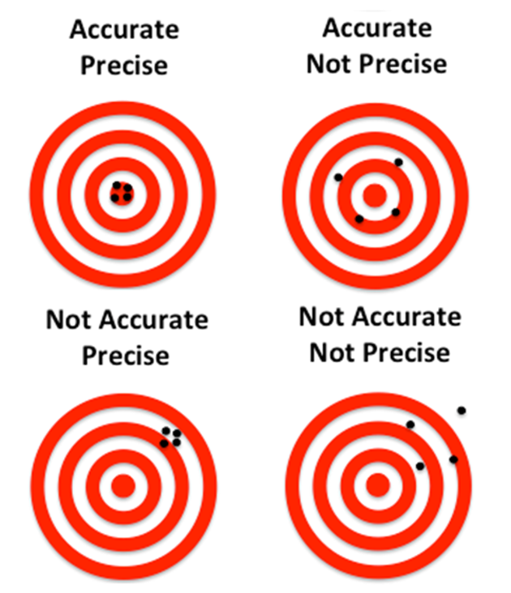
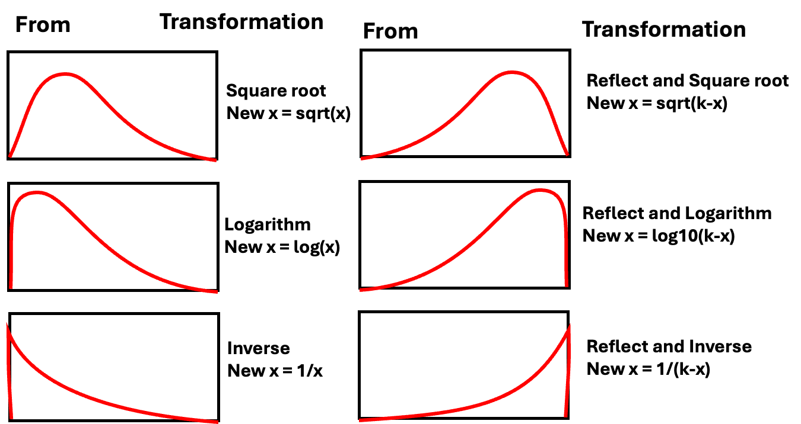

::: {.callout-note appearance="simple"}
## Download this lecture

[📄 Download HTML](03_01_lecture_powerpoint_standalone.html) \| [📝
Download Word](03_01_lecture_powerpoint.docx) \| [📊 Download
PowerPoint](03_01_lecture_powerpoint.pptx) \| [📄 Download
PDF](03_01_lecture_powerpoint.pdf)
:::

# **Lecture 2: Review of data and graphing**

::::: columns
::: {.column width="60%"}
-   We covered
    -   How to design a well-organized project structure
    -   How to implement good naming conventions
        -   Controlled vocabulary
        -   Including units in names
    -   Create and use metadata effectively
    -   Build tidy, well-structured spreadsheets
    -   Create visualizations with ggplot2
:::

::: {.column width="40%"}
These are variables - do you know what they mean?

-   TGW - yep its a thing
-   ODO - what do you think it is?
-   NO3 - what is it? Are you sure? Why might you get in legal trouble
    if you used this?

{width="300" height="250"}
:::
:::::

# **Lecture 3:** Descriptive Statistics and Uncertainty in R and Tidyverse

::::: columns
::: {.column width="60%"}
## The objectives:

-   Understand why statistics is vital in biology
-   Calculate and interpret measures of central tendency (mean, median,
    geometric mean)
-   Calculate and interpret measures of spread (standard deviation,
    variance, IQR)
-   Understand data transformations for skewed distributions
-   Visualize descriptive statistics for our data
-   Learn how to handle uncertainty in our data

We'll use a dataset on grayling - `gray_I3_I8.csv` from two different
lakes to explore these concepts.. like you did in the homework

{width="274"}
:::

::: {.column width="40%"}
{width="309" height="439"}
:::
:::::

# Lecture 3: Populations and Samples

::::: columns
::: {.column width="60%"}
Before we dive into descriptive statistics, let's clarify some
fundamental concepts:

-   **Population**: entire group of things under consideration
-   **Sample**: A subset of the population that is actually measured
-   **Sample unit**: The individual thing drawn from the population

Types of populations:

-   **Observational population**: **group whose characteristics are
    studied passively** (e.g., head width of all corn earworms in a
    field)
-   **Experimental population**: **actively manipulate variables to
    observe effects and establish cause-and-effect relationships
    (e.g.,** manipulate temperature and monitor head width)

Sampling involves

-   **inference** - generalizing from what is observed in the sample to
    what is present in the population.
-   Valid inference requires **random sampling**.
:::

::: {.column width="40%"}
{width="324" height="432"}
:::
:::::

# Lecture 3: Parameters vs. Statistics

::::: columns
::: {.column width="60%"}
It's important to distinguish between:

-   **Parameters**: True numerical values for a population (usually
    denoted by Greek letters)
-   **Statistics**: Estimates of parameters based on samples (usually
    denoted by Roman letters)

For example:

-   Population mean (μ) is estimated by sample mean (Y̅)
-   Population standard deviation (σ) is estimated by sample standard
    deviation (s)
:::

::: {.column width="40%"}
{width="310" height="411"}
:::
:::::

# Lecture 3: Kinds of Biological Variables

### Understanding the type of variable you're working with is essential for selecting appropriate statistics:

### Measurement or Quantitative Variables

-   **Continuous**: Any value between extremes of scale is possible
    (e.g., mass, length)
-   **Discrete (meristic)**: Only fixed values (usually integers)
    between extremes are possible (e.g., bristle number, egg count)

### Rank Variables (Ordinal)

-   Assign only order, not quantity - student rank - 1 2 3
-   Nothing implied about relative distance between values

### Categorical Variables (Qualitative)

-   No quantitative information (e.g., male/female, living/dead)
-   Some are simplifications of quantitative variables (e.g., color
    instead of wavelength)

# Lecture 3: Derived Variables

### Derived Variables

-   **Percentages, Proportions**: Ratio of some component to total
-   **Ratios**: Relation of two variables
-   **Rates**: Quantity per unit (time, mass, etc.)
-   **Indices**: More complex derived variables (e.g., condition index)

Let's explore our grayling dataset and identify the types of variables
it contains.

# Lecture 3: Why Statistics is Vital in Biology

::::: columns
::: {.column width="60%"}
Biology is fundamentally different from fields like physics/chemistry in
that:

-   Most biological phenomena are **probabilistic** rather than
    **deterministic**
    -   Responses occur with some characteristic probability, **not with
        certainty**
-   All biological material varies, which is essential for evolution
    (recall Darwin's postulates):
    -   Variation exists within populations
    -   Some variation is heritable
    -   Some heritable variation affects survival/reproduction
-   Environmental conditions (in nature, lab, or greenhouse) always vary
-   Measurements include error
-   Multiple unmeasured causal factors influence nearly all biological
    systems

Statistics helps us understand biological processes in this variable
world by:

1.  Condensing variation into summary form (Descriptive statistics)
2.  Testing whether observations are consistent with predictions
    (Inferential statistics)
:::

::: {.column width="40%"}
```{r}
#| echo: false
#| message: false
#| warning: false
#| paged-print: false

# install.packages("moments")
library(tidyverse)
library(readxl)
library(moments)
library(flextable)
library(patchwork)

pine_data <- read_excel("data/pine_needles_error.xlsx")

# Calculate the mean needle length for each needle_id within each species
needle_means <- pine_data %>%
  group_by(species,needle_id, needle_name) %>%
  summarize(
    mean_length = mean(length_mm),
    min_length = min(length_mm),
    max_length = max(length_mm),
    .groups = "drop"
  )

# Calculate overall species means
species_means <- pine_data %>%
  group_by(species) %>%
  summarize(
    species_mean = mean(length_mm),
    .groups = "drop"
  )

# Join the datasets to have all the information in one place
plot_data <- pine_data %>%
  left_join(needle_means, by = c("species", "needle_id", "needle_name")) %>%
  left_join(species_means, by = "species")

# Create an alternative visualization that more clearly shows measurer variation
# This creates a plot with needle_id on x-axis and species as facets
ggplot(plot_data, aes(x = factor(needle_id), y = length_mm, color = name)) +
  # Add points for individual measurements
  geom_point(position = position_dodge(width = 0.5), size = 3) +
  
  # Add line to mean for each measurement
  geom_linerange(aes(ymin = mean_length, ymax = length_mm), 
                position = position_dodge(width = 0.5)) +
  
  # Add shorter lines for needle means (centered on each needle_id position)
  geom_segment(data = needle_means,
               aes(x = as.numeric(factor(needle_id)) - 0.3, 
                   xend = as.numeric(factor(needle_id)) + 0.3, 
                   y = mean_length, yend = mean_length),
               color = "black", linewidth = 1) +
  
  # Add needle mean points
  geom_point(aes(y = mean_length), shape = 18, size = 4, color = "black",
             position = position_dodge(width = 0.5)) +
  
  # Add small indicator for species mean (instead of full line)
  geom_segment(data = species_means,
               aes(x = 0.7, xend = 3.3, y = species_mean, yend = species_mean),
               linetype = "dashed", color = "darkgrey", linewidth = 0.8) +
  
  # Facet by species
  facet_wrap(~ species, scales = "free_y", nrow = 2) +
  
  # Labels and theme
  labs(
    title = "Pine Needle Length by Tree and Measurer",
    subtitle = "Points show individual measurements, lines connect to needle means",
    x = "Tree ID",
    y = "Length (mm)",
    color = "Measurer"
  ) +
  theme_minimal() +
  theme(
    legend.position = "none",
    panel.grid.minor = element_blank(),
    strip.text = element_text(face = "bold")
  )
```
:::
:::::

# Practice Exercise 1: Fish Data

::: callout-tip
## Practice Exercise 1: Can you open the fish data `gray_I3_I8.csv` and look at the structure and make a histogram?

Note the variation around the mean... some could be due to measurement
error

Let's recreate the basic histogram of fish lengths using
`gray_I3_I8.csv`

```{r}
# Write your code here to read in the file
# How do you examine the data - what are the ways you think and lets try it!


```
:::

# Practice Exercise 2: Examining Grayling Data

::: callout-tip
## Practice Exercise 2: Can you do this for the pine data we have collected?

Let's examine the different data and determine what they are?

```{r}
#| paged-print: false
# Write your code here to read in the file
# How do you examine the data - what are the ways you think and lets try it!

# Load the grayling data
grayling_df <- read_csv("data/gray_I3_I8.csv")

# Take a look at the first few rows
head(grayling_df)


```
:::

# Lecture 3: Accuracy, Precision, and Bias

::::: columns
::: {.column width="60%"}
**When taking biological measurements, understanding measurement quality
is essential:**

-   **Accuracy**: Closeness of measured value to true value
-   **Precision**: Closeness of repeated measurements to each other
    (repeatability)
-   **Bias**: Systematic departure from the true value

**Accuracy** is a **function** of **both precision and bias**.

For statisticians, **BIAS is usually a more serious problem than low
precision because**:

-   It's harder to detect (true value usually unknown)
-   Low precision can be compensated for by increased sample size
:::

::: {.column width="40%"}
{width="314" height="322"}
:::
:::::

# Practice Exercise: Sources of Error

::: callout-tip
## Practice Exercise 1: What are potential sources of error in fish data?

For our grayling data, potential sources of measurement error might
include:

-   Precision issues:
    -   Variations in how fish are measured (e.g., slightly bent fish)
-   Bias issues:
    -   Systematic underestimation of length if measurements aren't
        taken from the true tip of the snout to the end of the tail
-   Accuracy issues? what could they be?
:::

# Lecture 3: Measures of Central Tendency - Mean

::::: columns
::: {.column width="60%"}
The two most common measures of central tendency are the **mean** and
the **median**.

The Arithmetic Mean The arithmetic mean is the average of a set of
measurements:

## $$\bar{Y} = \frac{\sum_{i=1}^{n} Y_i}{n}$$

Where:

-   $Y_i$ represents each individual measurement
-   $n$ is the total number of observations
:::

::: {.column width="40%"}
```{r mean}
#| echo: true
#| message: false
#| warning: false
#| paged-print: false
# Calculate mean length of all fish
mean(grayling_df$length_mm)

# Calculate mean by lake
grayling_df %>%
  group_by(lake) %>%
  summarise(mean_length = mean(length_mm, na.rm=TRUE)) 
```
:::
:::::

# Lecture 3: Measures of Central Tendency - Median

The Median

-   The median is the middle value of a sorted dataset.
-   If there is an even number of observations, it's the average of the
    two middle values.

```{r median}
#| echo: true
#| message: false
#| warning: false
#| paged-print: false
# Calculate median length of all fish
median(grayling_df$length_mm)

# Calculate median by lake
grayling_df %>%
  group_by(lake) %>%
  summarise(median_length = median(length_mm)) 
```

# Lecture 3: Measures of Spread - Variance and Standard Deviation

::::: columns
::: {.column width="60%"}
The spread of a distribution tells us how variable the measurements are.

### Variance and Standard Deviation

The variance is

## $$s^2 = {\frac{\sum_{i=1}^{n} (Y_i - \bar{Y})^2}{n-1}}$$

The standard deviation is the square root of variance

-   measures how far observations typically are from the mean and are in
    the units of the mean:

## $$s = \sqrt{\frac{\sum_{i=1}^{n} (Y_i - \bar{Y})^2}{n-1}}$$
:::

::: {.column width="40%"}
```{r sd-variance}
#| echo: true
#| message: false
#| warning: false
#| paged-print: false
# Calculate standard deviation of fish length
var_length <- var(grayling_df$length_mm)
sd_length <- sd(grayling_df$length_mm)

# Calculate by lake
grayling_df %>%
  group_by(lake) %>%
  summarise(
     var_length = var(length_mm), 
     sd_length = sd(length_mm) ) 
```
:::
:::::

# Lecture 3: Understanding Standard Deviation

::::: columns
::: {.column width="60%"}
The area under the curve of a bell shaped curve within + and - 2
standard deviations on each side includes about 95% of the data\
\
so there is only 2.5% of the data that is outside this range

-   note the similarity to the p \< 0.5
-   note that it is 90.91% and that is because the curve is not normal

```{r sd-variance-2 a}
#| echo: false
 # Read the data
fish_data <- read.csv("data/gray_I3_I8.csv")

# Filter data for I8 lake
i3_data <- fish_data %>% 
  filter(lake == "I3")

# Calculate statistics
mean_length <- mean(i3_data$length_mm)
sd_length <- sd(i3_data$length_mm)

# Calculate the bounds for standard deviations
minus_2sd <- mean_length - (2 * sd_length)
plus_2sd <- mean_length + (2 * sd_length)

# Calculate percentage of data within 2 SD
percent_within_2sd <- 100 * mean(
  i3_data$length_mm >= minus_2sd & 
  i3_data$length_mm <= plus_2sd
)

# Create the plot
cool_plot<- ggplot(i3_data, aes(x = length_mm)) +
  # Add density curve
  geom_density(fill = "skyblue", alpha = 0.6) +
  
  # Add vertical line for mean
  geom_vline(xintercept = mean_length, color = "navy", linewidth = 1) +
  
  # Add vertical lines for +/- 2 SD
  geom_vline(xintercept = minus_2sd, color = "darkred", linewidth = 0.8, linetype = "dashed") +
  geom_vline(xintercept = plus_2sd, color = "darkred", linewidth = 0.8, linetype = "dashed") +
  
  # Highlight area within 2 SD
  annotate("rect", 
           xmin = minus_2sd, xmax = plus_2sd, 
           ymin = 0, ymax = Inf, 
           fill = "lightgreen", alpha = 0.3) +
  
  # Add annotations
  annotate("text", 
           x = mean_length, y = 0.010,
           label = paste0("Mean = ", round(mean_length, 1), " mm"),
           color = "navy", fontface = "bold", size = 4) +
  
  annotate("text", 
           x = mean_length, y = 0.009,
           label = paste0("SD = ", round(sd_length, 1), " mm"),
           color = "darkred", size = 3.5) +
  
  annotate("text", 
           x = mean_length, y = 0.008,
           label = paste0(round(percent_within_2sd, 1), "% within ±2 SD"),
           color = "darkgreen", size = 3.5) +
  
  # Add labels for SD boundaries
  annotate("text", 
           x = minus_2sd+10, y = 0.015,
           label = paste0("-2 SD (", round(minus_2sd, 1), ")"),
           color = "darkred", angle = 00, hjust = 0, size = 3) +
  
  annotate("text", 
           x = plus_2sd-25, y = 0.015,
           label = paste0("+2 SD (", round(plus_2sd, 1), ")"),
           color = "darkred", angle = 0, hjust = 0, size = 3) +
  
  # Add title and labels
  labs(
    title = "Distribution of Fish Lengths in i3 Lake",
    subtitle = "Area between dashed lines represents ±2 standard deviations from the mean",
    x = "Total Length (mm)",
    y = "Density",
    caption = paste0("n = ", nrow(i3_data), " fish")
  ) +
  theme_minimal() +
  theme(
    plot.title = element_text(face = "bold", size = 14),
    plot.subtitle = element_text(size = 11),
    axis.title = element_text(face = "bold"),
    panel.grid.minor = element_blank()
  ) +
  # Set x-axis limits to show the full range plus a bit of padding
  xlim(min(i3_data$length_mm) - 10, max(i3_data$length_mm) + 10)

 
 # Print statistics to console
cat("i3 Lake Fish Length Summary:\n",
    "Number of fish:", nrow(i3_data), "\n",
    "Mean length:", round(mean_length, 2), "mm\n",
    "Standard Deviation:", round(sd_length, 2), "mm\n",
    "Range for ±2 SD:", round(minus_2sd, 2), "to", round(plus_2sd, 2), "mm\n",
    "Percentage within ±2 SD:", round(percent_within_2sd, 2), "%\n\n")
```
:::

::: {.column width="40%"}
```{r sd-variance-2}
#| echo: false
#| message: false
#| warning: false
#| paged-print: false
#| fig-width: 6
#| fig-height: 5

cool_plot

```
:::
:::::

# Lecture 3: Coefficient of Variation

::::: columns
::: {.column width="60%"}
The coefficient of variation (CV) expresses the standard deviation as a
percentage of the mean:

## $$CV = \frac{s}{\bar{Y}} \times 100\%$$

This is useful for comparing the variability of measurements with
different units or vastly different scales.
:::

::: {.column width="40%"}
```{r cv}
#| echo: false
#| message: false
#| warning: false
#| paged-print: false
# Calculate coefficient of variation
cv_length <- sd_length / mean_length * 100

cat("Coefficient of variation:", round(cv_length, 1), "%\n")

# Calculate by lake
grayling_df %>%
  group_by(lake) %>%
  summarise(
    cv_length = sd(length_mm) / mean(length_mm) * 100
  ) 

```
:::
:::::

# Lecture 3: Interquartile Range

::::: columns
::: {.column width="60%"}
The interquartile range (IQR) is the range of the middle 50% of the
data:

$$IQR = Q_3 - Q_1$$

Where $Q_1$ is the first quartile (25th percentile) and $Q_3$ is the
third quartile (75th percentile).
:::

::: {.column width="40%"}
```{r iqr}
#| echo: false
#| message: false
#| warning: false
#| paged-print: false
 

# Calculate quartiles and IQR
q1_length <- quantile(grayling_df$length_mm, 0.25)
q3_length <- quantile(grayling_df$length_mm, 0.75)
iqr_length <- IQR(grayling_df$length_mm)

cat("First quartile:", q1_length, "mm\n")
cat("Third quartile:", q3_length, "mm\n")
cat("Interquartile range:", iqr_length, "mm\n")

# Calculate by lake
grayling_df %>%
  group_by(lake) %>%
  summarise(
    q1 = quantile(length_mm, 0.25),
    q3 = quantile(length_mm, 0.75),
    iqr = IQR(length_mm)
  ) 

```
:::
:::::

# Lecture 3: Understanding Percentiles

### - it is the same as quartiles but more finely divided and will come into play later on

::::: columns
::: {.column width="60%"}
Percentiles are values that divide a dataset into 100 equal parts.

-   The 25th percentile is the first quartile (Q1)
-   The 50th percentile is the median
-   The 75th percentile is the third quartile (Q3)
-   The IQR is the difference between Q3 and Q1.
:::

::: {.column width="40%"}
```{r percentiles}
#| echo: true
#| message: false
#| warning: false
#| paged-print: false
 
# Calculate percentiles
percentiles <- quantile(grayling_df$length_mm, 
                       probs = c(0.1, 0.25, 0.5, 0.75, 0.9))
```
:::
:::::

# Lecture 3: Standard Deviation vs. Interquartile Range

::::: columns
::: {.column width="60%"}
The standard deviation and interquartile range both measure spread, but:

**Standard deviation**: Sensitive to outliers

**Interquartile range**: Robust against outliers

When the data is approximately normal, the IQR ≈ 1.35 × standard
deviation.
:::

::: {.column width="40%"}
```{r sd-vs-iqr}
#| echo: false
#| message: false
#| warning: false
#| paged-print: false
# Calculate the ratio of IQR to SD for our data
grayling_df %>%
  group_by(lake) %>%
  summarise(
    sd = sd(length_mm),
    iqr = IQR(length_mm),
    ratio_iqr_sd = IQR(length_mm) / sd(length_mm)
  ) 
```
:::
:::::

# Lecture 3: Data Transformations for Skewed Distributions

::::: columns
::: {.column width="60%"}
Biological data are often skewed (asymmetrical), which can make the
arithmetic mean less representative of central tendency. Data
transformations can help address this issue.

### Logarithmic Transformation

The logarithmic transformation is one of the most common for
right-skewed biological data:

When data are log-normally distributed, the geometric mean often
provides a better measure of central tendency than the arithmetic mean.

-   But there are issues and it might not be good...

    -   detecting differences in geometric means, not arithmetic means

        -   geometric is all values multiplied taken to the nth root

    -   Can't handle zeros without adding arbitrary constants (log(x+1)
        transformations), which can bias results\

```{r geo_vs_arithro}
#| echo: false
# Compare means on original and transformed scales
mean_log_mass <- mean(grayling_df$log_mass, na.rm=TRUE)
back_transformed_mean <- exp(mean_log_mass)

cat("Arithmetic mean of original data:", round(mean_length, 1), "mm\n","Geometric mean (back-transformed mean of logs):", round(back_transformed_mean, 1), "mm\n")
```
:::

::: {.column width="40%"}
```{r log-transform}
#| echo: false
#| message: false
#| warning: false
#| paged-print: false

 
# Add log-transformed length to our dataset
grayling_df <- grayling_df %>%
  mutate(log_mass = log(mass_g))

# Compare original and log-transformed distributions
p1 <- ggplot(grayling_df, aes(x = mass_g)) +
  geom_histogram(bins = 15, fill = "steelblue") +
  labs(
    title = "Original Mass Distribution",
    x = "Total Mass (g)",
    y = "Count"
  )

p2 <- ggplot(grayling_df, aes(x = log_mass)) +
  geom_histogram(bins = 15, fill = "steelblue") +
  labs(
    title = "Log-Transformed Mass Distribution",
    x = "Log(Mass(g)",
    y = "Count"
  )

# Display side by side
p1+ p2

```
:::
:::::

# Lecture 3: When to Use Transformations

::::: columns
::: {.column width="60%"}
To tranform data to a "normal" distribution we can use the following
transformations...

-   **Log transformation**: When data are right-skewed or follow
    multiplicative rather than additive processes
-   **Square root transformation**: For count data or data where
    variance increases with the mean
-   **Inverse transformation**: For strongly right-skewed data
-   **Arcsine square root transformation**: For proportions or
    percentages (though logistic regression is often preferred now)

In a reflection the parameter **k** is typically chosen to be a value
that's larger than the maximum value
:::

::: {.column width="40%"}
{width="576"}
:::
:::::

# Lecture 3: Visualizing Distributions - Histograms

::::: columns
::: {.column width="60%"}
Histograms

Histograms show the frequency distribution of our data.
:::

::: {.column width="40%"}
```{r histogram}
#| echo: false
#| message: false
#| warning: false
#| paged-print: false
#| fig-width: 8
#| fig-height: 5
 
# Create a histogram
all_histo_plot <- ggplot(grayling_df, aes(x = mass_g)) +
  geom_histogram(bins = 15, fill = "steelblue", color = "white") +
  labs(
    title = "Distribution of Fish Mass",
    x = "Total Mass (g)",
    y = "Count"
  )

# Histograms by lake
histo_lake_plot <- ggplot(grayling_df, aes(x = mass_g, fill = lake)) +
  geom_histogram(bins = 15, position = "dodge", alpha = 0.7) +
  labs(
    title = "Distribution of Fish Mass by Lake",
    x = "Total Mass (g)",
    y = "Count"
  )

# Display both plots
all_histo_plot + histo_lake_plot + plot_layout(ncol = 1)
```
:::
:::::

# Lecture 3: Visualizing Distributions - Box Plots

::::: columns
::: {.column width="60%"}
Box Plots

Box plots show the median, quartiles, and potential outliers.
:::

::: {.column width="40%"}
```{r boxplot}
#| echo: false
#| message: false
#| warning: false
#| paged-print: false
#| fig-width: 8
#| fig-height: 5
 
# Create a box plot
p1 <- ggplot(grayling_df, aes(y = length_mm)) +
  geom_boxplot(fill = "steelblue", alpha = 0.7) +
  labs(
    title = "Box Plot of Fish Lengths",
    y = "Total Length (mm)"
  )

# Box plot by lake
p2 <- ggplot(grayling_df, aes(x = lake, y = length_mm, fill = lake)) +
  geom_boxplot(alpha = 0.7) +
  labs(
    title = "Box Plot of Fish Lengths by Lake",
    x = "Lake",
    y = "Total Length (mm)"
  )

# Display both plots

p1 + p2 + plot_layout(ncol = 2)
```
:::
:::::

# Lecture 3: Comparing Mean vs. Median

::::: columns
::: {.column width="60%"}
The mean and median measure different aspects of a distribution:

**Mean**: Center of gravity of the distribution

**Median**: Middle value of the data

When a distribution is symmetric, the mean and median are similar. When
it's skewed or has outliers, they can differ significantly.
:::

::: {.column width="40%"}
```{r mean-vs-median}
#| echo: false
#| message: false
#| warning: false
#| paged-print: false
 
# Calculate summary statistics by lake
stats_by_lake <- grayling_df %>%
  group_by(lake) %>%
  summarise(
    mean = mean(length_mm),
    median = median(length_mm),
    sd = sd(length_mm),
    iqr = IQR(length_mm),
    skewness = moments::skewness(length_mm)
  )

# Display the results
stats_by_lake
```
:::
:::::

# Lecture 3: Histogram Plot - Mean vs. Median

::::: columns
::: {.column width="60%"}
The mean and median measure different aspects of a distribution:

**Mean**: Center of gravity of the distribution

**Median**: Middle value of the data

When a distribution is symmetric, the mean and median are similar. When
it's skewed or has outliers, they can differ significantly.
:::

::: {.column width="40%"}
```{r mean-vs-median-plot}
#| echo: false
#| message: false
#| warning: false
#| paged-print: false
#| fig-width: 6
#| fig-height: 5
 
# Create a density plot with vertical lines for mean and median
ggplot(grayling_df, aes(x = length_mm, fill = lake)) +
  geom_histogram(alpha = 0.5) +
  geom_vline(data = stats_by_lake, 
             aes(xintercept = mean, color = "Mean"), 
             linetype = "dashed", linewidth = 1) +
  geom_vline(data = stats_by_lake, 
             aes(xintercept = median, color = "Median"), 
             linetype = "solid", linewidth = 1) +
  scale_color_manual(values = c("Mean" = "red", "Median" = "blue")) +
  facet_wrap(~ lake, ncol = 1) +
  labs(
    title = "Density of Fish Lengths",
    x = "Total Length (mm)",
    y = "Density",
    color = "Statistic"
  )
```
:::
:::::

# Lecture 3: Handling Missing Values

Let's examine how missing values affect our descriptive statistics by
looking at the mass variable, which has some missing data.

```{r missing-values}
#| echo: false
#| message: false
#| warning: false
#| paged-print: false
 
# Check for missing values in mass
sum(is.na(grayling_df$mass_g))

# Calculate descriptive statistics with and without handling missing values
# Without handling (will produce NA results)
cat("Mean mass without handling NAs:", mean(grayling_df$mass_g), "g\n",
    "Mean mass with na.rm=TRUE:", mean(grayling_df$mass_g, na.rm = TRUE), "g\n\n"
    )

# Calculate descriptive statistics by lake, properly handling NAs
grayling_df %>%
  group_by(lake) %>%
  summarise(
    mean_mass = mean(mass_g, na.rm = TRUE),
    median_mass = median(mass_g, na.rm = TRUE),
    sd_mass = sd(mass_g, na.rm = TRUE),
    n_missing = sum(is.na(mass_g))
  ) 
```

# Lecture 3: Best Practices for Missing Values

1.  Always check for missing values in your data before calculating
    statistics.
2.  Use na.rm = TRUE when calculating summary statistics to handle
    missing values.
3.  Report the number of missing values along with your statistics.
4.  Consider whether the missing values are random or might introduce
    bias.

# **Sampling from a Population**

Now that we have estimates of the sample we need to relate that to the
population

In reality, we rarely know the true population parameters. When studying
fish in lakes I3 and I8:

-   The **population** includes all grayling fish in each lake
-   The true population mean (μ) and standard deviation (σ) are unknown
-   Our dataset is a **sample** from this population
-   We use the sample mean (x̄) to estimate μ
-   Sampling introduces random variation in our estimates

Let's demonstrate how different samples from the same population can
give different estimates.

If we could sample all fish in the lake, we would know the true mean
length. But that's usually impossible in ecology!

# **Demonstrating Sampling Variation**

Let's take several random samples from Lake I3 and see how the sample
means vary:

```{r}
# Filter for Lake I3
i3_data <- grayling_df %>% filter(lake == "I3")
# Function to take a random sample and calculate the mean
sample_mean <- function(data, sample_size) {
  sample_data <- sample_n(data, sample_size)
  return(mean(sample_data$length_mm))
}

# Take 10 different samples of size 15 from Lake I3
set.seed(123) # For reproducibility
sample_size <- 15
sample_means <- replicate(50, sample_mean(i3_data, sample_size))
# Create a data frame with sample numbers and means
samples_df <- data.frame(
  sample_number = 1:50,
  sample_mean = sample_means
)
```

# **Plotting Sample Variation**

```{r}
#| echo: false
#| message: false
#| warning: false
#| paged-print: false
# Plot the different sample means
ggplot(samples_df, aes(x = factor(sample_number), y = sample_mean)) +
  geom_point(size = 3, color = "blue") +
  geom_hline(yintercept = mean(i3_data$length_mm), 
             linetype = "dashed", color = "red") +
  annotate("text", x = 5, y = mean(i3_data$length_mm) + 2, 
           label = "Overall sample mean", color = "red") +
  labs(title = "Means of 10 Random Samples from Lake I3",
       x = "Sample Number",
       y = "Sample Mean (mm)") +
  theme_minimal()
```

Notice how each sample's mean differs from the overall mean. This
demonstrates sampling variation.

# **Standard Error: Quantifying Uncertainty**

::::: columns
::: {.column width="60%"}
The **standard error of the mean (SEM)** measures the precision of a
sample mean as an estimate of the population mean.

Formula: $SE_{\bar{x}} = \frac{s}{\sqrt{n}}$

Where:

-   s is the sample standard deviation
-   n is the sample size

The standard error tells us:

-   How much uncertainty is in our estimate
-   How much sample means are expected to vary
-   How close our sample mean is likely to be to the true population
    mean

**Remember:**

-   Standard deviation (s) describes the variability in the individual
    data points
-   Standard error (SE) describes the variability in the sample mean
    itself
-   As sample size increases, SE decreases (more precise estimate)
:::

::: {.column width="40%"}
```{r se_new}
#| echo: true
#| message: false
#| warning: false
#| paged-print: false
#| fig-width: 6
#| fig-height: 5
# Calculate mean, SD, and SE for each lake
grayling_stats <- grayling_df %>%
  group_by(lake) %>%
  summarize(
    mean_length = mean(length_mm),
    sd_length = sd(length_mm),
    n = n(),
    se_length = sd_length / sum(!is.na(length_mm))
  )

# Display the statistics
grayling_stats
```
:::
:::::

# **Sampling Distribution of the Mean**

The **sampling distribution of the mean** is the theoretical
distribution of all possible sample means of a given sample size from a
population.

Important properties:

1.  It is centered at the population mean (μ)
2.  Its standard deviation is the standard error (σ/√n)
3.  For large sample sizes, it approaches a normal distribution (Central
    Limit Theorem)

The larger the sample size:

-   The narrower the sampling distribution
-   The smaller the standard error
-   The more precise our estimate of the population mean

Let's simulate the sampling distribution for Lake I3 fish data.

# **Simulating the Sampling Distribution**

Let's simulate taking many samples from Lake I3 to visualize the
sampling distribution:

```{r}
#| fig-width: 7
#| fig-height: 5
# Filter for Lake I3
i3_data <- grayling_df %>% filter(lake == "I3")

# Number of samples to simulate
num_simulations <- 1000
sample_size <- 20 # change the number and examine the range of values 

# Simulate many samples and calculate means
set.seed(46) # For reproducibility
simulated_means <- replicate(num_simulations, sample_mean(i3_data, sample_size))

# Calculate the mean and standard deviation of the simulated means
mean_of_means <- mean(simulated_means)
sd_of_means <- sd(simulated_means)

# Create a data frame with the simulated means
simulated_df <- data.frame(sample_mean = simulated_means)

# Plot the sampling distribution
ggplot(simulated_df, aes(x = sample_mean)) +
  geom_histogram(bins = 30, fill = "blue", alpha = 0.7) +
  geom_vline(xintercept = mean(i3_data$length_mm), 
             linetype = "dashed", color = "red", linewidth = 1) +
  annotate("text", x = mean(i3_data$length_mm) + 2, y = 50, 
           label = "Full sample mean", color = "red") +
  labs(title = "Simulated Sampling Distribution of the Mean",
       subtitle = paste("Based on", num_simulations, "samples of size", sample_size),
       x = "Sample Mean (mm)",
       y = "Frequency") +
  theme_minimal()
```

Notice that the simulated sampling distribution:

1.  Is approximately normally distributed
2.  Is centered around the overall sample mean
3.  Has a spread that is related to the standard error

# **Standard Error and Sample Size**

Let's see how the standard error changes with different sample sizes:

```{r}
#| echo: false
#| message: false
#| warning: false
#| paged-print: false
# Define a range of sample sizes to test
sample_sizes <- c(5, 10, 20, 30, 50)

# For each sample size, simulate the sampling distribution and calculate SE
results <- data.frame()

for (size in sample_sizes) {
  # Simulate many sample means for this sample size
  simulated_means <- replicate(25, sample_mean(i3_data, size))
  
  # Calculate the standard deviation of the sampling distribution (empirical SE)
  empirical_se <- sd(simulated_means)
  
  # Calculate the theoretical SE
  theoretical_se <- sd(i3_data$length_mm) / sqrt(size)
  
  # Add to results
  results <- rbind(results, data.frame(
    sample_size = size,
    empirical_se = empirical_se,
    theoretical_se = theoretical_se
  ))
}

```

# **Sample Size vs. Standard Error**

```{r}
#| fig-width: 7
#| fig-height: 5
# Display the results
# Plot how SE changes with sample size
results_long <- pivot_longer(results, 
                             cols = c(empirical_se, theoretical_se),
                             names_to = "se_type", 
                             values_to = "standard_error")

ggplot(results_long, aes(x = sample_size, y = standard_error, color = se_type)) +
  geom_line() +
  geom_point(size = 3) +
  scale_x_continuous(breaks = sample_sizes) +
  labs(title = "Standard Error vs. Sample Size",
       subtitle = "Standard error decreases as sample size increases",
       x = "Sample Size",
       y = "Standard Error",
       color = "SE Type") +
  theme_minimal()
```

# **Confidence Intervals**

A **confidence interval** is a range of values that is likely to contain
the true population parameter.

The 95% confidence interval for the mean is approximately:

$\bar{x} \pm 2 \times SE_{\bar{x}}$

This "2 SE rule of thumb" means:

-   The interval extends 2 standard errors below and above the sample
    mean
-   About 95% of such intervals constructed from different samples would
    contain the true population mean

Confidence intervals provide a way to express the precision of our
estimates.

# **Calculating Confidence Intervals for Grayling Data**

Let's calculate and visualize the 95% confidence intervals for the mean
fish length in each lake:

```{r}
#| message: false
#| warning: false
#| paged-print: false
# Calculate 95% confidence intervals
grayling_ci <- grayling_df %>%
  group_by(lake) %>%
  summarize(
    mean_length = mean(length_mm),
    sd_length = sd(length_mm),
    n = n(),
    se_length = sd_length / sqrt(n),
    ci_lower = mean_length - 2 * se_length,
    ci_upper = mean_length + 2 * se_length
  )

# Display the confidence intervals
grayling_ci
```

# **Visualizing Confidence Intervals**

```{r}
#| message: false
#| warning: false
#| paged-print: false
#| fig-width: 6
#| fig-height: 5

# Plot with confidence intervals
ggplot(grayling_ci, aes(x = lake, y = mean_length, fill = lake)) +
  geom_bar(stat = "identity", alpha = 0.7) +
  geom_errorbar(aes(ymin = ci_lower, ymax = ci_upper),
                width = 0.2) +
  labs(title = "Mean Fish Length by Lake with 95% Confidence Intervals",
       subtitle = "Error bars represent 95% confidence intervals",
       x = "Lake",
       y = "Mean Length (mm)") +
  theme_minimal()
```

# **Different Types of Error Bars**

Let's compare different ways of displaying uncertainty in our estimates:

```{r}
#| code-overflow: wrap
#| code-fold: false
#| code-block-height: 800px
# Calculate statistics for different types of error bars
grayling_error_bars <- grayling_df %>% group_by(lake) %>%
  summarize(mean_length = mean(length_mm),
    sd_length = sd(length_mm), n = n(),
    se_length = sd_length / sqrt(n),
    ci_lower = mean_length - 1.96 * se_length,
    ci_upper = mean_length + 1.96 * se_length,
    one_sd_lower = mean_length - sd_length,
    one_sd_upper = mean_length + sd_length)
# Create a data frame for plotting different error types
lake_i3 <- grayling_error_bars %>% filter(lake == "I3")
error_types <- data.frame(
  error_type = c("Standard Deviation", "Standard Error", "95% Confidence Interval"),
  lower = c(lake_i3$one_sd_lower, 
            lake_i3$mean_length - lake_i3$se_length, 
            lake_i3$ci_lower),
  upper = c(lake_i3$one_sd_upper, 
            lake_i3$mean_length + lake_i3$se_length, 
            lake_i3$ci_upper))
```

# **Comparing Error Bar Types**

```{r}
#| fig-width: 7
#| fig-height: 5
# Plot the comparison
ggplot() +
  geom_point(data = lake_i3, aes(x = "Mean",
            y = mean_length), size = 4) +
  geom_errorbar(data = error_types, 
     aes(x = error_type, ymin = lower, 
         ymax = upper, color = error_type),
         width = 0.2, linewidth = 1) +
  labs(title = "Different Types of Error Bars for Lake I3",
       subtitle = "Comparing SD, SE, and 95% CI",
       x = "",
       y = "Length (mm)",
       color = "Error Bar Type") +
  theme_minimal() +
  theme(legend.position = "none")
```

# **Key Takeaways**

-   The **standard error** measures the precision of a sample statistic
    as an estimate of a population parameter
-   The standard error of the mean decreases as sample size increases:
    $SE_{\bar{x}} = \frac{s}{\sqrt{n}}$
-   The **sampling distribution** shows the variation in sample
    statistics that would be expected due to random sampling
-   **Confidence intervals** provide a range of plausible values for the
    population parameter
-   Larger sample sizes provide more precise estimates (narrower
    confidence intervals)
-   When reporting results, always include a measure of precision (SE or
    CI) 

# Lecture 3: Conclusion

In this lecture, we've explored:

-   Why statistics is essential in biology
-   Types of biological variables and their properties
-   Accuracy, precision, and bias in measurements
-   Measures of central tendency (mean, median, geometric mean)
-   Measures of spread (standard deviation, variance, and interquartile
    range)
-   Data transformations for skewed distributions
-   Visualization techniques for understanding distributions
-   Handling missing values

These tools form the foundation of statistical analysis and will be
essential as we move forward to more complex statistical methods.
