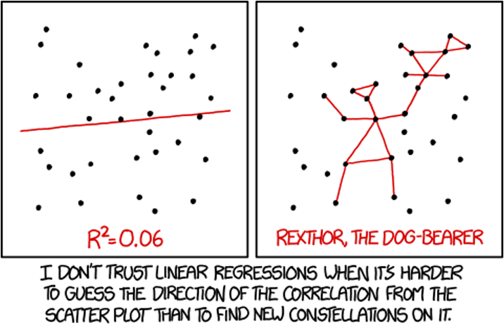
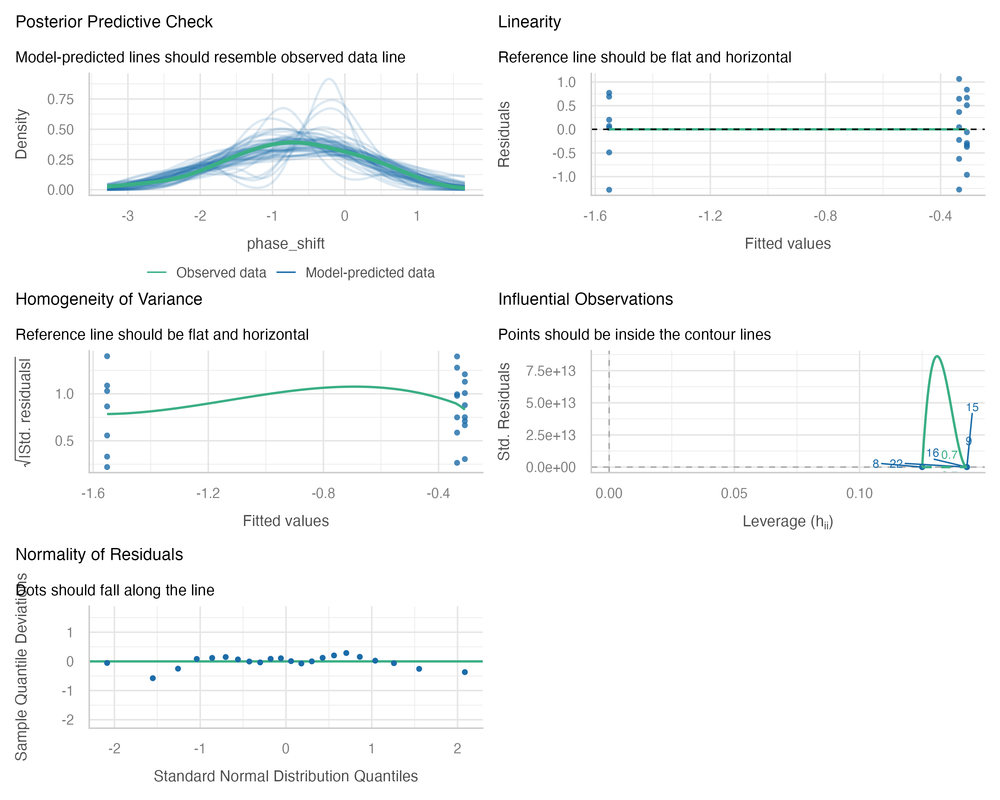

```{r setup}
#| include: false
#| message: false
#| warning: false
library(performance)
library(FSA)
library(ggfortify)
library(car)         # functions for regression diagnostics, ANOVA, and VIF
library(emmeans)     # calculates and compares adjusted means from statistical models
library(patchwork)   # Combines multiple ggplot2 plots into a single composite figure
library(broom)       # Converts statistical model outputs into tidy data frames
library(tidyverse)   # includes ggplot2, dplyr, tidyr, etc.

# ============================================================================
# CORE DATA CREATION - Used throughout the lecture
# ============================================================================

# Create nitrate standard curve data for regression example
nitrate_data <- tibble(
  nitrate_n_mg_L = seq(0, 20, by = 2.5),
  absorbance = c(0.02, 0.15, 0.28, 0.41, 0.54, 0.67, 0.80, 0.93, 0.98)
)

# Create circadian rhythm ANOVA data - PRIMARY DATASET
circ_data <- tibble(
  treatment = rep(c("Control", "Knees", "Eyes"), times = c(8, 7, 7)),
  phase_shift = c(0.53, 0.36, 0.20, -0.37, -0.60, -0.64, -0.68, -1.27,  # Control
                 0.73, 0.31, 0.03, -0.29, -0.56, -0.96, -1.61,          # Knees
                 -0.78, -0.86, -1.35, -1.48, -1.52, -2.04, -2.83)       # Eyes
)
circ_data <-  circ_data %>% mutate(treatment = as.factor(treatment))
levels(circ_data$treatment)
# Create subset with only 2 groups for t-test vs F-test comparison
circ_data_two_groups <- circ_data %>%
  filter(treatment %in% c("Control", "Knees"))

# ============================================================================
# CORE MODELS - Fit once and reuse throughout
# ============================================================================

# Primary ANOVA model using all three groups
circ_model <- lm(phase_shift ~ treatment, data = circ_data)
anova_result <- anova(circ_model)

# Two-group model for t-test vs F-test demonstration
circ_model_two_groups <- lm(phase_shift ~ treatment, data = circ_data_two_groups)
anova_result_two_groups <- anova(circ_model_two_groups)

# T-test on same two groups
t_result_circ <- t.test(phase_shift ~ treatment, data = circ_data_two_groups, var.equal = TRUE)


# Create circadian rhythm ANOVA data - PRIMARY DATASET
nonparam_circ_df <- tibble(
  treatment = rep(c("Control", "Knees", "Eyes"), times = c(8, 7, 7)),
  phase_shift = c(0.53, 0.36, 0.20, -0.37, -0.60, -0.64, -0.68, -1.27,  # Control
                 0.73, 0.31, 0.03, -0.29, -0.56, -0.96, -1.61,          # Knees
                 -0.78, -0.86, -1.35, -1.48, -1.52, -2.04, -2.83)       # Eyes
)
nonparam_circ_df <- nonparam_circ_df %>% mutate(treatment = as.factor(treatment))


```

# Lecture 11: Review

::::: columns
::: {.column width="60%"}
### **Multiple Regression**

-   MLR model
-   Regression parameters
-   Analysis of variance
-   Null hypotheses
-   Explained variance
-   Assumptions and diagnostics
-   Collinearity
-   Interactions
-   Dummy variables
-   Model selection
-   Importance of predictors
:::

::: {.column width="40%"}
{width="400"}
:::
:::::

# Lecture 12: Overview

::::: columns
::: {.column width="60%"}
### ANOVA

Analysis of variance: single and to come multi-factor designs

-   Predictor variables: fixed
-   ANOVA model
-   Analysis and partitioning of variance
-   Null hypothesis
-   Assumptions and diagnostics
-   Post F Tests - Tukey and others
-   Reporting the results
-   Mixed Model Anova - random effects
:::

::: {.column width="40%"}
What if response continuous and predictor(s) categorical?

|                        | Independent variable |                 |
|:-----------------------|:---------------------|:----------------|
| **Dependent variable** | **Continuous**       | **Categorical** |
| **Continuous**         | Regression           | ANOVA           |
| **Categorical**        | Logistic regression  |                 |
:::
:::::

# **Lecture 12:** ANOVA and Regression Connection

::::: columns
::: {.column width="60%"}
### Both regression and ANOVA:

-   Partition the total variation in Y
-   Use F-tests for significance where one MS is divided by another

### Regression

-   **Form:** $Y = \beta_0 + \beta_1X + \varepsilon$
    -   $Y$ = outcome/response variable
    -   $\beta_0$ = intercept (value of Y when X = 0)
    -   $\beta_1$ = slope (change in Y per unit increase in X)
    -   $X$ = predictor/independent variable
    -   $\varepsilon$ = error term
-   **Test:** $H_0: \beta_1 = 0$
    -   Tests whether slope equals zero
    -   Rejecting means X significantly predicts Y
:::

::: {.column width="40%"}
### ANOVA

-   **Form:** $Y_{ij} = \mu + A_i + \varepsilon_{ij}$
    -   $Y_{ij}$ = observation for person j in group i
    -   $\mu$ = grand mean across all groups
    -   $A_i$ = effect of group i
    -   $\varepsilon_{ij}$ = error term
-   **Test:** $H_0: \mu_1 = \mu_2 = ... = \mu_k$
    -   Tests whether all group means are equal
    -   Rejecting means at least one group differs
:::
:::::

# **Lecture 12:** ANOVA Partitioning

::::: columns
::: {.column width="60%"}
### General method for partitioning variation in continuous dependent variable

-   One or more continuous (and categorical) predictors:
    -   regression
-   One or more categorical predictors:
    -   ANOVA
-   Categorical predictor variables:
    -   groups or experimental treatments
:::

::: {.column width="40%"}
```{r}
#| echo: false
#| message: false
#| warning: false
#| paged-print: false
# Create regression plot for nitrate standard curve
nitrate_regression_plot <- ggplot(nitrate_data, aes(x = nitrate_n_mg_L, y = absorbance)) +
  geom_point(size = 3, color = "#2E86AB") +
  geom_smooth(method = "lm", se = TRUE, color = "#A23B72", fill = "#A23B72", alpha = 0.2) +
  theme_minimal() +
  labs(x = "Nitrate-N (mg/L)", y = "Absorbance") +
  theme(plot.title = element_text(hjust = 0.5, face = "bold"))

# Add regression equation to plot
lm_model <- lm(absorbance ~ nitrate_n_mg_L, data = nitrate_data)
r_squared <- summary(lm_model)$r.squared
equation <- paste0("y = ", round(coef(lm_model)[1], 3), " + ", 
                   round(coef(lm_model)[2], 3), "x\n",
                   "R² = ", round(r_squared, 3))

nitrate_regression_plot <- nitrate_regression_plot +
  annotate("text", x = 5, y = 0.85, label = equation, size = 3.5, hjust = 0)

# Create ANOVA plot for circadian rhythm
circadian_anova_plot <- ggplot(circ_data, aes(x = treatment, y = phase_shift, color = treatment)) +
  geom_jitter(width = 0.2, alpha = 0.7, size = 2) +
  stat_summary(fun = mean, geom = "point", size = 5, shape = 18) +
  stat_summary(fun.data = "mean_cl_normal", geom = "errorbar", width = 0.2, linewidth = 1) +
  theme_minimal() +
  labs(x = "Light Treatment", y = "Phase Shift (hours)") +
  theme(legend.position = "none", plot.title = element_text(hjust = 0.5, face = "bold"))

# Combine plots side by side with patchwork
combined_circ_std_plot <- nitrate_regression_plot + circadian_anova_plot +
  plot_annotation(theme = theme(plot.title = element_text(hjust = 0.5, size = 16, face = "bold")))

# Display the combined plot
print(combined_circ_std_plot)

```
:::
:::::

# **Lecture 12:** ANOVA as Regression

::: callout-tip
### ANOVA as Regression

With one categorical variable, ANOVA is equivalent to regression with
dummy variables.

In fact when we will run ANOVAs we will use he same code as for
regression!

regression: model \<- lm(response \~ predictor, data = df)\
anova: model \<- lm(response \~ factor, data = df)

```{r regression-anova, echo=FALSE, fig.height=4, fig.width=4}
# Create example data with one categorical variable
set.seed(123)
anova_data <- tibble(
  group = rep(c("No Nut.", "Low Nut.", "High Nut."), each = 10),
  value = c(rnorm(10, 10, 2), rnorm(10, 13, 2), rnorm(10, 16, 2))
) %>%
  mutate(group = factor(group, levels = c("No Nut.", "Low Nut.", "High Nut.")))

# Create a basic plot showing the groups
ggplot(anova_data, aes(x = group, y = value, color = group)) +
  geom_jitter(width = 0.2, alpha = 0.7) +
  stat_summary(fun = mean, geom = "point", size = 4, shape = 18) +
  stat_summary(fun.data = "mean_cl_normal", geom = "errorbar", width = 0.2) +
  theme_minimal() +
  labs(x = "Treatment Group", y = "Response Variable") +
  theme(legend.position = "none")
```
:::

# **Lecture 12:** ANOVA Goals

::::: columns
::: {.column width="60%"}
### ANOVA aims to compare means of groups:

-   Contribution of predictors + "error" to variability
-   Test H₀ that population (random effects) or group (fixed effects)
    means are equal
-   Single factor (1-way) and multifactor (2-, 3-way designs)
    -   Single factor: one factor with more than two levels
-   Multifactor:
    -   two or three factors with two or more levels each
    -   Examines variation due to factors **AND** their interaction
:::

::: {.column width="40%"}
```{r, echo=FALSE}
# Display the circadian rhythm plot
circadian_anova_plot
```
:::
:::::

# **Lecture 12:** Analysis of Variance

::::: columns
::: {.column width="60%"}
*Analysis of variance* - the most powerful approach known for
simultaneously testing if the means of k groups are equal - works by
assessing whether individuals chosen from different groups are, on
average, more different than individuals chosen from the same group.

The null hypothesis of ANOVA is that the population means μᵢ are the
same for all treatments.

-   **H₀**: μ₁ = μ₂ = ... = μₖ
-   **H₁**: At least one μᵢ is different from the others.

Rejecting H₀ in ANOVA

-   evidence that the mean of at least one group is different from the
    others\
-   does not indicate *which* means differ
:::

::: {.column width="40%"}
```{r, echo=FALSE}
# Display the circadian rhythm plot
circadian_anova_plot
```
:::
:::::

# **Lecture 12:** ANOVA Logic

::::: columns
::: {.column width="60%"}
Even if all groups had the same true mean, the data would likely show
different sample means for each group due to sampling error.

The key insight of ANOVA is that we can estimate how much variation
among group means ought to be present from sampling error alone if the
null hypothesis is true.

ANOVA lets us determine whether there is more variance among the sample
means than we would expect by chance alone. If so, then we can infer
that there are real differences among the population means.

Two key measures of variation are calculated and compared:

1.  **Group mean square (MSgroups)** - variation among subjects from
    different groups
2.  **Error mean square (MSerror)** - variation among subjects within
    the same group

The comparison is done with an F-ratio:

$$F = \frac{MS_{groups}}{MS_{error}}$$
:::

::: {.column width="40%"}
```{r}
#| echo: false
#| message: false
#| warning: false
#| paged-print: false
# Based on Figure 15.1-2 from the PDF


# Using actual circadian rhythm data to visualize components of variation
# Calculate the grand mean
grand_mean <- mean(circ_data$phase_shift)

# Calculate group means
group_means_df <- circ_data %>%
  group_by(treatment) %>%
  summarize(mean = mean(phase_shift))

# Join group means to main data
df_within <- circ_data %>%
  left_join(group_means_df, by = "treatment")

# Create jittered positions for consistency across plots
set.seed(123)
jitter_amount <- 0.15
df_within <- df_within %>%
  mutate(x_jitter = as.numeric(factor(treatment)) + 
           runif(n(), -jitter_amount, jitter_amount))

# Total variation plot
p1_anova_plot <- ggplot(circ_data, aes(x = treatment, y = phase_shift, color = treatment)) +
  geom_errorbar(data = group_means_df, 
                aes(x = treatment, y = mean, ymin = mean, ymax = mean),
                width = 0.8, linewidth = 1) +
  geom_point( aes(x = circ_data$treatment, y = circ_data$phase_shift, color = treatment),
             size = 2, position = position_jitter(width = 0.15, seed = 123)) +
  geom_hline(yintercept = grand_mean, linetype = "dashed", color = "black") +
  geom_segment(aes(x = treatment, xend = treatment, y = phase_shift, yend = grand_mean), 
               linetype = "solid",
               position = position_jitter(width = 0.15, seed = 123)) +
  labs(title = "Total Variation-Deviation from grand mean",
      y="",x = "Treatment") +
  theme_minimal() +
  theme(legend.position = "none")

# Among groups variation plot
p2_anova_plot <- ggplot(df_within, aes(color = treatment)) +
  geom_point( aes(x = as.numeric(factor(circ_data$treatment)), y = circ_data$phase_shift, color = treatment),alpha=0.3,
             size = 2, position = position_jitter(width = 0.15, seed = 123)) +
  geom_segment(data = group_means_df,
               aes(x = as.numeric(factor(treatment)) - 0.4,
                   xend = as.numeric(factor(treatment)) + 0.4,
                   y = mean, yend = mean, color = treatment),
               linewidth = 1) +
  geom_hline(yintercept = grand_mean, linetype = "dashed", color = "black") +
  geom_segment(aes(x = x_jitter, xend = x_jitter, y = mean, yend = grand_mean), 
               linetype = "solid") +
  labs(title = "Among Groups-Group means vs. grand mean",
       y = "Phase Shift (hours)", x = "Treatment") +
  ylim(range(circ_data$phase_shift)) +
  scale_x_continuous(breaks = 1:3, labels = c("Control", "Knees", "Eyes")) +
  theme_minimal() +
  theme(legend.position = "none")

# Within groups variation plot
p3_anova_plot <- ggplot(df_within, aes(color = treatment)) +
  geom_hline(yintercept = grand_mean, linetype = "dashed", color = "black") +
  geom_segment(data = group_means_df,
               aes(x = as.numeric(factor(treatment)) - 0.4,
                   xend = as.numeric(factor(treatment)) + 0.4,
                   y = mean, yend = mean, color = treatment),
               linewidth = 1) +
  geom_point(aes(x = x_jitter, y = phase_shift), size = 2) +
  geom_segment(aes(x = x_jitter, xend = x_jitter, y = phase_shift, yend = mean), 
               linetype = "solid") +
  labs(title = "Within Groups-Points vs. group mean",
       y="", x = "Treatment") +
  scale_x_continuous(breaks = 1:3, labels = c("Control", "Knees", "Eyes")) +
  theme_minimal() +
  theme(legend.position = "none")

# Combine plots
anova_visualization_plot <- p1_anova_plot + 
  theme(axis.title.x = element_blank(), axis.text.x = element_blank()) + 
  p2_anova_plot + 
  theme(axis.title.x = element_blank(), axis.text.x = element_blank()) + 
  p3_anova_plot +
  plot_layout(ncol = 1)

anova_visualization_plot
```
:::
:::::

# **Lecture 12:** Partitioning the Sum of Squares

::::: columns
::: {.column width="60%"}
The total variation in Y can be expressed as a sum of squares:

$SS_{total} = \sum_{i=1}^{a}\sum_{j=1}^{n}(Y_{ij} - \bar{Y})^2$

This can be partitioned into two components:

1.  **Among Groups (Treatment)**:
    $SS_{among} = \sum_{i=1}^{a}\sum_{j=1}^{n}(\bar{Y}_i - \bar{Y})^2 = n\sum_{i=1}^{a}(\bar{Y}_i - \bar{Y})^2$

2.  **Within Groups (Error)**:
    $SS_{within} = \sum_{i=1}^{a}\sum_{j=1}^{n}(Y_{ij} - \bar{Y}_i)^2$

These components are additive: $SS_{total} = SS_{among} + SS_{within}$
:::

::: {.column width="40%"}
```{r}
#| echo: false
#| message: false
#| warning: false
#| paged-print: false
anova_visualization_plot
```
:::
:::::

# **Lecture 12:** Sum of Squares Example

:::::: columns
::: {.column width="60%"}
```{r}
#| echo: false
#| paged-print: false
# Using the pre-fitted model from setup
summary_lm_anova_model <- summary(circ_model)
summary_lm_anova_model

# ANOVA table (already computed in setup)
anova_result
```
:::

:::: {.column width="40%"}
::: callout-important
### Key Connection to Regression

-   This is the same partitioning we saw in regression analysis:

    -   $SS_{total} = SS_{regression} + SS_{residual}$

-   Where:

    -   $SS_{among}$ in ANOVA = $SS_{regression}$ in regression
    -   $SS_{within}$ in ANOVA = $SS_{residual}$ in regression

-   Both measure how much variation is explained by our model vs.
    unexplained (error).
:::
::::
::::::

# **Lecture 12:** ANOVA Tables

::::: columns
::: {.column width="60%"}
The ANOVA table organizes all computations leading to a test of the null
hypothesis of no differences among population means.

-   **Source of variation**: What is being tested
-   **Sum of squares**: Measure of total variation for each source
-   **df**: Degrees of freedom for each source
-   **Mean squares**: Sum of squares divided by df
-   **F-ratio**: Ratio of mean squares, used to test significance
-   **P-value**: Probability of observing our results if H₀ is true

**Example**: For a one-way ANOVA with 3 groups and 4 replicates per
group:

-   df for treatments = (a - 1) = 2
-   df for error = a(n - 1) = 3(4 - 1) = 9
-   df total = an - 1 = 11
:::

::: {.column width="40%"}
```{r}
#| echo: false
#| message: false
#| warning: false
#| paged-print: false

# Display pre-computed results
summary_lm_anova_model
anova_result

# Calculate group means
group_means <- circ_data %>%
  group_by(treatment) %>%
  summarize(
    Mean = mean(phase_shift),
    SD = sd(phase_shift),
    N = n()
  )

group_means 
```
:::
:::::

# **Lecture 12:** ANOVA vs Regression Tables

::: callout-important
### Comparing ANOVA and Regression Tables

An ANOVA table compared to a regression table:

| Source    | df     | SS           | MS           | F   | p   |
|-----------|--------|--------------|--------------|-----|-----|
| Treatment | a-1    | SS_treatment | MS_treatment | F   | p   |
| Error     | a(n-1) | SS_error     | MS_error     |     |     |
| Total     | a\*n-1 | SS_total     |              |     |     |

Is equivalent to an ANOVA table from a regression model:

| Source     | df    | SS            | MS            | F   | p   |
|------------|-------|---------------|---------------|-----|-----|
| Regression | k     | SS_regression | MS_regression | F   | p   |
| Error      | n-k-1 | SS_residual   | MS_residual   |     |     |
| Total      | n-1   | SS_total      |               |     |     |

-   k = number of predictor / dummy variables = a-1
-   a = treatment groups/levels of factors
:::

# **Lecture 12:** F ratio

::::: columns
::: {.column width="60%"}
### The F-ratio is calculated as: $F = \frac{MS_{among}}{MS_{error}}$

-   Under the null hypothesis (all means equal):
    -   The F-ratio should be approximately 1\
    -   Larger F-ratios suggest among-group variance exceeds that
        expected by chance\
-   With the circadian rhythm data:
    -   F = 7.29 - p = 0.004\
    -   We reject the null hypothesis\
    -   F-ratio follows F-distribution with (a - 1) and (a(n - 1)) df

```{r}
#| echo: false
# Show our observed F value in comparison to critical value
f_observed <- anova_result$`F value`[1]
f_critical <- qf(0.95, df1 = 2, df2 = 19)

results_df <- tibble(
  Metric = c("F-observed", "F-critical (α = 0.05)"),
  Value = c(f_observed, f_critical)
)

results_df  
```
:::

::: {.column width="40%"}
```{r f_dist}
#| echo: false
#| message: false
#| warning: false
#| paged-print: false

# Visualize the F-distribution
x <- seq(0, 10, by = 0.1)
y <- df(x, df1 = 2, df2 = 19)

f_data <- tibble(x = x, y = y)

# Get the F-critical value
f_crit <- qf(0.95, df1 = 2, df2 = 19)

# Plot the F-distribution
ggplot(f_data, aes(x = x, y = y)) +
  geom_line() +
  geom_area(data = subset(f_data, x >= f_crit), aes(x = x, y = y), fill = "red", alpha = 0.3) +
  geom_vline(xintercept = f_crit, linetype = "dashed", color = "blue") +
  geom_text(aes(x = f_crit + 0.7, y = 0.15, label = paste("F-crit =", round(f_crit, 2))), color = "blue") +
  geom_text(aes(x = 7.5, y = 0.05, label = "α = 0.05"), color = "red") +
  labs(title = "F-Distribution (2, 19 df)",
       x = "F Value",
       y = "Density") +
  theme_minimal()
```
:::
:::::

# Connection of a F test to T Test

::::: columns
::: {.column width="60%"}
### An ANOVA with two groups (a = 2) is equivalent to a t-test:

-   Why $F=t^2$
    -   testing the same hypothesis: are means of two groups different?
-   *Understanding the t-statistic*
    -   The t-statistic for comparing two independent groups is:
        $t = \frac{\bar{X}_1 - \bar{X}_2}{SE_{\text{difference}}}$

    -   Measuring \# standard errors apart the two means are and can
        be + / -
-   *Understanding the F-statistic*
    -   F-statistic in ANOVA is:
        $F = \frac{\text{Mean Square Between Groups}}{\text{Mean Square Within Groups}} = \frac{MS_B}{MS_W}$

    -   ratio of variance *between* groups to variance *within* groups

    -   Unlike $t$, $F$ is always non-negative (it's a ratio of squared
        quantities).
:::

::: {.column width="40%"}
-   *The Mathematical Connection (squaring remove sign) of t^2^*
    -   **Both measure same signal-to-noise ratio**:
        -   numerators capture difference between groups (signal)

        -   denominator captures variability within groups (noise)
-   **When you have two groups**:
    -   $MS_B$ is directly related to $(\bar{X}_1 - \bar{X}_2)^2$

    -   $MS_W$ is related to the pooled variance
-   *Degrees of Freedom also match up:*
    -   t-test: $df = n_1 + n_2 - 2$

    -   F-test (two groups): $df_1 = 1$ (numerator),
        $df_2 = n_1 + n_2 - 2$ (denominator)

    -   F-distribution with $df_1 = 1$ is the square of a t-distribution
        with $df_2$
:::
:::::

# Connection of a F test to T Test

### Why This Matters

-   Shows ANOVA is actually a *generalization* of the t-test

-   When $a = 2$, you get the same result either way

-   but ANOVA extends naturally to comparing three or more groups,

-   can't do that directly with a t-test (without running into multiple
    comparison problems).

### Numerical Example

Let's verify this relationship with a simple example in R:

```{r}
#| echo: false
#| message: false
#| warning: false
#| paged-print: false

# Using our circadian data with only Control and Knees groups
# to demonstrate F = t^2 relationship

# Extract t-statistic and F-statistic from pre-computed models
t_statistic <- t_result_circ$statistic
f_statistic <- anova_result_two_groups$`F value`[1]

# Compare
cat("Using circ_data (Control vs Knees groups):\n",
    "t-statistic:", round(t_statistic, 4), "\n",
    "t^2:", round(t_statistic^2, 4), "\n",
    "F-statistic:", round(f_statistic, 4), "\n",
    "Difference (should be ~0):", round(abs(t_statistic^2 - f_statistic), 6), "\n")

```

# **Lecture 12:** F ratio Visualization

::::: columns
::: {.column width="60%"}
The F-ratio is calculated as: $F = \frac{MS_{among}}{MS_{error}}$ -
Under the null hypothesis (all means equal): - F-ratio should be
approximately 1 - Larger F-ratios suggests among-group variance exceeds
chance - With the circadian rhythm data: F~2,19~ = 7.29, p = 0.004\
- We reject the null hypothesis\
- F-ratio follows an F-distribution with (a - 1) and (a(n - 1)) df

```{r}
#| echo: false
#| message: false
#| warning: false
#| paged-print: false
# Display results from pre-computed model
summary(circ_model)
Anova(circ_model)
```
:::

::: {.column width="40%"}
```{r}
#| echo: false
#| message: false
#| warning: false
#| paged-print: false
circadian_anova_plot
```
:::
:::::

# **Lecture 12:** Variation Explained: R2

::::: columns
::: {.column width="60%"}
R² summarizes the contribution of group differences to total variation:

$$R^2 = \frac{SS_{among}}{SS_{total}}$$

This is interpreted as the "fraction of the variation in Y that is
explained by groups."

For the circadian rhythm data: $$R^2 = \frac{7.224}{16.639} = 0.43$$

43% of the total variation in phase shift is explained by differences in
light treatment, with the remaining 57% being unexplained variation.

## Connection to Regression

This is exactly the same calculation as R² in regression:
$$R^2 = \frac{SS_{regression}}{SS_{total}}$$
:::

::: {.column width="40%"}
```{r}
#| echo: false
#| message: false
#| warning: false
#| paged-print: false
# Calculate R-squared
total_ss <- sum((circ_data$phase_shift - mean(circ_data$phase_shift))^2)
among_ss <- anova_result$`Sum Sq`[1]
r_squared <- among_ss / total_ss

# Create visual representation of R-squared
variance_explained_plot <- ggplot() +
  geom_rect(aes(xmin = 0, xmax = 10, ymin = 0, ymax = 10), fill = "lightgrey") +
  geom_rect(aes(xmin = 0, xmax = 10, ymin = 0, ymax = 10 * r_squared), fill = "steelblue") +
  annotate("text", x = 5, y = 10 * r_squared / 2, 
           label = paste0("Explained\n", round(r_squared * 100, 1), "%"), 
           color = "white", size = 4) +
  annotate("text", x = 5, y = 10 * r_squared + (10 * (1 - r_squared) / 2), 
           label = paste0("Unexplained\n", round((1 - r_squared) * 100, 1), "%"), 
           size = 4) +
  coord_fixed(ratio = 1) +
  labs(title = "Variance Explained by Treatment",
       subtitle = "R² Visualization") +
  theme_void() +
  theme(plot.title = element_text(hjust = 0.5),
        plot.subtitle = element_text(hjust = 0.5))

# Create scatter plot showing regression view
anova_regression_output_plot <- ggplot(circ_data, aes(x = as.numeric(as.factor(treatment)), y = phase_shift)) +
  geom_point() +
  geom_smooth(method = "lm", se = FALSE, formula = y ~ x) +
  annotate("text", x = 2, y = min(circ_data$phase_shift), 
           label = paste("R² =", round(r_squared, 3)), 
           hjust = 0.5, vjust = 0, size = 4) +
  labs(title = "Regression View of ANOVA",
       x = "Treatment Group (as numeric)",
       y = "Phase Shift (hours)") +
  theme_minimal()

# Combine plots
variance_explained_plot +
  anova_regression_output_plot +
  plot_layout(ncol = 1)
```
:::
:::::

# **Lecture 12:** ANOVA Assumptions

-   ANOVA has the same assumptions as the two-sample t-test, but applied
    to all k groups:
    -   **Random samples** from corresponding populations
    -   **Normality**: Y values are normally distributed in each
        population
    -   **Homogeneity of variance**: variance is the same in all
        populations
    -   **Independence**: observations are independent
-   **Checking assumptions**:
    -   Normality: Q-Q plots, histogram of residuals, Shapiro-Wilk test
    -   Homogeneity: plot residuals vs. predicted values or x-values
    -   Independence: examine experimental design
-   **If assumptions are violated**:
    -   Transform Y (e.g., log, square root)

    -   Use robust or non-parametric alternatives

    -   Use generalized linear models (GLMs)

# **Lecture 12:** ANOVA diagnostics

```{r}
#| label: ggplot_diag
#| echo: false
#| message: false
#| warning: false
#| paged-print: false
# Get model data
model_data <- fortify(circ_model)

# 1. Residuals vs Fitted
p1 <- ggplot(model_data, aes(x = .fitted, y = .resid)) +
  geom_point(alpha = 0.6) +
  geom_hline(yintercept = 0, linetype = "dashed", color = "red") +
  geom_smooth(se = FALSE, color = "blue", linewidth = 0.5) +
  labs(title = "Residuals vs Fitted",
       x = "Fitted values",
       y = "Residuals") +
  theme_minimal()

# 2. Normal Q-Q
p2 <- ggplot(model_data, aes(sample = .stdresid)) +
  stat_qq() +
  stat_qq_line(color = "red", linetype = "dashed") +
  labs(title = "Normal Q-Q",
       x = "Theoretical Quantiles",
       y = "Standardized Residuals") +
  theme_minimal()

# 3. Scale-Location
p3 <- ggplot(model_data, aes(x = .fitted, y = sqrt(abs(.stdresid)))) +
  geom_point(alpha = 0.6) +
  geom_smooth(se = FALSE, color = "red", linewidth = 0.5) +
  labs(title = "Scale-Location",
       x = "Fitted values",
       y = expression(sqrt("|Standardized residuals|"))) +
  theme_minimal()

# 4. Residuals vs Leverage
p4 <- ggplot(model_data, aes(x = .hat, y = .stdresid)) +
  geom_point(alpha = 0.6) +
  geom_hline(yintercept = 0, linetype = "dashed", color = "red") +
  # geom_smooth(se = FALSE, color = "blue", linewidth = 0.5) +
  labs(title = "Residuals vs Leverage",
       x = "Leverage",
       y = "Standardized Residuals") +
  theme_minimal()

# Combine all 4 plots
print((p1 | p2) / (p3 | p4))
```

```{r}
#| message: false
#| warning: false
#| paged-print: false
print((p1 | p2) / (p3 | p4))
```

# A newer way to check with the performance library

```{r}
#| echo: false
#| message: false
#| warning: false
#| fig-height: 8
#| fig-width: 8
#| paged-print: false
#| fig-show: asis
#| out-width: "80%"
# install.packages("performance")

diag_plots_2 <- check_model(circ_model)
p <- plot(diag_plots_2)  # This converts it to a plottable object
ggsave("diagnostics_2.png", p, width = 10, height = 8, dpi = 300)

```

{width="80%"}

# **Lecture 12:** Levene's Test

Levene's test of homogeneity of variance

-   Null Hypothesis is that they are homogeneous
-   So you want a non significant result here

```{r}
#| echo: false
#| message: false
#| warning: false
#| paged-print: false

# Levene's test for homogeneity of variance
levene_test <- leveneTest(phase_shift ~ treatment, data = circ_data)
levene_test
```

# **Lecture 12:** Shapiro-Wilk Test

Shapiro-Wilk Normality Test Null Hypothesis is that they are normally
distributed So you want a non significant result here

```{r}
#| echo: false
#| message: false
#| warning: false
#| paged-print: false

# Normality test of residuals
shapiro_test <- shapiro.test(residuals(circ_model))
shapiro_test 
```

::: callout-note
# Shared Assumptions with Regression

ANOVA and regression share virtually identical assumptions because they
are both linear models:

| Assumption | ANOVA | Regression |
|----|----|----|
| Linearity | Each group has its own mean; effects are additive (no interaction in one-way ANOVA) | Relationship between X and Y is linear |
| Normality | Residuals are normal | Residuals are normal |
| Equal variance | Variance is the same across all groups | Variance is the same across all X values |
| Independence | Observations are independent | Observations are independent |
:::

# **Lecture 12:** ANOVA Post-Hoc Testing Overview

::::: columns
::: {.column width="50%"}
When ANOVA rejects H₀, we need to determine which groups differ

-   **Unplanned (post hoc) comparisons**:
    -   Used when no specific comparisons were planned
    -   Must adjust for multiple testing
    -   *Common methods*: Tukey-Kramer, Bonferroni, Scheffé, Sidak
-   **Planned (post hoc) comparisons**:
    -   Have strong prior justification
    -   Use pooled variance from all groups
    -   Have higher precision than separate t-tests
-   **Example**: Using Tukey's HSD to compare all pairs of treatments in
    the circadian rhythm data.
:::

::: {.column width="50%"}
```{r}
#| echo: false
#| message: false
#| warning: false
#| paged-print: false

# Using emmeans package for post-hoc comparisons
# Tukey's HSD test
tukey_result <- emmeans(circ_model, "treatment") |> 
  pairs(adjust = "tukey")

tukey_result

# Get Tukey pairwise comparisons with letter display
tukey_cld <- emmeans(circ_model, "treatment") |> 
  multcomp::cld(Letters = letters, adjust = "tukey")

tukey_cld
```
:::
:::::

# **Lecture 12:** Post-Hoc Testing Results

::::: columns
::: {.column width="50%"}
When ANOVA rejects H₀, we need to determine which groups differ

-   **Unplanned (post hoc) comparisons**:
    -   Used when no specific comparisons were planned
    -   Must adjust for multiple testing
    -   *Common methods*: Tukey-Kramer, Bonferroni, Scheffé
-   **Planned (post hoc) comparisons**:
    -   Have strong prior justification
    -   Use pooled variance from all groups
    -   Have higher precision than separate t-tests
-   **Example**: Using Tukey's HSD to compare all pairs of treatments in
    the circadian rhythm data.
:::

::: {.column width="50%"}
```{r}
#| echo: false
#| message: false
#| warning: false
#| paged-print: false

levels(circ_data$treatment)  # See the order

# Get estimated marginal means
emm <- emmeans(circ_model, "treatment")

# Define your specific planned comparison
planned_contrasts <- contrast(emm,
                              method = list(
                                "control vs eyes" = c(1, -1,  0),
                                "control vs knees" = c(1, 0, -1)
                              )) 

# View results
planned_contrasts
```
:::
:::::

# Comparison of Post-Hoc Tests

::::: columns
::: {.column width="60%"}
The Main Post-Hoc Tests

-   Tukey-Kramer (HSD - Honestly Significant Difference)
    -   Compares all possible pairs of group means
    -   Controls family-wise error rate when making multiple comparisons
    -   Most powerful when you want to compare ALL pairwise combinations
-   Bonferroni
    -   Adjusts α level by dividing by the number of comparisons (e.g.,
        α/k)
    -   Very conservative - reduces power to detect real differences
    -   Best choice for: small number of planned comparisons (not
        exploratory analyses of all pairs)
-   Sidak
    -   Similar to Bonferroni but slightly less conservative
    -   Uses multiplicative adjustment: 1-(1-α)\^(1/k)
    -   Best choice for: similar situations to Bonferroni, gives
        slightly more power
-   Dunnett's Test
    -   Specifically for comparing treatment groups to control
    -   More powerful than other tests

The key tradeoff is between power (ability to detect real differences)
and Type I error control (avoiding false positives). More conservative
tests = better error control but less power.
:::

::: {.column width="40%"}
```{r}
# ============================================
# TUKEY-KRAMER (HSD)
# ============================================
# All pairwise comparisons
tukey_result <- emmeans(circ_model, "treatment") |> 
  pairs(adjust = "tukey")
# tukey_result
# # With compact letter display
# tukey_cld <- emmeans(circ_model, "treatment") |> 
#   multcomp::cld(Letters = letters, adjust = "tukey")
# # tukey_cld
# ============================================
# BONFERRONI
# ============================================
# All pairwise comparisons with Bonferroni adjustment
bonferroni_result <- emmeans(circ_model, "treatment") |> 
  pairs(adjust = "bonferroni")
# bonferroni_result

# # With compact letter display
# bonferroni_cld <- emmeans(circ_model, "treatment") |> 
#   multcomp::cld(Letters = letters, adjust = "bonferroni")
# # bonferroni_cld
# ============================================
# ŠIDÁK (SIDAK)
# ============================================
# All pairwise comparisons with Šidák adjustment
sidak_result <- emmeans(circ_model, "treatment") |> 
  pairs(adjust = "sidak")
# sidak_result
# # With compact letter display
# sidak_cld <- emmeans(circ_model, "treatment") |> 
#   multcomp::cld(Letters = letters, adjust = "sidak")
# # sidak_cld
# ============================================
# DUNNETT'S TEST
# ============================================
# Compare all treatments to control
# Need to specify control group as reference
dunnett_result <- emmeans(circ_model, "treatment") |> 
  contrast(method = "trt.vs.ctrl", ref = 1, adjust = "dunnett")
# dunnett_result
# ============================================
# COMPARISON TABLE
# ============================================
# Create a comparison tibble showing p-values from different methods
# First, get the actual comparison names from your results
comparison_summary <- tibble(
  Comparison = summary(tukey_result)$contrast,
  Tukey = summary(tukey_result)$p.value,
  Bonferroni = summary(bonferroni_result)$p.value,
  Sidak = summary(sidak_result)$p.value
)
# ============================================
# SUMMARY TABLE WITH ALL RESULTS
# ============================================
# Create a comprehensive comparison
all_methods <- bind_rows(
  summary(tukey_result) |> 
    as_tibble() |> 
    select(contrast, estimate, SE, p.value) |> 
    mutate(Method = "Tukey"),
  
  summary(bonferroni_result) |> 
    as_tibble() |> 
    select(contrast, estimate, SE, p.value) |> 
    mutate(Method = "Bonferroni"),
  
  summary(sidak_result) |> 
    as_tibble() |> 
    select(contrast, estimate, SE, p.value) |> 
    mutate(Method = "Sidak")
)

# Pivot wider for easy comparison
all_methods |> 
  select(contrast, Method, p.value) |> 
  pivot_wider(names_from = Method, values_from = p.value) |> 
  arrange(Tukey)

```
:::
:::::

# **Lecture 12:** Post-Hoc Visualization

::::: columns
::: {.column width="50%"}
When ANOVA rejects H₀, we need to determine which groups differ.

-   **Unplanned (post hoc) comparisons**:
    -   Used when no specific comparisons were planned
    -   Must adjust for multiple testing
    -   *Common methods*: Tukey-Kramer, Bonferroni, Scheffé
-   **Planned (post hoc) comparisons**:
    -   Have strong prior justification
    -   Use pooled variance from all groups
    -   Have higher precision than separate t-tests
-   **Example**: Using Tukey's HSD to compare all pairs of treatments in
    the circadian rhythm data.
:::

::: {.column width="50%"}
```{r}
#| echo: false
#| message: false
#| warning: false
#| paged-print: false

# Using emmeans package for post-hoc comparisons
# Visualize the results
emmip(circ_model, ~ treatment, CIs = TRUE) +
  theme_minimal() +
  labs(title = "Estimated Marginal Means with 95% CIs",
       x = "Treatment",
       y = "Estimated Phase Shift")
```
:::
:::::

# **Lecture 12:** Significance Groups Plot

::::: columns
::: {.column width="60%"}
When ANOVA rejects H₀, we need to determine which groups differ.

-   **Unplanned (post hoc) comparisons**:
    -   Used when no specific comparisons were planned
    -   Must adjust for multiple testing
    -   *Common methods*: Tukey-Kramer, Bonferroni, Scheffé
-   **Planned (post hoc) comparisons**:
    -   Have strong prior justification
    -   Use pooled variance from all groups
    -   Have higher precision than separate t-tests
-   **Example**: Using Tukey's HSD to compare all pairs of treatments in
    the circadian rhythm data.
:::

::: {.column width="40%"}
```{r, echo=FALSE}
# Create a plot with letters indicating significant differences
ggplot(circ_data, aes(x = treatment, y = phase_shift, color = treatment)) +
  geom_jitter(width = 0.2, alpha = 0.7) +
  stat_summary(fun = mean, geom = "point", size = 4, shape = 18) +
  stat_summary(fun.data = "mean_cl_normal", geom = "errorbar", width = 0.2) +
  geom_text(data = as.data.frame(tukey_cld), 
            aes(x = treatment, y = -2.5, label = .group),
            vjust = 0.5, size = 5) +
  theme_minimal() +
  labs(title = "Treatment Means with Significance Groups",
       subtitle = "Groups sharing the same letter are not significantly different",
       x = "Light Treatment",
       y = "Phase Shift (hours)") +
  theme(legend.position = "none")
```
:::
:::::

# **Lecture 12:** Reporting ANOVA Results

**Formal scientific writing example:**

"The effect of light treatment on circadian rhythm phase shift was
analyzed using a one-way ANOVA. There was a significant effect of
treatment on phase shift (F(2, 19) = 7.29, p = 0.004, η² = 0.43).
Post-hoc comparisons using Tukey's HSD test indicated that the mean
phase shift for the Eyes treatment (M = -1.55 h, SD = 0.71) was
significantly different from both the Control treatment (M = -0.31 h, SD
= 0.62) and the Knees treatment (M = -0.34 h, SD = 0.79). However, the
Control and Knees treatments did not significantly differ from each
other. These results suggest that light exposure to the eyes, but not to
the knees, impacts circadian rhythm phase shifts."

# **Lecture 12:** ANOVA Summary

### Key ANOVA Principles

1.  **Purpose**: ANOVA (Analysis of Variance) compares means across
    multiple groups simultaneously
2.  **Connection to Regression**:
    -   Both are special cases of the General Linear Model
    -   ANOVA with categorical predictors = Regression with dummy
        variables
    -   Both partition variance into explained and unexplained
        components
3.  **The Analysis of Variance**:
    -   Partitions total variation into components
    -   Tests whether differences among groups exceed what would be
        expected by chance
    -   Uses F-tests to compare variance between groups to variance
        within groups
4.  **Sum of Squares Partitioning**:
    -   SS(Total) = SS(Between Groups) + SS(Within Groups)
    -   Same as SS(Total) = SS(Regression) + SS(Error) in regression
5.  **Fixed vs. Random Effects**:
    -   Fixed effects: specific groups of interest (most common)
    -   Random effects: sampling from a larger population

# Overview of Non-Parametric Tests

::::: columns
::: {.column width="60%"}
### Common Non-Parametric Alternatives to ANOVA

**Non-parametric tests make fewer assumptions about the data
distribution**

1.  **Kruskal-Wallis Test**
    -   Non-parametric alternative to one-way ANOVA
    -   Tests for differences in median ranks
    -   Works with ordinal or continuous data
    -   Assumptions: Independent observations, similar distribution
        shapes
2.  **Mood's Median Test** not covered here
    -   Tests whether medians differ across groups
    -   More robust but less powerful than Kruskal-Wallis
    -   Good for highly skewed data
:::

::: {.column width="40%"}
### When to Use Non-Parametric Tests

**Consider non-parametric tests when:**

-   Sample sizes are small
-   Data are heavily skewed
-   Outliers are present and legitimate
-   Variances are very unequal
-   Data are ordinal (ranked)
-   Assumptions checks clearly fail

**Trade-offs:**

-   [x] Fewer assumptions
-   [x] More robust to outliers
-   ✗ Less statistical power
-   ✗ Test medians/ranks, not means
:::
:::::

# Kruskal-Wallis Test: Overview

::::: columns
::: {.column width="60%"}
### The Kruskal-Wallis H Test

-   **Most common non-parametric alternative to one-way ANOVA**
    -   **What it does:**
        -   Ranks all observations from smallest to largest
        -   Compares the sum of ranks between groups
        -   Tests if groups come from the same distribution
    -   **Hypotheses:**
        -   **H₀**: All groups have the same distribution (same median)
        -   **H₁**: At least one group has a different distribution
    -   **Test statistic (H):**
        $H = \frac{12}{N(N+1)} \sum_{i=1}^{k} n_i (\bar{R}_i - \bar{R})^2 - 3(N+1)$
    -   Where:
        -   N = total sample size
        -   k = number of groups
        -   $\bar{R}_i$ = mean rank for group i
        -   $\bar{R}$= overall mean rank = (N+1)/2
        -   nᵢ = sample size for group i
        -   constant 12 comes from the variance of ranks in a uniform
            distribution
    -   **Distribution:** Approximated by χ² with (k-1) degrees of
        freedom
:::

::: {.column width="40%"}
### Assumptions of Kruskal-Wallis

**Much more relaxed than parametric ANOVA:**

-   **Independence**: Observations must be independent
    -   Same as parametric ANOVA
    -   Still critical!
-   **Similar distribution shapes**: Groups should have similar
    distribution shapes (same spread/variance)
    -   If violated, interprets as differences in distributions
        generally
    -   Not just medians
-   **Ordinal or continuous data**: Response variable should be at least
    ordinal
-   **What's NOT assumed:**
    -   ✗ Normal distribution
    -   ✗ Equal variances (though helps interpretation)
    -   ✗ Specific distribution shape
:::
:::::

# Demonstrating Assumption Violations

::::: columns
::: {.column width="60%"}
### Creating Data That Violates Assumptions

**Let's create a modified dataset with clear violations:**

```{r violated_data_creation}
#| echo: true

# Create data with outliers and skewness
set.seed(42)
violated_circ_df <- circ_data %>%
  mutate(
    phase_shift_violated = case_when(
      treatment == "Control" ~ phase_shift,
      treatment == "Knees" ~ phase_shift * 3.25,
      treatment == "Eyes" ~ {
        n <- length(phase_shift)
        c(phase_shift[1:(n-2)], phase_shift[(n-1):n] - 7)
      }
    )
  )

# Fit model with violated assumptions
violated_model <- lm(phase_shift_violated ~ treatment, 
                     data = violated_circ_df)
```

**What we changed:**

-   \- Increased variance in Knees group
-   \- Added extreme outliers to Eyes group
-   \- Created unequal variances and non-normality
:::

::: {.column width="40%"}
```{r violated_data_plot}
#| echo: false
ggplot(violated_circ_df, 
       aes(x = treatment, y = phase_shift_violated, 
           color = treatment)) +
  geom_jitter(width = 0.2, alpha = 0.7, size = 3) +
  geom_boxplot(alpha = 0.3, outlier.shape = NA) +
geom_jitter(width = 0.2, alpha = 0.7, size = 3)+
  theme_minimal() +
  labs(title = "Modified Data with Violations",
       subtitle = "Median with IQR",
       x = "Light Treatment",
       y = "Phase Shift (hours)") 
```
:::
:::::

# Checking Violated Data Assumptions

::::: columns
::: {.column width="50%"}
### Normality Test on Violated Data

**Clear violation:** p \< 0.05, points deviate from line

```{r violated_normality_test}
#| echo: false

# Shapiro-Wilk test on residuals
shapiro.test(resid(violated_model))
```

```{r violated_normality_plot}
#| echo: false


# Q-Q plot
qqnorm(resid(violated_model), 
       main = "Q-Q Plot: Violated Data")
qqline(resid(violated_model), col = "red", lwd = 2)
```
:::

::: {.column width="50%"}
### Variance Test on Violated Data

-   ok having issues making it not homogeoeous
-   **Clear violation:** p \< 0.05, unequal variances evident

```{r violated_variance_test}
#| echo: false

# Levene's test
leveneTest(phase_shift_violated ~ treatment, 
           data = violated_circ_df)
```

```{r violated_variance_plot}
#| echo: false
#| fig.height: 4

# Scale-Location plot
plot(violated_model, which = 3, 
     main = "Scale-Location: Violated Data")
```
:::
:::::

# Performing the Kruskal-Wallis Test

::::: columns
::: {.column width="60%"}
### Running Kruskal-Wallis on Original Data

**Even though assumptions are met, let's compare results:**

```{r kruskal_original_test}
#| echo: true
# Kruskal-Wallis test on original data
kruskal_original_result <- kruskal.test(
  phase_shift ~ treatment, 
  data = circ_data)
# Display results
kruskal_original_result
```

**Interpretation:** - H = test statistic (chi-squared approximation) -
df = degrees of freedom (k - 1 = 3 - 1 = 2) - p-value = 0.0135
(significant at α = 0.05) - Conclusion: At least one group differs from
others

**Compare to parametric ANOVA:**

```{r param_anova_comparison}
#| echo: false

anova(circ_model)
```
:::

::: {.column width="40%"}
### Rank Visualization

**How Kruskal-Wallis works:**

```{r kruskal_ranks_df}
#| echo: false

# Calculate ranks for visualization
kruskal_ranks_df <- nonparam_circ_df %>%
  mutate(rank = rank(phase_shift))

# Summary statistics
rank_summary_df <- kruskal_ranks_df %>%
  group_by(treatment) %>%
  summarise(
    mean_rank = mean(rank),
    sum_rank = sum(rank),
    n = n(),
    .groups = "drop"
  )
```

```{r kruskal_ranks_plot}
#| echo: false

ggplot(kruskal_ranks_df, 
       aes(x = treatment, y = rank, color = treatment)) +
  geom_jitter(width = 0.2, alpha = 0.7, size = 3) +
  stat_summary(fun = mean, geom = "point", 
               size = 5, shape = 18) +
  theme_minimal() +
  labs(title = "Ranks by Treatment Group",
       x = "Light Treatment",
       y = "Rank") +
  theme(legend.position = "none")
```

**Rank Sums:**

```{r rank_summary_output}
#| echo: false

rank_summary_df
```
:::
:::::

# Kruskal-Wallis on Violated Data

::::: columns
::: {.column width="60%"}
### Non-Parametric Test Handles Violations

**Running Kruskal-Wallis on data with assumption violations:**

```{r kruskal_violated_test}
#| echo: true
# Kruskal-Wallis test on violated data
kruskal_violated_result <- kruskal.test(
  phase_shift_violated ~ treatment, 
  data = violated_circ_df)
kruskal_violated_result
```

```{r param_violated_anova}
#| echo: false
anova(violated_model)
```

-   **Key observations:**
    -   Both tests still detect differences
    -   Kruskal-Wallis more robust to violations
    -   Parametric test may give misleading results when assumptions
        violated
    -   Non-parametric test maintains validity
:::

::: {.column width="40%"}
```{r violated_comparison_plot}
#| echo: false

# Create comparison visualization
violated_ranks_df <- violated_circ_df %>%
  mutate(rank = rank(phase_shift_violated))

ggplot(violated_ranks_df, 
       aes(x = treatment, y = rank, color = treatment)) +
  geom_jitter(width = 0.2, alpha = 0.7, size = 3) +
  stat_summary(fun = mean, geom = "point", 
               size = 5, shape = 18) +
  theme_minimal() +
  labs(title = "Ranks for Violated Data",
       subtitle = "Kruskal-Wallis uses ranks, not raw values",
       x = "Light Treatment",
       y = "Rank") +
  theme(legend.position = "none")
```

-   **Why Kruskal-Wallis is robust:**
    -   \- Uses ranks instead of raw values
    -   \- Outliers affect ranks minimally
    -   \- Unequal variances less problematic
    -   \- No distribution assumptions needed
:::
:::::

# Post-Hoc Tests for Kruskal-Wallis

::::: columns
::: {.column width="60%"}
### Pairwise Comparisons After Significant Kruskal-Wallis

**Just like ANOVA, we need post-hoc tests to identify which groups
differ:**

```{r kruskal_posthoc_original}
#| echo: false

# Pairwise Wilcoxon rank sum tests with 
# Bonferroni correction
pairwise_original_result <- pairwise.wilcox.test(
  x = nonparam_circ_df$phase_shift,
  g = nonparam_circ_df$treatment,
  p.adjust.method = "bonferroni"
)

pairwise_original_result
```

-   **Interpretation of p-values:**
    -   \- Control vs Eyes: p = 0.024 (significant)
    -   \- Control vs Knees: p = 1.000 (not significant)
    -   \- Eyes vs Knees: p = 0.078 (not significant)
-   **Common adjustment methods:**
    -   \- `"bonferroni"`: Most conservative
    -   \- `"holm"`: Less conservative than Bonferroni
    -   \- `"BH"`: Benjamini-Hochberg (controls false discovery rate)
    -   \- `"none"`: No adjustment (not recommended)
:::

::: {.column width="40%"}
### Post-Hoc for Violated Data

```{r kruskal_posthoc_violated}
#| echo: true

# Post-hoc tests on violated data
pairwise_violated_result <- pairwise.wilcox.test(
  x = violated_circ_df$phase_shift_violated,
  g = violated_circ_df$treatment,
  p.adjust.method = "bonferroni"
)

pairwise_violated_result
```

**Comparison table:**

```{r posthoc_comparison_df}
#| echo: false

cat("Original Data Pairwise p-values:\n",
"  Control vs Eyes:  0.024 *\n",
"  Control vs Knees: 1.000\n",
"  Eyes vs Knees:    0.078\n\n")

cat("Violated Data Pairwise p-values:\n",
"  Control vs Eyes:  0.015 *\n",
"  Control vs Knees: 1.000\n",
"  Eyes vs Knees:    0.015 *\n")
```
:::
:::::

# Dunn's Test: Alternative Post-Hoc

::::: columns
::: {.column width="60%"}
### Dunn's Test for Multiple Comparisons

**Dunn's test is specifically designed for Kruskal-Wallis post-hoc
comparisons:**

```{r dunn_test_original}
#| echo: true
#| message: false
#| warning: false
# Dunn's test on original data
dunn_original_result <- dunnTest(
  phase_shift ~ treatment,
  data = circ_data,
  method = "bonferroni")
dunn_original_result
```

-   **Advantages of Dunn's test:**
    -   Designed specifically for Kruskal-Wallis
    -   Provides Z-statistics in addition to p-values
    -   Multiple adjustment methods available
    -   More appropriate than multiple Wilcoxon tests
-   Z-statistic is a standardized test statistic that tells you how many
    standard deviations an observation or difference is from the
    expected value (usually zero, meaning "no difference").
:::

::: {.column width="40%"}
### Dunn's Test on Violated Data

```{r dunn_test_violated}
#| echo: true
#| paged-print: false

# Dunn's test on violated data
dunn_violated_result <- dunnTest(
  phase_shift_violated ~ treatment,
  data = violated_circ_df,
  method = "bonferroni"
)

dunn_violated_result
```

-   **Interpreting Z-statistics:**
    -   \- Large \|Z\| values indicate bigger differences

    -   \- Z \> 1.96 approximately equivalent to p \< 0.05

    -   \- Sign indicates direction of difference
:::
:::::

# Reporting Non-Parametric Results

### How to Report Kruskal-Wallis Results

**Essential elements to include:**

1.  Test name and purpose
2.  Sample sizes per group
3.  Medians and IQRs (not means and SDs!)
4.  Test statistic (H) and degrees of freedom, P-value, Effect size
5.  Post-hoc test results
6.  Conclusion

**Example write-up:** "A Kruskal-Wallis test was conducted to compare
the effect of light treatment on circadian rhythm phase shift across
three groups: Control (n = 8), Knees (n = 7), and Eyes (n = 7). Median
phase shifts were -0.48 hours (IQR = 0.84) for Control, -0.29 hours (IQR
= 1.04) for Knees, and -1.48 hours (IQR = 0.66) for Eyes. The test
revealed a statistically significant difference in phase shift between
the groups, H(2) = 8.66, p = 0.013, ε² = 0.37. Post-hoc pairwise
comparisons using Dunn's test with Bonferroni correction indicated that
the Eyes treatment differed significantly from Control (p = 0.024), but
no other pairwise differences were significant. These results suggest
that light exposure to the eyes has a different effect on circadian
rhythm than light to other body parts."

# APA Style Reporting

**In-text citation format:**

> The Kruskal-Wallis test revealed significant differences between
> treatment groups, H(2) = 8.66, p = .013.

**Table format:**

```{r reporting_table_df}
#| echo: false
#| message: false
#| warning: false
#| paged-print: false

reporting_summary_df <- nonparam_circ_df %>%
  group_by(treatment) %>%
  summarise(
    n = n(),
    Median = median(phase_shift),
    IQR = IQR(phase_shift),
    Min = min(phase_shift),
    Max = max(phase_shift),
    .groups = "drop"
  )

cat("Table 1. Descriptive Statistics for Phase Shift by Treatment\n\n",
"\n\nNote. IQR = interquartile range.\n",
"Kruskal-Wallis H(2) = 8.66, p = .013\n")
reporting_summary_df
```

**Common mistakes to avoid:**

-   ✗ Reporting means instead of medians & Using SD instead of IQR
-   ✗ Not mentioning it's a non-parametric test
-   ✗ Not justifying why non-parametric test used
