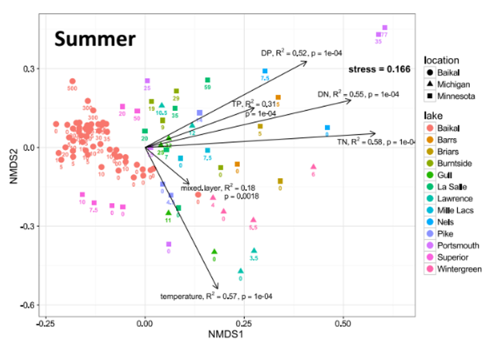
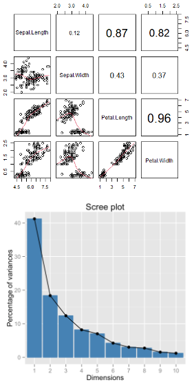
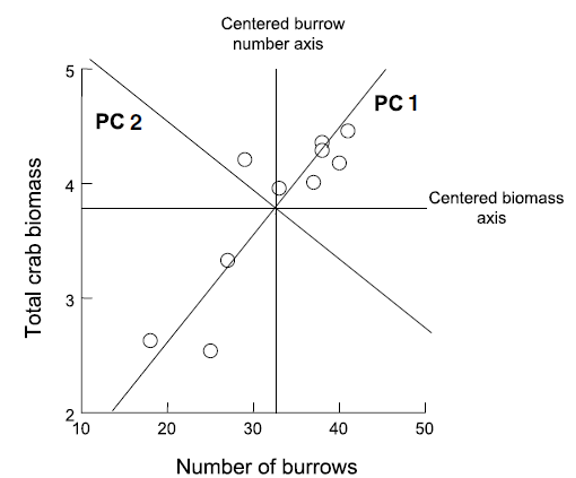
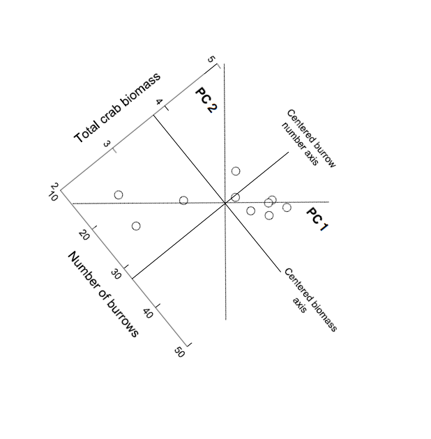
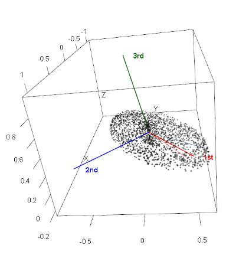

```{r setup_libraries}
#| include: false
#| message: false
#| warning: false
library(webshot2)
library(vegan)
library(factoextra)
library(corrplot)
library(GGally)
library(knitr)
library(patchwork)
library(janitor)
library(plotly)
library(tidyverse)
```

# Lecture 16: Review

::::: columns
::: {.column width="60%"}
## Review

-   Multivariate data
-   Multivariate statistics in ecology: overview
-   Eigenvectors, eigenvalues, components
-   Distance and dissimilarity in MV space
-   Data standardization
-   Graphics
-   Screening MV data
-   MANOVA
:::

::: {.column width="40%"}
{width="500"}
:::
:::::

# Review: Eigenvectors and Components

Eigenvectors, eigenvalues and components

-   Common goal of MV analysis is variable reduction: can we derive new
    variables (based on linear combinations of "original" variables)
    that explain variation in data?

-   For data set with i= 1 to n objects and j = 1 to p original
    variables we seek new variables (principal components) using the
    equation:

### $$z_{ik} = c_1y_{i1} + c_2y_{i2} + \cdots c_jy_{ij} + \cdots + c_py_{ip}$$

# Review: Component Interpretation

-   zik is value of new variable k for object I
-   yi1- yip are values of original variables for object i
-   c1-cp are coefficients that show importance of the original
    variables to new derived variable

### $$z_{ik} = c_1y_{i1} + c_2y_{i2} + \cdots c_jy_{ij} + \cdots + c_py_{ip}$$

# Review: Component Properties

::::: columns
::: {.column width="60%"}
Eigenvectors, eigenvalues and components

Derived variables are found so that:

-   First derived variable explains most of the variation in the data
-   Second most of the remaining variation
-   And so on…
-   As many derived variables as original variables (p)
-   Derived variables are uncorrelated with each other
:::

::: {.column width="40%"}
{width="500"}
:::
:::::

# Review: Eigenvalues and Eigenvectors

Eigenvectors, eigenvalues and components

-   Eigenvalues (latent roots) represent amount of variation in data
    explained by the new k= 1 to p derived variables (λ1, λ2 …λp).
-   Eigenvalues are population parameters and are estimated using ML to
    get sample statistics (l1, l2…lp)
-   Eigenvectors are lists of coefficients (c) that show contribution of
    original variables to new, derived variables
-   Each new variable has an eigenvalue and an eigenvector
-   New variables (components) are derived from a p x p covariance or
    correlation matrix of original variables

# Lecture 17: PCA Goals and Introduction

-   Common goals of MV data analysis are variable reduction (finding
    derived variables that summarize data) and exploration of patterns
    in data (scaling/ordination)
-   Can use association (correlation/ covariance) matrices (PCA) or
    dissimilarity measures (MDS)
-   In PCA: take p old variables and transform them into p "new/derived"
    uncorrelated variables (principal components)

# Data for PCA Analysis

```{r load_data}
#| include: true
#| message: false
#| warning: false

# Load the iris dataset
iris_df <- iris %>% clean_names() %>% mutate(ind = row_number()) %>% 
  mutate(species_ind = paste(species, ind, sep="_"))

# get values only
iris_data <- iris_df  %>% select(-species, -ind, -species_ind)

# Keep species for later visualization
iris_species <- iris_df  %>% select(species, ind, species_ind)

# pivot to long formt for viewing
iris_long_df <- iris_df %>%
  pivot_longer(
    cols = -c(species, ind, species_ind),
    names_to = "variable",
    values_to = "values")
 
iris_df 
```

# Step 1: Explore the Iris Dataset

::::: columns
::: {.column width="60%"}
As in every case you should be looking at the data first - every time...

Right is the data on iris from a long dataframe
:::

::: {.column width="40%"}
```{r}
overview_plot <- iris_long_df %>% 
  ggplot(aes(species, values, color=species)) + 
  geom_boxplot() +
  facet_wrap(~variable, scales = "free")
overview_plot
```
:::
:::::

# What is PCA? Goals and Overview

::::: columns
::: {.column width="40%"}
## Principal Component Analysis Goals:

-   **Variable Reduction**: Transform many correlated variables into
    fewer uncorrelated components
-   **Data Exploration**: Visualize patterns and relationships in
    high-dimensional data
-   **Noise Reduction**: Focus on the most important sources of
    variation
-   **Dimension Reduction**: Make complex datasets easier to analyze and
    interpret

**Today's Example**: Iris flower measurements - can we reduce 4
measurements to 2-3 components that capture most variation?
:::

::: {.column width="60%"}
```{r}
#| label: correaltions
#| echo: false
#| message: false
#| warning: false
# Create pairs plot colored by species to show the challenge
# Create pairs plot colored by species to show the challenge
pairs_plot <- iris_df %>% 
  select(sepal_length, sepal_width, petal_length, petal_width, species) %>%
  ggpairs(columns = 1:4, 
          aes(color = species, alpha = 0.7),
          title = "The Challenge: 4 Dimensions of Iris Data",
          upper = list(continuous = wrap("cor", size = 3)),
          lower = list(continuous = wrap("points", alpha = 0.7, size = 0.8)),
          diag = list(continuous = wrap("densityDiag", alpha = 0.7))) +
  theme_minimal() +
  theme(
    plot.title = element_text(size = 14, hjust = 0.5),
    strip.text = element_text(size = 8),
    axis.text = element_text(size = 6)
  ) +
  scale_color_manual(values = c("setosa" = "#00AFBB", 
                               "versicolor" = "#E7B800", 
                               "virginica" = "#FC4E07")) +
  scale_fill_manual(values = c("setosa" = "#00AFBB", 
                              "versicolor" = "#E7B800", 
                              "virginica" = "#FC4E07"))

pairs_plot
```
:::
:::::

# High-Dimensional Data Visualization

::::: columns
::: {.column width="40%"}
## Principal Component Analysis Goals:

-   **Variable Reduction**: Transform many correlated variables into
    fewer uncorrelated components
-   **Data Exploration**: Visualize patterns and relationships in
    high-dimensional data
-   **Noise Reduction**: Focus on the most important sources of
    variation
-   **Dimension Reduction**: Make complex datasets easier to analyze and
    interpret

**Today's Example**: Iris flower measurements - can we reduce 4
measurements to fewer components that capture most variation?
:::

::: {.column width="60%"}
```{r hypercube}
#| echo: false
#| message: false
#| warning: false
#| paged-print: false
#| eval: !expr knitr::is_html_output()
# Method: Create a 4D hypercube projection
# Project 4D data onto 3D using a rotation matrix
rotation_4d_to_3d <- matrix(c(
  1, 0, 0, 0,
  0, 1, 0, 0,
  0.5, 0.5, 0.7, 0.5
), nrow = 3, byrow = TRUE)

data_4d <- as.matrix(iris_df[, c("sepal_length", "sepal_width", "petal_length", "petal_width")])
data_3d <- data_4d %*% t(rotation_4d_to_3d)

iris_df2 <- iris_df
iris_df2$x_proj <- data_3d[, 1]
iris_df2$y_proj <- data_3d[, 2]
iris_df2$z_proj <- data_3d[, 3]

plot_hypercube <- plot_ly(iris_df2, 
                         x = ~x_proj, 
                         y = ~y_proj, 
                         z = ~z_proj,
                         color = ~species,
                         colors = c('#E41A1C', '#377EB8', '#4DAF4A'),
                         type = 'scatter3d',
                         mode = 'markers',
                         marker = list(size = 5, opacity = 0.8),
                         text = ~paste('Sepal Length:', sepal_length, '<br>',
                                      'Sepal Width:', sepal_width, '<br>',
                                      'Petal Length:', petal_length, '<br>',
                                      'Petal Width:', petal_width),
                         hoverinfo = 'text')

plot_hypercube <- plot_hypercube %>% layout(
  scene = list(
    xaxis = list(title = "", showgrid = FALSE, showline = FALSE, 
                 showticklabels = FALSE, zeroline = FALSE, showspikes = FALSE),
    yaxis = list(title = "", showgrid = FALSE, showline = FALSE, 
                 showticklabels = FALSE, zeroline = FALSE, showspikes = FALSE),
    zaxis = list(title = "", showgrid = FALSE, showline = FALSE, 
                 showticklabels = FALSE, zeroline = FALSE, showspikes = FALSE),
    bgcolor = "white",
    camera = list(eye = list(x = 1.5, y = 1.5, z = 1.5))
  ),
  paper_bgcolor = "white",
  showlegend = TRUE
)

plot_hypercube
```
:::
:::::

# PCA Assumptions - Critical to Check First!

## Key Assumptions:

1.  **Linear relationships** between variables
2.  **No extreme outliers** (can distort results)
3.  **Variables should be correlated** (if not, PCA won't reduce
    dimensions)
4.  **Adequate sample size** (generally n \> 50, preferably n \> 100)
5.  **No missing data** (complete cases only)
6.  **Consider standardization** when variables have different scales

**Important**: PCA works best when original variables are moderately to
highly correlated!

**Let's check these assumptions with our iris data...**

# Step 2: Check PCA Assumptions - Correlations

```{r check_correlations}
#| echo: false
# Check correlations between variables
cor_matrix <- cor(iris_data)
print("Correlation Matrix:")
round(cor_matrix, 3)

# Visualize correlation matrix
corrplot(cor_matrix, method = "color", type = "upper", 
         addCoef.col = "grey75", tl.cex = 0.8, number.cex = 0.8,
         title = "Correlation Matrix of Iris Variables")
```

# Step 2: Check PCA Assumptions - Linearity

```{r check_linearity}
#| echo: false
#| message: false
#| warning: false
#| paged-print: false
# Check for linear relationships using pairs plot
ggpairs(iris_data, 
        title = "Pairwise Relationships in Iris Data",
        upper = list(continuous = "cor"),
        lower = list(continuous = "smooth")) +
  theme_minimal()
```

# Step 2: Check PCA Assumptions - Outliers

```{r check_outliers}
#| echo: false
# Check for outliers using boxplots
iris_data %>% 
  pivot_longer(everything(), names_to = "variable", values_to = "value") %>% 
  ggplot(aes(x = variable, y = value)) +
  geom_boxplot() +
  labs(title = "Check for Outliers in Iris Variables",
       x = "Variable", y = "Value") +
  theme_minimal() +
  theme(axis.text.x = element_text(angle = 45, hjust = 1))
```

# Step 3: Standardize the Data

## STANDARDIZATION: Making all variables comparable

::::: columns
::: {.column width="60%"}
Why standardize?

Our measurements have different units and scales:

-   Sepal length: ranges from \~4-8 cm
-   Sepal width: ranges from \~2-4 cm
-   Petal length: ranges from \~1-7 cm
-   Petal width: ranges from \~0.1-2.5 cm

Without standardization, PCA would be dominated by variables with larger
numbers (like petal length) simply because they have bigger values, not
because they're more important biologically

What does standardization do?

-   Converts each variable to have:
    -   Mean = 0 (centered at zero)
    -   Standard deviation = 1 (same spread)
    -   This gives all variables equal weight in the analysis

How to interpret standardized values: Example: A sepal length of 5.1 cm
might become -0.9 after standardization, meaning it's 0.9 standard
deviations below the average sepal length
:::

::: {.column width="40%"}
```{r standardize_data}
#| echo: false
# Standardize the data (mean = 0, sd = 1)
# This is important when variables have different scales
iris_scaled <- scale(iris_data)

# Convert back to data frame for easier handling
iris_scaled_df <- as.data.frame(iris_scaled)

# Check standardization worked
print("Means after standardization (should be ~0):")
round(colMeans(iris_scaled_df), 3)

print("Standard deviations after standardization (should be 1):")
round(apply(iris_scaled_df, 2, sd), 3)
```
:::
:::::

# Step 4: Perform PCA - The Mathematics

::::: columns
::: {.column width="60%"}
## What is PCA doing?

Principal Component Analysis finds new variables (called components)
that capture the most variation in your data. Think of it as finding the
"best viewing angles" to see differences between flowers.

## The mathematics (simplified):

-   PCA rotates your data to find the direction with maximum spread
    (PC1)
-   Then finds the next direction with maximum spread perpendicular to
    PC1 (PC2)
-   Continues until it has as many components as original variables (4
    in our case)

## Why center = FALSE and scale = FALSE?

We already standardized our data in Step 3, so we tell R not to do it
again: - center = FALSE: Don't subtract the mean (we already did) -
scale = FALSE: Don't divide by standard deviation (we already did)

## What the summary shows:

-   **Standard deviation**: How much variation each component captures
-   **Proportion of Variance**: Percentage of total variation explained
    by each component
-   **Cumulative Proportion**: Running total of variance explained
:::

::: {.column width="40%"}
```{r perform_pca}
# Perform PCA on standardized data
iris_pca <- prcomp(iris_scaled, center = FALSE, scale. = FALSE)
# Note: center and scale are FALSE because we already standardized

# Alternative using vegan package
iris_pca_vegan <- rda(iris_scaled)

# Summary of PCA results
summary(iris_pca)
```
:::
:::::

# Deriving Components: 2D Visualization

::::: columns
::: {.column width="60%"}
How are new uncorrelated components derived? One way to think it is in
terms of axis rotation Consider a 2-variable dataset:
:::

::: {.column width="40%"}
{width="500"}
:::
:::::

# Component Derivation: Axis Rotation

::::: columns
::: {.column width="60%"}
Goal is to "rotate the axes" around center of the data "cloud" in such a
way that most of the variation lies along the first axis Then find
second axis that explains the second-most variation AND is orthogonal to
first axis
:::

::: {.column width="40%"}
{width="500"}
:::
:::::

# Component Derivation: Multivariate Extension

::::: columns
::: {.column width="60%"}
Easy to picture in 2D (or even 3D), but harder in multivariate space
Practically, components are "extracted" from a covariance of correlation
matrix among original variables Will extract as many principal
components as original variables
:::

::: {.column width="40%"}
{width="500"}
:::
:::::

# Component Information: Eigenvalues and Eigenvectors

-   Get two important pieces of information from PCA: eigenvectors and
    eigenvalues
-   Eigenvalues (latent roots)- how much of the variation is explained
    by each component?
-   Eigenvectors- list of coefficients for original variables. There are
    p coefficients in an eigenvector and p eigenvectors
-   Correlation bw original variables will result in fewer components
    explaining more variance; variable reduction will fail if original
    variables are not correlated

# Step 4: Understanding Eigenvalues and Variance

::::: columns
::: {.column width="60%"}
## Understanding Eigenvalues and Variance

### What are eigenvalues?

-   Eigenvalues tell us how much variation each principal component
    captures.
-   Larger eigenvalues = more important components.

### Key terms explained:

-   **Eigenvalue**: The amount of variance captured by each component
    (always positive)
-   **Proportion of Variance**: What percentage of total variation this
    component explains
-   **Cumulative Variance**: Running total - helps us decide how many
    components we need

### How to read the results:

-   If PC1 has eigenvalue = 2.9, it captures 2.9 "units" of variance
-   If Prop_Variance = 0.728, PC1 explains 72.8% of all variation in the
    data
-   If Cumsum_Variance = 0.959 at PC2, the first 2 components together
    explain 95.9% of variation

### Why this matters:

This table helps us decide how many components to keep.

-   If 2 components explain 95% of variance, we've successfully reduced
    4 variables to 2
-   We only lose 5% of information without including the other
    variables!
:::

::: {.column width="40%"}
```{r pca_eigenvalues}
#| paged-print: false
# Extract eigenvalues (variance explained by each component)
eigenvalues <- iris_pca$sdev^2
prop_variance <- eigenvalues / sum(eigenvalues)
cumsum_variance <- cumsum(prop_variance)

# Create a summary table
pca_summary <- data.frame(
  Component = paste0("PC", 1:length(eigenvalues)),
  Eigenvalue = eigenvalues,
  Prop_Variance = prop_variance,
  Cumsum_Variance = cumsum_variance
)

print("PCA Summary:")
kable(pca_summary, digits = 3)
```
:::
:::::

# Step 5: Determine Number of Components - Scree Plot

::::: columns
::: {.column width="60%"}
## What is a Scree Plot?

A scree plot shows how much variance each component explains, helping us
decide how many components we need. The name comes from the geological
term "scree" - loose rocks at the base of a cliff - because the plot
often looks like a steep cliff followed by rubble.

## How to read a Scree Plot:

-   **Y-axis**: Percentage of variance explained by each component
-   **X-axis**: Component number (PC1, PC2, etc.)
-   **The pattern**: Usually shows a steep drop followed by a leveling
    off

## The "Elbow Method":

Look for where the line "bends" or forms an elbow:

-   Components before the elbow = important (steep slope)
-   Components after the elbow = less important (gentle slope)
-   Keep components up to and including the elbow

## What to look for in our plot:

-   If PC1 explains 70% and PC2 explains 20%, but PC3 only explains 5%,
    the elbow is at PC2
-   This suggests keeping the first 2 components
-   The dramatic drop from PC1 to PC2, then gentle decline after,
    confirms our dimension reduction worked well
:::

::: {.column width="40%"}
```{r scree_plot}
#| echo: false
#| eval: !expr knitr::is_html_output()
# Scree plot - look for the "elbow"
fviz_eig(iris_pca, addlabels = TRUE, ylim = c(0, 80)) +
  labs(title = "Scree Plot - Variance Explained by Each Component",
       x = "Principal Component", y = "% of Variance Explained") +
  theme_minimal()
```
:::
:::::

# Step 5: Component Selection Rules

```{r eigenvalue_rule}
# Eigenvalue > 1 rule (Kaiser criterion)
components_to_keep <- sum(eigenvalues > 1)
print(paste("Components with eigenvalue > 1:", components_to_keep))

# Components explaining at least 80% of variance
components_80_percent <- which(cumsum_variance >= 0.80)[1]
print(paste("Components needed for 80% variance:", components_80_percent))
```

# Step 6: Interpret the Components - Loadings

::::: columns
::: {.column width="60%"}
## What are Component Loadings

Loadings tell us how much each original variable contributes to each
principal component. Think of them as "recipes" that show how to mix
your original measurements to create the new components.

## How to read the loadings table

-   **Values range from -1 to +1** (like correlations)
-   **Large positive values** (e.g., 0.8): This variable contributes
    strongly in the positive direction
-   **Large negative values** (e.g., -0.8): This variable contributes
    strongly in the negative direction
-   **Values near 0**: This variable doesn't contribute much to this
    component

## Interpreting the patterns:

-   **If all loadings have similar signs**: Component represents overall
    size (all measurements increase/decrease together)
-   **If loadings have mixed signs**: Component represents shape or
    proportions (some measurements increase while others decrease)
-   **Dominant variables**: Variables with the largest absolute loadings
    drive that component's meaning

## Example interpretation:

If PC1 has all negative loadings around -0.5, it means:

-   Flowers with high PC1 scores have small values for ALL measurements
-   This component captures "overall flower size"
-   The negative sign just indicates direction (could flip signs and
    interpretation)
:::

::: {.column width="40%"}
```{r component_loadings}
#| paged-print: false
# Component loadings (how much each original variable contributes)
loadings_df <- data.frame(
  Variable = rownames(iris_pca$rotation),
  PC1 = iris_pca$rotation[, 1],
  PC2 = iris_pca$rotation[, 2],
  PC3 = iris_pca$rotation[, 3],
  PC4 = iris_pca$rotation[, 4]
)

print("Component Loadings:")
loadings_df
```
:::
:::::

# Step 6: Eigenvector Properties

### Key properties of eigenvectors/loadings:

-   **Unit length**: Each eigenvector has length 1 (sum of squares = 1)
-   **Orthogonal**: Eigenvectors are perpendicular to each other (dot
    product = 0)
-   **Ordered by importance**: First eigenvector (PC1) explains most
    variance

### The complete picture:

-   **Eigenvectors** = The directions (loadings)
-   **Eigenvalues** = The importance of each direction (variance
    explained)
-   Together they fully describe the PCA transformation

# Step 6b: Visualization of Component Loadings

::::: columns
::: {.column width="60%"}
What does this plot show?

This is a visual representation of the loadings table, showing how each
original variable contributes to PC1 and PC2. It's like a map of how
your original measurements relate to the new principal components.

How to read the plot:

-   Arrows represent your original variables (sepal_length, sepal_width,
    etc.)
-   Arrow direction shows which PC the variable contributes to
-   Arrow length indicates the strength of contribution (longer =
    stronger)
-   Arrow color shows the overall contribution magnitude (red = highest,
    blue = lowest)
-   The circle represents the maximum possible contribution

Key interpretations from this plot:

-   PC1 (horizontal axis, 73% variance):
    -   All arrows point roughly left (negative direction)
    -   All variables contribute almost equally to PC1
    -   This confirms PC1 represents "overall flower size"

PC2 (vertical axis, 22.9% variance):

-   Sepal_width points down (negative)
-   Other variables point slightly up (positive)
-   This creates a contrast: sepal width vs. everything else
-   PC2 captures "flower shape" - wide sepals vs. long petals
:::

::: {.column width="40%"}
```{r loading_visualization}
#| echo: false
#| eval: !expr knitr::is_html_output()
# Visualize loadings for first two components
fviz_pca_var(iris_pca, col.var = "contrib",
             gradient.cols = c("#00AFBB", "#E7B800", "#FC4E07"),
             repel = TRUE) +
  labs(title = "Variable Contributions to PC1 and PC2") +
  theme_minimal()
```
:::
:::::

# Loading Plot Interpretation

What the arrow positions tell us:

-   Variables pointing in same direction = positively correlated
-   Variables at 90° angles = uncorrelated
-   Variables pointing opposite directions = negatively correlated

The practical meaning:

-   Flowers with high PC1 scores have large values for all measurements
-   Flowers with high PC2 scores have narrow sepals but long/wide petals
-   The plot confirms our dimension reduction worked - we've captured
    95.9% of variation in just 2 dimensions!

# Step 7: PCA Biplot - The Main Result

::::: columns
::: {.column width="60%"}
## Key insights from this biplot:

### Species separation:

-   **Setosa (blue)**: Clearly separated on the left (negative PC1)
-   **Versicolor (yellow)**: In the middle
-   **Virginica (red)**: On the right (positive PC1)
-   PCA successfully separates species without being told about them!

### Understanding flower characteristics:

-   **Setosa flowers**: Small overall (negative PC1), relatively wide
    sepals (positive PC2)
-   **Virginica flowers**: Large overall (positive PC1), especially long
    petals
-   **Versicolor flowers**: Intermediate in most characteristics

### Variable relationships:

-   Petal measurements point together → highly correlated
-   Sepal width points differently → captures different information
-   All arrows point right → all measurements increase from setosa to
    virginica
:::

::: {.column width="40%"}
```{r pca_biplot_species}
#| echo: false
#| eval: !expr knitr::is_html_output()
# Create PCA scores with species information
pca_scores <- data.frame(
  iris_pca$x,
  species = iris_species$species
)

# Biplot with species coloring
fviz_pca_biplot(iris_pca, 
                geom.ind = "point",
                col.ind = iris_species$species,  # Use just the species column
                palette = c("#00AFBB", "#E7B800", "#FC4E07"),
                addEllipses = TRUE,  # Add confidence ellipses
                label = "var",
                col.var = "black",
                repel = TRUE) +
  labs(title = "PCA Biplot - Iris Dataset",
       subtitle = "Points = Individual flowers, Arrows = Original variables") +
  theme_minimal()
```
:::
:::::

# Step 7: PCA Scores Plot - Alternative Visualization

```{r pca_scores_plot}
#| eval: !expr knitr::is_html_output()
# Alternative scores plot
ggplot(pca_scores, aes(x = PC1, y = PC2, color = species)) +
  geom_point(size = 3, alpha = 0.7) +
  stat_ellipse(level = 0.68, linetype = 2) +  # Add ellipses
  labs(title = "PCA Scores Plot",
       subtitle = paste0("PC1 explains ", round(prop_variance[1]*100, 1), 
                        "% of variance, PC2 explains ", round(prop_variance[2]*100, 1), "%"),
       x = paste0("PC1 (", round(prop_variance[1]*100, 1), "%)"),
       y = paste0("PC2 (", round(prop_variance[2]*100, 1), "%)"),
       color = "Species") +
  theme_minimal() +
  scale_color_manual(values = c("#00AFBB", "#E7B800", "#FC4E07"))
```

# Step 8: Interpret PC1 Results

### Understanding PC1 Loadings:

The loadings show how each original variable contributes to PC1:

-   **Sepal length: 0.521** - Strong positive contribution
-   **Sepal width: -0.269** - Moderate negative contribution
-   **Petal length: 0.580** - Strong positive contribution
-   **Petal width: 0.565** - Strong positive contribution

```{r interpretation_pc1}
# What does PC1 represent?
pc1_loadings <- iris_pca$rotation[, 1]
print("PC1 Loadings (all variables contribute similarly):")
round(pc1_loadings, 3)

cat("\nPC1 Interpretation: Overall flower size")
cat("\n- All variables have similar negative loadings")
cat("\n- Higher PC1 values = smaller flowers overall")
cat("\n- Lower PC1 values = larger flowers overall")
```

# PC1 Interpretation: Overall Flower Size

### PC1 Interpretation: Overall flower size (with a twist)

Note: The output says "all variables have similar negative loadings" but
the actual values show mostly positive loadings. This is likely due to a
sign flip - PCA signs can be arbitrary. Let's interpret based on the
actual values shown:

-   **Three variables (sepal length, petal length, petal width) have
    similar positive loadings** (\~0.52-0.58)
-   **Sepal width has a negative loading** (-0.269)
-   This means PC1 captures flowers where length and width measurements
    (except sepal width) vary together

### What PC1 scores mean:

-   **Higher PC1 values** = Longer petals, longer sepals, wider petals,
    but narrower sepals
-   **Lower PC1 values** = Shorter petals, shorter sepals, narrower
    petals, but wider sepals
-   PC1 essentially captures "overall flower size except sepal width
    goes opposite"

### Biological interpretation:

PC1 distinguishes between:

-   Small flowers with relatively wide sepals (negative PC1) - typical
    of setosa
-   Large flowers with relatively narrow sepals (positive PC1) - typical
    of virginica

# Step 8: Interpret PC2 Results

### Understanding PC2 Loadings:

The loadings show how each original variable contributes to PC2:

-   **Sepal length: -0.377** - Moderate negative contribution
-   **Sepal width: -0.923** - Very strong negative contribution
-   **Petal length: -0.024** - Almost no contribution
-   **Petal width: -0.067** - Very small negative contribution

```{r interpretation_pc2}
# What does PC2 represent?
pc2_loadings <- iris_pca$rotation[, 2]
print("PC2 Loadings:")
round(pc2_loadings, 3)

cat("\nPC2 Interpretation: Flower shape contrast")
cat("\n- Positive loadings: sepal width")
cat("\n- Negative loadings: petal length and width, sepal length")
cat("\n- Higher PC2 = wider sepals relative to petal size")
cat("\n- Lower PC2 = longer/wider petals relative to sepal width")
```

# PC2 Interpretation: Flower Shape Contrast

### PC2 Interpretation: Correcting the output

Note: The output says "Positive loadings: sepal width" but the actual
value is -0.923 (negative). All loadings are actually negative, with
sepal width being the most strongly negative.

### What PC2 actually represents:

-   **All variables have negative loadings**, but sepal width is
    dominant (-0.923)
-   **Petal measurements contribute very little** (-0.024 and -0.067)
-   **This component is primarily driven by sepal width**, with some
    contribution from sepal length

### What PC2 scores mean:

-   **Higher PC2 values** = Smaller measurements overall, especially
    narrow sepals
-   **Lower PC2 values** = Larger measurements overall, especially wide
    sepals
-   Since sepal width has the strongest loading, PC2 primarily captures
    sepal width variation

### Biological interpretation:

PC2 helps distinguish:

-   Flowers with narrow sepals and smaller overall size (positive PC2)
-   Flowers with wide sepals and larger overall size (negative PC2)
-   This dimension helps separate species that have similar PC1 scores
    but different sepal proportions

# Step 9: How Well Does PCA Work?

```{r pca_effectiveness}
#| paged-print: false
#| eval: !expr knitr::is_html_output()
# Calculate total variance explained by first 2 components
variance_explained_2pc <- sum(prop_variance[1:2])
caption_pca <- paste("Variance explained by first 2 components:", round(variance_explained_2pc * 100, 1), "%")

# This means we reduced 4 variables to 2 components while retaining most information!

# Create a summary plot showing dimension reduction success
tibble(
  Component = factor(paste0("PC", 1:4), levels = paste0("PC", 1:4)),
  Variance = prop_variance * 100,
  Cumulative = cumsum_variance * 100
) %>% 
  ggplot(aes(x = Component)) +
  geom_col(aes(y = Variance), fill = "lightblue", alpha = 0.7) +
  geom_line(aes(y = Cumulative, group = 1), color = "red", size = 1) +
  geom_point(aes(y = Cumulative), color = "red", size = 3) +
  labs(title = "PCA Dimension Reduction Success",
       subtitle = "Blue bars = individual variance, Red line = cumulative variance",
       caption = caption_pca,
       x = "Principal Component", 
       y = "Percentage of Variance Explained") +
  theme_minimal()
```

# Summary: What We Learned

## Key Findings:

1.  **Successful dimension reduction**: 4 variables → 2 components
    explaining \~96% of variance

2.  **PC1 (72.8% variance)**: Overall flower size

    -   All measurements contribute similarly
    -   Separates large from small flowers

3.  **PC2 (23.1% variance)**: Shape contrast

    -   Sepal width vs. petal dimensions
    -   Separates flower shape types

4.  **Species separation**: PCA naturally groups the three iris species
    based on their morphological differences

## PCA Success Criteria Met:

✓ Variables were correlated\
✓ Linear relationships\
✓ No major outliers\
✓ Adequate sample size\
✓ Clear dimension reduction\
✓ Interpretable components

# When to Use PCA vs. Other Methods

## Use PCA when:

-   Variables are **continuous and correlated**
-   Goal is **dimension reduction** or **data exploration**
-   Linear relationships between variables
-   Want to **remove redundancy** in measurements

## Consider alternatives when:

-   Variables are categorical → use MCA (Multiple Correspondence
    Analysis)
-   Focus on **species composition** → use ordination methods like NMDS
-   Want to **classify/predict** → use discriminant analysis or machine
    learning

**PCA is excellent for exploring patterns in biological measurements
like morphology, physiology, or environmental variables!**
